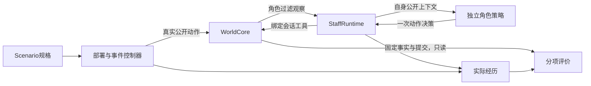

# v0.10 统一运行、声明场景与分项评价

依据：[审计](reference/platform-modules-audit.md)与[两阶段计划](platform-modules-v010-plan.md)。本版继续使用核对、报告两个模板，新增模块职责分离；实验结果另见最终报告。

软件版本0.10.0；工作人员checkpoint为`staff-runtime-v0.10.1`，经历为`staff-experience-v0.10`，场景和评价接口各自版本化。WorldCore核心状态仍为world-core-v0.9、work-world-v0.9：本轮没有为新模块增加一套核心业务事实或复制运行器。经营/出版旧单模板仍保留自身格式，不将它们的结果冒充新世界能力。



图中没有从独立评价回到策略的答案通道。控制器能读取触发条件所需状态，但不得以评分临时补料、改变事件或替工作人员修正文稿。

## 评价边界

reconciliation先检查声明路径下对象、rows、行、匹配键、证据和汇总等结构，再检验集合覆盖和业务值。合法JSON不自动表示符合交付合同。null目标或null结果行是structure_failure，不再使正常评价流程抛AttributeError。

独立提交入口在明确边界中承接未知异常并返回evaluator_error，保留异常类型、边界、此前已发生的read_set/检查和被中断的检查。它不将所有异常变成“工作人员算错”；系统退出/取消不被普通Exception捕获。来源不可读、字节摘要不符等来源边界有独立状态。

| status | 含义 |
| --- | --- |
| pass | 已声明的有限合同成立 |
| content_failure | 有足够结构和依据，实际业务内容不符合合同 |
| structure_failure | 交付形状或已知结构不符合合同 |
| source_unavailable | 评价所需确切来源不可读取或不能作为该输入使用 |
| unassessed | 未声明内容目标、无评价依据或目标尚未观测，不能称通过或算错 |
| evaluator_error | 未处理的实现/内部故障在评价边界被捕获，独立记录归因 |

多项检查结果分别保留，汇总状态仅选择优先级，不抹掉其他结果。旧`passed`作为有限谓词保留，应结合status读取；没有content_checks时不是内容通过。required_fields齐全只能证明相应结构，旧M4回归已明确更新该口径，历史JSON不改。

## 工作人员运行模块

`StaffRuntime`只依赖公开端口和策略，内部没有匹配、正文生成、findings或问题修复算法。可信宿主绑定actor/project。每次step选择下一个角色，取得其真实tools与observation，给策略以下上下文：

```text
worker_id, tools, observation, memory, last_action, last_result
```

每个角色的memory、上次结果和进度独立。策略返回act/wait/done及更新的memory；act最多引发一次实际调用。策略自己选择读什么、何时提交、修哪一项、反驳还是修改。未授权操作仍交给世界产生真实拒绝；无效策略返回或试图覆盖运行器的action/request_key运输字段在策略边界拒绝。运行器不把失败动作换成正确动作。

`workers.team_policies`保留现有有限业务算法，提供ReconciliationPolicy、ReportAuthorPolicy、ReviewerPolicy。规则策略从公开工作合同和实际内容决定步骤；它们不是通用规划能力。作者初交错误、审阅者错误意见、非法操作等配置均明确标注为实验故障策略，不作为运行器救场逻辑。

作者针对公开issues一次处理一项，修复用同一work/requirement重交，能以原始材料反驳错误意见。审阅者读取固定提交及该提交采用快照的来源，自己生成意见和处理决定。核对审阅策略可复用公开matcher，因此实验仍需要独立手写真值，不把两策略相等当作自证。

工作公开要求可以声明：

```json
{"public_delivery":{"recipients":[{"project_id":"REPORT","actor_ids":["author","reviewer"]}],"publish":true}}
```

这是策略需要履行的公开交付义务，owner在真实accepted提交上执行share与publish；调度器不偷偷替它发布。旧accepted前项的发布是精确历史事实，后续新版不会要求重发旧版或将旧任务重开。

完整step返回后可snapshot，恢复核对角色标签/顺序、策略实现/config及实际公开身份（世界、实例、分支、角色和项目）。checkpoint含实际原经历和各自memory；不保证任意进程中断或半个动作的策略恢复。可信宿主还核对世界instance及场景身份。StaffRuntime的done/等待只是策略出口，制度完成和独立质量仍由其他接口判断。

## 场景构建与控制

Scenario以有限JSON声明world、installer、projects、roles、setup、events、start、boundary。项目可为现有模板recipe或明确ProjectPackage；`$object`引用由宿主根据已部署对象解析，不把隐藏正确答案写进策略参数。只有既有两个模板及其linked_report配置，不生成任意可执行代码。

构建通过真实install/setup工具。缺来源、无效角色/节点、未知事件引用或不支持配置报告unbuildable；已发生的部分构造与真实拒绝保留，不自动换一个更容易的场景。重复构建对比保留业务标识、逻辑时序、命令身份、授权、版本和历史，只规范化已声明的实例/分支身份及诊断耗时/摘要。

事件有固定event_id、条件、effects和fire_once。条件只支持有限时钟、工作阶段和其他事件是否触发的组合；effects通过明确actor/project的真实工具执行。事件选择在完整角色机会之间进行，记录触发事实、工具参数和真实返回；不能检查独立评分决定是否执行。规则不是逐步给工作人员填写下一动作。

初始材料与已发生经历分开。start为initial时仅按配置部署；executed_prefix起点必须通过真实runtime机会到达指定waiting/pending等状态，保存原始经历区间、摘要和checkpoint。前缀有独立声明预算；目标不达或外部动作被拒绝时保留unbuildable及已发生前缀，不伪造背景历史。

显式complete_when在完整机会之间检查。声明的部分范围到达可返回boundary_reached，其他项目仍保留；completed另要求制度接受、应有发布已兑现且无待处理环境事件。accepted并不自动等于声明的public_delivery已完成。没有显式边界时，通过一轮所有角色都不行动的观察区分完成、世界阻塞或策略等待。

单维结构对照只改变资料direct/route或更正阶段；文件名、显示名变化另作表面变化。不能把名称数量当作流程种类数量。

## 经历与只读分项评价

ExperienceRecorder按实际发生顺序保存public_tools、public_observation、policy_decision、tool_call、controller_action、environment_event及运行边界；部署记录与真实前缀另有来源标记。工具调用保留真实参数、request_key、结果或真正抛出的异常，不从最终世界重建旧观察。策略决定中记录实际动作及memory摘要，完整memory在checkpoint保存。

`assess_episode(store,state,experience,...)`是可信评价侧接口，不修改世界，也不将报告注入角色上下文。它分开输出制度进度、内容质量、独立目标、过程约束、不完备性、运行问题与外部事件，没有总体成功布尔值。

独立目标须显式声明work、固定提交可选、路径和expected；缺expected或availability=unknown时未评。显式expected=null可以是已知JSON-null目标，不能与“目标尚未观测”混淆。没有过程约束则未评；有限过程规则支持禁止某些成功正式动作及保持确切版本哈希。被真实拒绝的动作有拒绝记录，不算已经完成禁止动作。

未解决核对项、来源null、机构未接受、独立业务目标失败、评价器内部故障及预算截断分别呈现。上游错误而下游忠实不合成链条成功，也不重复计数为多个独立根因。

## 可运行入口

```bash
.venv/bin/proworksim scenario-build runs/platform-demo --spec examples/scenarios-v10/chain-accepted.json
.venv/bin/proworksim staff-run runs/platform-demo --output runs/platform-demo-run.json
.venv/bin/proworksim episode-assess runs/platform-demo --experience runs/platform-demo-run.json --output runs/platform-demo-assessment.json
```

`staff-run --max-opportunities N`是在开始该次运行前声明的软预算，不能超过场景上限，不修改规格或控制器身份；真实前缀另用start预算。继续用`--checkpoint 上次运行文件`及新output路径。CLI要求同世界instance、同规格和最新完整checkpoint；不把任意旧快照当作可靠重放起点。新一次调用的预算与原截断结论分别保留。

`episode-assess --spec`可提供work_ids、independent_targets和process_requirements。未提供独立目标时明确未评，而不是猜一个总体业务成功标签。输出文件须位于世界目录外且新建；评价读取Store，不触发世界恢复或写入历史。

本版没有模型API、GPU、训练导出或大规模场景合成要求。未来单角色固定模型接入应是可替换策略，不得由规则策略补齐并称为模型完成。
