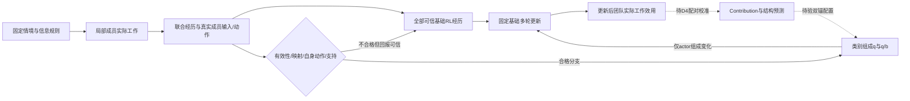

# ID-VTDO：研究目标与理论设计 V1

日期：2026-09-25。以用户提供的[数据需求增强版理论稿](../reference/id-vtdo-v1-data-design.md)为完整设计依据，以[v0.11审计](../reference/id-vtdo-audit-v011.md)规定本轮优先级。本文是该设计与仓库实现、实验门槛之间的正式对应；不把设计稿中的数量算例写成已建数据或运行结果。原ProWorkSim版本报告保留为历史证据。

## 研究目标的变更

ProWorkSim继续作为持续工作世界和经验采集环境；本项目的当前科学目标改为 **ID-VTDO（Information-Dependency-aware Valid Trajectory Distribution Optimization）**：在固定工作情境边际、信息权限、团队组成、基础学习规则与可比总预算下，利用可核验的信息依赖结构，配置当前团队产生的联合经历，提高更新后团队在新受限信息情境中的工作能力。

世界能执行、模型能调用工具、参数能变化是必要工程前提，各自不能替代算法收益证据。v0.11的36段主试跑全部零奖励、两个制度完成仍独立失败、有限首决策更新成功而回接仍格式失败，均保留，不按新标准回填旧结果。下一阶段的研究对象是当前团队真实产生、各成员可学习的完整工作经历。

候选贡献是信息结构对成员学习价值估计、配置与有限联合探测的作用；不是重新提出CTDE、PPO、经验回放或元重加权。若不能超过获得相同验证反馈和可比计算的通用成员—轨迹元重加权，就应收缩关于信息结构价值的主张。

图中的外层反馈是待验证研究设计。未知/不可靠记录仍进入故障与成本目录，不因为画在训练路径之外就从原始采样分母消失。

## 固定对象与优化对象

精确情境为 $\xi=(x,s_0,\kappa_0)$，包含工作目标、既有义务、初始状态及信息/权限分布。冻结情境边际 $\bar\mu$；工具、外生事件、调度、模型输入呈现、格式反馈、重试和预算构成运行协议 $\Gamma$。改变持有者、开放全信息、换提示或格式适配属于不同 $\xi$ 或 $\Gamma$。

局部执行满足 $a_{i,k}\sim\pi_{\vartheta_i(\Theta)}(\cdot\mid h_{i,k},r_i)$。$h_{i,k}$ 必须来自当次实际HTTP输入及真实token记录，不能从完整归档或最终世界倒推。训练器可为critic使用联合状态；不能把它补进actor输入。相同局部输入和策略对应相同动作分布；猜对隐藏事实不创造合法信息渠道。

外层变量仅为各情境—成员块的类别组成 $Q=\{q_i(z\mid\xi)\}$。它不是执行策略，不能直接命令成员采取某条流程，也不能给支持外类别凭空分配经验。任务份额、类内呈现、成员系数、参数共享、奖励和基础学习预算保持固定。

## 三层资格与四种分布

1. **奖励可训练性**：是否有可信的冻结回报与记录。真实可评失败可为0；评价故障、不可判定和不可靠服务记录单列，不强造梯度。
2. **工作有效性**：$V=V_{record}\land V_{permission}\land V_{basis}\land V_{delivery}$。按合同作三值判断；允许的恢复错误与不可接受过程分别声明。奖励为0不自动等于无效，合法阻塞也应按其合同判定。
3. **成员可重配资格**：工作有效、可可靠映射、成员有可恢复的自身动作，并达到冻结支持条件。商业API有实际文本但缺真实token概率时，可以研究工作语义，不能冒充另一训练模型的动作支持。

严格区分真实运行分布 $P_{\Theta,\Gamma}(\tau\mid\xi)$、合格分支自然组成 $b_i$、目标组成 $q_i$ 和实际物化损失权重。程序见证、Teacher、旧策略、不同提示/布局的成功不合并为当前团队同情境支持。

## 联合经历与语义类别

`TeamRollout`在封闭Episode之上绑定团队版本、情境、协议、全部结果和成本；`MemberView`恢复每成员每次真实请求、响应、自身动作、原token/mask/logprob和世界调用关联。发送消息是发送者的动作；接收它是观察。工具返回、同事内容和输入token的actor标签全部为0。wait、done及格式失败仍属于该成员实际生成输出，若基础回报可靠不能只保留成功动作。

信息依赖图来自实际获取、请求、交接、送达、呈现、采用、验证和修订，不是预定项目DAG，也不是已经识别的因果图。文件存在、允许访问、工具已返回、进入当次输入、正式采用和支持业务结论分别记录。

首版Mapper使用冻结、可核验的小类别目录，例如主动交接与请求后交接；消去随机ID、文件名、措辞和无关操作重排，保留相关事件顺序、依据版本及跨成员关系。事件不足、关联冲突或因果先后不明时返回unknown，不能以最终成功猜回路径。不同信息布局不合并支持。类别稳定性通过同义改写、独立重排、缺失交接、事后资料和更换持有者等控制检查。

## 支持与权重物化

令 $M_\xi$ 为冻结窗口实际进入采集的全部采样槽数（中断后未启动的计划名额另列），$n_{\xi iz}$ 为合格类别计数，$n^+_{\xi i}=\sum_z n_{\xi iz}$。

$$v_{\xi i}=n^+_{\xi i}/M_\xi,\qquad b_{\xi iz}=n_{\xi iz}/n^+_{\xi i}.$$

无支持块继续基础处理；单类别块没有组成自由度。两个类别各出现一次不代表足以估计Contribution。按原始槽分母报告产出率、参与、映射失败、有效性未知、服务故障和成本；禁止不断补采到满足配额或把困难情境预算转给容易情境。

对支持内 $q_j$ 要求单纯形和 $\underline w b_{jz}\le q_{jz}\le\overline w b_{jz}$。仅合格分支物化 $w=q/b$；其他有可靠基础回报的经历保持1，无自身动作actor损失为0。不可用记录显式mask并报告，不能静默删掉其生成槽。

若基础损失使用固定情境份额、成员系数 $\omega_i$ 与类内归一化，则

$$\mathcal L(\Theta;Q)=\mathcal L^{base}(\Theta)+\sum_\xi\bar\mu(\xi)\sum_i\omega_i v_{\xi i}\sum_z(q_{\xi iz}-b_{\xi iz})\bar\ell_{\xi iz}(\Theta).$$

因此 $Q=B$ 必须恢复基础损失、梯度与规定更新，不能残留成功筛选。合格分支的总损失质量保持，不能外推成梯度范数、输出token或GPU时间相等。$q/b$与PPO新旧策略概率比各有独立字段和作用。

## 基础多轮学习配方与前置门槛

首阶段采用固定CTDE actor–critic/PPO型基础配方。基础由[PPO原论文](https://arxiv.org/abs/1707.06347)与[合作多智能体PPO研究](https://arxiv.org/abs/2103.01955)提供方法依据；本项目的语言动作、中央critic表示、奖励窗口和工程实现需独立冻结与验证，不声称复现其游戏基准。

覆盖声明工作片段内各目标成员全部真实轮次；actor只计算自身输出token，优势、critic、熵、KL、归一化与共享参数方式在方法间固定。第一版仅重配actor项。格式/工具冷启动若必要，来源、用量和后续各方法相同；冷启动后重新采当前团队经历。

D3先验证真实动作完整性、行为概率、结果差异和优势有效性，再作Q=B损失/梯度/更新恒等检查。固定窗口的真实多轮训练与新鲜检查情境执行必须分开记录。loss、非零梯度和参数变化不能通过“已学会工作”的门槛；若当前模型仍没有可靠多轮工作和非退化学习信号，明确关闭学习收益结论，继续保留真实失败。

## Contribution及后续外层算法

完整学习状态 $\mathsf S_t$ 包括actor、critic、优化器；用相同材料和更新预算得到 $\mathsf S_t^+(Q)=\mathcal U_H(\mathsf S_t;\mathcal B_t,Q)$，目标为 $F_t(Q)=\mathbb E[J_{\nu_{dev}}(\Theta_t^+(Q))]$。

沿 $d_{jz}=\delta_z-q_{j,t}$ 定义 $C_t(j,z)=\left.\partial_\epsilon F_t(Q_t+\epsilon d_{jz})\right|_0$，满足可微条件下 $\sum_zq_{jz}C_t(j,z)=0$。它是改变训练组成后的学习价值，不是当前奖励、执行功劳或永久轨迹质量。

低成本梯度对齐只是代理；固定预条件矩阵下的一步推导不等于完整Adam超梯度。用相同学习起点的配对短试训与真实开发工作结果校准，开发池因此是训练资源。实际扰动步长须留在冻结的正支持、单纯形及权重界限内；不可行的探测方向不能靠临时放宽界限获得。探测后回到共同起点作正式更新，不叠加有利分支。

图特征先采用可解释低维表示，预测获取/提供/请求/采用/验证等结构位置；与无信息依赖特征及原始成员—轨迹元重加权直接比较。双锚第一阶目标为冻结势 $S=C+\beta[\log(r/q_t)]_+$，减去历史KL和覆盖KL。仅正支持、单纯形约束时有归一化指数形式；权重盒或信赖域激活需约束求解，不能裁剪后忘记归一化。

单点可估后才检验 $I_{ab}=F_{11}-F_{10}-F_{01}+F_{00}$。图引导选对与同预算随机选对比较，并保留非邻接对；共享参数会产生图外交互。固定材料试训与更新后各自重新采样的在线闭环分开，后者不宣称经验逐字相同。以上是待验证设计，本轮不以公式实现代替D4–D5证据。

## 数据需求与用途登记

保留五层数据：原始领域素材、可执行情境包、在线联合经历、贡献校准数据、独立评价情境。至少记录来源簇、世界家族、基础项目、布局、精确情境、用途划分、生成器、验证器和模板版本。先按来源/世界家族划分，再派生情境、布局与反事实版本；索引、回放池、世界记忆和派生图同样遵守划分。

软件维护与数据分析是主要领域候选，企业运营、金融资料核对与短程科研复现为后续候选，均非已建覆盖。本轮Jaffle Shop仍为一个公开虚构数据来源家族；D1另用复用其SQL接口思路的手工模拟小表作信息机制预检，并非原始seed切片，也不增加独立公开来源数。行过滤、换名、布局交换和多角色投影不增加独立来源数。其用途登记为机制/接口开发；不能将其中新抽样的一段称为独立来源测试或跨领域泛化。

SWE-smith、UCI、DSBench、WorkArena++、τ²-Bench、SEC、FRED和TPC-H在用户理论稿中是候选资源分析，不是本轮下载或训练清单。区分参考范式、原始素材使用与直接训练任务。正式多来源阶段另行核验版本、使用条件和评价隔离。

每轮至少报告独立来源簇、世界家族、精确情境、联合rollout、成员动作以及成员—情境—类别支持六种数量。完整成本拆为采集、正式更新、探测试训、探测开发执行和外层优化，独立测试另列。固定内层步数不等于相同总预算。

## 可证伪的研究判据

- H1：控制内容与信息条件后，信息结构仍帮助预测成员的真实训练收益。
- H2：同一联合材料和内层预算下，成员条件化配置优于共用权重及仅看当前奖励的配置。
- H3：相同探测预算下，图引导联合探测优于单点与随机选对。
- H4：新事实、新来源、重分配信息和新搭档条件下仍有收益。

必要强基线包括基础MARL、共用类别权重、通用成员—轨迹元重加权、无信息依赖特征、结构化单成员配置、同预算随机选对及双锚消融。只优于均匀权重不足以支持主要创新。

有效性、支持与数据划分先于算法比较；结果按来源/世界/依赖簇及训练种子统计。有限推导只支持相应条件下的质量保持、中心化与surrogate优化，不保证真实效用单调、全局收敛或任意目标分布可由局部策略实现。

## v0.12 证据对研究计划的约束

本轮实现和实验见[实施计划](../id-vtdo-v012-plan.md)与[实验报告](../experiments/id-vtdo-v012.md)。D0 小批两后端均未达到跨报告/SQL 的预声明完整工作门槛。三角色规则见证支持工作链可行，真实 DeepSeek 联合批有少量 V=true 语义经历，但不足以建立同情境多类别支持，且缺原生 token 概率，不能转成 Qwen 训练材料。原本地浮点注意力路径的资源缺陷与公开结构反馈遗漏另行修复并分批记录，不能记为经验重配收益。

因此本轮可成立的是联合材料的准入与支持诊断、固定多轮更新配方及 CPU Q=B 恒等核验；基础多轮工作学习、Contribution、信息图的预测增益和联合探测收益仍未成立。本轮不做实际参数更新。下一次实验先在开发池选定可实际工作的训练模型/格式冷启动，并重新冻结策略与采集；所有方法共用相同冷启动来源和用量。随后在固定少量情境观察真实结果差异与自然多类支持，不以不断补采达配额。D3 真正更新和 fresh 工作检查成立后，才进入配对 Contribution 与强基线。
