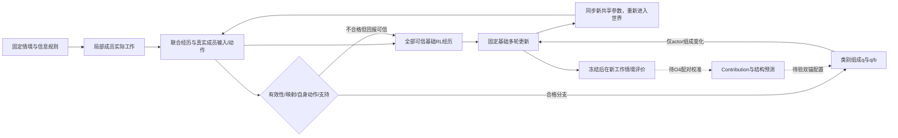

# ID-VTDO：研究目标与理论设计 V1

日期：2026-09-26，v0.14 工作学习路线修订。以用户提供的[数据需求增强版理论稿](../reference/id-vtdo-v1-data-design.md)为完整设计依据，以[v0.13审计](../reference/learning-audit-v013.md)和[当前实验计划](../learning-v014-plan.md)规定本轮优先级。本文是该设计与仓库实现、实验门槛之间的正式对应；不把设计稿中的数量算例写成已建数据或运行结果。原ProWorkSim版本报告保留为历史证据。

## 研究目标的变更

ProWorkSim继续作为持续工作世界和经验采集环境；本项目的当前科学目标改为 **ID-VTDO（Information-Dependency-aware Valid Trajectory Distribution Optimization）**：在固定工作情境边际、信息权限、团队组成、基础学习规则与可比总预算下，利用可核验的信息依赖结构，配置当前团队产生的联合经历，提高更新后团队在新受限信息情境中的工作能力。

世界能执行、模型能调用工具、参数能变化是必要工程前提，各自不能替代算法收益证据。v0.11的36段主试跑全部零奖励、两个制度完成仍独立失败、有限首决策更新成功而回接仍格式失败，均保留，不按新标准回填旧结果。当前研究对象是共享模型直接交互、更新、再交互的在线窗口；暂存完整经历是闭环中间量，不先建设一个成功轨迹库。

候选贡献是信息结构对成员学习价值估计、配置与有限联合探测的作用；不是重新提出CTDE、PPO、经验回放或元重加权。若不能超过获得相同验证反馈和可比计算的通用成员—轨迹元重加权，就应收缩关于信息结构价值的主张。

图中的外层反馈是待验证研究设计。未知/不可靠记录仍进入故障与成本目录，不因为画在训练路径之外就从原始采样分母消失。

## 固定对象与优化对象

精确情境为 $\xi=(x,s_0,\kappa_0)$，包含工作目标、既有义务、初始状态及信息/权限分布。冻结情境边际 $\bar\mu$；工具、外生事件、调度、模型输入呈现、格式反馈、重试和预算构成运行协议 $\Gamma$。改变持有者、开放全信息、换提示或格式适配属于不同 $\xi$ 或 $\Gamma$。

局部执行满足 $a_{i,k}\sim\pi_{\vartheta_i(\Theta)}(\cdot\mid h_{i,k},r_i)$。$h_{i,k}$ 必须来自当次实际模型输入及真实token记录（HTTP 或 resident_direct 分列），不能从完整归档或最终世界倒推。训练器可为critic使用联合状态；不能把它补进actor输入。相同局部输入和策略对应相同动作分布；猜对隐藏事实不创造合法信息渠道。

外层变量仅为各情境—成员块的类别组成 $Q=\{q_i(z\mid\xi)\}$。它不是执行策略，不能直接命令成员采取某条流程，也不能给支持外类别凭空分配经验。任务份额、类内呈现、成员系数、参数共享、奖励和基础学习预算保持固定。

## 三层资格与四种分布

1. **奖励可训练性**：是否有可信的冻结回报与记录。真实可评失败可为0；评价故障、不可判定和不可靠服务记录单列，不强造梯度。
2. **工作有效性**：$V=V_{record}\land V_{permission}\land V_{basis}\land V_{delivery}$。按合同作三值判断；允许的恢复错误与不可接受过程分别声明。奖励为0不自动等于无效，合法阻塞也应按其合同判定。
3. **成员可重配资格**：工作有效、可可靠映射、成员有可恢复的自身动作，并达到冻结支持条件。商业API有实际文本但缺真实token概率时，可以研究工作语义，不能冒充另一训练模型的动作支持。

严格区分真实运行分布 $P_{\Theta,\Gamma}(\tau\mid\xi)$、合格分支自然组成 $b_i$、目标组成 $q_i$ 和实际物化损失权重。程序见证、Teacher、旧策略、不同提示/布局的成功不合并为当前团队同情境支持。

## 联合经历与语义类别

`TeamRollout`在封闭Episode之上绑定团队版本、情境、协议、全部结果和成本；`MemberView`恢复每成员每次真实请求、响应、自身动作、原token/mask/logprob和世界调用关联。发送消息是发送者的动作；接收它是观察。工具返回、同事内容和输入token的actor标签全部为0。wait、done及格式失败仍属于该成员实际生成输出，若基础回报可靠不能只保留成功动作。

信息依赖图来自实际获取、请求、交接、送达、呈现、采用、验证和修订，不是预定项目DAG，也不是已经识别的因果图。文件存在、允许访问、工具已返回、进入当次输入、正式采用和支持业务结论分别记录。

首版Mapper使用冻结、可核验的小类别目录，例如主动交接与请求后交接；消去随机ID、文件名、措辞和无关操作重排，保留相关事件顺序、依据版本及跨成员关系。事件不足、关联冲突或因果先后不明时返回unknown，不能以最终成功猜回路径。不同信息布局不合并支持。类别稳定性通过同义改写、独立重排、缺失交接、事后资料和更换持有者等控制检查。

## 支持与权重物化

令 $M_\xi$ 为冻结窗口实际进入采集的全部采样槽数（中断后未启动的计划名额另列），$n_{\xi iz}$ 为合格类别计数，$n^+_{\xi i}=\sum_z n_{\xi iz}$。

$$v_{\xi i}=n^+_{\xi i}/M_\xi,\qquad b_{\xi iz}=n_{\xi iz}/n^+_{\xi i}.$$

无支持块继续基础处理；单类别块没有组成自由度。两个类别各出现一次不代表足以估计Contribution。按原始槽分母报告产出率、参与、映射失败、有效性未知、服务故障和成本；禁止不断补采到满足配额或把困难情境预算转给容易情境。

对支持内 $q_j$ 要求单纯形和 $\underline w b_{jz}\le q_{jz}\le\overline w b_{jz}$。仅合格分支物化 $w=q/b$；其他有可靠基础回报的经历保持1，无自身动作actor损失为0。不可用记录显式mask并报告，不能静默删掉其生成槽。

若基础损失使用固定情境份额、成员系数 $\omega_i$ 与类内归一化，则

$$\mathcal L(\Theta;Q)=\mathcal L^{base}(\Theta)+\sum_\xi\bar\mu(\xi)\sum_i\omega_i v_{\xi i}\sum_z(q_{\xi iz}-b_{\xi iz})\bar\ell_{\xi iz}(\Theta).$$

因此 $Q=B$ 必须恢复基础损失、梯度与规定更新，不能残留成功筛选。合格分支的总损失质量保持，不能外推成梯度范数、输出token或GPU时间相等。$q/b$与PPO新旧策略概率比各有独立字段和作用。

## 共享模型直接在线学习与两类准入

首阶段采用固定CTDE actor–critic/PPO型基础配方。基础由[PPO原论文](https://arxiv.org/abs/1707.06347)与[合作多智能体PPO研究](https://arxiv.org/abs/2103.01955)提供方法依据；本项目的语言动作、中央critic表示、奖励窗口和工程实现需独立冻结与验证，不声称复现其游戏基准。

一套共享有效 actor 参数、一套 LoRA、一个 actor optimizer，角色有独立权限与局部历史；critic 与 optimizer 独立。窗口内固定 θ，片段闭合后累积更新，所有角色同步 θₜ₊₁ 并清除旧 KV 后实际重新交互。策略身份绑定真实 adapter 张量、base manifest 与数值 profile。共享权重不合并动作归属，别人消息和工具结果仍不是自身生成标签。

固定短任务份额为证据交接、合法前缀后的实现、正确/错误真实交付复核及完整链各1/4；这些是工作起点和责任合同，不是教师轨迹。前缀动作排除于当前 actor 和奖励，终局按责任范围的唯一成果计分，重复批准/消息不加分。各任务自己的有限期限终点与业务自然成功分开；长任务 continuation/bootstrap 留待单独设计，不把任意截断冒充成功。

基础在线 RL 检查环境、记录、回报、概率和优化语义，不以旧 D0、V=true、多类成功、未更新 base 或每窗奖励方差为永久门槛。ID-VTDO 重配置另需当窗有效性、映射、自身动作与类内支持；没有支持的可信失败仍按基础权重处理。critic 最后一层零初始化，未有真实非零回报历史时全零奖励明确 actor 零步，不能用随机 baseline 噪声制造工作信号；同值正奖励可以更新。

完整片段内所有实际决策及 token 都保留，固定情境/角色份额不按准入数量重归一。使用真实输出 token 复算行为 logp 是 PPO 目标的概率核对，不是模仿教师答案。本轮不使用 SFT。具体配方、边界和门限见[在线训练合同](../online-learning-v013.md)，旧 D3 按原门槛停止的结论不变。

O1 的 θ₀→B₀→θ₁→B₁→θ₂ 检验真实闭环。O2 用预声明新事实冻结比较初始/最终模型，单岗位实例和同权重团队分开；loss、非零梯度、参数变化及工具成功率仅为诊断，两周期不等于工作能力改善。没有改善就报告没有证据，不扩写为可迁移学习收益。

## Contribution及后续外层算法

完整学习状态 $\mathsf S_t$ 包括actor、critic、优化器；用相同材料和更新预算得到 $\mathsf S_t^+(Q)=\mathcal U_H(\mathsf S_t;\mathcal B_t,Q)$，目标为 $F_t(Q)=\mathbb E[J_{\nu_{dev}}(\Theta_t^+(Q))]$。

沿 $d_{jz}=\delta_z-q_{j,t}$ 定义 $C_t(j,z)=\left.\partial_\epsilon F_t(Q_t+\epsilon d_{jz})\right|_0$，满足可微条件下 $\sum_zq_{jz}C_t(j,z)=0$。它是改变训练组成后的学习价值，不是当前奖励、执行功劳或永久轨迹质量。

低成本梯度对齐只是代理；固定预条件矩阵下的一步推导不等于完整Adam超梯度。用相同学习起点的配对短试训与真实开发工作结果校准，开发池因此是训练资源。实际扰动步长须留在冻结的正支持、单纯形及权重界限内；不可行的探测方向不能靠临时放宽界限获得。探测后回到共同起点作正式更新，不叠加有利分支。

图特征先采用可解释低维表示，预测获取/提供/请求/采用/验证等结构位置；与无信息依赖特征及原始成员—轨迹元重加权直接比较。双锚第一阶目标为冻结势 $S=C+\beta[\log(r/q_t)]_+$，减去历史KL和覆盖KL。仅正支持、单纯形约束时有归一化指数形式；权重盒或信赖域激活需约束求解，不能裁剪后忘记归一化。

单点可估后才检验 $I_{ab}=F_{11}-F_{10}-F_{01}+F_{00}$。图引导选对与同预算随机选对比较，并保留非邻接对；共享参数会产生图外交互。固定材料试训与更新后各自重新采样的在线闭环分开，后者不宣称经验逐字相同。以上是待验证设计，本轮不以公式实现代替D4–D5证据。

## 数据需求与用途登记

保留五层数据：原始领域素材、可执行情境包、在线联合经历、贡献校准数据、独立评价情境。至少记录来源簇、世界家族、基础项目、布局、精确情境、用途划分、生成器、验证器和模板版本。先按来源/世界家族划分，再派生情境、布局与反事实版本；索引、回放池、世界记忆和派生图同样遵守划分。

软件维护与数据分析是主要领域候选，企业运营、金融资料核对与短程科研复现为后续候选，均非已建覆盖。本轮Jaffle Shop仍为一个公开虚构数据来源家族；D1另用复用其SQL接口思路的手工模拟小表作信息机制预检，并非原始seed切片，也不增加独立公开来源数。行过滤、换名、布局交换和多角色投影不增加独立来源数。其用途登记为机制/接口开发；不能将其中新抽样的一段称为独立来源测试或跨领域泛化。

SWE-smith、UCI、DSBench、WorkArena++、τ²-Bench、SEC、FRED和TPC-H在用户理论稿中是候选资源分析，不是本轮下载或训练清单。区分参考范式、原始素材使用与直接训练任务。正式多来源阶段另行核验版本、使用条件和评价隔离。

每轮至少报告独立来源簇、世界家族、精确情境、联合rollout、成员动作以及成员—情境—类别支持六种数量。完整成本拆为采集、正式更新、探测试训、探测开发执行和外层优化，独立测试另列。固定内层步数不等于相同总预算。

## 可证伪的研究判据

- H1：控制内容与信息条件后，信息结构仍帮助预测成员的真实训练收益。
- H2：同一联合材料和内层预算下，成员条件化配置优于共用权重及仅看当前奖励的配置。
- H3：相同探测预算下，图引导联合探测优于单点与随机选对。
- H4：新事实、新来源、重分配信息和新搭档条件下仍有收益。

必要强基线包括基础MARL、共用类别权重、通用成员—轨迹元重加权、无信息依赖特征、结构化单成员配置、同预算随机选对及双锚消融。只优于均匀权重不足以支持主要创新。

有效性、支持与数据划分先于算法比较；结果按来源/世界/依赖簇及训练种子统计。有限推导只支持相应条件下的质量保持、中心化与surrogate优化，不保证真实效用单调、全局收敛或任意目标分布可由局部策略实现。

## 历史证据与当前推进顺序

[v0.12 报告](../experiments/id-vtdo-v012.md)保留：真实联合经历与成员训练接口已接通，但真实 actor/critic 都未更新，D4/D5 未执行。旧 Qwen 大量拒绝和零奖励、DeepSeek 少量 V=true 但缺本地 token 概率均不回填。critic 状态枚举问题不解释为这些业务拒绝的已证实原因。

O0/O1 的共享在线工程阶段已完成，当前进入 E0 工作可操作性与真实信号诊断→E1 固定预算多窗口基础 RL→E2 同终局合同的时间信用对照，同时进行当窗支持诊断；O4 配置干预仍须具备真实多方法支持。支持严格绑定当前 θ/Γ/ξ，不跨旧策略拼成功、不补采凑类别；未知闭合经历保留真实分母且不伪造 b/v，未启动计划数另列。贡献探测须从共同 actor/critic/optimizer 起点比较，在开发世界真实测效用，回到共同起点正式更新后继续新交互，始终是在线内部机制。

本轮只有一个 development 来源家族，内部 train/dev/locked 标签不是独立来源切分；固定信息布局下的新数值检查只能给有限事实适应证据。四项目实际上下游消费、不同信息布局、独立来源和新搭档尚需后续加入，不能靠随机留 rollout 替代。H1–H4 与强基线要求不降级，正式算法收益尚待实际实验。

## v0.13 实际阶段结论

[实验报告](../experiments/online-v013.md)已给出真实θ₀→B₀→θ₁→B₁→θ₂证据：同一共享actor/optimizer累计2步，独立critic2步，62次实际生成/3965自身输出token全部进入基础更新，两窗概率门通过。每窗当前ξ/成员支持单列，min2/M1使重配正池为空，但不阻断基础RL。

初始/最终各8例在相同预登记协议下冻结工作，R逐项相同（均值0.3），有据实现/复核及完整链交付仍未建立；没有观察到本小批工作收益。主结论是在线工程闭环成立，非ID-VTDO有效或模型具备可迁移工作能力。更新、诊断、未知与未执行项目均不回填成成功。下一阶段继续围绕在线工作后果和新情境评价推进；O4须当窗支持与可测学习效用满足后另冻强对照，四项目/信息重排/独立来源仍未在本轮验证。

## v0.14 的可检验学习问题

本阶段的目标是观察依据驱动的实际修改、有据固定版本复核与错误恢复；参数变化、经历准入和非零优势各自只是诊断。v0.13 首窗口实现/复核失败虽保留，自身零优势仍给零 actor 梯度；共享参数也可能被其他组改变。当前分组诊断记录实际任务、成员、过去公共阶段的正负零优势、输出 token、叶梯度及与总梯度的内积。不同组梯度可能抵消，范数不能相加成“贡献百分比”，这些量不是因果 Contribution。

基础时间信用候选保持同一终局合同：MC 令每个决定目标为 R；joint reward-to-go 使用该决定之后、沿真实联合事件时间线结算的后果总额。只在实际可判定时结算依据读取/送达，复合正确性与复核条款留至终点，最终差额可为负。每条经历强制检查阶段总和等于终局 R。此处的读取/交接条款来自原任务成果合同，不新增工具调用次数奖励。由于成员 token 平均、有限采样和 critic 估计，本实现不宣称两种目标严格无偏等价，更不将 reward-to-go 当作 ID-VTDO 的算法贡献。

更新后诊断固定选取每个首次遇到的组的一次真实决定，最多12条；记录所选输出 token 的概率比与 k3 代理。其 old 分母是更新前完整序列重算，另经真实缓存采样概率门核对。有限选择、数值误差与非全分布求和决定了它不是 full KL 或严格无偏 KL；不以小代理值证明任意后续多 epoch 更新稳定。

正式预算由独立容量窗确定后冻结：MC/RTG 各3个独立训练种子，每窗四任务等份额、每精确情境4条新经历，4个在线训练窗；共384条计划训练经历。开发评价固定在0/2/4窗，24个锁定案例覆盖新事实、持有者交换和新规则，均属同一构造来源家族。计划360条评价独立计费，配对条件共用经过实际初态核对的初始锁定基线。评测不更新 actor/critic/optimizer，恢复 RNG；不据测量挑末点、不将未执行槽补成0。三个种子不是三个独立项目，内部新条件也不是独立来源泛化。

重复 Mξ=4 只使“两类各2条”成为可能，实际当前支持仍须由真实工作有效性、可映射性及成员自身动作共同决定。主动/请求后交接必须在同一真实团队情境出现；单岗位短交接不替代团队支持。没有多类支持便不启动配置试训。后续四项目回接以短工作出现可解释变化为依据，独立来源、新搭档与真正不可得的合法阻塞仍需另行设计及验证。

## v0.14 实际完成范围

[本轮报告](../experiments/learning-v014.md)完成E0诊断和预声明E1/E2的实际启动，但六个high数值条件运行均在原概率门停止：264条真实经历、3次actor/critic更新，480个未来槽未执行。训练后开发及最终锁定评价缺失，不能建立有限工作收益或MC/RTG优劣。RTG在实际首窗删去了交接后过去成果的直接信号，这只验证时间信用机制。当前54个成员支持块无多方法组成自由度，O4没有执行。

确认失效点后以同一实际θ、固定原序列诊断high/highest数值路径，新入口默认完整FP32；新Γ的独立四例容量与旧失败研究分列，不回填原准入、不把新精度通过当学习改善。下一研究应以新数值profile实际代价重冻完整预算，继续观察有据修改和独立复核，不再次以两次更新为主要目标。独立来源与算法增益判据保持不变。
