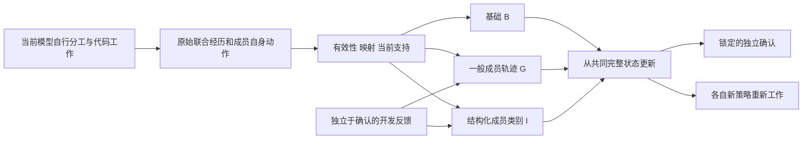

# ID-VTDO 当前研究设计与实现状态

更新：2026-10-02。当前主线为**软件协作中的在线经验分配**：模型自己选择分工、调度、代码修改与集成；算法改变已发生经历在学习中的权重，比较更新后的独立团队工作。软件载体的绝对成绩、基础学习改善和配置相对强基线的增量分别报告。

本次依据[用户提供的审计](../reference/audit-v026-next-software-v027.md)修订。此前全文原样保存在[V1 至 v0.26 历史入口](id-vtdo-v1-through-v026.md)；各历史实验、失败、评分、训练和恢复记录继续有效，不被新领域或新协议重新解释。[v0.27 协议](../software-allocation-v027-plan.md)规定新边界，[实施与 CPU 核验报告](../experiments/software-alignment-v027.md)说明实际完成范围。

## 当前科学问题

主要对象不是训练出通用编程模型，也不是比较哪一种通信方式更好，而是在相同完整学习起点、当前经历、基础损失、重配范围和评价条件下，检验结构化分配是否比基础分配 B 及一般成员—轨迹重加权 G 更有效。

设完整学习状态为 `S=(actor, critic, actor_optimizer, critic_optimizer, declared RNG)`，当前窗口原始联合经历为 D，基础更新算子为 U，独立确认效用为 J_test。主要比较为：

\[
\Delta_{I-B}=J_{test}(\mathcal U(S,D,Q_I))-J_{test}(\mathcal U(S,D,B)),\qquad
\Delta_{I-G}=J_{test}(\mathcal U(S,D,Q_I))-J_{test}(\mathcal U(S,D,Q_G)).
\]

开发反馈用于选权，独立确认不参与选择。只在开发集上挑出更高分配置不构成算法有效；软件任务本身成功也不构成配置收益。当前 v0.27 实现和 CPU 控制不是这两个主量的真实模型估计。

```mermaid
flowchart LR
  W[当前模型自行分工与代码工作] --> D[原始联合经历和成员自身动作]
  D --> V[有效性 映射 当前支持]
  V --> B[基础 B]
  V --> G[一般成员轨迹 G]
  V --> I[结构化成员类别 I]
  DEV[独立于确认的开发反馈] --> G
  DEV --> I
  B --> U[从共同完整状态更新]
  G --> U
  I --> U
  U --> TEST[锁定的独立确认]
  U --> NEXT[各自新策略重新工作]
```

图中软件真实模型窗口、配对试训、确认及后继工作须分别具备运行回执后才能标为已完成；当前不通过图示声称已有闭环效果证据。

## 理论机制与实现证据

| 机制 | 实现入口 | 当前证据及边界 |
| --- | --- | --- |
| 权限、精确版本、固定交付、真实操作后果 | `core/`、`episode.py` | 已有内核与历史控制保留；不是新增训练框架 |
| 软件副本、动态责任、补丁与集成 | `software_collaboration_v027.py` | 新的有限接口开发实现；Marshmallow 不作新独立来源 |
| 来源用途及派生簇隔离 | `software_sources_v027.py` | SWE-smith 为主路线；清单准入不等于任务已下载或可执行 |
| 受管 SDK 会话与实际调用 | `harness_sdk.py`、`harness_runtime.py`、`harness_collection.py` | 复用既有 OpenHands 接入；软件接线的 CPU 控制不代替真实模型准入 |
| 原始请求、自身输出与窗口身份 | `team_rollout.py`、`member_views.py`、`online_support.py` | 不重分词伪造 token，不跨成员转移目标，不拼参数窗口 |
| 软件有效性与工作路线 | `software_training_v027.py` | 根据独立记录与真实产物关系映射，不按消息 ID 或确认结果贴类 |
| 当前支持与 q/b | `support_weights.py` | 每个精确情境/成员独立计数，失败残余与分母保留 |
| 多块 B/G/I 配置、C/N 与双锚 | `experience_allocation_v027.py` | 通用有限第一阶选择规则及 CPU 控制；无真实配置效果结论 |
| actor 加权与 critic 独立 | `online_training.py` | 复用实际损失入口；新分配只传受约束 actor 权重，不改 critic/PPO 比例 |
| 跨窗口预测、联合探测、图选对 | 历史理论中的后续机制 | 尚未完成软件环境校准和效果验证，不由首版有限差分冒充 |
| 独立确认与后继在线工作 | v0.27 A–D 协议 | 真实任务、预算和模型状态待冻结，没有自动开启后继 |

详细 CPU 执行数量、通过/跳过及环境限制以[实施报告](../experiments/software-alignment-v027.md)为准。旧 `composition_training_v025.py` 保持其冻结微实验语义，不靠直接解除旧硬编码重写历史。

## 情境 协议 成员和三层资格

精确情境 `xi` 包括代码起点、联合目标、任务与信息分布、角色权限和既有责任；运行协议 `Gamma` 包括工具、呈现、模型配置、调度、重试、上下文和资源规则。不同初态、错误类型、来源用途或 Gamma 不并入同一个支持块。

两位稳定成员可以领取、委派或改变具体职责，但过去动作始终属于当时实际生成它的成员。模型输入来自其真实会话和工作副本；critic 的联合状态不补进 actor 输入。任务板声明、文件可访问、实际读取、固定补丁被集成和测试覆盖是不同证据，不互相替代。

保留三层资格：

1. 奖励与记录可信性：有固定提交、独立可判结果和完整原始记录；真实可评失败可以为零，服务故障或缺失不能强造零分。
2. 完整工作有效性：记录、权限、需求与真实产物关系、完整交付分别具有证据。软件使用实际文件、patch、集成和独立测试，不复制冗长的 SQL 式手工采用手续。
3. 成员重配资格：当前参数与协议窗口、可映射工作路线、成员可恢复的自身生成动作及预定频数全部成立。

完整职责、重配资格和基础 actor mask 分开。可信失败仍按共同基础规则处理；没有自身生成不能补一个虚拟动作，没有真实 token/概率就不能冒充当前学习器样本。

## 当前支持与一阶配置

每个精确情境、成员块保留原始 M 个联合槽，记合格类别计数 n_z、支持总数 n⁺、覆盖比例 v=n⁺/M、经验组成 b_z=n_z/n⁺。频数门在采样前冻结，不跨窗口或用途拼池，也不事后补采到凑齐。

I 在实际工作类别上配置；G 在相同合格分支的原始成员轨迹上配置。它们共享允许重配范围、残余处理、比例上下界和 TV 半径。基准 B 保持单位权重，I 的成员权重为 q_z/b_z；G 的原始槽权重为其目标质量与均匀原始槽质量之比。每个任务和成员份额不转移，critic 与基础分母不随权重重新归一化。

首版使用完整单纯形对比方向的正负配对试训，估计局部 C；它是有限差分，不是已经学会或校准的贡献预测器。每一对必须从相同 actor、critic、两个优化器和声明随机状态出发，消费同一当前经历，并在同一冻结开发清单上执行。缺失配对、未知结果或绑定不符显式回退或拒绝，不将未知填零。

覆盖 N 只由当前真实支持定义。对于 K 个已支持类别，I 使用 `r_z=1/K`、`N_z=max(0,1-K*b_z)`。G 的原始槽 s 属于 z 时，`b_s=1/n⁺`、`r_s=1/(K*n_z)`、`N_s=N_z`；两法的逐槽覆盖目标一致，避免把重配范围差异混成结构收益。

本版本逐块选择目标为：

\[
\max_q\ \langle q,C\rangle+\beta\langle q,N\rangle
-\lambda_B\operatorname{KL}(q\Vert b)
-\lambda_R\operatorname{KL}(q\Vert r),
\quad q\in\Delta,\quad L\le q/b\le U,\quad\mathrm{TV}(q,b)\le\varepsilon.
\]

两个锚系数为正，beta 非负且须冻结；默认开发控制使用 beta=0.25，并不据此声称该值最优。N 不是价值或不确定性，覆盖不足不能自动解释为应当获得更高任务收益。具体输入、预算、数值求解、可识别性、回退和绑定见[配置器设计](../design/experience-allocation-v027.md)。

G 所需方向数取决于合格原始成员轨迹自由度，I 取决于类别自由度；统一有限预算必须足够覆盖声明方向，不能暗中只给 G 无效搜索。记录实际试训与开发成本，不为填满预算空跑。若整个有限窗口无可配置块，本次比较停止，不默认追加无对照基础训练；完整在线算法的可信残余处理规则并未删除。

## 软件来源与效果研究

先按仓库、commit、issue、目标补丁、测试与共同派生关系划分接口开发、策略训练、贡献开发、独立确认，再构造协作需求。第一版采用保守的仓库用途隔离。SWE-smith 提供素材和环境机制，其教师轨迹不替代当前模型生成；SWE-Gym 为备选，已有 Marshmallow 为接口开发资产。

主确认使用内部锁定软件协作任务，评价完整功能、组合和交付；CooperBench 原生分数另列，因为逐 feature/逐 patch 的通过不自动证明组合集成正确。SWE-bench 用作个体代码和回归控制；AsynCodeBench 为未完成实现审计的候选，不作当前必经门槛。各来源的正式依据和版本见[来源说明](software-sources-v027.md)。

A 的 4 情境×2 重复是审计建议的载体开发规模，尚未冻结为实际运行清单。B 的重复数、频数门及 C/D 的试训和确认资源由软件任务与开发成本决定，不先设一个新的总56/72/144例。v0.26 的 GPU 列表、8小时上限和旧等卡期限均不继承。

各方法正式更新后必须用自己的新策略重新采集下一窗，不能交叉复用后继经历。报告分别说明功能交付、协作过程、基础学习和相对 B/G 的配置增量。固定正式更新预算的机制比较，与计入采集/试训/开发/更新/确认/外层计算的总成本效率比较分开；后者应让 B 按预定规则使用节省预算，不要求空等。

## 历史证据与归档入口

[v0.26 结案](../experiments/collaboration-v026-final.md)保持：恢复后16逻辑槽可评、完整职责0/16，17次实际业务尝试，原中断unknown与原完整主比较未知保留。两份源产物内容正确但合同未全部满足；消费端没有成功构建或交付。两个通信条件均零不能证明通信等价或 ID-VTDO 无效；累计2.468925 GPU小时及无更新事实不改变。

[v0.25](../experiments/composition-pilot-v025-final.md)的旧支持不足、一次基础更新、确认2/12与后继0/2，[v0.24](../experiments/credit-pilot-v024-final.md)的MC/RTG有限结果，均按原材料与职责协议保留。新软件成绩不能与这些 SQL 比例直接相减为学习或配置增量。

[V1 至 v0.26 原文](id-vtdo-v1-through-v026.md)保存旧形式定义、历史阶段和当时执行边界；当前有限协议的停止规则、软件用途及 B/G/I 选择接口以本页和 v0.27 协议为准。尚未实现的历史复杂机制仍是研究设计，不作为当前实验证据。
