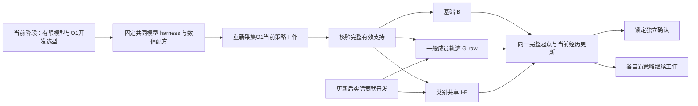

# ID-VTDO 当前研究设计与实现状态

最新恢复进度（2026-10-04晚）：9B已完成12槽（API2/4、修复4/4、O1 0/4）；两个新模型下载完整，但在写加载诊断时发生零采样序列化失败。仅修复诊断表示并建立一次恢复，GPU5已成功预约，原9B及两次失败原件全部保留。见[恢复记录](../experiments/software-model-selection-v030-recovery.md)。

更新：2026-10-04。主线仍为**软件协作中的在线经验分配**：模型在真实工作中形成任务、承担责任、修改代码并集成交付；分配算法改变已发生经历在学习中的权重，以更新后的独立团队工作检验增量。当前执行依据[v0.30模型与O1选型协议](../experiments/software-model-selection-v030-protocol.md)，三个候选的监督队列已于北京时间2026-10-04 13:54启动；9B于13:59在GPU4启动并进入真实资格测试，14B与24B等待完整下载，详见[启动凭据](../experiments/software-model-selection-v030-launch.md)及[运行报告](../experiments/software-model-selection-v030.md)。

[v0.29已结案](../experiments/software-allocation-v029-final.md)：同一sqlparse情境的8槽全部可评，完整工作0/8；7份固定交付完成局部库修复，但consumer正常路径失败，另1槽无固定交付。完整有效支持为零，因此未执行B/G/I试训、正式更新、schema贡献开发或TextFSM独立确认。该结果既不支持也不反驳分配算法的效果，旧0/8和失败原件不回改。

[新审计](../reference/audit-v029-next-v030.md)据此要求先区分载体能力、正常路径反馈、O1任务形成和公式对象。v0.30完成了对应源码与CPU控制，真实候选资格正在执行，尚无正式筛选结果或参数训练收益。本地未取得完整V1.3原文；新数学模块只实现已提供详细理论的可见一阶条款，不能称完整V1.3实现。

## 当前阶段与证据边界

| 对象 | 当前完成范围 | 不能据此声称 |
|---|---|---|
| 六个新开发合同 | 一个固定MIT Marshmallow仓库；6份参考解公开／独立检查全过，20个坏控制均拒绝 | 六独立来源、真实模型成功或可训练支持 |
| O1工作世界 | 共同根目标、空任务表、自主创建／修订任务和责任、版本化依赖与真实集成 | 已观察到真实候选模型自主有效协作 |
| 原生模板与SDK | 18个模型／案例组合、72次脚本化请求通过；实际tokenizer与WorldCore错误回流 | 模型生成、行为概率、近16K训练或工作能力通过 |
| 技术更新与恢复实现 | CPU小模型实际采样、全token反向、两个optimizer各一次聚合更新和完整恢复已核验 | 9B／14B／24B的本轮训练准入或能力收益 |
| 一阶分配规则 | 对数N、显式历史／覆盖双锚、G-raw／G-lift／I-P接口及CPU数值控制 | 已执行真实贡献试训、分配更新或完整V1.3 |
| 三候选正式运行 | 候选、用途、调用上限、资格门及选择规则已冻结；监督队列已启动；9B在GPU4执行真实资格，14B／24B等待下载，尚无筛选结果 | 已有候选排名、软件成绩或ID-VTDO增量 |

规则基线、脚本化SDK请求、CPU小模型参数控制、真实候选模型运行和正式参数学习分别记账。[最终CPU集成报告](../experiments/software-model-selection-v030-cpu.md)记录71项测试及Ruff通过；[原生模板资格报告](../experiments/software-native-templates-v030.md)说明18组合与72次请求的实际范围，其中真实模型调用为0，没有采样token_trace或可训练rollout。[开发池说明](../../examples/software-sources-v030/README.md)与其资格原件固定源码、合同和正反控制。

## 科学问题与本轮选型的位置

算法主要检验：在同一完整学习起点、同批当前经历、基础损失、可重配范围和评价条件下，结构化分配是否优于基础分配B及一般成员—轨迹重加权G-raw。设完整学习状态为 `S=(actor, critic, actor_optimizer, critic_optimizer, declared RNG)`，当前原始联合经历为D，基础更新算子为U，独立确认效用为J_test：

\[
\Delta_{I-B}=J_{test}(\mathcal U(S,D,Q_{I-P}))-J_{test}(\mathcal U(S,D,B)),\qquad
\Delta_{I-G}=J_{test}(\mathcal U(S,D,Q_{I-P}))-J_{test}(\mathcal U(S,D,Q_{G-raw})).
\]

开发反馈用于选权，独立确认不参与选择。换用更强模型后的绝对成绩属于载体变化；只有固定同一模型与完整起点后的方法内部差值，才对应上述分配增量。当前一阶CPU控制和模型选型都未估计这两个真实主量。

```mermaid
flowchart LR
  SELECT[当前阶段：有限模型与O1开发选型] --> FIX[固定共同模型 harness 与数值配方]
  FIX --> WORK[重新采集O1当前策略工作]
  WORK --> SUPPORT[核验完整有效支持]
  SUPPORT --> B[基础 B]
  SUPPORT --> G[一般成员轨迹 G-raw]
  SUPPORT --> I[类别共享 I-P]
  DEV[更新后实际贡献开发] --> G
  DEV --> I
  B --> UPDATE[同一完整起点与当前经历更新]
  G --> UPDATE
  I --> UPDATE
  UPDATE --> TEST[锁定独立确认]
  UPDATE --> NEXT[各自新策略继续工作]
```

该图表示研究次序；v0.30止于有限选型，不自动启动尚未冻结的支持窗口、贡献试训或独立确认。下一窗重复数与最低频数根据开发产出和估计精度事前确定，不机械沿用8槽，也不补采到出现成功。

## 三个固定候选与有限开发池

本轮固定当前Qwen3.5-9B端点、SWE-Next-14B、Devstral-Small-2507三个运行组合。9B严格恢复历史actor／critic累计3/3的完整状态；两个新架构各从官方权重、新LoRA、新critic和两个新optimizer的0/0起点开始，不继承9B的参数适配或优化器状态。这些初始化和公开后训练不同，比较属于运行组合选型，不能解释为参数量的因果作用。固定revision、许可、模型资料与有限训练来源重合检查见[候选研究](software-model-candidates-v030.md)。

开发池共6个新合同：2个API正常路径、2个看见真实失败后的修复、2个O1双成员根目标。前4个只启用单执行者A，后2个启用A／B；它们来自一个既有开发用途的Marshmallow仓库，不是六个独立仓库或原生SWE问题。该仓库存在历史9B冻结交互暴露，但未用于项目参数训练；也不声称候选预训练或公开后训练完全无重合。

最多6案例×2seed×3模型＝36条正式筛选经历。API、修复和O1三类分别报告，不把单执行者诊断与团队任务混成一个总成功率。所有案例均为`model_interface_development`，永不用于训练、贡献估计或独立确认；schema、TextFSM及旧sqlparse训练材料均不参与选模型。

候选须先通过推理与训练资格才进入12槽筛选；正式12槽全部已知且三类各至少2/4完整通过，才具有可选资格。排名依次使用O1成功、修复成功、API成功、跨seed一致性、格式错误和实际成本，不使用消息数、任务数或“看起来合作”。不因低分追加候选或seed，全部不合格则结束本批。

## O1工作与公开验证的变化

新`software_collaboration_v030.py`只预置共同根目标、代码、公共要求、权限、工具和资源。初始执行任务表为空，成员自行创建、修订、领取、转交任务并安排依赖；固定启动身份不等于固定两张执行任务卡。任务和依赖有版本，固定patch保留当时的责任快照；旧patch不会自动满足后来的任务修订。O3动态成员扩缩仍是后续独立面板。

公开反馈分别报告上游回归、consumer公开正常例、成员自测和未测试部分。公开正常例由公共合同派生，与隐藏独立输入分开；回归绿色不代替consumer和根目标通过。两道修复案例的初始失败来自实际执行有缺陷代码，明确标注controller-forced反馈，不能计作模型自主发现缺口。固定提交保存待验收版本，不直接宣称完整正确。

这些工作继续复用WorldCore、受管OpenHands SDK、原始请求／响应与完整版本记录。环境不替模型修改代码；参考解和隐藏验收不进入成员可见工作副本。真实可评失败、技术未知、未启动及中断分别保留，后续结果不能填回过去的提交或episode。

## 推理、可微更新与容量分开准入

每候选最多4次独立原生技术生成：读取真实note、约8K输入后事实记录、控制器真实missing-file异常与约10K输入后继续、约14K输入加2048输出上限的写文件压力请求。fixture独立于6个开发案例。正常前三次必须正确使用公开工具；第4次即使自然达到length上限或格式失败，全部实际输出token仍参与原概率门与梯度检查。不强制最小输出长度、不改EOS、不裁尾、不覆盖行为概率，也不增加生成次数凑长度。

每候选最多1次聚合技术更新，使用原PPO损失、原optimizer和clip，恒定正诊断优势与critic目标明确不属于软件业务reward。通过实际参数变化、保存重载后，再做1个更新后单调用WorldCore片段检验真实新身份回流；该片段不要求业务成功，也不计入36条筛选。最后必须完整恢复诊断前的actor、critic、两个optimizer、recipe和RNG。

`training_integration_ready`与`near_16k_capacity_demonstrated`分别记录。后者必须有真实输入加输出至少15,360 token且完整反传成功；不足则记`capacity_not_demonstrated`。总`training_ready`同时要求接口、原概率门、实际更新、重载、新身份回流和容量证据。任何概率失败均零步；资格失败不进入筛选，也不换模型或删困难token。当前三个真实候选尚未执行本轮资格；CPU小模型通过不替代这些实际检查。

## 当前支持、一阶公式与基线

后续正式分配仍须区分精确情境xi、运行协议Gamma、稳定成员和当前参数窗口。每块保留原始M个槽、有效支持总数n⁺、类别计数n_z、覆盖比例v=n⁺/M与基础组成b_z=n_z/n⁺。不跨来源用途、参数窗口或协议拼支持；无自身生成动作的成员不能创造虚拟策略梯度。可信失败保留共同基础处理，actor mask、critic、任务／成员份额和原始分母不随重配偷偷改变。

新[一阶分配设计](../design/experience-allocation-v030.md)明确分开当前基础组成b、已绑定到当前支持的历史组成h及正覆盖目标r：

\[
N_a=[\log(r_a/h_a)]_+,\qquad S_a=\widehat C_a+\beta N_a,
\]

\[
\max_q\ \langle q,S\rangle
-\lambda_h\operatorname{KL}(q\Vert h)
-\lambda_r\operatorname{KL}(q\Vert r),\qquad
q\in\Delta,\quad L\le q/b\le U,\quad\operatorname{TV}(q,h)\le\rho.
\]

历史需显式提供来源窗口、当前情境／成员、来源配置摘要及事前转移规则。首次h=b可以是明确声明的初始化，不能默认设置后声称跨窗口继承。当前CPU数值接口要求传入历史已在当前支持及权重盒内，不会自行投影、平滑或制造新支持。TV中心h是本轮记录的实现选择；它与权重比基准b不同。

| 方法 | 配置坐标 | 专用语义输入与先验 | 类内配置 |
|---|---|---|---|
| B | 原始基础处理 | 无重新选权 | 单位权重 |
| G-raw | 原始成员轨迹 | 不接类别或图；默认原始轨迹均匀覆盖，或预声明非语义目标 | 每条独立 |
| G-lift | 原始成员轨迹 | 显式读取类别覆盖先验的辅助对照 | 每条独立 |
| I-P | 成员条件化工作类别 | 冻结正类别覆盖目标 | 同类共享q_z/b_z |

G-lift不能再冒称完全一般的G-raw。类别先验不强加给G-raw，I-P也没有实现图网络或I-S结构共享。C必须最终来自更新后实际贡献开发；CPU传入一个数值不证明已经执行试训。未知C不能写成零后让N代替贡献，覆盖引起的权重变化也不能被描述为发现高价值经历。

旧`experience_allocation_v027.py`及v0.29保持原线性不足度`max(0,1-K*b)`、q0=b和共同类别覆盖先验变体。新模块不重选旧结果，也未接入本轮模型筛选的optimizer路径。跨窗口支持转移、贡献预测、完整试训与原始训练动作绑定、联合探测及O3还需要各自实现与证据。本地完整V1.3原文不可用，不能用这一阶修订代替全部详细理论。

## 资源与完成后的主线

本轮协议允许GPU0–7、每模型一个单卡owner、最多3个并行组合，累计GPU时间、worker总时长、统一墙钟与队列截止均不继承旧限制。仍执行事前冻结的单任务时间、显存、RSS与原件空间保护；下载未完成的臂不占GPU。启动快照中9B已在GPU4进行真实资格，两个新模型等待完整下载；CPU控制、下载与排队不记作模型工作或训练耗时。整批结束后独立finisher生成报告并提交推送，不自动开始B/G-raw/I-P。

[旧27B权重清理](../operations/model-27b-cleanup-2026-10-04.md)已按授权完成，删除权重、专属缓存及探针的分配块合计约51.75GiB；保留9B基座、检查点、旧身份元数据和实验原件。旧27B目录已明确标记不可加载，历史下载完成记录不再代表当前文件完整。

若选型产生合格组合，下一阶段固定同一模型、harness和数值配方，重新采集O1当前策略材料，冻结重复数、最低频数、G-raw一般基线、贡献试训与独立确认数量和全部成本。各方法正式更新后用自己的新策略继续工作，不能交叉复用后继经历。本轮36条开发材料不会转为该阶段支持，当前协议也不自动启动尚未冻结的比较。

## 历史证据与归档

- [v0.29结案](../experiments/software-allocation-v029-final.md)：8/8可评、完整工作0/8、无配置支持、无更新及独立确认；局部库修复与consumer失败分开。
- [v0.28报告](../experiments/software-development-v028-summary.md)：恢复后8槽可评、4通过／4未交付；原异常attempt保留，新旧接口结果不当作同协议算法比较。
- [v0.26结案](../experiments/collaboration-v026-final.md)：恢复后完整职责0/16，原中断unknown和原完整主比较未知保留，无参数更新。
- [v0.25结案](../experiments/composition-pilot-v025-final.md)：支持不足后一次基础更新、确认2/12与后继0/2；缺少同材料更新前端点，不估计配置或参数学习增量。
- [v0.24结案](../experiments/credit-pilot-v024-final.md)：MC／RTG的有限结果保留原材料和单训练seed边界，不与新软件比例直接相减。
- [V1至v0.26原文](id-vtdo-v1-through-v026.md)与[本地详细理论](../reference/id-vtdo-v1-data-design.md)保存研究定义和历史阶段；未完成机制仍是设计，不作当前实验证据。

当前执行范围以v0.30冻结协议及其后实际运行回执为准。规则可行、真实模型交付、基础参数学习改善和同模型分配增量始终分别报告。
