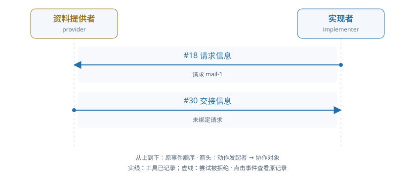

# train-00-4 · A · 依据交接与新交付

[交互HTML版](train-00-4.html) · [全部16条](../README.md) · [完整结构化数据](../data/train-00-4.json)

> 审阅者全局视角。模型输出保持原文；各成员完整实际输入在HTML的请求详情和JSON中逐调用保留，不能从全局快照补入模型当时视野。数值token/logprob数组仅保留源引用。

## 成员协作有向图



箭头为动作发起成员→协作对象，按原事件顺序向下排列。实线表示工具已记录，虚线表示尝试被拒；不代表对方已读或业务正确。个人操作及准备动作不连成成员关系。

[在交互页查看并定位事件](train-00-4.html#collaboration) · [单独打开图](../graphs/train-00-4.svg)

## 任务及原结果

Provider reads an applicable private business basis and legally delivers its exact version through the declared route. The implementer obtains and adopts that delivered version with actual data, uses it in a correct real build and fixes the code/result in a new submission. A message without consumption is insufficient. Proactive delivery and a recipient request are both legitimate.

完整职责：否；原回报：0.2；重配有效性V：否；方法：unmapped。

| 维度 | 原判定 |
|---|---|
| record | 是 |
| permission | 是 |
| basis | 否 |
| delivery | 否 |

## 中文阅读提示（事后摘要）

提供者须读取自己持有的适用业务依据，并通过声明的合法路线送达其准确版本；实现者须取得并采用该版本与实际数据，执行正确构建，将代码和结果固定到新提交中。仅发送消息而未实际使用不够；主动送达和由接收方先提出请求均为合法方式。

先请求、后未绑定交接，构建执行后仍无法提交。

实现者 seq18 发出请求；提供者 seq30 合法交接却未填写 request_id。seq189 构建成功执行，但 seq202/241 的提交都被当前工作状态拒绝；seq228 preflight 成功也未解除该状态。原评分仍未承认正确构建／交付。

审阅重点：将未绑定请求这一协作断点与 SQL 内容评价分开，不能断言只补 request_id 就必然全部成功。


以下参数完整保留；工具返回仅作带标注的摘要，完整返回、原始XML、全部输入消息及对象文件在HTML/JSON中，不是再次评分。

## 联合时间线

### #2 资料提供者 · 决定 1

调用 `model-a35209870caeed239d32e688`；observed_completion；输出token 150。

模型回复原文：

```text
The task requires me to read the applicable private business basis and legally deliver it through the declared route. According to the observation, I am the "provider" and there is a manual route with route_id "basis" for object_alias "basis" with object_id "obj-9f9810e0cce067d1c4e27122".

I need to first read the current version at the visible workspace alias "basis" to get the exact version of the basis that I should deliver.
```

工具/控制提案：

```json
[
  {
    "id": "call_129d531ec69f7e009933c10ee404953c",
    "type": "function",
    "function": {
      "name": "read_alias",
      "arguments": "{\"alias\": \"basis\", \"work_id\": \"TEAM::build\"}"
    }
  }
]
```

**#8 读取别名 · read_alias · 工具ok=true**

执行参数：

```json
{
  "alias": "basis",
  "work_id": "TEAM::build"
}
```

工具返回摘要（完整返回见HTML/JSON）：

```text
{
  "reference": {
    "object_id": "obj-9f9810e0cce067d1c4e27122",
    "version_id": "v1"
  }
}
```

原输入/回复序号：4/5；[在HTML定位](train-00-4.html#seq-2)。

### #12 实现者 · 决定 1

调用 `model-9322377869514de345449a71`；observed_completion；输出token 304。

模型回复原文：

```text
I need to understand the task. Looking at the observation, I can see:

1. This is a retail collaboration work where the implementer needs to:
   - Obtain and adopt a delivered basis version
   - Use it in a correct build
   - Fix the code/result and submit

2. The requirements show:
   - input_policies: basis="fixed", data="fixed"
   - input_versions: data="v1"
   - source_objects: basis="obj-9f9810e0cce067d1c4e27122", data="obj-ce6df59356455075dcb4aa81"

3. The deliverable contract requires:
   - Two files: code and result
   - result must have tables.metrics with CustomerID, revenue_pence, invoice_count
   - Must use actual adoptions with sql_build

4. The information_routes show:
   - "basis" route available for implementer from provider
   - "audit_basis" route available for reviewer

Let me first read the basis information since it's needed for the task. The route_id is "basis" and work_id is "TEAM::build".
```

工具/控制提案：

```json
[
  {
    "id": "call_c3b70bdedc3f57ce43b6d258ccf711cd",
    "type": "function",
    "function": {
      "name": "request_information",
      "arguments": "{\"route_id\": \"basis\", \"work_id\": \"TEAM::build\"}"
    }
  }
]
```

**#18 请求信息 · request_information · 工具ok=true**

执行参数：

```json
{
  "route_id": "basis",
  "work_id": "TEAM::build"
}
```

工具返回摘要（完整返回见HTML/JSON）：

```text
{
  "request_id": "mail-1"
}
```

原输入/回复序号：14/15；[在HTML定位](train-00-4.html#seq-12)。

### #24 资料提供者 · 决定 2

调用 `model-dab65068a7db4d3003cb2719`；observed_completion；输出token 460。

模型回复原文：

```text
（原正文为空；工具提案见下）
```

工具/控制提案：

```json
[
  {
    "id": "call_5bbdc844bac4f419d2e248ef89084920",
    "type": "function",
    "function": {
      "name": "handoff_information",
      "arguments": "{\"route_id\": \"basis\", \"work_id\": \"TEAM::build\", \"handoff_key\": \"basis\", \"body\": \"Delivered basis: meaning=\\\"UCI InvoiceNo starting C (case insensitive) is a cancellation; UnitPrice is GBP per unit. sales_only excludes C invoices and nonpositive quantities; net_signed retains signed Quantity including cancellations. Both exclude nonpositive prices and missing CustomerID. Keep all original rows (no duplicate deletion), sum Quantity*UnitPrice in GBP and output rounded integer pence, count DISTINCT qualifying InvoiceNo. Retain every customer in data.customers with zeros as needed. Date interval is start inclusive/end exclusive using source local-naive timestamps.\\\", policy_origin=\\\"This reporting policy is an explicit simulated client contract; it is not asserted to be the original retailer policy.\\\", tables={\\\"basis_meta\\\": {\\\"columns\\\": [{\\\"name\\\": \\\"period\\\", \\\"type\\\": \\\"VARCHAR\\\"}, {\\\"name\\\": \\\"edition\\\", \\\"type\\\": \\\"VARCHAR\\\"}, {\\\"name\\\": \\\"start_inclusive\\\", \\\"type\\\": \\\"VARCHAR\\\"}, {\\\"name\\\": \\\"end_exclusive\\\", \\\"type\\\": \\\"VARCHAR\\\"}, {\\\"name\\\": \\\"invoice_mode\\\", \\\"type\\\": \\\"VARCHAR\\\"}, {\\\"name\\\": \\\"currency\\\", \\\"type\\\": \\\"VARCHAR\\\"}, {\\\"name\\\": \\\"duplicates\\\", \\\"type\\\": \\\"VARCHAR\\\"}, {\\\"name\\\": \\\"missing_customer\\\", \\\"type\\\": \\\"VARCHAR\\\"}, {\\\"name\\\": \\\"price_rule\\\", \\\"type\\\": \\\"VARCHAR\\\"}], \\\"rows\\\": [[\\\"UCI-2011-fixed-slice\\\", \\\"approved\\\", \\\"2010-12-01 00:00:00\\\", \\\"2011-07-01 00:00:00\\\", \\\"sales_only\\\", \\\"GBP\\\", \\\"retain_source_rows\\\", \\\"exclude\\\", \\\"strictly_positive\\\"]]}}\", \"reference\": {\"object_id\": \"obj-9f9810e0cce067d1c4e27122\", \"version_id\": \"v1\"}}"
    }
  }
]
```

**#30 交接信息 · handoff_information · 工具ok=true**

执行参数：

```json
{
  "route_id": "basis",
  "work_id": "TEAM::build",
  "handoff_key": "basis",
  "body": "Delivered basis: meaning=\"UCI InvoiceNo starting C (case insensitive) is a cancellation; UnitPrice is GBP per unit. sales_only excludes C invoices and nonpositive quantities; net_signed retains signed Quantity including cancellations. Both exclude nonpositive prices and missing CustomerID. Keep all original rows (no duplicate deletion), sum Quantity*UnitPrice in GBP and output rounded integer pence, count DISTINCT qualifying InvoiceNo. Retain every customer in data.customers with zeros as needed. Date interval is start inclusive/end exclusive using source local-naive timestamps.\", policy_origin=\"This reporting policy is an explicit simulated client contract; it is not asserted to be the original retailer policy.\", tables={\"basis_meta\": {\"columns\": [{\"name\": \"period\", \"type\": \"VARCHAR\"}, {\"name\": \"edition\", \"type\": \"VARCHAR\"}, {\"name\": \"start_inclusive\", \"type\": \"VARCHAR\"}, {\"name\": \"end_exclusive\", \"type\": \"VARCHAR\"}, {\"name\": \"invoice_mode\", \"type\": \"VARCHAR\"}, {\"name\": \"currency\", \"type\": \"VARCHAR\"}, {\"name\": \"duplicates\", \"type\": \"VARCHAR\"}, {\"name\": \"missing_customer\", \"type\": \"VARCHAR\"}, {\"name\": \"price_rule\", \"type\": \"VARCHAR\"}], \"rows\": [[\"UCI-2011-fixed-slice\", \"approved\", \"2010-12-01 00:00:00\", \"2011-07-01 00:00:00\", \"sales_only\", \"GBP\", \"retain_source_rows\", \"exclude\", \"strictly_positive\"]]}}",
  "reference": {
    "object_id": "obj-9f9810e0cce067d1c4e27122",
    "version_id": "v1"
  }
}
```

工具返回摘要（完整返回见HTML/JSON）：

```text
{
  "reference": {
    "object_id": "obj-9f9810e0cce067d1c4e27122",
    "version_id": "v1"
  },
  "request_id": null,
  "handoff_id": "handoff-693cdaf1c385027b4fdd1b01"
}
```

原输入/回复序号：26/27；[在HTML定位](train-00-4.html#seq-24)。

### #32 业务环境事件 · 

```json
{
  "event_id": "f8f2e02c374112f6090dafa8545dcb66",
  "kind": "manual_handoff",
  "at": 5,
  "payload": {
    "handoff_id": "handoff-693cdaf1c385027b4fdd1b01",
    "handoff_key": "basis",
    "origin": "member_action",
    "project_id": "TEAM",
    "work_item_id": "TEAM::build",
    "requirement_version": 1,
    "route_id": "basis",
    "sender": "provider",
    "recipients": [
      "implementer"
    ],
    "request_id": null,
    "reference": {
      "object_id": "obj-9f9810e0cce067d1c4e27122",
      "version_id": "v1"
    },
    "body": "Delivered basis: meaning=\"UCI InvoiceNo starting C (case insensitive) is a cancellation; UnitPrice is GBP per unit. sales_only excludes C invoices and nonpositive quantities; net_signed retains signed Quantity including cancellations. Both exclude nonpositive prices and missing CustomerID. Keep all original rows (no duplicate deletion), sum Quantity*UnitPrice in GBP and output rounded integer pence, count DISTINCT qualifying InvoiceNo. Retain every customer in data.customers with zeros as needed. Date interval is start inclusive/end exclusive using source local-naive timestamps.\", policy_origin=\"This reporting policy is an explicit simulated client contract; it is not asserted to be the original retailer policy.\", tables={\"basis_meta\": {\"columns\": [{\"name\": \"period\", \"type\": \"VARCHAR\"}, {\"name\": \"edition\", \"type\": \"VARCHAR\"}, {\"name\": \"start_inclusive\", \"type\": \"VARCHAR\"}, {\"name\": \"end_exclusive\", \"type\": \"VARCHAR\"}, {\"name\": \"invoice_mode\", \"type\": \"VARCHAR\"}, {\"name\": \"currency\", \"type\": \"VARCHAR\"}, {\"name\": \"duplicates\", \"type\": \"VARCHAR\"}, {\"name\": \"missing_customer\", \"type\": \"VARCHAR\"}, {\"name\": \"price_rule\", \"type\": \"VARCHAR\"}], \"rows\": [[\"UCI-2011-fixed-slice\", \"approved\", \"2010-12-01 00:00:00\", \"2011-07-01 00:00:00\", \"sales_only\", \"GBP\", \"retain_source_rows\", \"exclude\", \"strictly_positive\"]]}}",
    "response_status": "delivered",
    "purpose": "basis",
    "actor": "provider"
  },
  "outcome": "applied",
  "transition_id": "event:f8f2e02c374112f6090dafa8545dcb66",
  "transition": {
    "receipt_version": "phase-deltas-v0.5",
    "semantics_version": "work-world-v0.9",
    "contract": "ManualHandoffDelivery",
    "allowed_business_paths": [
      [
        "messages"
      ],
      [
        "shares"
      ],
      [
        "raw_condition_responses"
      ],
      [
        "handoffs",
        "handoff-693cdaf1c385027b4fdd1b01"
      ]
    ],
    "apply_delta": [
      [
        "handoffs",
        "handoff-693cdaf1c385027b4fdd1b01",
        "message_id"
      ],
      [
        "handoffs",
        "handoff-693cdaf1c385027b4fdd1b01",
        "received_at"
      ],
      [
        "handoffs",
        "handoff-693cdaf1c385027b4fdd1b01",
        "status"
      ],
      [
        "messages"
      ],
      [
        "shares"
      ]
    ],
    "derive_delta": [],
    "net_delta": [
      [
        "handoffs",
        "handoff-693cdaf1c385027b4fdd1b01",
        "message_id"
      ],
      [
        "handoffs",
        "handoff-693cdaf1c385027b4fdd1b01",
        "received_at"
      ],
      [
        "handoffs",
        "handoff-693cdaf1c385027b4fdd1b01",
        "status"
      ],
      [
        "messages"
      ],
      [
        "shares"
      ]
    ],
    "primary_region_changes": [
      [
        "handoffs",
        "handoff-693cdaf1c385027b4fdd1b01",
        "message_id"
      ],
      [
        "handoffs",
        "handoff-693cdaf1c385027b4fdd1b01",
        "received_at"
      ],
      [
        "handoffs",
        "handoff-693cdaf1c385027b4fdd1b01",
        "status"
      ],
      [
        "messages"
      ],
      [
        "shares"
      ]
    ],
    "projection_region_changes": [],
    "state_digests": {
      "before": "ef7f9fa469d2b8df6e870aeaebe9c8fa2b4dccdd99c9ec35fb63f4c2b327869d",
      "after_apply": "1cb3a09aecc6dd9b1b6b7fd994b8c5f81b6813686d0b30ff4d21d47fe8df3c71",
      "after_derive": "1cb3a09aecc6dd9b1b6b7fd994b8c5f81b6813686d0b30ff4d21d47fe8df3c71"
    },
    "effect_refs": [],
    "history_preserved": true,
    "frame_respected": true,
    "committed_revision": 6,
    "execution_outcome": "committed",
    "transition_id": "event:f8f2e02c374112f6090dafa8545dcb66",
    "bound_actor": "provider",
    "request_digest": "655a21e0341844dbcac3a0369fa5e76cd9f728715ae4effc1188bd55baa0eb9a",
    "pre_state_revision": 5
  }
}
```

### #36 实现者 · 决定 2

调用 `model-c83230dbe4931d227f44f858`；observed_completion；输出token 404。

模型回复原文：

```text
I need to implement the retail result contract. Let me start by understanding the current state and reading the basis information that was delivered.

From the observation, I can see:
- There's a basis.json (obj-9f9810e0cce067d1c4e27122, version v1) that contains the policy
- There's a data.json (obj-ce6df59356455075dcb4aa81, version v1) with the data
- I need to create code and result files
- The basis specifies: "UCI InvoiceNo starting C (case insensitive) is a cancellation; UnitPrice is GBP per unit. sales_only excludes C invoices and nonpositive quantities; net_signed retains signed Quantity including cancellations. Both exclude nonpositive prices and missing CustomerID. Keep all original rows (no duplicate deletion), sum Quantity*UnitPrice in GBP and output rounded integer pence, count DISTINCT qualifying InvoiceNo. Retain every customer in data.customers with zeros as needed."

The period is "UCI-2011-fixed-slice" with start "2010-12-01 00:00:00" and end "2011-07-01 00:00:00", invoice_mode "sales_only", currency "GBP", duplicates "retain_source_rows", missing_customer "exclude", price_rule "strictly_positive".

Let me first read the basis to understand the exact content:
```

工具/控制提案：

```json
[
  {
    "id": "call_7486cd1350c86360711b6caa4e1ac0ce",
    "type": "function",
    "function": {
      "name": "read_version",
      "arguments": "{\"reference\": {\"object_id\": \"obj-9f9810e0cce067d1c4e27122\", \"version_id\": \"v1\"}, \"work_id\": \"TEAM::build\"}"
    }
  }
]
```

**#42 读取确切版本 · read_version · 工具ok=true**

执行参数：

```json
{
  "reference": {
    "object_id": "obj-9f9810e0cce067d1c4e27122",
    "version_id": "v1"
  },
  "work_id": "TEAM::build"
}
```

工具返回摘要（完整返回见HTML/JSON）：

```text
{
  "reference": {
    "object_id": "obj-9f9810e0cce067d1c4e27122",
    "version_id": "v1"
  }
}
```

原输入/回复序号：38/39；[在HTML定位](train-00-4.html#seq-36)。

### #48 资料提供者 · 决定 3

调用 `model-a9087d0eab1fd0ea77a7f6d3`；observed_completion；输出token 121。

模型回复原文：

```text
The basis has been successfully delivered via handoff. Now I need to proceed with the next step in the workflow. Based on the role task, I need to read and adopt the data (obj-ce6df59356455075dcb4aa81) to prepare for building the result.

Let me read the data object to understand its contents.
```

工具/控制提案：

```json
[
  {
    "id": "call_cad8d6a1e0f2a2a5b4e1a0773c0efe28",
    "type": "function",
    "function": {
      "name": "read_alias",
      "arguments": "{\"alias\": \"data\", \"work_id\": \"TEAM::build\"}"
    }
  }
]
```

**#54 读取别名 · read_alias · 工具ok=true**

执行参数：

```json
{
  "alias": "data",
  "work_id": "TEAM::build"
}
```

工具返回摘要（完整返回见HTML/JSON）：

```text
{
  "reference": {
    "object_id": "obj-ce6df59356455075dcb4aa81",
    "version_id": "v1"
  }
}
```

原输入/回复序号：50/51；[在HTML定位](train-00-4.html#seq-48)。

### #59 实现者 · 决定 3

调用 `model-df56a0a1ce17ecfc1fe33102`；observed_completion；输出token 41。

模型回复原文：

```text
（原正文为空；工具提案见下）
```

工具/控制提案：

```json
[
  {
    "id": "call_18a3aff95d695e17d197df003c58fbfa",
    "type": "function",
    "function": {
      "name": "read_alias",
      "arguments": "{\"alias\": \"data\", \"work_id\": \"TEAM::build\"}"
    }
  }
]
```

**#65 读取别名 · read_alias · 工具ok=true**

执行参数：

```json
{
  "alias": "data",
  "work_id": "TEAM::build"
}
```

工具返回摘要（完整返回见HTML/JSON）：

```text
{
  "reference": {
    "object_id": "obj-ce6df59356455075dcb4aa81",
    "version_id": "v1"
  }
}
```

原输入/回复序号：61/62；[在HTML定位](train-00-4.html#seq-59)。

### #71 资料提供者 · 决定 4

调用 `model-bfc0b1055f556ec79cc312ef`；observed_completion；输出token 88。

模型回复原文：

```text
I have read the basis and data. The basis has been delivered. Now I need to read the code and query to understand the current state, then execute the build to produce the result.

Let me read the code first.
```

工具/控制提案：

```json
[
  {
    "id": "call_c1c2020b4d6e24940dd149974ac2eb74",
    "type": "function",
    "function": {
      "name": "read_alias",
      "arguments": "{\"alias\": \"code\", \"work_id\": \"TEAM::build\"}"
    }
  }
]
```

**#77 读取别名 · read_alias · 工具ok=true**

执行参数：

```json
{
  "alias": "code",
  "work_id": "TEAM::build"
}
```

工具返回摘要（完整返回见HTML/JSON）：

```text
{
  "reference": {
    "object_id": "obj-744d5addeb8920d37cbb11db",
    "version_id": "v1"
  }
}
```

原输入/回复序号：73/74；[在HTML定位](train-00-4.html#seq-71)。

### #82 实现者 · 决定 4

调用 `model-0e239949f462ca3329401796`；observed_completion；输出token 327。

模型回复原文：

```text
I need to understand the task requirements. From the observation, I can see:

1. I'm the implementer role in TEAM::build
2. There's a condition "TEAM::condition-mail-1" that is still open (status: "open")
3. The basis was delivered via handoff-693cdaf1c385027b4fdd1b01
4. I need to:
   - Adopt the delivered basis version
   - Adopt the data version (v1 of obj-ce6df59356455075dcb4aa81)
   - Write SQL code (code.json)
   - Run sql_build to generate result
   - Submit code and result

The deliverable contract requires:
- Two files: code and result
- result must have tables.metrics with columns: CustomerID, revenue_pence, invoice_count
- sources.data and sources.basis with exact references

Let me first adopt the basis and data, then write the SQL code.
```

工具/控制提案：

```json
[
  {
    "id": "call_0dd2a71cfddd31dca0dece11142abc0f",
    "type": "function",
    "function": {
      "name": "adopt",
      "arguments": "{\"alias\": \"basis\", \"object_id\": \"obj-9f9810e0cce067d1c4e27122\", \"version_id\": \"v1\", \"policy\": \"fixed\", \"work_ids\": [\"TEAM::build\"]}"
    }
  }
]
```

**#88 采用版本 · adopt · 工具ok=true**

执行参数：

```json
{
  "alias": "basis",
  "object_id": "obj-9f9810e0cce067d1c4e27122",
  "version_id": "v1",
  "policy": "fixed",
  "work_ids": [
    "TEAM::build"
  ]
}
```

工具返回摘要（完整返回见HTML/JSON）：

```text
{
  "version_id": "v1"
}
```

原输入/回复序号：84/85；[在HTML定位](train-00-4.html#seq-82)。

### #94 资料提供者 · 决定 5

调用 `model-f390003a4ccd0e36fcee93ed`；observed_completion；输出token 738。

模型回复原文：

```text
The role task instructs me to "Read and legally hand off your privately held applicable basis. Proactive delivery or responding to a recipient request is legitimate. Do not produce the implementer result."

Looking at the observation, I can see that:
1. There's a condition `TEAM::condition-mail-1` with status "open" that requires a "basis" provider to "provide"
2. There's already a handoff `handoff-693cdaf1c385027b4fdd1b01` that was delivered to implementer with handoff_key "basis"
3. The current actor is "provider" and I'm at logical_time 13
4. The work_item TEAM::build has condition_ids including "TEAM::condition-mail-1" which is outstanding

Looking at my own action history, I can see I've already:
- Read basis (action-2)
- Handoff basis via handoff_information (action-6) with handoff_key "basis"
- Read data (action-9)
- Read code (action-12)

The handoff I made was already delivered (status "delivered" in the observation). The condition status shows "open" but there's already a delivered handoff. 

Wait, looking more carefully at the task: "Read and legally hand off your privately held applicable basis." The observation shows my own action history includes a handoff that was already made. But the condition is still "open". 

Let me check if there's another condition or if I need to make another handoff. Looking at the conditions, there's only one condition `TEAM::condition-mail-1` with status "open".

Actually, re-reading the observation more carefully, I see that the handoff "handoff-693cdaf1c385027b4fdd1b01" was sent to implementer and has status "delivered". But the condition is still open. 

Perhaps the condition needs to be resolved by the implementer or reviewer, not the provider. The task says I'm the "provider" and my role is to "Read and legally hand off your privately held applicable basis."

I've already handed off the basis. Let me check if there's anything else I need to do. The task says "Do not produce the implementer result" - so I should not be producing the sql result.

Looking at the deliverables section, it says the deliverables should be code and result, but my role as provider is to deliver the basis, not the implementer's result.

I think I've completed my task as provider - I've read the basis and handed it off. The condition might remain open until the implementer adopts it and submits.

Let me wait to see if there are any new messages or if I should declare done.

Actually, looking at the conditions more carefully, the condition has "status":"open" and "outstanding_condition_ids":["TEAM::condition-mail-1"] in the work_item. This suggests the condition hasn't been resolved yet.

But my task is specifically to "Read and legally hand off your privately held applicable basis." I've done that - I read the basis and made a handoff. The handoff was delivered.

Perhaps I should wait for new messages or declare that I'm done with my provider tasks.

Let me check if there are any messages I need to respond to.
```

工具/控制提案：

```json
[
  {
    "id": "call_0bf1d942a46595d8ed1057e5883ec115",
    "type": "function",
    "function": {
      "name": "read_messages",
      "arguments": "{}"
    }
  }
]
```

**#100 读取消息 · read_messages · 工具ok=true**

执行参数：

```json
{}
```

工具返回摘要（完整返回见HTML/JSON）：

```text
[{'at': 2, 'attachments': [], 'body': {'mode': 'manual', 'origin': 'member_action', 'purpose': 'basis', 'requirement_version': 1, 'route_id': 'basis', 'work_item_id': 'TEAM::build'}, 'message_id': 'mail-1', 'project_id': 'TEAM', 'recipients': ['provider'], 'sender': 'implementer', 'subject': 'Information requested from team member', 'work_item_id': 'TEAM::build'}]
```

原输入/回复序号：96/97；[在HTML定位](train-00-4.html#seq-94)。

### #105 实现者 · 决定 5

调用 `model-c5d9908c0fe1892b9aeb84f0`；observed_completion；输出token 66。

模型回复原文：

```text
I need to read the existing code and query files to understand the current implementation, then build and submit the correct result.
```

工具/控制提案：

```json
[
  {
    "id": "call_7b0aad697488072844593739ba7fc933",
    "type": "function",
    "function": {
      "name": "read_alias",
      "arguments": "{\"alias\": \"code\", \"work_id\": \"TEAM::build\"}"
    }
  }
]
```

**#111 读取别名 · read_alias · 工具ok=true**

执行参数：

```json
{
  "alias": "code",
  "work_id": "TEAM::build"
}
```

工具返回摘要（完整返回见HTML/JSON）：

```text
{
  "reference": {
    "object_id": "obj-744d5addeb8920d37cbb11db",
    "version_id": "v1"
  }
}
```

原输入/回复序号：107/108；[在HTML定位](train-00-4.html#seq-105)。

### #117 资料提供者 · 决定 6

调用 `model-829355e9d853390309541749`；observed_completion；输出token 385。

模型回复原文：

```text
Based on my analysis of the policy, data, and code:

**Policy (basis v1):**
- InvoiceNo starting C (case insensitive) is a CANCELLATION
- sales_only excludes C invoices AND nonpositive quantities
- net_signed retains signed Quantity including cancellations
- Both exclude nonpositive prices and missing CustomerID
- Keep all original rows (no duplicate deletion)
- Sum Quantity*UnitPrice in GBP and output rounded integer pence
- Count DISTINCT qualifying InvoiceNo
- Retain every customer in data.customers with zeros as needed
- Date interval: 2010-12-01 00:00:00 to 2011-07-01 00:00:00 (start inclusive, end exclusive)

**Data:**
- Customers: 13756, 15838
- 12 retail rows in the slice

**Current code issues:**
1. No date filtering (should only include 2010-12-01 to 2011-07-01)
2. No exclusion of C invoices (cancellations)
3. No exclusion of nonpositive quantities
4. No exclusion of missing CustomerID
5. No grouping by CustomerID
6. No proper metrics output (revenue_pence, invoice_count)

Let me read the query object to see if it exists:
```

工具/控制提案：

```json
[
  {
    "id": "call_e7fb4aab9dfdddb37caf9e5270bdc7d8",
    "type": "function",
    "function": {
      "name": "read_version",
      "arguments": "{\"reference\": {\"object_id\": \"obj-d9d68c0639ed6a00185aff83\", \"version_id\": \"v1\"}, \"work_id\": \"TEAM::build\"}"
    }
  }
]
```

**#123 读取确切版本 · read_version · 工具ok=true**

执行参数：

```json
{
  "reference": {
    "object_id": "obj-d9d68c0639ed6a00185aff83",
    "version_id": "v1"
  },
  "work_id": "TEAM::build"
}
```

工具返回摘要（完整返回见HTML/JSON）：

```text
{
  "reference": {
    "object_id": "obj-d9d68c0639ed6a00185aff83",
    "version_id": "v1"
  }
}
```

原输入/回复序号：119/120；[在HTML定位](train-00-4.html#seq-117)。

### #128 实现者 · 决定 6

调用 `model-e5bf104e52880f93271203ed`；observed_completion；输出token 647。

模型回复原文：

```text
I need to implement the retail result contract. Let me analyze what I have:

1. **Basis (adopted)**: The policy states:
   - "UCI InvoiceNo starting C (case insensitive) is a cancellation"
   - "sales_only excludes C invoices and nonpositive quantities"
   - "Keep all original rows (no duplicate deletion), sum Quantity*UnitPrice in GBP and output rounded integer pence, count DISTINCT qualifying InvoiceNo"
   - "Retain every customer in data.customers with zeros as needed"
   - Date interval is start inclusive/end exclusive

2. **Data**: Contains customers (13756, 15838) and retail rows. Looking at the data, I can see there's a cancellation row (InvoiceNo starting with "C" - C577753 with Quantity -24).

3. **Current code**: The current code just does a simple GROUP BY without implementing the proper filtering logic.

I need to:
1. Write a new code alias that implements the proper filtering
2. Build the SQL to generate the correct result
3. Submit the code and result

Let me write the corrected code:
```

工具/控制提案：

```json
[
  {
    "id": "call_003e3441b63a72bb05e1682edd533825",
    "type": "function",
    "function": {
      "name": "write_object",
      "arguments": "{\"alias\": \"code\", \"dependencies\": [{\"object_id\": \"obj-ce6df59356455075dcb4aa81\", \"version_id\": \"v1\"}, {\"object_id\": \"obj-9f9810e0cce067d1c4e27122\", \"version_id\": \"v1\"}], \"data\": {\"config\": {\"description\": \"Retail customer metrics with proper filtering: exclude C invoices (cancellations), exclude nonpositive quantities, exclude nonpositive prices, exclude missing CustomerID. Keep all original rows, sum Quantity*UnitPrice in GBP (output rounded integer pence), count DISTINCT qualifying InvoiceNo per customer. Retain every customer from data.customers with zeros as needed.\", \"exports\": [\"metrics\"]}, \"models\": [{\"name\": \"metrics\", \"sql\": \"WITH filtered AS (\\n  SELECT * FROM retail \\n  WHERE Quantity > 0 \\n    AND UnitPrice > 0 \\n    AND CustomerID IS NOT NULL\\n    AND InvoiceNo NOT LIKE 'C%'\\n    AND InvoiceNo NOT LIKE 'c%'\\n),\\ncustomer_ids AS (\\n  SELECT CustomerID FROM customers\\n)\\nSELECT \\n  c.CustomerID,\\n  SUM(r.Quantity * r.UnitPrice * 100)::BIGINT AS revenue_pence,\\n  COUNT(DISTINCT r.InvoiceNo)::BIGINT AS invoice_count\\nFROM customer_ids c\\nLEFT JOIN filtered r ON c.CustomerID = r.CustomerID\\nGROUP BY c.CustomerID\\nORDER BY c.CustomerID\"}], \"tests\": []}, \"work_id\": \"TEAM::build\"}"
    }
  }
]
```

**#134 写入对象 · write_object · 工具ok=true**

执行参数：

```json
{
  "alias": "code",
  "dependencies": [
    {
      "object_id": "obj-ce6df59356455075dcb4aa81",
      "version_id": "v1"
    },
    {
      "object_id": "obj-9f9810e0cce067d1c4e27122",
      "version_id": "v1"
    }
  ],
  "data": {
    "config": {
      "description": "Retail customer metrics with proper filtering: exclude C invoices (cancellations), exclude nonpositive quantities, exclude nonpositive prices, exclude missing CustomerID. Keep all original rows, sum Quantity*UnitPrice in GBP (output rounded integer pence), count DISTINCT qualifying InvoiceNo per customer. Retain every customer from data.customers with zeros as needed.",
      "exports": [
        "metrics"
      ]
    },
    "models": [
      {
        "name": "metrics",
        "sql": "WITH filtered AS (\n  SELECT * FROM retail \n  WHERE Quantity > 0 \n    AND UnitPrice > 0 \n    AND CustomerID IS NOT NULL\n    AND InvoiceNo NOT LIKE 'C%'\n    AND InvoiceNo NOT LIKE 'c%'\n),\ncustomer_ids AS (\n  SELECT CustomerID FROM customers\n)\nSELECT \n  c.CustomerID,\n  SUM(r.Quantity * r.UnitPrice * 100)::BIGINT AS revenue_pence,\n  COUNT(DISTINCT r.InvoiceNo)::BIGINT AS invoice_count\nFROM customer_ids c\nLEFT JOIN filtered r ON c.CustomerID = r.CustomerID\nGROUP BY c.CustomerID\nORDER BY c.CustomerID"
      }
    ],
    "tests": []
  },
  "work_id": "TEAM::build"
}
```

工具返回摘要（完整返回见HTML/JSON）：

```text
{
  "version_id": "v2"
}
```

原输入/回复序号：130/131；[在HTML定位](train-00-4.html#seq-128)。

### #140 停止或边界 · 资料提供者

```json
{
  "type": "PolicyBoundaryError",
  "message": "Fixed model decision count reached",
  "status": "model_budget_exhausted",
  "opportunity_id": "staff-opportunity-v024-854f49c51ba741883727a0a0-13",
  "limits": [
    "max_decisions"
  ]
}
```

### #144 实现者 · 决定 7

调用 `model-ed4c1a7ba81a770261913267`；observed_completion；输出token 121。

模型回复原文：

```text
I need to adopt the data source before building. Let me adopt the data alias first.
```

工具/控制提案：

```json
[
  {
    "id": "call_1ae7a608e5b698b98133a2e6a1c26994",
    "type": "function",
    "function": {
      "name": "adopt",
      "arguments": "{\"alias\": \"data\", \"object_id\": \"obj-ce6df59356455075dcb4aa81\", \"version_id\": \"v1\", \"policy\": \"fixed\", \"work_ids\": [\"TEAM::build\"]}"
    }
  }
]
```

**#150 采用版本 · adopt · 工具ok=true**

执行参数：

```json
{
  "alias": "data",
  "object_id": "obj-ce6df59356455075dcb4aa81",
  "version_id": "v1",
  "policy": "fixed",
  "work_ids": [
    "TEAM::build"
  ]
}
```

工具返回摘要（完整返回见HTML/JSON）：

```text
{
  "version_id": "v1"
}
```

原输入/回复序号：146/147；[在HTML定位](train-00-4.html#seq-144)。

### #157 实现者 · 决定 8

调用 `model-df3f9b57cc1736249e3d8379`；observed_completion；输出token 76。

模型回复原文：

```text
I need to execute the SQL build using the updated code. Let me first check if there's a basis alias that needs to be adopted, then run the sql_build.
```

工具/控制提案：

```json
[
  {
    "id": "call_fb53a8b53db86ea39d164baba4dd4750",
    "type": "function",
    "function": {
      "name": "read_alias",
      "arguments": "{\"alias\": \"basis\", \"work_id\": \"TEAM::build\"}"
    }
  }
]
```

**#163 读取别名 · read_alias · 工具ok=true**

执行参数：

```json
{
  "alias": "basis",
  "work_id": "TEAM::build"
}
```

工具返回摘要（完整返回见HTML/JSON）：

```text
{
  "reference": {
    "object_id": "obj-9f9810e0cce067d1c4e27122",
    "version_id": "v1"
  }
}
```

原输入/回复序号：159/160；[在HTML定位](train-00-4.html#seq-157)。

### #170 实现者 · 决定 9

调用 `model-21befb688383efdef014727a`；observed_completion；输出token 346。

模型回复原文：

```text
I need to analyze the policy and data to implement the correct SQL. Let me review the basis policy:

From the basis:
- Period: "UCI-2011-fixed-slice", date range "2010-12-01 00:00:00" to "2011-07-01 00:00:00" (start inclusive, end exclusive)
- Invoice mode: "sales_only" - excludes C invoices (cancellations) AND nonpositive quantities
- Currency: "GBP"
- Duplicates: "retain_source_rows" - keep all original rows
- Missing customer: "exclude" - exclude rows with missing CustomerID
- Price rule: "strictly_positive" - exclude nonpositive prices

Looking at the data, I can see:
- InvoiceNo starting with "C" are cancellations (e.g., "C577753")
- Negative quantities exist (e.g., -9360)
- CustomerID column exists in all visible rows

The policy says "sales_only excludes C invoices and nonpositive quantities". This means I should:
1. Exclude InvoiceNo starting with "C" (case insensitive)
2. Exclude Quantity <= 0
3. Exclude prices <= 0
4. Exclude missing CustomerID

Let me first check what the current code looks like and then write the correct SQL:
```

工具/控制提案：

```json
[
  {
    "id": "call_0555f335e472c079f434687c6df164e5",
    "type": "function",
    "function": {
      "name": "read_alias",
      "arguments": "{\"alias\": \"code\", \"work_id\": \"TEAM::build\"}"
    }
  }
]
```

**#176 读取别名 · read_alias · 工具ok=true**

执行参数：

```json
{
  "alias": "code",
  "work_id": "TEAM::build"
}
```

工具返回摘要（完整返回见HTML/JSON）：

```text
{
  "reference": {
    "object_id": "obj-744d5addeb8920d37cbb11db",
    "version_id": "v2"
  }
}
```

原输入/回复序号：172/173；[在HTML定位](train-00-4.html#seq-170)。

### #183 实现者 · 决定 10

调用 `model-4d2d364637370d09d4894fda`；observed_completion；输出token 197。

模型回复原文：

```text
I need to execute the SQL build to generate the result. I have:
- code alias with the SQL code (version v2)
- data alias adopted (obj-ce6df59356455075dcb4aa81, v1)
- basis alias adopted (obj-9f9810e0cce067d1c385027b4fdd1b01, v1)

Let me run sql_build with the code alias, output to result alias, and input aliases for data and basis.
```

工具/控制提案：

```json
[
  {
    "id": "call_b9430fbcc11d05562bfae652beed38ec",
    "type": "function",
    "function": {
      "name": "sql_build",
      "arguments": "{\"work_id\": \"TEAM::build\", \"code_alias\": \"code\", \"output_alias\": \"result\", \"input_aliases\": [\"data\", \"basis\"]}"
    }
  }
]
```

**#189 执行SQL构建 · sql_build · 工具ok=true**

执行参数：

```json
{
  "work_id": "TEAM::build",
  "code_alias": "code",
  "output_alias": "result",
  "input_aliases": [
    "data",
    "basis"
  ]
}
```

工具返回摘要（完整返回见HTML/JSON）：

```text
{
  "reference": {
    "object_id": "obj-9198e3ea23f930466ff23e6a",
    "version_id": "v2"
  }
}
```

原输入/回复序号：185/186；[在HTML定位](train-00-4.html#seq-183)。

### #196 实现者 · 决定 11

调用 `model-971d805781abbb5419289003`；observed_completion；输出token 75。

模型回复原文：

```text
I need to submit the current versions of the chosen workspace aliases (code and result) for the work. Let me submit these artifacts.
```

工具/控制提案：

```json
[
  {
    "id": "call_eacb0e44edff466725be30698ffa6fa4",
    "type": "function",
    "function": {
      "name": "submit",
      "arguments": "{\"work_id\": \"TEAM::build\", \"artifacts\": [\"code\", \"result\"]}"
    }
  }
]
```

**#202 固定提交 · submit · 工具ok=false**

执行参数：

```json
{
  "work_id": "TEAM::build",
  "artifacts": [
    "code",
    "result"
  ]
}
```

工具返回摘要（完整返回见HTML/JSON）：

```text
{
  "message": "Work is not open for submission by this actor",
  "rejection": {
    "category": "unknown",
    "code": "unclassified_exception",
    "context": {
      "action": "project_action",
      "actor_id": "implementer",
      "arguments_type": "dict",
      "project_id": "TEAM",
      "tool": "submit"
    },
    "version": "tool-rejection-v0.9"
  },
  "type": "ValueError"
}
```

原输入/回复序号：198/199；[在HTML定位](train-00-4.html#seq-196)。

### #209 实现者 · 决定 12

调用 `model-e35f969d84a28ec0904477d4`；observed_completion；输出token 166。

模型回复原文：

```text
The submission was blocked because the work is not open for submission by this actor. Looking at the observation, I see there's an outstanding condition "TEAM::condition-mail-1" with status "open". The condition requires the implementer to respond to the basis requirement.

Looking at the handoffs, I see that "handoff-693cdaf1c385027b4fdd1b01" delivered the basis to the implementer at logical_time 5. The condition has a "resolution_ref": null, which suggests it hasn't been resolved yet.

I need to respond to the issue/condition. Let me check if there are any issues I need to respond to first by reading messages.
```

工具/控制提案：

```json
[
  {
    "id": "call_a427f00f845e92d817129220d94dd0d1",
    "type": "function",
    "function": {
      "name": "read_messages",
      "arguments": "{}"
    }
  }
]
```

**#215 读取消息 · read_messages · 工具ok=true**

执行参数：

```json
{}
```

工具返回摘要（完整返回见HTML/JSON）：

```text
[{'at': 5, 'attachments': [], 'body': {'actor': 'provider', 'body': 'Delivered basis: meaning="UCI InvoiceNo starting C (case insensitive) is a cancellation; UnitPrice is GBP per unit. sales_only excludes C invoices and nonpositive quantities; net_signed retains signed Quantity including cancellations. Both exclude nonpositive prices and missing CustomerID. Keep all original rows (no duplicate deletion), sum Quantity*UnitPrice in GBP and output rounded integer pence, count DISTINCT qualifying InvoiceNo. Retain every customer in data.customers with zeros as needed. Date interval is start inclusive/end exclusive using source local-naive timestamps.", policy_origin="This reporting policy is an explicit simulated client contract; it is not asserted to be the original retailer policy.", tables={"basis_meta": {"columns": [{"name": "period", "type": "VARCHAR"}, {"name": "edition", "type": "VARCHAR"}, {"name": "start_inclusive", "type": "VARCHAR"}, {"name": "end_exclusive", "type": "VARCHAR"}, {"name": "invoice_mode", "type": "VARCHAR"}, {"name": "currency", "type": "VARCHAR"}, {"name": "duplicates", "type": "VARCHAR"}, {"name": "missing_customer", "type": "VARCHAR"}, {"name": "price_rule", "type": "VARCHAR"}], "rows": [["UCI-2011-fixed-slice", "approved", "2010-12-01 00:00:00", "2011-07-01 00:00:00", "sales_only", "GBP", "retain_source_rows", "exclude", "strictly_positive"]]}}', 'delivered_for_current_work': True, 'handoff_id': 'handoff-693cdaf1c385027b4fdd1b01', 'handoff_key': 'basis', 'origin': 'member_action', 'project_id': 'TEAM', 'purpose': 'basis', 'recipients': ['implementer'], 'reference': {'object_id': 'obj-9f9810e0cce067d1c4e27122', 'version_id': 'v1'}, 'request_id': None, 'requirement_version': 1, 'response_id': None, 'response_status': 'delivered', 'route_id': 'basis', 'sender': 'provider', 'work_item_id': 'TEAM::build'}, 'message_id': 'mail-2', 'project_id': 'TEAM', 'recipients': ['implementer'], 'sender': 'provider', 'subject': 'Team evidence handoff'}]
```

原输入/回复序号：211/212；[在HTML定位](train-00-4.html#seq-209)。

### #222 实现者 · 决定 13

调用 `model-7c3da148c3aabdbcfe40d46b`；observed_completion；输出token 1060。

模型回复原文：

```text
The submission was rejected because "Work is not open for submission by this actor". Looking at the observation, I see there's an outstanding condition "TEAM::condition-mail-1" that needs to be resolved. The condition is related to the basis handoff. Let me check if I need to respond to this condition or if there's something else I need to do first.

Looking at the task description, it says "Existing pending work may be correct. Self-check or respond to evidenced review; withdraw before replacing a pending fixed submission." Since there's no pending submission (latest_submission_id is null), I need to understand what's blocking the submission.

The work item status is "blocked" with an outstanding condition. Let me check if I need to respond to an issue first. Looking at the issues section, it's empty. 

Let me re-read the task: "Deliver only the current fixed material result table; arbitrary future-input correctness is not evaluated."

The submit failed because the work is not open. Looking at the conditions, there's "TEAM::condition-mail-1" which is about basis. But I've already adopted basis and data, and built the result.

Wait - I notice the submission was rejected. Let me check if there's a need to respond to an issue first. The observation shows "issue_views":{} and "issues":{} which means no issues are currently open.

Looking more carefully at the public_format section, it says "Submit exactly aliases code and result from the actual build." But the submit failed.

Let me check if I need to withdraw a pending submission first. But there's no pending submission (pending_submission_id is null).

Actually, looking at the work item status, it says "status":"blocked" with "outstanding_condition_ids":["TEAM::condition-mail-1"]. This condition might need to be resolved before submission can proceed.

Let me check if there's an issue that needs responding. The condition has status "open" but I don't see an associated issue_id in the issue_views.

Looking at the task again - it says to "Self-check or respond to evidenced review". Perhaps I need to respond to the condition/issue that's blocking the work.

Let me try to understand what's happening. The condition "TEAM::condition-mail-1" is about basis, and I've already handled that. But the work is still blocked.

Actually, I notice that in the own_action_history, there was a submit that failed. Let me check if there's a submission_id I should be aware of. The failed submit doesn't show a submission_id in the response.

Let me try a different approach - maybe I need to wait for the condition to resolve, or perhaps I need to respond to an issue that I haven't seen yet.

Looking at the observation more carefully, I see "issue_decisions":{} and "issue_responses":{}, which suggests no issues have been responded to. But there's also "issues":{} which is empty.

Wait - the condition "TEAM::condition-mail-1" has status "open" and it's an outstanding condition. Perhaps this condition needs to be resolved through responding to an issue, but the issue hasn't been created yet, or perhaps I need to check if there's an issue associated with this condition.

Let me try to respond_issue to see if there's an issue I need to handle. But I need an issue_id, which I don't have.

Actually, re-reading the task description more carefully: "The implementer obtains and adopts that delivered version with actual data, uses it in a correct real build and fixes the code/result in a new submission."

I've done all of that - I adopted basis and data, built the result, and the code looks correct. The submit failed because the work is blocked.

Let me check if there's a way to unblock the work. Perhaps I need to respond to an issue first. But I don't see any issues.

Wait - looking at the observation again, I see "conditions":{"TEAM::condition-mail-1": {... "status":"open", ...}}. This condition might need to be resolved. But how?

Actually, I think I may have misunderstood. Let me check if there's a pending submission that needs to be withdrawn. The observation says "pending_submission_id":null, so there's no pending submission.

Let me try to understand the workflow better. The task says to "respond to evidenced review". Perhaps there's an issue that needs responding, but it's not visible in the issues section yet.

Actually, looking at the public_format section again, it mentions "preflight": "preflight_submission(work_id,artifacts=[code,result]) checks only public structure/references/dependencies."

Maybe I should run preflight_submission first to check if my artifacts are correct, and then submit again. Let me try that.
```

工具/控制提案：

```json
[
  {
    "id": "call_e10cbb4525ce05ce4709eaae21e0455d",
    "type": "function",
    "function": {
      "name": "preflight_submission",
      "arguments": "{\"work_id\": \"TEAM::build\", \"artifacts\": [\"code\", \"result\"]}"
    }
  }
]
```

**#228 提交前结构检查 · preflight_submission · 工具ok=true**

执行参数：

```json
{
  "work_id": "TEAM::build",
  "artifacts": [
    "code",
    "result"
  ]
}
```

工具返回摘要（完整返回见HTML/JSON）：

```text
返回字段：execution_lineage, inspected_versions, issues, limits, structurally_ready, version, work_id
```

原输入/回复序号：224/225；[在HTML定位](train-00-4.html#seq-222)。

### #235 实现者 · 决定 14

调用 `model-f0203fb94f2e9d954a2d008b`；observed_completion；输出token 393。

模型回复原文：

```text
Based on my analysis:

1. I've read the basis (obj-9f9810e0cce067d1c4e27122 v1) which specifies the policy for the retail metrics
2. I've read the data (obj-ce6df59356455075dcb4aa81 v1) with the retail table and customers table
3. I've written code (obj-744d5addeb8920d37cbb11db v2) that implements the policy correctly:
   - Excludes C invoices (cancellations) - case insensitive
   - Excludes nonpositive quantities
   - Excludes nonpositive prices
   - Excludes missing CustomerID
   - Keeps all original rows (no duplicate deletion)
   - Sums Quantity*UnitPrice in GBP, outputs rounded integer pence
   - Counts DISTINCT qualifying InvoiceNo per customer
   - Retains every customer from data.customers with zeros as needed
4. I've executed sql_build and got result (obj-9198e3ea23f930466ff23e6a v2) with:
   - CustomerID 13756: revenue_pence=58788, invoice_count=2
   - CustomerID 15838: revenue_pence=123500, invoice_count=2
5. Preflight passed - structurally ready

The submission was attempted but failed. Let me submit again with the correct artifacts (code and result).
```

工具/控制提案：

```json
[
  {
    "id": "call_166d76ffcc0c9cbf3010b6149300d801",
    "type": "function",
    "function": {
      "name": "submit",
      "arguments": "{\"work_id\": \"TEAM::build\", \"artifacts\": [\"code\", \"result\"]}"
    }
  }
]
```

**#241 固定提交 · submit · 工具ok=false**

执行参数：

```json
{
  "work_id": "TEAM::build",
  "artifacts": [
    "code",
    "result"
  ]
}
```

工具返回摘要（完整返回见HTML/JSON）：

```text
{
  "message": "Work is not open for submission by this actor",
  "rejection": {
    "category": "unknown",
    "code": "unclassified_exception",
    "context": {
      "action": "project_action",
      "actor_id": "implementer",
      "arguments_type": "dict",
      "project_id": "TEAM",
      "tool": "submit"
    },
    "version": "tool-rejection-v0.9"
  },
  "type": "ValueError"
}
```

原输入/回复序号：237/238；[在HTML定位](train-00-4.html#seq-235)。

### #248 实现者 · 决定 15

调用 `model-481955c48a517abf9fb63422`；observed_completion；输出token 220。

模型回复原文：

```text
The work is blocked because it's not open for submission by this actor. I need to understand the current state better. Let me check if there's a pending submission that needs to be withdrawn first, or if there's some other condition that needs to be resolved.

Looking at the observation, I can see:
- `latest_submission_id`: null
- `pending_submission_id`: null
- `submission_state`: "none"
- `status`: "blocked"

The work is blocked, but there's no pending submission. The error message said "Work is not open for submission by this actor". This might be because the work is blocked for a different reason, or perhaps I need to check the conditions more carefully.

Let me read the current code and result to verify they are correct, and also check if there's any issue that needs to be responded to.
```

工具/控制提案：

```json
[
  {
    "id": "call_81bd14148336718d557d6e4b3f695871",
    "type": "function",
    "function": {
      "name": "read_alias",
      "arguments": "{\"alias\": \"code\", \"work_id\": \"TEAM::build\"}"
    }
  }
]
```

**#254 读取别名 · read_alias · 工具ok=true**

执行参数：

```json
{
  "alias": "code",
  "work_id": "TEAM::build"
}
```

工具返回摘要（完整返回见HTML/JSON）：

```text
{
  "reference": {
    "object_id": "obj-744d5addeb8920d37cbb11db",
    "version_id": "v2"
  }
}
```

原输入/回复序号：250/251；[在HTML定位](train-00-4.html#seq-248)。

### #261 实现者 · 决定 16

调用 `model-53b7749b0925d7dab9301549`；observed_completion；输出token 531。

模型回复原文：

```text
Looking at the work state, I can see:
- The work is "blocked" with status "none" for submissions
- There's an outstanding condition "TEAM::condition-mail-1" 
- The goal states: "Provider reads an applicable private business basis and legally delivers its exact version through the declared route. The implementer obtains and adopts that delivered version with actual data, uses it in a correct real build and fixes the code/result in a new submission."
- The task mentions: "Existing pending work may be correct. Self-check or respond to evidenced review; withdraw before replacing a pending fixed submission."

I notice there was a failed submit attempt earlier with error "Work is not open for submission by this actor". This suggests the work might be in a state where I need to respond to an issue or condition first.

Looking at the public_format and the condition, I see there's a "TEAM::condition-mail-1" that appears to be open. The condition has a provider_object_id of "obj-9f9810e0cce067d1c4e27122" which is the basis object.

Let me check if there's an issue to respond to. Looking at the observation, I see "issues":{} which is empty, but there's an outstanding condition.

The task also mentions: "A message without consumption is insufficient." This suggests I need to properly consume the basis message that was delivered.

Looking at the history, I can see I already:
1. Requested information for basis route
2. Read the basis version
3. Adopted basis
4. Read code (v1 and v2)
5. Wrote code (v2)
6. Adopted data
7. Read basis again
8. Read code (v2)
9. Ran sql_build
10. Tried to submit (failed)
11. Read messages (showing the basis delivery)
12. Did preflight_submission
13. Tried to submit again (failed)
14. Read code (v2)

The submit failures suggest the work state doesn't allow submission yet. Looking at the work status "blocked", I might need to wait or the work needs to be unblocked somehow.

Let me check if there's a pending submission that needs to be withdrawn first, or if I need to wait for the work to become unblocked.
```

工具/控制提案：

```json
[
  {
    "id": "call_bb0c411dc0be4415e6df1be748ae8969",
    "type": "function",
    "function": {
      "name": "wait",
      "arguments": "{\"ticks\": 1}"
    }
  }
]
```

**#267 wait · wait · 工具ok=true**

执行参数：

```json
{
  "ticks": 1
}
```

工具返回摘要（完整返回见HTML/JSON）：

```text
返回字段：advanced_ticks
```

原输入/回复序号：263/264；[在HTML定位](train-00-4.html#seq-261)。

### #274 停止或边界 · 实现者

```json
{
  "type": "PolicyBoundaryError",
  "message": "Fixed model decision count reached",
  "status": "model_budget_exhausted",
  "opportunity_id": "staff-opportunity-v024-854f49c51ba741883727a0a0-24",
  "limits": [
    "max_decisions"
  ]
}
```


## 终止、方法及源记录

```json
{
  "status": "finite_task_deadline",
  "kind": "finite_horizon_task_terminal",
  "role_stops": {
    "provider": "model_budget_exhausted",
    "implementer": "model_budget_exhausted"
  },
  "opportunities": 24,
  "actions": 22,
  "continuation": false,
  "bootstrap": 0,
  "scope": "Fixed short-task deadline; this terminal does not claim the business goal completed. No later continuation can backfill its reward."
}
```

```json
{
  "version": "complete-work-evidence-v0.25",
  "rollout_id": "9c808de3-322c-4d40-8c5c-bc32fa2c0eb5",
  "spec_id": "retail-complete-actual-method-v0.25",
  "status": "unmapped",
  "class_id": null,
  "evidence": {
    "version": "complete-work-evidence-v0.25",
    "episode_id": "9c808de3-322c-4d40-8c5c-bc32fa2c0eb5",
    "manifest_sha256": "015518477f4075750418b9123f9efadcd9b817ca18f288015ac6e909e48f299c",
    "known": true,
    "reason": null,
    "case_id": "retail-v25-a4be1394fce60c40",
    "facts": {
      "task": "joint_a",
      "fixed_current_product": null,
      "qualifying_handoffs": [
        {
          "handoff_id": "handoff-693cdaf1c385027b4fdd1b01",
          "reference": [
            "obj-9f9810e0cce067d1c4e27122",
            "v1"
          ],
          "request_id": null,
          "request_bound": false,
          "request": null,
          "handoff": {
            "sequence": 30,
            "actor": "provider",
            "action": "handoff_information",
            "command_id": "command:e9f12b3d13cab1adbc42411c133396b82e4e3cdfdfd7eef2e186329449850da5"
          },
          "delivery_sequences": [
            32
          ],
          "actually_used_in_current_fixed_product": false
        }
      ],
      "used_handoffs": [],
      "basis_valid": false,
      "delivery_valid": false,
      "existing_predicates": [
        "RetailEvidence.read_inputs/read_before/applicable_basis",
        "retail_collaboration_v021._actual_fixed_build",
        "actual applied handoff receipts"
      ]
    }
  },
  "reason": "Full independently valid work and an unambiguous current method required"
}
```

```json
{
  "started_requests": 22,
  "actual_generations": 22,
  "non_generation_requests": 0,
  "world_actions": 22,
  "world_action_ok": 20,
  "world_action_rejected": 2,
  "format_feedback_events": 0,
  "model_control_events": 0,
  "boundary_errors": 2,
  "unlinked_boundary_errors": 2,
  "parse_errors": 0,
  "all_actual_requests_reconstructed_exactly": true,
  "all_world_actions_linked_exactly": true,
  "numeric_token_arrays_included": false
}
```

原始文件引用：

```json
{
  "rollout": {
    "path": "/data1/zhuxinrui/projects/ProWorkSim/runs/domain-v025/support/actual/collection/train-00-4/team-rollout.json",
    "sha256": "d0c90b44674fc076de264b0d5e556c6232680da00263251545b5f032477896d1",
    "bytes": 26596951
  },
  "projection": {
    "path": "/data1/zhuxinrui/projects/ProWorkSim/runs/domain-v025/support/actual/collection/train-00-4/projection.json",
    "sha256": "2418d25580982b07489bb4d5ef9d89339f7640ffb9a4a2cd64837ac0271c4b3d",
    "bytes": 25480109
  },
  "manifest": {
    "path": "/data1/zhuxinrui/projects/ProWorkSim/runs/domain-v025/support/actual/collection/train-00-4/episode/manifest.json",
    "sha256": "015518477f4075750418b9123f9efadcd9b817ca18f288015ac6e909e48f299c",
    "bytes": 118113
  },
  "preparation": {
    "path": "/data1/zhuxinrui/projects/ProWorkSim/runs/domain-v025/support/actual/collection/train-00-4/preparation.json",
    "sha256": "f665e4e924bbbfb61d381349a70357144eb39975ea009f9ab75e49b4559f37a0",
    "bytes": 1216
  }
}
```

