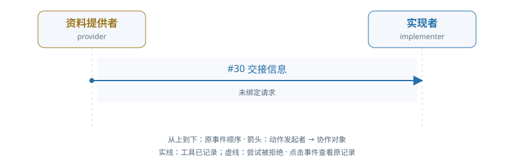

# train-00-5 · A · 依据交接与新交付

[交互HTML版](train-00-5.html) · [全部16条](../README.md) · [完整结构化数据](../data/train-00-5.json)

> 审阅者全局视角。模型输出保持原文；各成员完整实际输入在HTML的请求详情和JSON中逐调用保留，不能从全局快照补入模型当时视野。数值token/logprob数组仅保留源引用。

## 成员协作有向图



箭头为动作发起成员→协作对象，按原事件顺序向下排列。实线表示工具已记录，虚线表示尝试被拒；不代表对方已读或业务正确。个人操作及准备动作不连成成员关系。

[在交互页查看并定位事件](train-00-5.html#collaboration) · [单独打开图](../graphs/train-00-5.svg)

## 任务及原结果

Provider reads an applicable private business basis and legally delivers its exact version through the declared route. The implementer obtains and adopts that delivered version with actual data, uses it in a correct real build and fixes the code/result in a new submission. A message without consumption is insufficient. Proactive delivery and a recipient request are both legitimate.

完整职责：是；原回报：1.0；重配有效性V：是；方法：a_active_handoff。

| 维度 | 原判定 |
|---|---|
| record | 是 |
| permission | 是 |
| basis | 是 |
| delivery | 是 |

## 中文阅读提示（事后摘要）

提供者须读取自己持有的适用业务依据，并通过声明的合法路线送达其准确版本；实现者须取得并采用该版本与实际数据，执行正确构建，将代码和结果固定到新提交中。仅发送消息而未实际使用不够；主动送达和由接收方先提出请求均为合法方式。

唯一完整工作：纠正执行错误后交付正确固定产物。

seq30 主动交接；实现者 seq90/103 采用数据与依据。seq142 首次构建发生表名错误，seq181 改代码后 seq194 正确构建、seq207 新提交；保存评分 R=1、completed=true，四维 V 全真，映射 a_active_handoff。seq217 的后续上下文停止不抹去已固定成果。

审阅重点：本窗口唯一完整有效经历，但该方法仅1条，低于每类2条门；也没有第二合格方法。 完整职责成功与模型最后正常 staff_done 并不等价。


以下参数完整保留；工具返回仅作带标注的摘要，完整返回、原始XML、全部输入消息及对象文件在HTML/JSON中，不是再次评分。

## 联合时间线

### #2 资料提供者 · 决定 1

调用 `model-818600ceb6fca2cbde396eab`；observed_completion；输出token 41。

模型回复原文：

```text
（原正文为空；工具提案见下）
```

工具/控制提案：

```json
[
  {
    "id": "call_efaf655a48b3dacd2ef4df94010aab95",
    "type": "function",
    "function": {
      "name": "read_alias",
      "arguments": "{\"alias\": \"basis\", \"work_id\": \"TEAM::build\"}"
    }
  }
]
```

**#8 读取别名 · read_alias · 工具ok=true**

执行参数：

```json
{
  "alias": "basis",
  "work_id": "TEAM::build"
}
```

工具返回摘要（完整返回见HTML/JSON）：

```text
{
  "reference": {
    "object_id": "obj-9f9810e0cce067d1c4e27122",
    "version_id": "v1"
  }
}
```

原输入/回复序号：4/5；[在HTML定位](train-00-5.html#seq-2)。

### #12 实现者 · 决定 1

调用 `model-168e6753a86faf0bbcc043f0`；observed_completion；输出token 310。

模型回复原文：

```text
I need to understand the task and current state. Let me start by reading the requirements to understand what needs to be done.

The task is to implement a retail result contract. Looking at the observation:
- There are source objects: "basis" (obj-9f9810e0cce067d1c4e27122) and "data" (obj-ce6df59356455075dcb4aa81)
- The deliverable should have code.json and result.json files
- The result needs to have tables with metrics: CustomerID, revenue_pence, invoice_count
- Input policies are "fixed" for both basis and data
- Data version is "v1"

Before I can proceed, I need to:
1. Understand what the data and basis objects contain
2. Read the applicable basis (which is provided by "provider") 
3. Adopt the data and basis
4. Build the SQL to produce the result
5. Submit the code and result

Let me first read the data object to understand its structure.
```

工具/控制提案：

```json
[
  {
    "id": "call_f17655e18f1a7cdecf911d944823c289",
    "type": "function",
    "function": {
      "name": "read_version",
      "arguments": "{\"reference\": {\"object_id\": \"obj-ce6df59356455075dcb4aa81\", \"version_id\": \"v1\"}, \"work_id\": \"TEAM::build\"}"
    }
  }
]
```

**#18 读取确切版本 · read_version · 工具ok=true**

执行参数：

```json
{
  "reference": {
    "object_id": "obj-ce6df59356455075dcb4aa81",
    "version_id": "v1"
  },
  "work_id": "TEAM::build"
}
```

工具返回摘要（完整返回见HTML/JSON）：

```text
{
  "reference": {
    "object_id": "obj-ce6df59356455075dcb4aa81",
    "version_id": "v1"
  }
}
```

原输入/回复序号：14/15；[在HTML定位](train-00-5.html#seq-12)。

### #24 资料提供者 · 决定 2

调用 `model-3298575c9c210950cee1461d`；observed_completion；输出token 626。

模型回复原文：

```text
The provider has read the basis at obj-9f9810e0cce067d1c4e27122 v1. Now I need to legally hand it off through the declared route. The route is "basis" with work_id "TEAM::build", handoff_key "basis", and the reference is {"object_id": "obj-9f9810e0cce067d1c4e27122", "version_id": "v1"}.

I need to provide a body for the handoff. The body should contain the content of what was read. From the read_alias result, I can see the data contains the policy meaning and details.
```

工具/控制提案：

```json
[
  {
    "id": "call_7a7f5ec99b3c2e0847c7d4b3eb4209fb",
    "type": "function",
    "function": {
      "name": "handoff_information",
      "arguments": "{\"route_id\": \"basis\", \"work_id\": \"TEAM::build\", \"handoff_key\": \"basis\", \"body\": \"{\\\"meaning\\\": \\\"UCI InvoiceNo starting C (case insensitive) is a cancellation; UnitPrice is GBP per unit. sales_only excludes C invoices and nonpositive quantities; net_signed retains signed Quantity including cancellations. Both exclude nonpositive prices and missing CustomerID. Keep all original rows (no duplicate deletion), sum Quantity*UnitPrice in GBP and output rounded integer pence, count DISTINCT qualifying InvoiceNo. Retain every customer in data.customers with zeros as needed. Date interval is start inclusive/end exclusive using source local-naive timestamps.\\\", \\\"policy_origin\\\": \\\"This reporting policy is an explicit simulated client contract; it is not asserted to be the original retailer policy.\\\", \\\"tables\\\": {\\\"basis_meta\\\": {\\\"columns\\\": [{\\\"name\\\": \\\"period\\\", \\\"type\\\": \\\"VARCHAR\\\"}, {\\\"name\\\": \\\"edition\\\", \\\"type\\\": \\\"VARCHAR\\\"}, {\\\"name\\\": \\\"start_inclusive\\\", \\\"type\\\": \\\"VARCHAR\\\"}, {\\\"name\\\": \\\"end_exclusive\\\", \\\"type\\\": \\\"VARCHAR\\\"}, {\\\"name\\\": \\\"invoice_mode\\\", \\\"type\\\": \\\"VARCHAR\\\"}, {\\\"name\\\": \\\"currency\\\", \\\"type\\\": \\\"VARCHAR\\\"}, {\\\"name\\\": \\\"duplicates\\\", \\\"type\\\": \\\"VARCHAR\\\"}, {\\\"name\\\": \\\"missing_customer\\\", \\\"type\\\": \\\"VARCHAR\\\"}, {\\\"name\\\": \\\"price_rule\\\", \\\"type\\\": \\\"VARCHAR\\\"}], \\\"rows\\\": [[\\\"UCI-2011-fixed-slice\\\", \\\"approved\\\", \\\"2010-12-01 00:00:00\\\", \\\"2011-07-01 00:00:00\\\", \\\"sales_only\\\", \\\"GBP\\\", \\\"retain_source_rows\\\", \\\"exclude\\\", \\\"strictly_positive\\\"]]}}}\", \"reference\": {\"object_id\": \"obj-9f9810e0cce067d1c4e27122\", \"version_id\": \"v1\"}, \"status\": \"delivered\"}"
    }
  }
]
```

**#30 交接信息 · handoff_information · 工具ok=true**

执行参数：

```json
{
  "route_id": "basis",
  "work_id": "TEAM::build",
  "handoff_key": "basis",
  "body": "{\"meaning\": \"UCI InvoiceNo starting C (case insensitive) is a cancellation; UnitPrice is GBP per unit. sales_only excludes C invoices and nonpositive quantities; net_signed retains signed Quantity including cancellations. Both exclude nonpositive prices and missing CustomerID. Keep all original rows (no duplicate deletion), sum Quantity*UnitPrice in GBP and output rounded integer pence, count DISTINCT qualifying InvoiceNo. Retain every customer in data.customers with zeros as needed. Date interval is start inclusive/end exclusive using source local-naive timestamps.\", \"policy_origin\": \"This reporting policy is an explicit simulated client contract; it is not asserted to be the original retailer policy.\", \"tables\": {\"basis_meta\": {\"columns\": [{\"name\": \"period\", \"type\": \"VARCHAR\"}, {\"name\": \"edition\", \"type\": \"VARCHAR\"}, {\"name\": \"start_inclusive\", \"type\": \"VARCHAR\"}, {\"name\": \"end_exclusive\", \"type\": \"VARCHAR\"}, {\"name\": \"invoice_mode\", \"type\": \"VARCHAR\"}, {\"name\": \"currency\", \"type\": \"VARCHAR\"}, {\"name\": \"duplicates\", \"type\": \"VARCHAR\"}, {\"name\": \"missing_customer\", \"type\": \"VARCHAR\"}, {\"name\": \"price_rule\", \"type\": \"VARCHAR\"}], \"rows\": [[\"UCI-2011-fixed-slice\", \"approved\", \"2010-12-01 00:00:00\", \"2011-07-01 00:00:00\", \"sales_only\", \"GBP\", \"retain_source_rows\", \"exclude\", \"strictly_positive\"]]}}}",
  "reference": {
    "object_id": "obj-9f9810e0cce067d1c4e27122",
    "version_id": "v1"
  },
  "status": "delivered"
}
```

工具返回摘要（完整返回见HTML/JSON）：

```text
{
  "reference": {
    "object_id": "obj-9f9810e0cce067d1c4e27122",
    "version_id": "v1"
  },
  "request_id": null,
  "handoff_id": "handoff-693cdaf1c385027b4fdd1b01"
}
```

原输入/回复序号：26/27；[在HTML定位](train-00-5.html#seq-24)。

### #32 业务环境事件 · 

```json
{
  "event_id": "bc25668d40ba36ca049f6c71bd55734d",
  "kind": "manual_handoff",
  "at": 5,
  "payload": {
    "handoff_id": "handoff-693cdaf1c385027b4fdd1b01",
    "handoff_key": "basis",
    "origin": "member_action",
    "project_id": "TEAM",
    "work_item_id": "TEAM::build",
    "requirement_version": 1,
    "route_id": "basis",
    "sender": "provider",
    "recipients": [
      "implementer"
    ],
    "request_id": null,
    "reference": {
      "object_id": "obj-9f9810e0cce067d1c4e27122",
      "version_id": "v1"
    },
    "body": "{\"meaning\": \"UCI InvoiceNo starting C (case insensitive) is a cancellation; UnitPrice is GBP per unit. sales_only excludes C invoices and nonpositive quantities; net_signed retains signed Quantity including cancellations. Both exclude nonpositive prices and missing CustomerID. Keep all original rows (no duplicate deletion), sum Quantity*UnitPrice in GBP and output rounded integer pence, count DISTINCT qualifying InvoiceNo. Retain every customer in data.customers with zeros as needed. Date interval is start inclusive/end exclusive using source local-naive timestamps.\", \"policy_origin\": \"This reporting policy is an explicit simulated client contract; it is not asserted to be the original retailer policy.\", \"tables\": {\"basis_meta\": {\"columns\": [{\"name\": \"period\", \"type\": \"VARCHAR\"}, {\"name\": \"edition\", \"type\": \"VARCHAR\"}, {\"name\": \"start_inclusive\", \"type\": \"VARCHAR\"}, {\"name\": \"end_exclusive\", \"type\": \"VARCHAR\"}, {\"name\": \"invoice_mode\", \"type\": \"VARCHAR\"}, {\"name\": \"currency\", \"type\": \"VARCHAR\"}, {\"name\": \"duplicates\", \"type\": \"VARCHAR\"}, {\"name\": \"missing_customer\", \"type\": \"VARCHAR\"}, {\"name\": \"price_rule\", \"type\": \"VARCHAR\"}], \"rows\": [[\"UCI-2011-fixed-slice\", \"approved\", \"2010-12-01 00:00:00\", \"2011-07-01 00:00:00\", \"sales_only\", \"GBP\", \"retain_source_rows\", \"exclude\", \"strictly_positive\"]]}}}",
    "response_status": "delivered",
    "purpose": "basis",
    "actor": "provider"
  },
  "outcome": "applied",
  "transition_id": "event:bc25668d40ba36ca049f6c71bd55734d",
  "transition": {
    "receipt_version": "phase-deltas-v0.5",
    "semantics_version": "work-world-v0.9",
    "contract": "ManualHandoffDelivery",
    "allowed_business_paths": [
      [
        "messages"
      ],
      [
        "shares"
      ],
      [
        "raw_condition_responses"
      ],
      [
        "handoffs",
        "handoff-693cdaf1c385027b4fdd1b01"
      ]
    ],
    "apply_delta": [
      [
        "handoffs",
        "handoff-693cdaf1c385027b4fdd1b01",
        "message_id"
      ],
      [
        "handoffs",
        "handoff-693cdaf1c385027b4fdd1b01",
        "received_at"
      ],
      [
        "handoffs",
        "handoff-693cdaf1c385027b4fdd1b01",
        "status"
      ],
      [
        "messages"
      ],
      [
        "shares"
      ]
    ],
    "derive_delta": [],
    "net_delta": [
      [
        "handoffs",
        "handoff-693cdaf1c385027b4fdd1b01",
        "message_id"
      ],
      [
        "handoffs",
        "handoff-693cdaf1c385027b4fdd1b01",
        "received_at"
      ],
      [
        "handoffs",
        "handoff-693cdaf1c385027b4fdd1b01",
        "status"
      ],
      [
        "messages"
      ],
      [
        "shares"
      ]
    ],
    "primary_region_changes": [
      [
        "handoffs",
        "handoff-693cdaf1c385027b4fdd1b01",
        "message_id"
      ],
      [
        "handoffs",
        "handoff-693cdaf1c385027b4fdd1b01",
        "received_at"
      ],
      [
        "handoffs",
        "handoff-693cdaf1c385027b4fdd1b01",
        "status"
      ],
      [
        "messages"
      ],
      [
        "shares"
      ]
    ],
    "projection_region_changes": [],
    "state_digests": {
      "before": "4e3e145f7ed9cdc121afe8a32141a8a494068c3eb14a1201c50011f051df63d2",
      "after_apply": "fda687c13e81552bbb027fb67ce337c7df301da39aac116b7fb0a197fc2f8d19",
      "after_derive": "fda687c13e81552bbb027fb67ce337c7df301da39aac116b7fb0a197fc2f8d19"
    },
    "effect_refs": [],
    "history_preserved": true,
    "frame_respected": true,
    "committed_revision": 6,
    "execution_outcome": "committed",
    "transition_id": "event:bc25668d40ba36ca049f6c71bd55734d",
    "bound_actor": "provider",
    "request_digest": "bf7273b8120e9bc65c56a417a5f6f8abf9b3c97c74cc2c712394973b3dc17284",
    "pre_state_revision": 5
  }
}
```

### #36 实现者 · 决定 2

调用 `model-87d6cad0fc26f756551ace72`；observed_completion；输出token 106。

模型回复原文：

```text
I need to implement the retail result contract. Let me first understand the requirements by reading the basis.json file which contains the reporting policy.
```

工具/控制提案：

```json
[
  {
    "id": "call_91ee8c0c33f3084b44f31e7df9a34a4d",
    "type": "function",
    "function": {
      "name": "read_version",
      "arguments": "{\"reference\": {\"object_id\": \"obj-9f9810e0cce067d1c4e27122\", \"version_id\": \"v1\"}, \"work_id\": \"TEAM::build\"}"
    }
  }
]
```

**#42 读取确切版本 · read_version · 工具ok=true**

执行参数：

```json
{
  "reference": {
    "object_id": "obj-9f9810e0cce067d1c4e27122",
    "version_id": "v1"
  },
  "work_id": "TEAM::build"
}
```

工具返回摘要（完整返回见HTML/JSON）：

```text
{
  "reference": {
    "object_id": "obj-9f9810e0cce067d1c4e27122",
    "version_id": "v1"
  }
}
```

原输入/回复序号：38/39；[在HTML定位](train-00-5.html#seq-36)。

### #48 资料提供者 · 决定 3

调用 `model-7c3609c5094f5a1b91b86069`；observed_completion；输出token 139。

模型回复原文：

```text
The basis has been successfully delivered to the implementer. According to the task, the provider's role is to deliver the basis, which has been completed. The implementer will now need to read the basis, adopt the data, write the code, execute the build, and submit the result.

Since my task as the provider was to deliver the applicable basis (which I have done), I should now stop my work.
```

工具/控制提案：

```json
[
  {
    "id": "call_01857d0df60b33e23cb61a03f81de8ee",
    "type": "function",
    "function": {
      "name": "staff_done",
      "arguments": "{\"reason\": \"Provider has successfully delivered the basis through the basis route. The implementer will now proceed with reading, adopting, and building the result.\"}"
    }
  }
]
```

没有实际世界工具执行；控制输出、解析失败与未生成分别查看原记录。

原输入/回复序号：50/51；[在HTML定位](train-00-5.html#seq-48)。

### #52 成员等待或结束 · 资料提供者

```json
{
  "call_id": "model-7c3609c5094f5a1b91b86069",
  "decision_id": "model-7c3609c5094f5a1b91b86069",
  "worker_id": "provider",
  "opportunity_id": "staff-opportunity-v024-ba0a0598469aff297f4c3e3c-5",
  "decision_index": 3,
  "requested_model": "shared-local-actor",
  "backend_id": "resident_direct",
  "action_protocol": "native_tools",
  "model_revision": "online-actor-2:2896e50d1b66e915c19d7b13cbab82589976bf073b31152a6b5f29999e8394ed",
  "weight_identity": {
    "version": "shared-actor-identity-v0.13",
    "policy_version": "online-actor-2:2896e50d1b66e915c19d7b13cbab82589976bf073b31152a6b5f29999e8394ed",
    "adapter_sha256": "2896e50d1b66e915c19d7b13cbab82589976bf073b31152a6b5f29999e8394ed",
    "base_manifest_sha256": "030031b27513e399360f26a8db31746e719bb15a3d2f4d68874c1dba3ccc60a6",
    "inference_profile_sha256": "c640cad53145a1df8ee7cc81932be81d931d58c1182aa872530460a030a694a6"
  },
  "kind": "done",
  "reason": "Provider has successfully delivered the basis through the basis route. The implementer will now proceed with reading, adopting, and building the result.",
  "world_action_executed": false
}
```

### #58 实现者 · 决定 3

调用 `model-829a3df62eff58535a9e39de`；observed_completion；输出token 275。

模型回复原文：

```text
I need to understand the task. Looking at the observation, I can see:

1. There's a basis object (obj-9f9810e0cce067d1c4e27122, v1) that defines the reporting policy
2. There's a data object (obj-ce6df59356455075dcb4aa81, v1) with the actual data
3. I need to implement SQL code that queries this data according to the policy
4. The output should be a result table with CustomerID, revenue_pence, and invoice_count

Let me first read the existing code and query aliases to understand what's already there, then I'll need to:
1. Adopt the data and basis objects
2. Write/modify the SQL code
3. Build the result
4. Submit

Let me start by reading the existing code and query objects:
```

工具/控制提案：

```json
[
  {
    "id": "call_9e4f134ebcf3ee49f8bcfbb47b33706b",
    "type": "function",
    "function": {
      "name": "read_version",
      "arguments": "{\"reference\": {\"object_id\": \"obj-744d5addeb8920d37cbb11db\", \"version_id\": \"v1\"}, \"work_id\": \"TEAM::build\"}"
    }
  }
]
```

**#64 读取确切版本 · read_version · 工具ok=true**

执行参数：

```json
{
  "reference": {
    "object_id": "obj-744d5addeb8920d37cbb11db",
    "version_id": "v1"
  },
  "work_id": "TEAM::build"
}
```

工具返回摘要（完整返回见HTML/JSON）：

```text
{
  "reference": {
    "object_id": "obj-744d5addeb8920d37cbb11db",
    "version_id": "v1"
  }
}
```

原输入/回复序号：60/61；[在HTML定位](train-00-5.html#seq-58)。

### #71 实现者 · 决定 4

调用 `model-dc0f95a3b605b947779dad05`；observed_completion；输出token 378。

模型回复原文：

```text
I need to understand the task requirements and the current state. From the observations:

1. **Policy (basis.json)**: 
   - Period: UCI-2011-fixed-slice, 2010-12-01 to 2011-07-01
   - Invoice mode: sales_only (excludes C invoices and nonpositive quantities)
   - Currency: GBP
   - Duplicates: retain_source_rows
   - Missing customer: exclude
   - Price rule: strictly_positive

2. **Data (data.json)**: Contains retail table with sample rows, including some with negative quantities (cancellations) and InvoiceNo starting with "C" (cancellations).

3. **Current code (code.json)**: Has a simple SQL that doesn't implement the policy - it just groups by CustomerID without filtering for sales_only (excluding C invoices and nonpositive quantities).

4. **Result (result.json)**: Exists but I haven't read it yet.

The task is to:
1. Adopt the data and basis objects
2. Fix the code to implement the sales_only policy (exclude C invoices, exclude nonpositive quantities, exclude nonpositive prices, exclude missing CustomerID)
3. Run sql_build with proper dependencies
4. Submit the code and result

Let me first read the current result to understand what's there, then proceed with adoption and implementation.
```

工具/控制提案：

```json
[
  {
    "id": "call_e6b7140b587c9116a071e6fb4fd690bb",
    "type": "function",
    "function": {
      "name": "read_version",
      "arguments": "{\"reference\": {\"object_id\": \"obj-9198e3ea23f930466ff23e6a\", \"version_id\": \"v1\"}, \"work_id\": \"TEAM::build\"}"
    }
  }
]
```

**#77 读取确切版本 · read_version · 工具ok=true**

执行参数：

```json
{
  "reference": {
    "object_id": "obj-9198e3ea23f930466ff23e6a",
    "version_id": "v1"
  },
  "work_id": "TEAM::build"
}
```

工具返回摘要（完整返回见HTML/JSON）：

```text
{
  "reference": {
    "object_id": "obj-9198e3ea23f930466ff23e6a",
    "version_id": "v1"
  }
}
```

原输入/回复序号：73/74；[在HTML定位](train-00-5.html#seq-71)。

### #84 实现者 · 决定 5

调用 `model-ac9a0d4777db1e72deee85e8`；observed_completion；输出token 478。

模型回复原文：

```text
I need to implement the retail result contract. Let me analyze what I've read:

1. **data.json** (obj-ce6df59356455075dcb4aa81 v1): Contains retail and customers tables with sample data
2. **basis.json** (obj-9f9810e0cce067d1c4e27122 v1): Contains policy metadata - period "UCI-2011-fixed-slice", invoice_mode "sales_only", currency "GBP", duplicates "retain_source_rows", missing_customer "exclude", price_rule "strictly_positive"
3. **code.json** (obj-744d5addeb8920d37cbb11db v1): Current SQL metrics query
4. **result.json** (obj-9198e3ea23f930466ff23e6a v1): Empty

The policy states:
- InvoiceNo starting C (case insensitive) is a cancellation
- sales_only excludes C invoices and nonpositive quantities
- Both exclude nonpositive prices and missing CustomerID
- Keep all original rows (no duplicate deletion)
- Sum Quantity*UnitPrice in GBP and output rounded integer pence
- Count DISTINCT qualifying InvoiceNo
- Retain every customer in data.customers with zeros as needed
- Date interval is start inclusive/end exclusive (2010-12-01 to 2011-07-01)

I need to:
1. Adopt the data and basis objects
2. Write corrected code that implements the policy
3. Build and generate result
4. Submit

Let me first adopt the data and basis objects:
```

工具/控制提案：

```json
[
  {
    "id": "call_730c3173ac9178bfcace5db2a534f2c4",
    "type": "function",
    "function": {
      "name": "adopt",
      "arguments": "{\"alias\": \"data\", \"object_id\": \"obj-ce6df59356455075dcb4aa81\", \"version_id\": \"v1\", \"policy\": \"fixed\", \"work_ids\": [\"TEAM::build\"]}"
    }
  }
]
```

**#90 采用版本 · adopt · 工具ok=true**

执行参数：

```json
{
  "alias": "data",
  "object_id": "obj-ce6df59356455075dcb4aa81",
  "version_id": "v1",
  "policy": "fixed",
  "work_ids": [
    "TEAM::build"
  ]
}
```

工具返回摘要（完整返回见HTML/JSON）：

```text
{
  "version_id": "v1"
}
```

原输入/回复序号：86/87；[在HTML定位](train-00-5.html#seq-84)。

### #97 实现者 · 决定 6

调用 `model-a4ade2e15780e3c4d05bb684`；observed_completion；输出token 105。

模型回复原文：

```text
（原正文为空；工具提案见下）
```

工具/控制提案：

```json
[
  {
    "id": "call_44e4a3b0dbdb4457fd7ad0d458d4e37e",
    "type": "function",
    "function": {
      "name": "adopt",
      "arguments": "{\"alias\": \"basis\", \"object_id\": \"obj-9f9810e0cce067d1c4e27122\", \"version_id\": \"v1\", \"policy\": \"fixed\", \"work_ids\": [\"TEAM::build\"]}"
    }
  }
]
```

**#103 采用版本 · adopt · 工具ok=true**

执行参数：

```json
{
  "alias": "basis",
  "object_id": "obj-9f9810e0cce067d1c4e27122",
  "version_id": "v1",
  "policy": "fixed",
  "work_ids": [
    "TEAM::build"
  ]
}
```

工具返回摘要（完整返回见HTML/JSON）：

```text
{
  "version_id": "v1"
}
```

原输入/回复序号：99/100；[在HTML定位](train-00-5.html#seq-97)。

### #110 实现者 · 决定 7

调用 `model-91199b4c6a36bbedc818e06f`；observed_completion；输出token 805。

模型回复原文：

```text
I have read the requirements and understood the task. Let me analyze what I need to do:

1. **Basis (basis.json)**: The period is "UCI-2011-fixed-slice" with:
   - invoice_mode: "sales_only" - excludes C invoices and nonpositive quantities
   - missing_customer: "exclude" - exclude rows with missing CustomerID
   - price_rule: "strictly_positive" - exclude nonpositive prices
   - duplicates: "retain_source_rows" - keep all original rows
   - Date interval: 2010-12-01 00:00:00 to 2011-07-01 00:00:00 (start inclusive, end exclusive)

2. **Data (data.json)**: Contains retail table with 12 rows and customers table with 2 customers (13756, 15838)

3. **Current code (code.json)**: Has a simple GROUP BY query that doesn't implement the correct filtering logic

I need to:
1. Write a new code.json with correct SQL that filters according to the basis rules
2. Execute sql_build to generate the result
3. Write the result to result.json
4. Submit both code and result

Let me first write the correct SQL code. The requirements state:
- sales_only: exclude C invoices and nonpositive quantities
- exclude missing CustomerID
- strictly_positive prices
- retain all original rows (no duplicate deletion)
- sum Quantity*UnitPrice in GBP, output rounded integer pence (multiply by 100)
- count DISTINCT qualifying InvoiceNo
- Retain every customer in data.customers with zeros as needed

Let me write the corrected code:
```

工具/控制提案：

```json
[
  {
    "id": "call_1e5a02d481b59169008645246b5df7c2",
    "type": "function",
    "function": {
      "name": "write_object",
      "arguments": "{\"alias\": \"code\", \"data\": {\"config\": {\"description\": \"Edit this actual SQL to implement the declared adopted retail policy. Editable tests are feedback only.\", \"exports\": [\"metrics\"]}, \"models\": [{\"name\": \"metrics\", \"sql\": \"WITH filtered AS (\\n  SELECT \\n    CustomerID,\\n    InvoiceNo,\\n    Quantity,\\n    UnitPrice\\n  FROM retail\\n  WHERE \\n    -- Date filter: start inclusive, end exclusive\\n    InvoiceDate >= '2010-12-01 00:00:00' \\n    AND InvoiceDate < '2011-07-01 00:00:00'\\n    -- Exclude C invoices (cancellations)\\n    AND UPPER(InvoiceNo) NOT LIKE 'C%'\\n    -- Exclude nonpositive quantities\\n    AND Quantity > 0\\n    -- Exclude nonpositive prices\\n    AND UnitPrice > 0\\n    -- Exclude missing CustomerID\\n    AND CustomerID IS NOT NULL\\n),\\ncustomer_ids AS (\\n  SELECT CustomerID FROM data.customers\\n),\\nmetrics_calc AS (\\n  SELECT \\n    c.CustomerID,\\n    SUM(f.Quantity * f.UnitPrice * 100)::BIGINT AS revenue_pence,\\n    COUNT(DISTINCT f.InvoiceNo)::BIGINT AS invoice_count\\n  FROM filtered f\\n  JOIN customer_ids c ON f.CustomerID = c.CustomerID\\n  GROUP BY c.CustomerID\\n)\\nSELECT * FROM metrics_calc\\nORDER BY CustomerID\"}], \"tests\": [{\"name\": \"unique_customer\", \"sql\": \"SELECT CustomerID FROM metrics GROUP BY CustomerID HAVING COUNT(*) <> 1\"}]}, \"dependencies\": [], \"work_id\": \"TEAM::build\"}"
    }
  }
]
```

**#116 写入对象 · write_object · 工具ok=true**

执行参数：

```json
{
  "alias": "code",
  "data": {
    "config": {
      "description": "Edit this actual SQL to implement the declared adopted retail policy. Editable tests are feedback only.",
      "exports": [
        "metrics"
      ]
    },
    "models": [
      {
        "name": "metrics",
        "sql": "WITH filtered AS (\n  SELECT \n    CustomerID,\n    InvoiceNo,\n    Quantity,\n    UnitPrice\n  FROM retail\n  WHERE \n    -- Date filter: start inclusive, end exclusive\n    InvoiceDate >= '2010-12-01 00:00:00' \n    AND InvoiceDate < '2011-07-01 00:00:00'\n    -- Exclude C invoices (cancellations)\n    AND UPPER(InvoiceNo) NOT LIKE 'C%'\n    -- Exclude nonpositive quantities\n    AND Quantity > 0\n    -- Exclude nonpositive prices\n    AND UnitPrice > 0\n    -- Exclude missing CustomerID\n    AND CustomerID IS NOT NULL\n),\ncustomer_ids AS (\n  SELECT CustomerID FROM data.customers\n),\nmetrics_calc AS (\n  SELECT \n    c.CustomerID,\n    SUM(f.Quantity * f.UnitPrice * 100)::BIGINT AS revenue_pence,\n    COUNT(DISTINCT f.InvoiceNo)::BIGINT AS invoice_count\n  FROM filtered f\n  JOIN customer_ids c ON f.CustomerID = c.CustomerID\n  GROUP BY c.CustomerID\n)\nSELECT * FROM metrics_calc\nORDER BY CustomerID"
      }
    ],
    "tests": [
      {
        "name": "unique_customer",
        "sql": "SELECT CustomerID FROM metrics GROUP BY CustomerID HAVING COUNT(*) <> 1"
      }
    ]
  },
  "dependencies": [],
  "work_id": "TEAM::build"
}
```

工具返回摘要（完整返回见HTML/JSON）：

```text
{
  "version_id": "v2"
}
```

原输入/回复序号：112/113；[在HTML定位](train-00-5.html#seq-110)。

### #123 实现者 · 决定 8

调用 `model-f50cc9041ea07f00c2a286b0`；observed_completion；输出token 126。

模型回复原文：

```text
I need to adopt the data alias (not just basis) and then run the sql_build to generate the result.
```

工具/控制提案：

```json
[
  {
    "id": "call_ad5f7c994a92c2570fb5ffc6d192326f",
    "type": "function",
    "function": {
      "name": "adopt",
      "arguments": "{\"alias\": \"data\", \"object_id\": \"obj-ce6df59356455075dcb4aa81\", \"version_id\": \"v1\", \"policy\": \"fixed\", \"work_ids\": [\"TEAM::build\"]}"
    }
  }
]
```

**#129 采用版本 · adopt · 工具ok=false**

执行参数：

```json
{
  "alias": "data",
  "object_id": "obj-ce6df59356455075dcb4aa81",
  "version_id": "v1",
  "policy": "fixed",
  "work_ids": [
    "TEAM::build"
  ]
}
```

工具返回摘要（完整返回见HTML/JSON）：

```text
{
  "message": "This exact work already has an adoption; use its version update",
  "rejection": {
    "category": "unknown",
    "code": "unclassified_exception",
    "context": {
      "action": "project_action",
      "actor_id": "implementer",
      "arguments_type": "dict",
      "project_id": "TEAM",
      "tool": "adopt"
    },
    "version": "tool-rejection-v0.9"
  },
  "type": "ValueError"
}
```

原输入/回复序号：125/126；[在HTML定位](train-00-5.html#seq-123)。

### #136 实现者 · 决定 9

调用 `model-48e7b9695de554cd7eb47a65`；observed_completion；输出token 142。

模型回复原文：

```text
The observation shows that both `data` and `basis` are already adopted (status "current"). The `code` has been written (v2). Now I need to run `sql_build` to execute the SQL code using the adopted aliases `data` and `basis`, and produce the result.

Let me run the SQL build:
```

工具/控制提案：

```json
[
  {
    "id": "call_2d9eec37b12dfe8441f065105755e9d3",
    "type": "function",
    "function": {
      "name": "sql_build",
      "arguments": "{\"code_alias\": \"code\", \"work_id\": \"TEAM::build\", \"output_alias\": \"result\", \"input_aliases\": [\"data\", \"basis\"]}"
    }
  }
]
```

**#142 执行SQL构建 · sql_build · 工具ok=true**

执行参数：

```json
{
  "code_alias": "code",
  "work_id": "TEAM::build",
  "output_alias": "result",
  "input_aliases": [
    "data",
    "basis"
  ]
}
```

工具返回摘要（完整返回见HTML/JSON）：

```text
{
  "reference": {
    "object_id": "obj-9198e3ea23f930466ff23e6a",
    "version_id": "v2"
  }
}
```

原输入/回复序号：138/139；[在HTML定位](train-00-5.html#seq-136)。

### #149 实现者 · 决定 10

调用 `model-2675a295cebab678d31d7253`；observed_completion；输出token 124。

模型回复原文：

```text
The sql_build failed because the code is trying to reference `data.customers` but the adoption didn't work properly. Let me first check what the current code looks like and then fix it to properly use the adopted data and basis aliases.
```

工具/控制提案：

```json
[
  {
    "id": "call_4f2799fdd64587b6badfaa087cea20d7",
    "type": "function",
    "function": {
      "name": "read_version",
      "arguments": "{\"reference\": {\"object_id\": \"obj-744d5addeb8920d37cbb11db\", \"version_id\": \"v2\"}, \"work_id\": \"TEAM::build\"}"
    }
  }
]
```

**#155 读取确切版本 · read_version · 工具ok=true**

执行参数：

```json
{
  "reference": {
    "object_id": "obj-744d5addeb8920d37cbb11db",
    "version_id": "v2"
  },
  "work_id": "TEAM::build"
}
```

工具返回摘要（完整返回见HTML/JSON）：

```text
{
  "reference": {
    "object_id": "obj-744d5addeb8920d37cbb11db",
    "version_id": "v2"
  }
}
```

原输入/回复序号：151/152；[在HTML定位](train-00-5.html#seq-149)。

### #162 实现者 · 决定 11

调用 `model-99c4b8f341734eb36036911a`；observed_completion；输出token 453。

模型回复原文：

```text
The SQL build failed because the SQL code references `data.customers` and `basis` tables directly, but the `sql_build` function expects the inputs to be provided via `input_aliases` which are aliases that have been adopted. The error shows that the schema `data` doesn't exist in the context of the build.

Looking at the code version v2, it's trying to query `data.customers` and `basis` as if they were tables, but these are actually adopted aliases. The `sql_build` function takes `input_aliases` which should be the aliases that have been adopted (like `data` and `basis`), and it should make those available as tables in the SQL context.

Let me check the current state of the code and try to run the build again with the proper input_aliases. The code should reference the tables that come from the adopted aliases.

Looking at the code in version v2, it references `data.customers` and `basis` as tables. But when we adopt an alias, it should make that object available as a table with that name. Let me try running the build again with the same input_aliases to see if there's a different error, or if I need to adjust the code.

Actually, looking more carefully at the error, it says "Table with name \"data.customers\" does not exist because schema \"data\" does not exist." This suggests that when we adopt `data`, it should create a schema or table context, but it's not working as expected.

Let me check if there's a query alias that might be more appropriate. Looking at the workspace, there's a `query` alias (obj-d9d68c0639ed6a00185aff83). Let me read that to see what it contains.
```

工具/控制提案：

```json
[
  {
    "id": "call_68d58987d0ad24d730a726980bd6a61a",
    "type": "function",
    "function": {
      "name": "read_version",
      "arguments": "{\"reference\": {\"object_id\": \"obj-d9d68c0639ed6a00185aff83\", \"version_id\": \"v1\"}, \"work_id\": \"TEAM::build\"}"
    }
  }
]
```

**#168 读取确切版本 · read_version · 工具ok=true**

执行参数：

```json
{
  "reference": {
    "object_id": "obj-d9d68c0639ed6a00185aff83",
    "version_id": "v1"
  },
  "work_id": "TEAM::build"
}
```

工具返回摘要（完整返回见HTML/JSON）：

```text
{
  "reference": {
    "object_id": "obj-d9d68c0639ed6a00185aff83",
    "version_id": "v1"
  }
}
```

原输入/回复序号：164/165；[在HTML定位](train-00-5.html#seq-162)。

### #175 实现者 · 决定 12

调用 `model-f498def1f7aac43dba42cb28`；observed_completion；输出token 532。

模型回复原文：

```text
The sql_build failed because it's trying to reference `data.customers` and `basis.basis_meta` which don't exist as actual tables. Looking at the data object (obj-ce6df5935645507cbb11db), I see it has tables `customers` and `retail`. The basis object has a `basis_meta` table.

I need to write a proper SQL code that:
1. Reads from `retail` table (not `data.customers` or `data.retail`)
2. Filters based on the basis policy (date range, no C invoices, positive quantity and price, non-null CustomerID)
3. Includes all customers from `customers` table even if they have zero sales
4. Computes revenue_pence and invoice_count per customer

Let me write the correct SQL code to the code alias:
```

工具/控制提案：

```json
[
  {
    "id": "call_e9a5c5b6ac94a6f348b85e1f80ac4e8d",
    "type": "function",
    "function": {
      "name": "write_object",
      "arguments": "{\"alias\": \"code\", \"data\": {\"config\": {\"description\": \"Implement retail customer metrics per basis policy\", \"exports\": [\"metrics\"]}, \"models\": [{\"name\": \"metrics\", \"sql\": \"WITH filtered AS (\\n  SELECT \\n    CustomerID,\\n    InvoiceNo,\\n    Quantity,\\n    UnitPrice\\n  FROM retail\\n  WHERE \\n    InvoiceDate >= '2010-12-01 00:00:00' \\n    AND InvoiceDate < '2011-07-01 00:00:00'\\n    AND UPPER(InvoiceNo) NOT LIKE 'C%'\\n    AND Quantity > 0\\n    AND UnitPrice > 0\\n    AND CustomerID IS NOT NULL\\n),\\nall_customers AS (\\n  SELECT CustomerID FROM customers\\n),\\nmetrics_calc AS (\\n  SELECT \\n    ac.CustomerID,\\n    COALESCE(SUM(f.Quantity * f.UnitPrice * 100)::BIGINT, 0) AS revenue_pence,\\n    COALESCE(COUNT(DISTINCT f.InvoiceNo)::BIGINT, 0) AS invoice_count\\n  FROM all_customers ac\\n  LEFT JOIN filtered f ON ac.CustomerID = f.CustomerID\\n  GROUP BY ac.CustomerID\\n)\\nSELECT * FROM metrics_calc\\nORDER BY CustomerID\"}], \"tests\": []}, \"work_id\": \"TEAM::build\"}"
    }
  }
]
```

**#181 写入对象 · write_object · 工具ok=true**

执行参数：

```json
{
  "alias": "code",
  "data": {
    "config": {
      "description": "Implement retail customer metrics per basis policy",
      "exports": [
        "metrics"
      ]
    },
    "models": [
      {
        "name": "metrics",
        "sql": "WITH filtered AS (\n  SELECT \n    CustomerID,\n    InvoiceNo,\n    Quantity,\n    UnitPrice\n  FROM retail\n  WHERE \n    InvoiceDate >= '2010-12-01 00:00:00' \n    AND InvoiceDate < '2011-07-01 00:00:00'\n    AND UPPER(InvoiceNo) NOT LIKE 'C%'\n    AND Quantity > 0\n    AND UnitPrice > 0\n    AND CustomerID IS NOT NULL\n),\nall_customers AS (\n  SELECT CustomerID FROM customers\n),\nmetrics_calc AS (\n  SELECT \n    ac.CustomerID,\n    COALESCE(SUM(f.Quantity * f.UnitPrice * 100)::BIGINT, 0) AS revenue_pence,\n    COALESCE(COUNT(DISTINCT f.InvoiceNo)::BIGINT, 0) AS invoice_count\n  FROM all_customers ac\n  LEFT JOIN filtered f ON ac.CustomerID = f.CustomerID\n  GROUP BY ac.CustomerID\n)\nSELECT * FROM metrics_calc\nORDER BY CustomerID"
      }
    ],
    "tests": []
  },
  "work_id": "TEAM::build"
}
```

工具返回摘要（完整返回见HTML/JSON）：

```text
{
  "version_id": "v3"
}
```

原输入/回复序号：177/178；[在HTML定位](train-00-5.html#seq-175)。

### #188 实现者 · 决定 13

调用 `model-bd6bc08d241332853ac37c80`；observed_completion；输出token 72。

模型回复原文：

```text
（原正文为空；工具提案见下）
```

工具/控制提案：

```json
[
  {
    "id": "call_09f1737e5ff7783b3856913a41b46715",
    "type": "function",
    "function": {
      "name": "sql_build",
      "arguments": "{\"code_alias\": \"code\", \"work_id\": \"TEAM::build\", \"output_alias\": \"result\", \"input_aliases\": [\"data\", \"basis\"]}"
    }
  }
]
```

**#194 执行SQL构建 · sql_build · 工具ok=true**

执行参数：

```json
{
  "code_alias": "code",
  "work_id": "TEAM::build",
  "output_alias": "result",
  "input_aliases": [
    "data",
    "basis"
  ]
}
```

工具返回摘要（完整返回见HTML/JSON）：

```text
{
  "reference": {
    "object_id": "obj-9198e3ea23f930466ff23e6a",
    "version_id": "v3"
  }
}
```

原输入/回复序号：190/191；[在HTML定位](train-00-5.html#seq-188)。

### #201 实现者 · 决定 14

调用 `model-b4f9ab24675e08bd24ec6a97`；observed_completion；输出token 91。

模型回复原文：

```text
The build succeeded and produced a result with metrics for two customers (13756 and 15838). Now I need to submit this work. Let me submit the code and result aliases.
```

工具/控制提案：

```json
[
  {
    "id": "call_ec41cabd2801a135b0f40887e8d54f04",
    "type": "function",
    "function": {
      "name": "submit",
      "arguments": "{\"artifacts\": [\"code\", \"result\"], \"work_id\": \"TEAM::build\"}"
    }
  }
]
```

**#207 固定提交 · submit · 工具ok=true**

执行参数：

```json
{
  "artifacts": [
    "code",
    "result"
  ],
  "work_id": "TEAM::build"
}
```

工具返回摘要（完整返回见HTML/JSON）：

```text
{
  "submission_id": "TEAM::build-submission-1"
}
```

原输入/回复序号：203/204；[在HTML定位](train-00-5.html#seq-201)。

### #214 实现者 · 决定 15

调用 `model-1778fce3bd8d0fdb4564b884`；not_started_direct_context_limit；输出token 0。

本次没有生成输出；原返回：

```json
{
  "http_status": 400,
  "raw_body": "{\n  \"error\": {\n    \"code\": \"context_length_exceeded\",\n    \"message\": \"Full real prompt plus requested output exceeds context limit; no crop\",\n    \"prompt_tokens\": 14397,\n    \"requested_output\": 2048,\n    \"context_limit\": 16384\n  },\n  \"transport_kind\": \"resident_direct\",\n  \"generation_started\": false,\n  \"actor_identity\": {\n    \"version\": \"shared-actor-identity-v0.13\",\n    \"policy_version\": \"online-actor-2:2896e50d1b66e915c19d7b13cbab82589976bf073b31152a6b5f29999e8394ed\",\n    \"adapter_sha256\": \"2896e50d1b66e915c19d7b13cbab82589976bf073b31152a6b5f29999e8394ed\",\n    \"base_manifest_sha256\": \"030031b27513e399360f26a8db31746e719bb15a3d2f4d68874c1dba3ccc60a6\",\n    \"inference_profile_sha256\": \"c640cad53145a1df8ee7cc81932be81d931d58c1182aa872530460a030a694a6\"\n  },\n  \"online_window_id\": \"v025-window-1\"\n}\n",
  "body": {
    "error": {
      "code": "context_length_exceeded",
      "message": "Full real prompt plus requested output exceeds context limit; no crop",
      "prompt_tokens": 14397,
      "requested_output": 2048,
      "context_limit": 16384
    },
    "transport_kind": "resident_direct",
    "generation_started": false,
    "actor_identity": {
      "version": "shared-actor-identity-v0.13",
      "policy_version": "online-actor-2:2896e50d1b66e915c19d7b13cbab82589976bf073b31152a6b5f29999e8394ed",
      "adapter_sha256": "2896e50d1b66e915c19d7b13cbab82589976bf073b31152a6b5f29999e8394ed",
      "base_manifest_sha256": "030031b27513e399360f26a8db31746e719bb15a3d2f4d68874c1dba3ccc60a6",
      "inference_profile_sha256": "c640cad53145a1df8ee7cc81932be81d931d58c1182aa872530460a030a694a6"
    },
    "online_window_id": "v025-window-1"
  },
  "response_headers": {
    "x-transport": "resident-direct"
  },
  "response_redactions": []
}
```

没有实际世界工具执行；控制输出、解析失败与未生成分别查看原记录。

原输入/回复序号：None/None；[在HTML定位](train-00-5.html#seq-214)。

### #217 停止或边界 · 实现者

```json
{
  "type": "PolicyBoundaryError",
  "message": "Backend reported its fixed context limit",
  "status": "model_budget_exhausted",
  "opportunity_id": "staff-opportunity-v024-ba0a0598469aff297f4c3e3c-18",
  "model_call_id": "model-1778fce3bd8d0fdb4564b884",
  "backend_error": {
    "code": "context_length_exceeded",
    "http_status": 400
  }
}
```


## 终止、方法及源记录

```json
{
  "status": "finite_task_deadline",
  "kind": "finite_horizon_task_terminal",
  "role_stops": {
    "provider": "completed",
    "implementer": "model_budget_exhausted"
  },
  "opportunities": 18,
  "actions": 16,
  "continuation": false,
  "bootstrap": 0,
  "scope": "Fixed short-task deadline; this terminal does not claim the business goal completed. No later continuation can backfill its reward."
}
```

```json
{
  "version": "complete-work-evidence-v0.25",
  "rollout_id": "7afd069f-2c3f-4e8e-82f5-7f556168e8db",
  "spec_id": "retail-complete-actual-method-v0.25",
  "status": "mapped",
  "class_id": "a_active_handoff",
  "evidence": {
    "version": "complete-work-evidence-v0.25",
    "episode_id": "7afd069f-2c3f-4e8e-82f5-7f556168e8db",
    "manifest_sha256": "972dd980b0c9c1d8a899d945074002854a349d77c8411e2c4c2c4113e6513f35",
    "known": true,
    "reason": null,
    "case_id": "retail-v25-a4be1394fce60c40",
    "facts": {
      "task": "joint_a",
      "fixed_current_product": {
        "submission_id": "TEAM::build-submission-1",
        "result_reference": [
          "obj-9198e3ea23f930466ff23e6a",
          "v3"
        ],
        "code_reference": [
          "obj-744d5addeb8920d37cbb11db",
          "v3"
        ],
        "source_references": {
          "data": [
            "obj-ce6df59356455075dcb4aa81",
            "v1"
          ],
          "basis": [
            "obj-9f9810e0cce067d1c4e27122",
            "v1"
          ]
        },
        "current_actor_build": true,
        "build_sequence": 194,
        "submit_sequence": 207
      },
      "qualifying_handoffs": [
        {
          "handoff_id": "handoff-693cdaf1c385027b4fdd1b01",
          "reference": [
            "obj-9f9810e0cce067d1c4e27122",
            "v1"
          ],
          "request_id": null,
          "request_bound": false,
          "request": null,
          "handoff": {
            "sequence": 30,
            "actor": "provider",
            "action": "handoff_information",
            "command_id": "command:0f3d58d2412a96c3860679eb70c58bbe50dce34384cbdcfa6b34309f9fc70387"
          },
          "delivery_sequences": [
            32
          ],
          "actually_used_in_current_fixed_product": true
        }
      ],
      "used_handoffs": [
        {
          "handoff_id": "handoff-693cdaf1c385027b4fdd1b01",
          "reference": [
            "obj-9f9810e0cce067d1c4e27122",
            "v1"
          ],
          "request_id": null,
          "request_bound": false,
          "request": null,
          "handoff": {
            "sequence": 30,
            "actor": "provider",
            "action": "handoff_information",
            "command_id": "command:0f3d58d2412a96c3860679eb70c58bbe50dce34384cbdcfa6b34309f9fc70387"
          },
          "delivery_sequences": [
            32
          ],
          "actually_used_in_current_fixed_product": true
        }
      ],
      "basis_valid": true,
      "delivery_valid": true,
      "existing_predicates": [
        "RetailEvidence.read_inputs/read_before/applicable_basis",
        "retail_collaboration_v021._actual_fixed_build",
        "actual applied handoff receipts"
      ]
    }
  },
  "reason": "Frozen actual information dependency and complete work path; not causal member contribution"
}
```

```json
{
  "started_requests": 18,
  "actual_generations": 17,
  "non_generation_requests": 1,
  "world_actions": 16,
  "world_action_ok": 15,
  "world_action_rejected": 1,
  "format_feedback_events": 0,
  "model_control_events": 1,
  "boundary_errors": 1,
  "unlinked_boundary_errors": 0,
  "parse_errors": 0,
  "all_actual_requests_reconstructed_exactly": true,
  "all_world_actions_linked_exactly": true,
  "numeric_token_arrays_included": false
}
```

原始文件引用：

```json
{
  "rollout": {
    "path": "/data1/zhuxinrui/projects/ProWorkSim/runs/domain-v025/support/actual/collection/train-00-5/team-rollout.json",
    "sha256": "ad5a3ddf090cfd3e6e533ad81becf5d57c8071e5cd9a05a4c3b0243c0afb140f",
    "bytes": 20742216
  },
  "projection": {
    "path": "/data1/zhuxinrui/projects/ProWorkSim/runs/domain-v025/support/actual/collection/train-00-5/projection.json",
    "sha256": "2dc0fb65444eda5f809d16a80ae8dd59fc0ebbb1d7ebcda975918f385fa9a7b6",
    "bytes": 19863392
  },
  "manifest": {
    "path": "/data1/zhuxinrui/projects/ProWorkSim/runs/domain-v025/support/actual/collection/train-00-5/episode/manifest.json",
    "sha256": "972dd980b0c9c1d8a899d945074002854a349d77c8411e2c4c2c4113e6513f35",
    "bytes": 105396
  },
  "preparation": {
    "path": "/data1/zhuxinrui/projects/ProWorkSim/runs/domain-v025/support/actual/collection/train-00-5/preparation.json",
    "sha256": "f665e4e924bbbfb61d381349a70357144eb39975ea009f9ab75e49b4559f37a0",
    "bytes": 1216
  }
}
```

