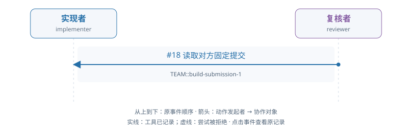

# train-01-0 · B · 错误初稿复核与修复

[交互HTML版](train-01-0.html) · [全部16条](../README.md) · [完整结构化数据](../data/train-01-0.json)

> 审阅者全局视角。模型输出保持原文；各成员完整实际输入在HTML的请求详情和JSON中逐调用保留，不能从全局快照补入模型当时视野。数值token/logprob数组仅保留源引用。

## 成员协作有向图



箭头为动作发起成员→协作对象，按原事件顺序向下排列。实线表示工具已记录，虚线表示尝试被拒；不代表对方已读或业务正确。个人操作及准备动作不连成成员关系。

[在交互页查看并定位事件](train-01-0.html#collaboration) · [单独打开图](../graphs/train-01-0.svg)

## 任务及原结果

A real fixed submission is already pending. The implementer may inspect it and repair a real defect independently or respond to an evidenced review. The reviewer independently reads data, applicable audit facts and exact submitted code/result; approve correct work or raise a located evidenced issue. For repair, withdraw the pending submission, execute changed code, submit a new fixed result, respond to actual issues and independently check their treatment before final approval. Correct initial work can be approved without manufacture of a defect or unnecessary repair. Prior preparation is not current actor work.

完整职责：否；原回报：0.0；重配有效性V：否；方法：unmapped。

| 维度 | 原判定 |
|---|---|
| record | 是 |
| permission | 是 |
| basis | 否 |
| delivery | 否 |

## 中文阅读提示（事后摘要）

当前有一份已固定、待复核的提交。实现者可以自行检查并修复真实缺陷，也可以响应有证据的复核反馈。复核者须独立读取数据、适用审计依据以及准确提交版本的代码和结果：正确则核准，有问题则提出定位明确、证据充分的问题。需要修复时，应先撤回待审提交，执行修改后的代码并提交新的固定结果，回应实际存在的问题，并独立检查其处理后再最终核准。正确初稿可直接核准，不必制造缺陷或无必要修复；准备阶段成果不计作当前工作人员工作。

已自检撤回并执行新构建，未固定提交。

实现者 seq122 撤回原错误提交，seq145 改代码、seq167 构建执行成功；尚无新 submit，双方于 seq174/182 达上下文门。原评分没有完整修复或独立最终核准。

审阅重点：构建执行成功不等于已经形成新的固定交付。


以下参数完整保留；工具返回仅作带标注的摘要，完整返回、原始XML、全部输入消息及对象文件在HTML/JSON中，不是再次评分。

## 联合时间线

### #2 实现者 · 决定 1

调用 `model-856bd3c07bf994954f5e8332`；observed_completion；输出token 100。

模型回复原文：

```text
I need to understand the current state and complete the task. Let me first inspect the pending submission to see what's already been submitted and check if there are any issues to respond to.
```

工具/控制提案：

```json
[
  {
    "id": "call_4a76793735909c84bbdfbb34178e6926",
    "type": "function",
    "function": {
      "name": "inspect_submission",
      "arguments": "{\"work_id\": \"TEAM::build\", \"submission_id\": \"TEAM::build-submission-1\", \"include_contract\": true}"
    }
  }
]
```

**#8 检查固定提交 · inspect_submission · 工具ok=true**

执行参数：

```json
{
  "work_id": "TEAM::build",
  "submission_id": "TEAM::build-submission-1",
  "include_contract": true
}
```

工具返回摘要（完整返回见HTML/JSON）：

```text
{
  "submission_id": "TEAM::build-submission-1"
}
```

原输入/回复序号：4/5；[在HTML定位](train-01-0.html#seq-2)。

### #12 复核者 · 决定 1

调用 `model-bcda666e1df71f0186494a51`；observed_completion；输出token 98。

模型回复原文：

```text
I need to inspect the fixed submission and read the exact code and result versions to verify correctness. Let me start by inspecting the pending submission to see what artifacts were submitted.
```

工具/控制提案：

```json
[
  {
    "id": "call_74090c5012efa25f06594b7c3539f790",
    "type": "function",
    "function": {
      "name": "inspect_submission",
      "arguments": "{\"work_id\": \"TEAM::build\", \"submission_id\": \"TEAM::build-submission-1\", \"include_contract\": true}"
    }
  }
]
```

**#18 检查固定提交 · inspect_submission · 工具ok=true**

执行参数：

```json
{
  "work_id": "TEAM::build",
  "submission_id": "TEAM::build-submission-1",
  "include_contract": true
}
```

工具返回摘要（完整返回见HTML/JSON）：

```text
{
  "submission_id": "TEAM::build-submission-1"
}
```

原输入/回复序号：14/15；[在HTML定位](train-01-0.html#seq-12)。

### #24 实现者 · 决定 2

调用 `model-dc04371eae967f6e0723506b`；observed_completion；输出token 125。

模型回复原文：

```text
I need to inspect the pending submission to understand what code/result was submitted, and also read the data and basis sources to verify the correctness. Let me start by reading the exact versions of the data and basis objects that were adopted in the submission.
```

工具/控制提案：

```json
[
  {
    "id": "call_9a62f45ffde72f63b028028b5de67971",
    "type": "function",
    "function": {
      "name": "read_version",
      "arguments": "{\"reference\": {\"object_id\": \"obj-ce6df59356455075dcb4aa81\", \"version_id\": \"v1\"}, \"work_id\": \"TEAM::build\"}"
    }
  }
]
```

**#30 读取确切版本 · read_version · 工具ok=true**

执行参数：

```json
{
  "reference": {
    "object_id": "obj-ce6df59356455075dcb4aa81",
    "version_id": "v1"
  },
  "work_id": "TEAM::build"
}
```

工具返回摘要（完整返回见HTML/JSON）：

```text
{
  "reference": {
    "object_id": "obj-ce6df59356455075dcb4aa81",
    "version_id": "v1"
  }
}
```

原输入/回复序号：26/27；[在HTML定位](train-01-0.html#seq-24)。

### #35 复核者 · 决定 2

调用 `model-bc18630cb248b42b05e40db9`；observed_completion；输出token 266。

模型回复原文：

```text
I need to read the exact versions of the data and audit_basis objects to perform my independent review. From the inspection result, I can see:
- Data object: obj-ce6df59356455075dcb4aa81, version v1 (adopted)
- Basis object: obj-9f9810e0cce067d1c4e27122, version v1 (adopted)
- Result object in submission: obj-9198e3ea23f930466ff23e6a, version v2
- Audit basis object: obj-f69c3f5f6d16d972a39d7b6b, version v1

Let me read the data and audit_basis versions first, then read the result to verify correctness.
```

工具/控制提案：

```json
[
  {
    "id": "call_fb2c1b0ceb0994c4c3781ae391030920",
    "type": "function",
    "function": {
      "name": "read_version",
      "arguments": "{\"reference\": {\"object_id\": \"obj-ce6df59356455075dcb4aa81\", \"version_id\": \"v1\"}, \"work_id\": \"TEAM::build\"}"
    }
  }
]
```

**#41 读取确切版本 · read_version · 工具ok=true**

执行参数：

```json
{
  "reference": {
    "object_id": "obj-ce6df59356455075dcb4aa81",
    "version_id": "v1"
  },
  "work_id": "TEAM::build"
}
```

工具返回摘要（完整返回见HTML/JSON）：

```text
{
  "reference": {
    "object_id": "obj-ce6df59356455075dcb4aa81",
    "version_id": "v1"
  }
}
```

原输入/回复序号：37/38；[在HTML定位](train-01-0.html#seq-35)。

### #47 实现者 · 决定 3

调用 `model-7b0f8433262f5235457951e4`；observed_completion；输出token 78。

模型回复原文：

```text
（原正文为空；工具提案见下）
```

工具/控制提案：

```json
[
  {
    "id": "call_abd670c3df695294c5918aadc77fc463",
    "type": "function",
    "function": {
      "name": "read_version",
      "arguments": "{\"reference\": {\"object_id\": \"obj-9f9810e0cce067d1c4e27122\", \"version_id\": \"v1\"}, \"work_id\": \"TEAM::build\"}"
    }
  }
]
```

**#53 读取确切版本 · read_version · 工具ok=true**

执行参数：

```json
{
  "reference": {
    "object_id": "obj-9f9810e0cce067d1c4e27122",
    "version_id": "v1"
  },
  "work_id": "TEAM::build"
}
```

工具返回摘要（完整返回见HTML/JSON）：

```text
{
  "reference": {
    "object_id": "obj-9f9810e0cce067d1c4e27122",
    "version_id": "v1"
  }
}
```

原输入/回复序号：49/50；[在HTML定位](train-01-0.html#seq-47)。

### #58 复核者 · 决定 3

调用 `model-b541859265b739b2f6d026a6`；observed_completion；输出token 78。

模型回复原文：

```text
（原正文为空；工具提案见下）
```

工具/控制提案：

```json
[
  {
    "id": "call_e0d684773a3de40c29a93e685c6d9b9b",
    "type": "function",
    "function": {
      "name": "read_version",
      "arguments": "{\"reference\": {\"object_id\": \"obj-9f9810e0cce067d1c4e27122\", \"version_id\": \"v1\"}, \"work_id\": \"TEAM::build\"}"
    }
  }
]
```

**#64 读取确切版本 · read_version · 工具ok=false**

执行参数：

```json
{
  "reference": {
    "object_id": "obj-9f9810e0cce067d1c4e27122",
    "version_id": "v1"
  },
  "work_id": "TEAM::build"
}
```

工具返回摘要（完整返回见HTML/JSON）：

```text
{
  "message": "Exact object version is not shared with this actor and project",
  "rejection": {
    "category": "unknown",
    "code": "unclassified_exception",
    "context": {
      "action": "project_action",
      "actor_id": "reviewer",
      "arguments_type": "dict",
      "project_id": "TEAM",
      "tool": "read_version"
    },
    "version": "tool-rejection-v0.9"
  },
  "type": "ValueError"
}
```

原输入/回复序号：60/61；[在HTML定位](train-01-0.html#seq-58)。

### #70 实现者 · 决定 4

调用 `model-e2a95808d24be9172f1054ff`；observed_completion；输出token 75。

模型回复原文：

```text
（原正文为空；工具提案见下）
```

工具/控制提案：

```json
[
  {
    "id": "call_58088b8836eb3fd16cc16c76c5f292f6",
    "type": "function",
    "function": {
      "name": "read_version",
      "arguments": "{\"reference\": {\"object_id\": \"obj-744d5addeb8920d37cbb11db\", \"version_id\": \"v2\"}, \"work_id\": \"TEAM::build\"}"
    }
  }
]
```

**#76 读取确切版本 · read_version · 工具ok=true**

执行参数：

```json
{
  "reference": {
    "object_id": "obj-744d5addeb8920d37cbb11db",
    "version_id": "v2"
  },
  "work_id": "TEAM::build"
}
```

工具返回摘要（完整返回见HTML/JSON）：

```text
{
  "reference": {
    "object_id": "obj-744d5addeb8920d37cbb11db",
    "version_id": "v2"
  }
}
```

原输入/回复序号：72/73；[在HTML定位](train-01-0.html#seq-70)。

### #81 复核者 · 决定 4

调用 `model-c3516218c2114c4815d60144`；observed_completion；输出token 42。

模型回复原文：

```text
（原正文为空；工具提案见下）
```

工具/控制提案：

```json
[
  {
    "id": "call_fcf7d3c98e8e1b243f96b296ec6bb77f",
    "type": "function",
    "function": {
      "name": "read_alias",
      "arguments": "{\"alias\": \"audit_basis\", \"work_id\": \"TEAM::build\"}"
    }
  }
]
```

**#87 读取别名 · read_alias · 工具ok=true**

执行参数：

```json
{
  "alias": "audit_basis",
  "work_id": "TEAM::build"
}
```

工具返回摘要（完整返回见HTML/JSON）：

```text
{
  "reference": {
    "object_id": "obj-f69c3f5f6d16d972a39d7b6b",
    "version_id": "v1"
  }
}
```

原输入/回复序号：83/84；[在HTML定位](train-01-0.html#seq-81)。

### #93 实现者 · 决定 5

调用 `model-054af64f82501b5e9e01e97e`；observed_completion；输出token 107。

模型回复原文：

```text
I need to inspect the submitted result (v2) to verify it's correct before approving. Let me read the result version v2.
```

工具/控制提案：

```json
[
  {
    "id": "call_d0adb7a67c74fd0eb03c44ab8a9f7d7f",
    "type": "function",
    "function": {
      "name": "read_version",
      "arguments": "{\"reference\": {\"object_id\": \"obj-9198e3ea23f930466ff23e6a\", \"version_id\": \"v2\"}, \"work_id\": \"TEAM::build\"}"
    }
  }
]
```

**#99 读取确切版本 · read_version · 工具ok=true**

执行参数：

```json
{
  "reference": {
    "object_id": "obj-9198e3ea23f930466ff23e6a",
    "version_id": "v2"
  },
  "work_id": "TEAM::build"
}
```

工具返回摘要（完整返回见HTML/JSON）：

```text
{
  "reference": {
    "object_id": "obj-9198e3ea23f930466ff23e6a",
    "version_id": "v2"
  }
}
```

原输入/回复序号：95/96；[在HTML定位](train-01-0.html#seq-93)。

### #104 复核者 · 决定 5

调用 `model-8671d9468bb53262fb85a93d`；observed_completion；输出token 75。

模型回复原文：

```text
（原正文为空；工具提案见下）
```

工具/控制提案：

```json
[
  {
    "id": "call_94a20884f4ac2378133f649413357bfe",
    "type": "function",
    "function": {
      "name": "read_version",
      "arguments": "{\"reference\": {\"object_id\": \"obj-744d5addeb8920d37cbb11db\", \"version_id\": \"v2\"}, \"work_id\": \"TEAM::build\"}"
    }
  }
]
```

**#110 读取确切版本 · read_version · 工具ok=true**

执行参数：

```json
{
  "reference": {
    "object_id": "obj-744d5addeb8920d37cbb11db",
    "version_id": "v2"
  },
  "work_id": "TEAM::build"
}
```

工具返回摘要（完整返回见HTML/JSON）：

```text
{
  "reference": {
    "object_id": "obj-744d5addeb8920d37cbb11db",
    "version_id": "v2"
  }
}
```

原输入/回复序号：106/107；[在HTML定位](train-01-0.html#seq-104)。

### #116 实现者 · 决定 6

调用 `model-01e6152ca8eb73449cade8dd`；observed_completion；输出token 1531。

模型回复原文：

```text
I have inspected the submission and read all the relevant data. Let me analyze the submitted result against the requirements:

**Requirements from basis (obj-9f9810e0cce067d1c4e27122 v1):**
- Period: UCI-2011-fixed-slice (2010-12-01 to 2012-01-01)
- Invoice mode: "sales_only" - excludes C invoices and nonpositive quantities
- Currency: GBP
- Duplicates: retain_source_rows
- Missing customer: exclude
- Price rule: strictly_positive

**Data (obj-ce6df59356455075dcb4aa81 v1):**
- 2 customers: 14367 and 17644
- 15 retail rows with various quantities (some negative, some positive)

**Submitted code (obj-744d5addeb8920d37cbb11db v2):**
The SQL has a critical error: `COUNT(DISTINCT InvoiceNo)+1 n` - it adds 1 to the count, which is incorrect.

**Submitted result (obj-9198e3ea23f930466ff23e6a v2):**
- Customer 14367: revenue_pence=12390, invoice_count=3
- Customer 17644: revenue_pence=7215, invoice_count=3

Let me manually verify the calculations:

**For Customer 14367:**
- Row 1: "552848", 85123A, Quantity=12, UnitPrice=2.95 → 12*2.95 = 35.40
- Row 2: "552848", 22804, Quantity=6, UnitPrice=2.95 → 6*2.95 = 17.70
- Row 3: "552848", 21733, Quantity=3, UnitPrice=2.95 → 3*2.95 = 8.85
- Row 4: "C552849", 85123A, Quantity=-12, UnitPrice=2.95 → -35.40 (negative quantity, excluded in sales_only)
- Row 5: "C552849", 22804, Quantity=-6, UnitPrice=2.95 → -17.70 (excluded)
- Row 6: "C552849", 21733, Quantity=-3, UnitPrice=2.95 → -8.85 (excluded)
- Row 7: "552850", 85123A, Quantity=12, UnitPrice=2.95 → 35.40
- Row 8: "552850", 22804, Quantity=6, UnitPrice=2.95 → 17.70
- Row 9: "552850", 21733, Quantity=3, UnitPrice=2.95 → 8.85

Qualifying rows (Quantity > 0 and not C invoice): 9 rows
Total: 35.40 + 17.70 + 8.85 + 35.40 + 17.70 + 8.85 = 123.90 GBP = 12390 pence ✓
Distinct InvoiceNos: 552848, 552850 = 2 invoices (C552849 is excluded because Quantity <= 0)

Wait, let me re-check. The invoice_mode is "sales_only" which excludes:
- C invoices (cancellations)
- nonpositive quantities

So C552849 rows are excluded because they start with 'C' (cancellation).

For 14367:
- 552848: 3 rows with positive quantities → 1 invoice
- 552850: 3 rows with positive quantities → 1 invoice
Total: 2 distinct invoices, not 3!

The submitted result shows invoice_count=3, which is wrong. The SQL has `COUNT(DISTINCT InvoiceNo)+1` which incorrectly adds 1.

Let me also verify Customer 17644:
- Row 10: "556746", 22558, Quantity=1, UnitPrice=1.65 → 1.65
- Row 11: "556746", 21156, Quantity=8, UnitPrice=1.95 → 15.60
- Row 12: "556746", 21039, Quantity=6, UnitPrice=2.55 → 15.30
- Row 13: "559926", 23028, Quantity=12, UnitPrice=1.65 → 19.80
- Row 14: "559926", 23032, Quantity=12, UnitPrice=1.65 → 19.80

All qualifying, total: 1.65 + 15.60 + 15.30 + 19.80 + 19.80 = 72.15 GBP = 7215 pence ✓
Distinct InvoiceNos: 556746, 559926 = 2 invoices, not 3!

The submitted result is INCORRECT. The invoice_count is wrong for both customers (shows 3, should be 2).

I need to:
1. Withdraw the pending submission
2. Fix the code (remove the +1)
3. Rebuild and resubmit
```

工具/控制提案：

```json
[
  {
    "id": "call_14de42a258b75638842f27070d798f4e",
    "type": "function",
    "function": {
      "name": "withdraw",
      "arguments": "{\"work_id\": \"TEAM::build\", \"submission_id\": \"TEAM::build-submission-1\", \"reason\": \"The submitted result has incorrect invoice_count values. The SQL incorrectly adds 1 to COUNT(DISTINCT InvoiceNo). Both customers show invoice_count=3 but should show 2 (customer 14367 has invoices 552848 and 552850; customer 17644 has invoices 556746 and 559926).\"}"
    }
  }
]
```

**#122 撤回提交 · withdraw · 工具ok=true**

执行参数：

```json
{
  "work_id": "TEAM::build",
  "submission_id": "TEAM::build-submission-1",
  "reason": "The submitted result has incorrect invoice_count values. The SQL incorrectly adds 1 to COUNT(DISTINCT InvoiceNo). Both customers show invoice_count=3 but should show 2 (customer 14367 has invoices 552848 and 552850; customer 17644 has invoices 556746 and 559926)."
}
```

工具返回摘要（完整返回见HTML/JSON）：

```text
{
  "submission_id": "TEAM::build-submission-1",
  "status": "withdrawn"
}
```

原输入/回复序号：118/119；[在HTML定位](train-01-0.html#seq-116)。

### #127 复核者 · 决定 6

调用 `model-8b3abca3a572826b038e9645`；observed_completion；输出token 108。

模型回复原文：

```text
I need to read the result.json (version v2) to inspect the submitted result table and verify its correctness against the data and audit_basis.
```

工具/控制提案：

```json
[
  {
    "id": "call_a09c6ee1eb5d933e9c830ba63ccbfb83",
    "type": "function",
    "function": {
      "name": "read_version",
      "arguments": "{\"reference\": {\"object_id\": \"obj-9198e3ea23f930466ff23e6a\", \"version_id\": \"v2\"}, \"work_id\": \"TEAM::build\"}"
    }
  }
]
```

**#133 读取确切版本 · read_version · 工具ok=true**

执行参数：

```json
{
  "reference": {
    "object_id": "obj-9198e3ea23f930466ff23e6a",
    "version_id": "v2"
  },
  "work_id": "TEAM::build"
}
```

工具返回摘要（完整返回见HTML/JSON）：

```text
{
  "reference": {
    "object_id": "obj-9198e3ea23f930466ff23e6a",
    "version_id": "v2"
  }
}
```

原输入/回复序号：129/130；[在HTML定位](train-01-0.html#seq-127)。

### #139 实现者 · 决定 7

调用 `model-dbca450c8d7d0a0bda28db92`；observed_completion；输出token 791。

模型回复原文：

```text
I need to write corrected SQL code that fixes the invoice_count bug. The issue is that the SQL adds 1 to COUNT(DISTINCT InvoiceNo), which is incorrect. According to the policy:
- sales_only excludes C invoices and nonpositive quantities
- invoice_count should be COUNT(DISTINCT qualifying InvoiceNo)

Let me analyze the data:
- Customer 14367 has invoices: 552848 (qty=12), 552849 (cancellation, qty=-12), 552850 (qty=12)
  - For sales_only: exclude C invoices (none are C), exclude nonpositive quantities (552849 has -12)
  - Qualifying invoices: 552848 and 552850 = 2 distinct invoices
- Customer 17644 has invoices: 556746 (qty=1), 559926 (qty=12)
  - For sales_only: both have positive quantities and are not C
  - Qualifying invoices: 556746 and 559926 = 2 distinct invoices

The revenue_pence calculation:
- Customer 14367: (12*2.95) + (12*2.95) = 35.4 + 35.4 = 70.8 GBP = 7080 pence
- Customer 17644: (1*1.65) + (12*1.65) = 1.65 + 19.8 = 21.45 GBP = 2145 pence

Wait, let me re-read the policy more carefully. The policy says:
- "sales_only excludes C invoices and nonpositive quantities"
- "net_signed retains signed Quantity including cancellations"

But the submitted code has `invoice_mode='net_signed'` in the WHERE clause, which would include cancellations. Let me check what invoice_mode='approved' means from the basis table - it shows "sales_only" as the invoice_mode value.

Actually, looking at the basis table, the invoice_mode is 'sales_only', which means we should exclude C invoices and nonpositive quantities. The SQL should use invoice_mode='sales_only' not 'net_signed'.

Let me write the corrected code:
```

工具/控制提案：

```json
[
  {
    "id": "call_ac042eaf6a68dc4e1a60166d2dea107a",
    "type": "function",
    "function": {
      "name": "write_object",
      "arguments": "{\"alias\": \"code\", \"data\": {\"config\": {\"exports\": [\"metrics\"]}, \"models\": [{\"name\": \"metrics\", \"sql\": \"WITH e AS (SELECT r.* FROM retail r,basis_meta b WHERE edition='approved' AND InvoiceDate>=start_inclusive::TIMESTAMP AND InvoiceDate<end_exclusive::TIMESTAMP AND CustomerID IS NOT NULL AND UnitPrice>0 AND (invoice_mode='sales_only' OR (InvoiceNo NOT ILIKE 'C%' AND Quantity>0))), a AS (SELECT CustomerID,SUM(Quantity*UnitPrice)*100 p,COUNT(DISTINCT InvoiceNo) n FROM e GROUP BY CustomerID) SELECT c.CustomerID,COALESCE(p,0)::BIGINT revenue_pence,COALESCE(n,0)::BIGINT invoice_count FROM customers c LEFT JOIN a ON c.CustomerID=a.CustomerID ORDER BY c.CustomerID\"}], \"tests\": [{\"name\": \"unique_customer\", \"sql\": \"SELECT CustomerID FROM metrics GROUP BY CustomerID HAVING COUNT(*) <> 1\"}]}, \"work_id\": \"TEAM::build\"}"
    }
  }
]
```

**#145 写入对象 · write_object · 工具ok=true**

执行参数：

```json
{
  "alias": "code",
  "data": {
    "config": {
      "exports": [
        "metrics"
      ]
    },
    "models": [
      {
        "name": "metrics",
        "sql": "WITH e AS (SELECT r.* FROM retail r,basis_meta b WHERE edition='approved' AND InvoiceDate>=start_inclusive::TIMESTAMP AND InvoiceDate<end_exclusive::TIMESTAMP AND CustomerID IS NOT NULL AND UnitPrice>0 AND (invoice_mode='sales_only' OR (InvoiceNo NOT ILIKE 'C%' AND Quantity>0))), a AS (SELECT CustomerID,SUM(Quantity*UnitPrice)*100 p,COUNT(DISTINCT InvoiceNo) n FROM e GROUP BY CustomerID) SELECT c.CustomerID,COALESCE(p,0)::BIGINT revenue_pence,COALESCE(n,0)::BIGINT invoice_count FROM customers c LEFT JOIN a ON c.CustomerID=a.CustomerID ORDER BY c.CustomerID"
      }
    ],
    "tests": [
      {
        "name": "unique_customer",
        "sql": "SELECT CustomerID FROM metrics GROUP BY CustomerID HAVING COUNT(*) <> 1"
      }
    ]
  },
  "work_id": "TEAM::build"
}
```

工具返回摘要（完整返回见HTML/JSON）：

```text
{
  "version_id": "v3"
}
```

原输入/回复序号：141/142；[在HTML定位](train-01-0.html#seq-139)。

### #150 复核者 · 决定 7

调用 `model-9e7c8d9c486e99c9b1d0b6f6`；observed_completion；输出token 2048。

模型回复原文：

````text
I have now read all the necessary components:

1. **Data (obj-ce6df59356455075dcb4aa81, v1)**: Contains 2 customers (14367, 17644) and 15 retail rows with dates in May-July 2011.

2. **Audit Basis (obj-f69c3f5f6d16d972a39d7b6b, v1)**: 
   - Period: 2010-12-01 to 2012-01-01 (covers all data)
   - invoice_mode: 'sales_only' (excludes C invoices and nonpositive quantities)
   - price_rule: 'strictly_positive' (excludes rows with UnitPrice <= 0)
   - missing_customer: 'exclude' 
   - duplicates: 'retain_source_rows'

3. **Code (obj-744d5addeb8920d37cbb11db, v2)**: The SQL uses:
   - InvoiceDate filtering (correct)
   - CustomerID IS NOT NULL (correct)
   - UnitPrice > 0 (correct)
   - `(invoice_mode='net_signed' OR (InvoiceNo NOT ILIKE 'C%' AND Quantity>0))` - This is problematic!
   
   The condition should be `invoice_mode='sales_only'`, not `invoice_mode='net_signed'`. But wait, let me re-read the basis. The basis says `invoice_mode: 'sales_only'`, so the WHERE clause should filter for `invoice_mode='sales_only'`.

   However, the actual SQL in the code has `invoice_mode='net_signed'` which is WRONG. The basis says the invoice_mode is 'sales_only', so the SQL should be checking for `invoice_mode='sales_only'`.

   Actually, looking more carefully at the SQL logic:
   - It's using `OR` between `invoice_mode='net_signed'` and the sales_only condition
   - Since invoice_mode='net_signed' is never true (it's 'sales_only'), this effectively becomes just the sales_only condition
   - But wait, the SQL is reading from `basis_meta b WHERE edition='approved' AND ... invoice_mode='net_signed' ...`
   
   Let me trace through the actual data to verify the results are correct.

4. **Result (obj-9198e3ea23f930466ff23e6a, v2)**: 
   - Customer 14367: revenue_pence=12390, invoice_count=3
   - Customer 17644: revenue_pence=7215, invoice_count=3

Let me manually verify the calculations:

**For Customer 14367:**
Retail rows for customer 14367:
- Row 1: StockCode 85123A, Quantity=12, UnitPrice=2.95 → 12*2.95=35.40 (qualifies: Quantity>0, not C invoice)
- Row 2: StockCode 22804, Quantity=6, UnitPrice=2.95 → 6*2.95=17.70 (qualifies)
- Row 3: StockCode 21733, Quantity=3, UnitPrice=2.95 → 3*2.95=8.85 (qualifies)
- Row 4: StockCode 85123A, Quantity=-12, UnitPrice=2.95 → Does NOT qualify (Quantity<=0)
- Row 5: StockCode 22804, Quantity=-6, UnitPrice=2.95 → Does NOT qualify (Quantity<=0)
- Row 6: StockCode 21733, Quantity=-3, UnitPrice=2.95 → Does NOT qualify (Quantity<=0)

So for customer 14367, qualifying rows are rows 1, 2, 3 (InvoiceNos: 552848, 552848, 552848)
- Total revenue: 35.40 + 17.70 + 8.85 = 61.95 GBP = 6195 pence
- Distinct InvoiceNos: Only "552848" appears, so count = 1

But the result shows revenue_pence=12390, invoice_count=3. This doesn't match!

Wait, let me re-examine. The SQL joins with customers and groups by CustomerID. Let me check if there are other rows I'm missing.

Actually, looking at the retail rows again for customer 14367:
- Rows 1-3 are for customer 14367 with positive quantities
- Rows 4-6 are for customer 14367 with negative quantities (cancellations)
- Rows 7-10 are for customer 14367 with positive quantities

Wait, I need to re-read the data more carefully:

Row 0: InvoiceNo=C541833, Quantity=-1, CustomerID=17644 (cancellation)
Row 1: InvoiceNo=552848, Quantity=12, CustomerID=14367 (qualifies)
Row 2: InvoiceNo=552848, Quantity=6, CustomerID=14367 (qualifies)
Row 3: InvoiceNo=552848, Quantity=3, CustomerID=14367 (qualifies)
Row 4: InvoiceNo=C552849, Quantity=-12, CustomerID=14367 (cancellation, doesn't qualify)
Row 5: InvoiceNo=C552849, Quantity=-6, CustomerID=14367 (cancellation, doesn't qualify)
Row 6: InvoiceNo=C552849, Quantity=-3, CustomerID=14367 (cancellation, doesn't qualify)
Row 7: InvoiceNo=552850, Quantity=12, CustomerID=14367 (qualifies)
Row 8: InvoiceNo=552850, Quantity=6, CustomerID=14367 (qualifies)
Row 9: InvoiceNo=552850, Quantity=3, CustomerID=14367 (qualifies)

So for customer 14367, qualifying rows are: 1, 2, 3, 7, 8, 9
- Revenue: 12*2.95 + 6*2.95 + 3*2.95 + 12*2.95 + 6*2.95 + 3*2.95 = (12+6+3+12+6+3)*2.95 = 42*2.95 = 123.90 GBP = 12390 pence ✓
- Distinct InvoiceNos: 552848, 552850 = 2 distinct invoices

But the result shows invoice_count=3, not 2!

Wait, let me check the SQL again. The SQL says:
```sql
COUNT(DISTINCT InvoiceNo)+1 n
```

It's adding 1 to the count! That's a bug in the SQL. The +1 is incorrect.

For customer 14367:
- Actual distinct InvoiceNos: 2 (552848, 552850)
- SQL calculates: 2 + 1 = 3

For customer 17644:
- Qualifying rows: Let me check
- Row 0: C541833, Quantity=-1 → doesn't qualify (cancellation)
- Row 10: 556746, Quantity=1, CustomerID=17644 → qualifies
- Row 11: 556746, Quantity=8, CustomerID=17644 → qualifies
- Row 12: 556746, Quantity=6, CustomerID=17644 → qualifies
- Row 13: 559926, Quantity=12, CustomerID=17644 → qualifies
- Row 14: 559926, Quantity=12, CustomerID=17644 → qualifies

So for customer 17644, qualifying rows are: 10, 11, 12, 13, 14
- Revenue: 1*1.65 + 8*1.95 + 6*2.55 + 12*1.65 + 12*1.65 = 1.65 + 15.6 + 15.3 + 19.
````

没有实际世界工具执行；控制输出、解析失败与未生成分别查看原记录。

原输入/回复序号：152/153；[在HTML定位](train-01-0.html#seq-150)。

### #155 运行时格式反馈 · 复核者

```json
{
  "call_id": "model-9e7c8d9c486e99c9b1d0b6f6",
  "decision_id": "model-9e7c8d9c486e99c9b1d0b6f6",
  "worker_id": "reviewer",
  "opportunity_id": "staff-opportunity-v024-403debf564155790545df740-14",
  "decision_index": 7,
  "requested_model": "shared-local-actor",
  "backend_id": "resident_direct",
  "action_protocol": "native_tools",
  "model_revision": "online-actor-2:2896e50d1b66e915c19d7b13cbab82589976bf073b31152a6b5f29999e8394ed",
  "weight_identity": {
    "version": "shared-actor-identity-v0.13",
    "policy_version": "online-actor-2:2896e50d1b66e915c19d7b13cbab82589976bf073b31152a6b5f29999e8394ed",
    "adapter_sha256": "2896e50d1b66e915c19d7b13cbab82589976bf073b31152a6b5f29999e8394ed",
    "base_manifest_sha256": "030031b27513e399360f26a8db31746e719bb15a3d2f4d68874c1dba3ccc60a6",
    "inference_profile_sha256": "c640cad53145a1df8ee7cc81932be81d931d58c1182aa872530460a030a694a6"
  },
  "feedback": {
    "version": "public-format-feedback-v0.17",
    "model_call_id": "model-9e7c8d9c486e99c9b1d0b6f6",
    "status": "decision_rejected",
    "reason": "Completion reached the fixed output limit; no proposed action executed",
    "action_protocol": "native_tools",
    "world_action_executed": false,
    "decision_consumed": true,
    "format_errors": {
      "total": 1,
      "consecutive": 1
    },
    "format_limits": {
      "max_total": 4,
      "max_consecutive": 2
    },
    "continues_on_later_opportunity": true,
    "contract": "Return exactly one native function call using the current public tool definition. Multiple calls are all rejected. Use staff_wait or staff_done with a reason for control.",
    "finish_reason": "length",
    "parse_diagnostics": {
      "version": "public-format-diagnostics-v0.17",
      "native_parser": {
        "parser": "native_parser",
        "status": "no_failure_reported",
        "failure": null
      },
      "adapter_parser": {
        "parser": "native_model_policy_v017",
        "status": "rejected",
        "failure": {
          "stage": "adapter_structure",
          "reason": "Completion reached the fixed output limit; no proposed action executed",
          "field_path": null,
          "schema_path": null,
          "expected_type": null,
          "observed_type": null,
          "position": null
        }
      },
      "scope": "Public syntax and supplied schema only; unknown locations stay null. No replacement values or business answers."
    }
  }
}
```

### #161 实现者 · 决定 8

调用 `model-8b6e20a425e6c3344310aaa5`；observed_completion；输出token 93。

模型回复原文：

```text
I need to execute the sql_build with the new code to generate the correct result, then submit.
```

工具/控制提案：

```json
[
  {
    "id": "call_1cfa105d2d395463afda18da0fd3eaa5",
    "type": "function",
    "function": {
      "name": "sql_build",
      "arguments": "{\"code_alias\": \"code\", \"input_aliases\": [\"data\", \"basis\"], \"output_alias\": \"result\", \"work_id\": \"TEAM::build\"}"
    }
  }
]
```

**#167 执行SQL构建 · sql_build · 工具ok=true**

执行参数：

```json
{
  "code_alias": "code",
  "input_aliases": [
    "data",
    "basis"
  ],
  "output_alias": "result",
  "work_id": "TEAM::build"
}
```

工具返回摘要（完整返回见HTML/JSON）：

```text
{
  "reference": {
    "object_id": "obj-9198e3ea23f930466ff23e6a",
    "version_id": "v3"
  }
}
```

原输入/回复序号：163/164；[在HTML定位](train-01-0.html#seq-161)。

### #171 复核者 · 决定 8

调用 `model-9275c9ba415312378306c1c4`；not_started_direct_context_limit；输出token 0。

本次没有生成输出；原返回：

```json
{
  "http_status": 400,
  "raw_body": "{\n  \"error\": {\n    \"code\": \"context_length_exceeded\",\n    \"message\": \"Full real prompt plus requested output exceeds context limit; no crop\",\n    \"prompt_tokens\": 14740,\n    \"requested_output\": 2048,\n    \"context_limit\": 16384\n  },\n  \"transport_kind\": \"resident_direct\",\n  \"generation_started\": false,\n  \"actor_identity\": {\n    \"version\": \"shared-actor-identity-v0.13\",\n    \"policy_version\": \"online-actor-2:2896e50d1b66e915c19d7b13cbab82589976bf073b31152a6b5f29999e8394ed\",\n    \"adapter_sha256\": \"2896e50d1b66e915c19d7b13cbab82589976bf073b31152a6b5f29999e8394ed\",\n    \"base_manifest_sha256\": \"030031b27513e399360f26a8db31746e719bb15a3d2f4d68874c1dba3ccc60a6\",\n    \"inference_profile_sha256\": \"c640cad53145a1df8ee7cc81932be81d931d58c1182aa872530460a030a694a6\"\n  },\n  \"online_window_id\": \"v025-window-1\"\n}\n",
  "body": {
    "error": {
      "code": "context_length_exceeded",
      "message": "Full real prompt plus requested output exceeds context limit; no crop",
      "prompt_tokens": 14740,
      "requested_output": 2048,
      "context_limit": 16384
    },
    "transport_kind": "resident_direct",
    "generation_started": false,
    "actor_identity": {
      "version": "shared-actor-identity-v0.13",
      "policy_version": "online-actor-2:2896e50d1b66e915c19d7b13cbab82589976bf073b31152a6b5f29999e8394ed",
      "adapter_sha256": "2896e50d1b66e915c19d7b13cbab82589976bf073b31152a6b5f29999e8394ed",
      "base_manifest_sha256": "030031b27513e399360f26a8db31746e719bb15a3d2f4d68874c1dba3ccc60a6",
      "inference_profile_sha256": "c640cad53145a1df8ee7cc81932be81d931d58c1182aa872530460a030a694a6"
    },
    "online_window_id": "v025-window-1"
  },
  "response_headers": {
    "x-transport": "resident-direct"
  },
  "response_redactions": []
}
```

没有实际世界工具执行；控制输出、解析失败与未生成分别查看原记录。

原输入/回复序号：None/None；[在HTML定位](train-01-0.html#seq-171)。

### #174 停止或边界 · 复核者

```json
{
  "type": "PolicyBoundaryError",
  "message": "Backend reported its fixed context limit",
  "status": "model_budget_exhausted",
  "opportunity_id": "staff-opportunity-v024-403debf564155790545df740-16",
  "model_call_id": "model-9275c9ba415312378306c1c4",
  "backend_error": {
    "code": "context_length_exceeded",
    "http_status": 400
  }
}
```

### #179 实现者 · 决定 9

调用 `model-ad133bd582ff735c5fc42d9e`；not_started_direct_context_limit；输出token 0。

本次没有生成输出；原返回：

```json
{
  "http_status": 400,
  "raw_body": "{\n  \"error\": {\n    \"code\": \"context_length_exceeded\",\n    \"message\": \"Full real prompt plus requested output exceeds context limit; no crop\",\n    \"prompt_tokens\": 14342,\n    \"requested_output\": 2048,\n    \"context_limit\": 16384\n  },\n  \"transport_kind\": \"resident_direct\",\n  \"generation_started\": false,\n  \"actor_identity\": {\n    \"version\": \"shared-actor-identity-v0.13\",\n    \"policy_version\": \"online-actor-2:2896e50d1b66e915c19d7b13cbab82589976bf073b31152a6b5f29999e8394ed\",\n    \"adapter_sha256\": \"2896e50d1b66e915c19d7b13cbab82589976bf073b31152a6b5f29999e8394ed\",\n    \"base_manifest_sha256\": \"030031b27513e399360f26a8db31746e719bb15a3d2f4d68874c1dba3ccc60a6\",\n    \"inference_profile_sha256\": \"c640cad53145a1df8ee7cc81932be81d931d58c1182aa872530460a030a694a6\"\n  },\n  \"online_window_id\": \"v025-window-1\"\n}\n",
  "body": {
    "error": {
      "code": "context_length_exceeded",
      "message": "Full real prompt plus requested output exceeds context limit; no crop",
      "prompt_tokens": 14342,
      "requested_output": 2048,
      "context_limit": 16384
    },
    "transport_kind": "resident_direct",
    "generation_started": false,
    "actor_identity": {
      "version": "shared-actor-identity-v0.13",
      "policy_version": "online-actor-2:2896e50d1b66e915c19d7b13cbab82589976bf073b31152a6b5f29999e8394ed",
      "adapter_sha256": "2896e50d1b66e915c19d7b13cbab82589976bf073b31152a6b5f29999e8394ed",
      "base_manifest_sha256": "030031b27513e399360f26a8db31746e719bb15a3d2f4d68874c1dba3ccc60a6",
      "inference_profile_sha256": "c640cad53145a1df8ee7cc81932be81d931d58c1182aa872530460a030a694a6"
    },
    "online_window_id": "v025-window-1"
  },
  "response_headers": {
    "x-transport": "resident-direct"
  },
  "response_redactions": []
}
```

没有实际世界工具执行；控制输出、解析失败与未生成分别查看原记录。

原输入/回复序号：None/None；[在HTML定位](train-01-0.html#seq-179)。

### #182 停止或边界 · 实现者

```json
{
  "type": "PolicyBoundaryError",
  "message": "Backend reported its fixed context limit",
  "status": "model_budget_exhausted",
  "opportunity_id": "staff-opportunity-v024-403debf564155790545df740-17",
  "model_call_id": "model-ad133bd582ff735c5fc42d9e",
  "backend_error": {
    "code": "context_length_exceeded",
    "http_status": 400
  }
}
```


## 终止、方法及源记录

```json
{
  "status": "finite_task_deadline",
  "kind": "finite_horizon_task_terminal",
  "role_stops": {
    "reviewer": "model_budget_exhausted",
    "implementer": "model_budget_exhausted"
  },
  "opportunities": 17,
  "actions": 14,
  "continuation": false,
  "bootstrap": 0,
  "scope": "Fixed short-task deadline; this terminal does not claim the business goal completed. No later continuation can backfill its reward."
}
```

```json
{
  "version": "complete-work-evidence-v0.25",
  "rollout_id": "6a830177-4a36-4cf1-8f07-3f3fecebd19e",
  "spec_id": "retail-complete-actual-method-v0.25",
  "status": "unmapped",
  "class_id": null,
  "evidence": {
    "version": "complete-work-evidence-v0.25",
    "episode_id": "6a830177-4a36-4cf1-8f07-3f3fecebd19e",
    "manifest_sha256": "1db9c3eeeb57b5d9325f90af60ab76014af4790f0317ab5309dbb779993ee81c",
    "known": true,
    "reason": null,
    "case_id": "retail-v25-4273bbfbaa657a8c",
    "facts": {
      "task": "joint_b",
      "initial_submission_id": "TEAM::build-submission-1",
      "initial_independent_quality": "content_failure",
      "initial_was_incorrect": true,
      "implementation_inspected_before_withdrawal": true,
      "withdrawal": {
        "sequence": 122,
        "actor": "implementer",
        "action": "withdraw",
        "command_id": "command:bc970f702d04ae4ebc91990f0f83c2a15b965d38fc45463a535e8247c74d9249"
      },
      "fixed_current_product": null,
      "judgments": [],
      "issues": [],
      "issue_treatments": [],
      "final_approvals": [],
      "actual_feedback_presented_before_withdrawal": false,
      "all_judgments_valid": false,
      "self_repair_path": false,
      "feedback_repair_path": false,
      "basis_valid": false,
      "delivery_valid": false,
      "existing_predicates": [
        "RetailEvidence.read_inputs/read_before/review_reads",
        "retail_collaboration_v021._quality/_actual_fixed_build/_judgments",
        "retail_collaboration_v021._implementation_inspected/_issue_treatment"
      ]
    }
  },
  "reason": "Full independently valid work and an unambiguous current method required"
}
```

```json
{
  "started_requests": 17,
  "actual_generations": 15,
  "non_generation_requests": 2,
  "world_actions": 14,
  "world_action_ok": 13,
  "world_action_rejected": 1,
  "format_feedback_events": 1,
  "model_control_events": 0,
  "boundary_errors": 2,
  "unlinked_boundary_errors": 0,
  "parse_errors": 0,
  "all_actual_requests_reconstructed_exactly": true,
  "all_world_actions_linked_exactly": true,
  "numeric_token_arrays_included": false
}
```

原始文件引用：

```json
{
  "rollout": {
    "path": "/data1/zhuxinrui/projects/ProWorkSim/runs/domain-v025/support/actual/collection/train-01-0/team-rollout.json",
    "sha256": "49a74abd6ee0e19bfb77b626df94a6420551dec7b445b236c8a33b78736e5d5e",
    "bytes": 20840928
  },
  "projection": {
    "path": "/data1/zhuxinrui/projects/ProWorkSim/runs/domain-v025/support/actual/collection/train-01-0/projection.json",
    "sha256": "5f1dbe407515f6c7005b32781deec248b35023f95def057aafd8866dd92ef29f",
    "bytes": 19837447
  },
  "manifest": {
    "path": "/data1/zhuxinrui/projects/ProWorkSim/runs/domain-v025/support/actual/collection/train-01-0/episode/manifest.json",
    "sha256": "1db9c3eeeb57b5d9325f90af60ab76014af4790f0317ab5309dbb779993ee81c",
    "bytes": 141757
  },
  "preparation": {
    "path": "/data1/zhuxinrui/projects/ProWorkSim/runs/domain-v025/support/actual/collection/train-01-0/preparation.json",
    "sha256": "b76349ba9865422ff505ceedb454a8e2700be9cb07f0928b9a3399e7daf266c2",
    "bytes": 89094
  }
}
```

