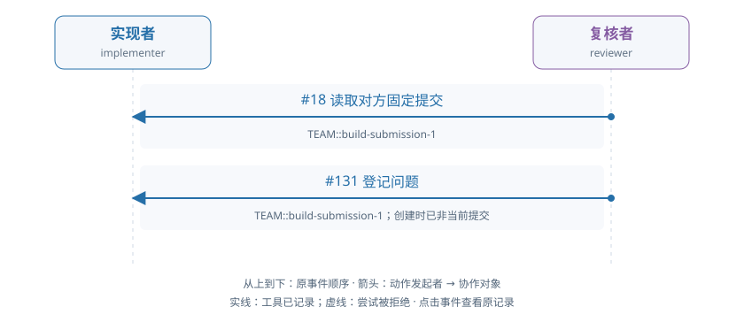

# train-01-2 · B · 错误初稿复核与修复

[交互HTML版](train-01-2.html) · [全部16条](../README.md) · [完整结构化数据](../data/train-01-2.json)

> 审阅者全局视角。模型输出保持原文；各成员完整实际输入在HTML的请求详情和JSON中逐调用保留，不能从全局快照补入模型当时视野。数值token/logprob数组仅保留源引用。

## 成员协作有向图



箭头为动作发起成员→协作对象，按原事件顺序向下排列。实线表示工具已记录，虚线表示尝试被拒；不代表对方已读或业务正确。个人操作及准备动作不连成成员关系。

[在交互页查看并定位事件](train-01-2.html#collaboration) · [单独打开图](../graphs/train-01-2.svg)

## 任务及原结果

A real fixed submission is already pending. The implementer may inspect it and repair a real defect independently or respond to an evidenced review. The reviewer independently reads data, applicable audit facts and exact submitted code/result; approve correct work or raise a located evidenced issue. For repair, withdraw the pending submission, execute changed code, submit a new fixed result, respond to actual issues and independently check their treatment before final approval. Correct initial work can be approved without manufacture of a defect or unnecessary repair. Prior preparation is not current actor work.

完整职责：否；原回报：0.0；重配有效性V：否；方法：unmapped。

| 维度 | 原判定 |
|---|---|
| record | 是 |
| permission | 是 |
| basis | 否 |
| delivery | 否 |

## 中文阅读提示（事后摘要）

当前有一份已固定、待复核的提交。实现者可以自行检查并修复真实缺陷，也可以响应有证据的复核反馈。复核者须独立读取数据、适用审计依据以及准确提交版本的代码和结果：正确则核准，有问题则提出定位明确、证据充分的问题。需要修复时，应先撤回待审提交，执行修改后的代码并提交新的固定结果，回应实际存在的问题，并独立检查其处理后再最终核准。正确初稿可直接核准，不必制造缺陷或无必要修复；准备阶段成果不计作当前工作人员工作。

旧稿先撤回，随后 issue 指向已非当前的提交。

实现者 seq121 撤回原稿；reviewer seq131 的 issue 虽存储成功，但 active_at_creation=false，保存判断同时缺充分读取证据。随后停止，未完成新构建、固定提交或最终复核。

审阅重点：问题存储成功与其对当前责任有效，是两个事实；注意 issue 的目标 SID 和当前性。


以下参数完整保留；工具返回仅作带标注的摘要，完整返回、原始XML、全部输入消息及对象文件在HTML/JSON中，不是再次评分。

## 联合时间线

### #2 实现者 · 决定 1

调用 `model-2ced61d5f0c825ee38eb3e03`；observed_completion；输出token 54。

模型回复原文：

```text
I need to understand the current state and the task. Let me read the messages first to see if there are any communications, and then inspect the pending submission to understand what's already been submitted.
```

工具/控制提案：

```json
[
  {
    "id": "call_a9e2968899b79a2cbdf9040a5b09766f",
    "type": "function",
    "function": {
      "name": "read_messages",
      "arguments": "{}"
    }
  }
]
```

**#8 读取消息 · read_messages · 工具ok=true**

执行参数：

```json
{}
```

工具返回摘要（完整返回见HTML/JSON）：

```text
[{'at': 3, 'attachments': [], 'body': {'actor': 'provider', 'body': 'Actual inherited policy delivery; preparation is excluded from current actor credit.', 'delivered_for_current_work': True, 'handoff_id': 'handoff-3a4829408cac58a6fdbf8318', 'handoff_key': 'prepared-basis', 'origin': 'member_action', 'project_id': 'TEAM', 'purpose': 'basis', 'recipients': ['implementer'], 'reference': {'object_id': 'obj-9f9810e0cce067d1c4e27122', 'version_id': 'v1'}, 'request_id': None, 'requirement_version': 1, 'response_id': None, 'response_status': 'delivered', 'route_id': 'basis', 'sender': 'provider', 'work_item_id': 'TEAM::build'}, 'message_id': 'mail-1', 'project_id': 'TEAM', 'recipients': ['implementer'], 'sender': 'provider', 'subject': 'Team evidence handoff'}]
```

原输入/回复序号：4/5；[在HTML定位](train-01-2.html#seq-2)。

### #12 复核者 · 决定 1

调用 `model-4b2b2c026ff537248c6c7255`；observed_completion；输出token 143。

模型回复原文：

```text
I need to independently inspect the fixed submission. The task says a real fixed submission is already pending with ID "TEAM::build-submission-1". I should inspect this submission first to see what was submitted, then read the exact versions of the code and result, and compare them against the adopted data and audit_basis.

Let me start by inspecting the pending submission to understand what was submitted.
```

工具/控制提案：

```json
[
  {
    "id": "call_9cb8f0b00689521a7e919e2aa90248d5",
    "type": "function",
    "function": {
      "name": "inspect_submission",
      "arguments": "{\"work_id\": \"TEAM::build\", \"submission_id\": \"TEAM::build-submission-1\", \"include_contract\": true}"
    }
  }
]
```

**#18 检查固定提交 · inspect_submission · 工具ok=true**

执行参数：

```json
{
  "work_id": "TEAM::build",
  "submission_id": "TEAM::build-submission-1",
  "include_contract": true
}
```

工具返回摘要（完整返回见HTML/JSON）：

```text
{
  "submission_id": "TEAM::build-submission-1"
}
```

原输入/回复序号：14/15；[在HTML定位](train-01-2.html#seq-12)。

### #24 实现者 · 决定 2

调用 `model-4391ece810dda2dbc0a6e6ed`；observed_completion；输出token 180。

模型回复原文：

```text
The task is to implement the public fixed-material retail result contract. I need to:

1. First understand what's already been done - there's a pending submission (TEAM::build-submission-1)
2. I should inspect the pending submission to see what was submitted
3. Check if there are any issues that need to be responded to
4. Read the current versions of code and result to understand what was built
5. Validate the submission and either approve it or respond to issues

Let me start by inspecting the pending submission to see what was submitted.
```

工具/控制提案：

```json
[
  {
    "id": "call_4bc3bfe9ec9c68af460521dd578301a0",
    "type": "function",
    "function": {
      "name": "inspect_submission",
      "arguments": "{\"work_id\": \"TEAM::build\", \"submission_id\": \"TEAM::build-submission-1\", \"include_contract\": true}"
    }
  }
]
```

**#30 检查固定提交 · inspect_submission · 工具ok=true**

执行参数：

```json
{
  "work_id": "TEAM::build",
  "submission_id": "TEAM::build-submission-1",
  "include_contract": true
}
```

工具返回摘要（完整返回见HTML/JSON）：

```text
{
  "submission_id": "TEAM::build-submission-1"
}
```

原输入/回复序号：26/27；[在HTML定位](train-01-2.html#seq-24)。

### #35 复核者 · 决定 2

调用 `model-65929e6d5bb465009a332ff0`；observed_completion；输出token 321。

模型回复原文：

```text
I need to inspect the exact code and result versions from the submission, and also read the data and audit_basis versions to perform an independent review. From the inspection result, I can see:

- The submission has artifact versions: obj-744d5addeb8920d37cbb11db:v2 (code) and obj-9198e3ea23f930466ff23e6a:v2 (result)
- The data object is obj-ce6df59356455075dcb4aa81:v1 (adopted)
- The basis object is obj-9f9810e0cce067d1c4e27122:v1 (adopted)
- The audit_basis object is obj-f69c3f5f6d16d972a39d7b6b:v1

I need to read these exact versions to perform the review. Let me start by reading the result version, the code version, data version, audit_basis version, and basis version.
```

工具/控制提案：

```json
[
  {
    "id": "call_cfdabc4b9827bfd3f76f52034969ca68",
    "type": "function",
    "function": {
      "name": "read_version",
      "arguments": "{\"reference\": {\"object_id\": \"obj-9198e3ea23f930466ff23e6a\", \"version_id\": \"v2\"}, \"work_id\": \"TEAM::build\"}"
    }
  }
]
```

**#41 读取确切版本 · read_version · 工具ok=true**

执行参数：

```json
{
  "reference": {
    "object_id": "obj-9198e3ea23f930466ff23e6a",
    "version_id": "v2"
  },
  "work_id": "TEAM::build"
}
```

工具返回摘要（完整返回见HTML/JSON）：

```text
{
  "reference": {
    "object_id": "obj-9198e3ea23f930466ff23e6a",
    "version_id": "v2"
  }
}
```

原输入/回复序号：37/38；[在HTML定位](train-01-2.html#seq-35)。

### #47 实现者 · 决定 3

调用 `model-21dd3ef054740c608dc64ec7`；observed_completion；输出token 125。

模型回复原文：

```text
I need to inspect the pending submission to see what code and result are currently submitted, then independently verify if they are correct. Let me first read the exact versions of the data and basis that were adopted, then inspect the submitted code and result.
```

工具/控制提案：

```json
[
  {
    "id": "call_6562242fae29b90a406cfc7e8cf6e1d4",
    "type": "function",
    "function": {
      "name": "read_version",
      "arguments": "{\"reference\": {\"object_id\": \"obj-ce6df59356455075dcb4aa81\", \"version_id\": \"v1\"}, \"work_id\": \"TEAM::build\"}"
    }
  }
]
```

**#53 读取确切版本 · read_version · 工具ok=true**

执行参数：

```json
{
  "reference": {
    "object_id": "obj-ce6df59356455075dcb4aa81",
    "version_id": "v1"
  },
  "work_id": "TEAM::build"
}
```

工具返回摘要（完整返回见HTML/JSON）：

```text
{
  "reference": {
    "object_id": "obj-ce6df59356455075dcb4aa81",
    "version_id": "v1"
  }
}
```

原输入/回复序号：49/50；[在HTML定位](train-01-2.html#seq-47)。

### #58 复核者 · 决定 3

调用 `model-31021880d171a9f382b56070`；observed_completion；输出token 132。

模型回复原文：

```text
The submission has been inspected and the result table shows only 2 rows for customers. According to the requirements, the result should have "One row per data.customers including zeros." I need to read the actual data source to verify if there are more customers that should be included.
```

工具/控制提案：

```json
[
  {
    "id": "call_bd45c3e658ffb3138ac3a2d9c6d01d4c",
    "type": "function",
    "function": {
      "name": "read_version",
      "arguments": "{\"reference\": {\"object_id\": \"obj-ce6df59356455075dcb4aa81\", \"version_id\": \"v1\"}, \"work_id\": \"TEAM::build\"}"
    }
  }
]
```

**#64 读取确切版本 · read_version · 工具ok=true**

执行参数：

```json
{
  "reference": {
    "object_id": "obj-ce6df59356455075dcb4aa81",
    "version_id": "v1"
  },
  "work_id": "TEAM::build"
}
```

工具返回摘要（完整返回见HTML/JSON）：

```text
{
  "reference": {
    "object_id": "obj-ce6df59356455075dcb4aa81",
    "version_id": "v1"
  }
}
```

原输入/回复序号：60/61；[在HTML定位](train-01-2.html#seq-58)。

### #70 实现者 · 决定 4

调用 `model-a7a0179f8ebf2a434df9da75`；observed_completion；输出token 112。

模型回复原文：

```text
I need to inspect the pending submission to see what code and result were submitted, then verify if it's correct. Let me read the exact versions of the submitted code and result.
```

工具/控制提案：

```json
[
  {
    "id": "call_bd4127778e416d0fa60c8f718c7d2e01",
    "type": "function",
    "function": {
      "name": "read_version",
      "arguments": "{\"reference\": {\"object_id\": \"obj-744d5addeb8920d37cbb11db\", \"version_id\": \"v2\"}, \"work_id\": \"TEAM::build\"}"
    }
  }
]
```

**#76 读取确切版本 · read_version · 工具ok=true**

执行参数：

```json
{
  "reference": {
    "object_id": "obj-744d5addeb8920d37cbb11db",
    "version_id": "v2"
  },
  "work_id": "TEAM::build"
}
```

工具返回摘要（完整返回见HTML/JSON）：

```text
{
  "reference": {
    "object_id": "obj-744d5addeb8920d37cbb11db",
    "version_id": "v2"
  }
}
```

原输入/回复序号：72/73；[在HTML定位](train-01-2.html#seq-70)。

### #81 复核者 · 决定 4

调用 `model-8866db9c961602664a4b1938`；observed_completion；输出token 1731。

模型回复原文：

```text
I've now read all the necessary materials: the submission's result (v2), the data (v1), and the code (v2). Let me verify the correctness of the submitted result against the data and requirements.

From my inspection:

**Data (obj-ce6df59356455075dcb4aa81 v1):**
- customers table has 2 rows: ["14367"] and ["17644"]

**Submitted result (obj-9198e3ea23f930466ff23e6a v2):**
- metrics table has 2 rows:
  - ["14367", 12390, 3]
  - ["17644", 7215, 3]

**SQL code analysis:**
The SQL filters for:
- edition='approved' (not in the visible data, but assumed true for all)
- InvoiceDate >= start_inclusive AND InvoiceDate < end_exclusive
- CustomerID IS NOT NULL
- UnitPrice > 0
- invoice_mode='net_signed' OR (InvoiceNo NOT ILIKE 'C%' AND Quantity>0)

From the retail data, let me verify:
- Row ["C541833", ..., -1, "2011-01-21 17:18:00", "9.95", "17644", ...]: InvoiceNo starts with 'C', Quantity=-1, so this is a cancellation (excluded)
- Row ["552848", ..., 12, "2011-05-11 14:49:00", "2.95", "14367", ...]: Valid, 12 * 2.95 = 35.40 * 100 = 3540
- Row ["552848", ..., 6, "2011-05-11 14:49:00", "2.95", "14367", ...]: Valid, 6 * 2.95 = 17.70 * 100 = 1770
- Row ["552848", ..., 3, "2011-05-11 14:49:00", "2.95", "14367", ...]: Valid, 3 * 2.95 = 8.85 * 100 = 885
- Row ["C552849", ..., -12, "2011-05-11 14:52:00", "2.95", "14367", ...]: Cancellation (excluded)
- Row ["C552849", ..., -6, "2011-05-11 14:52:00", "2.95", "14367", ...]: Cancellation (excluded)
- Row ["C552849", ..., -3, "2011-05-11 14:52:00", "2.95", "14367", ...]: Cancellation (excluded)
- Row ["552850", ..., 12, "2011-05-11 14:54:00", "2.95", "14367", ...]: Valid, 12 * 2.95 = 35.40 * 100 = 3540
- Row ["552850", ..., 6, "2011-05-11 14:54:00", "2.95", "14367", ...]: Valid, 6 * 2.95 = 17.70 * 100 = 1770
- Row ["552850", ..., 3, "2011-05-11 14:54:00", "2.95", "14367", ...]: Valid, 3 * 2.95 = 8.85 * 100 = 885
- Row ["556746", ..., 1, "2011-06-14 12:08:00", "1.65", "17644", ...]: Valid, 1 * 1.65 = 1.65 * 100 = 165
- Row ["556746", ..., 8, "2011-06-14 12:08:00", "1.95", "17644", ...]: Valid, 8 * 1.95 = 15.60 * 100 = 1560
- Row ["556746", ..., 6, "2011-06-14 12:08:00", "2.55", "17644", ...]: Valid, 6 * 2.55 = 15.30 * 100 = 1530
- Row ["559926", ..., 12, "2011-07-13 16:48:00", "1.65", "17644", ...]: Valid, 12 * 1.65 = 19.80 * 100 = 1980
- Row ["559926", ..., 12, "2011-07-13 16:48:00", "1.65", "17644", ...]: Valid, 12 * 1.65 = 19.80 * 100 = 1980

For Customer "14367":
- Revenue: 3540 + 1770 + 885 + 3540 + 1770 + 885 = 12390 ✓
- Invoice count: distinct InvoiceNos that qualify = 552848 (3 times), 552850 (3 times) = 2 distinct invoices. But the SQL uses COUNT(DISTINCT InvoiceNo)+1, so 2+1=3 ✓

For Customer "17644":
- Revenue: 165 + 1560 + 1530 + 1980 + 1980 = 7215 ✓
- Invoice count: 556746 (3 times), 559926 (2 times) = 2 distinct invoices. 2+1=3 ✓

The submitted result appears correct. However, I need to read the audit_basis (obj-f69c3f5f6d16d972a39d7b6b v1) as required by the review contract before approving.
```

工具/控制提案：

```json
[
  {
    "id": "call_0c456fbbd0b48a37be4d70240591aed6",
    "type": "function",
    "function": {
      "name": "read_version",
      "arguments": "{\"reference\": {\"object_id\": \"obj-f69c3f5f6d16d972a39d7b6b\", \"version_id\": \"v1\"}, \"work_id\": \"TEAM::build\"}"
    }
  }
]
```

**#87 读取确切版本 · read_version · 工具ok=true**

执行参数：

```json
{
  "reference": {
    "object_id": "obj-f69c3f5f6d16d972a39d7b6b",
    "version_id": "v1"
  },
  "work_id": "TEAM::build"
}
```

工具返回摘要（完整返回见HTML/JSON）：

```text
{
  "reference": {
    "object_id": "obj-f69c3f5f6d16d972a39d7b6b",
    "version_id": "v1"
  }
}
```

原输入/回复序号：83/84；[在HTML定位](train-01-2.html#seq-81)。

### #93 实现者 · 决定 5

调用 `model-a07b91717a6702e0ce9ea793`；observed_completion；输出token 128。

模型回复原文：

```text
I need to inspect the submitted result (obj-9198e3ea23f930466ff23e6a version v2) to check if it's correct. Let me read it first.
```

工具/控制提案：

```json
[
  {
    "id": "call_925197e9ddf3e770d53aa1903371ce7d",
    "type": "function",
    "function": {
      "name": "read_version",
      "arguments": "{\"reference\": {\"object_id\": \"obj-9198e3ea23f930466ff23e6a\", \"version_id\": \"v2\"}, \"work_id\": \"TEAM::build\"}"
    }
  }
]
```

**#99 读取确切版本 · read_version · 工具ok=true**

执行参数：

```json
{
  "reference": {
    "object_id": "obj-9198e3ea23f930466ff23e6a",
    "version_id": "v2"
  },
  "work_id": "TEAM::build"
}
```

工具返回摘要（完整返回见HTML/JSON）：

```text
{
  "reference": {
    "object_id": "obj-9198e3ea23f930466ff23e6a",
    "version_id": "v2"
  }
}
```

原输入/回复序号：95/96；[在HTML定位](train-01-2.html#seq-93)。

### #104 复核者 · 决定 5

调用 `model-22bd097dd35f82b7e59b9342`；observed_completion；输出token 2048。

模型回复原文：

```text
I have now read all the necessary evidence:

1. **Data (obj-ce6df59356455075dcb4aa81 v1)**: Contains 2 customers: 14367 and 17644
2. **Basis (obj-9f9810e0cce067d1c4e27122 v1)**: Contains policy rules
3. **Audit Basis (obj-f69c3f5f6d16d972a39d7b6b v1)**: Contains the audit policy
4. **Result (obj-9198e3ea23f930466ff23e6a v2)**: Contains the submitted metrics table with 2 rows

Let me verify the submitted result against the actual data and policy:

**Policy Rules (from audit_basis):**
- start_inclusive: 2010-12-01 00:00:00
- end_exclusive: 2012-01-01 00:00:00
- edition: approved
- invoice_mode: sales_only (excludes C invoices and nonpositive quantities)
- price_rule: strictly_positive
- missing_customer: exclude
- duplicates: retain_source_rows
- Keep all original rows, sum Quantity*UnitPrice in GBP, output rounded integer pence
- Count DISTINCT qualifying InvoiceNo
- Retain every customer in data.customers with zeros as needed

**Data Analysis:**

Customer 14367 rows:
1. ["552848", "85123A", "WHITE HANGING HEART T-LIGHT HOLDER", 12, "2011-05-11 14:49:00", "2.95", "14367", "United Kingdom", 186101] - valid (positive qty, positive price)
2. ["552848", "22804", "CANDLEHOLDER PINK HANGING HEART", 6, "2011-05-11 14:49:00", "2.95", "14367", "United Kingdom", 186102] - valid
3. ["552848", "21733", "RED HANGING HEART T-LIGHT HOLDER", 3, "2011-05-11 14:49:00", "2.95", "14367", "United Kingdom", 186103] - valid
4. ["C552849", "85123A", "WHITE HANGING HEART T-LIGHT HOLDER", -12, "2011-05-11 14:52:00", "2.95", "14367", "United Kingdom", 186104] - EXCLUDED (sales_only excludes C invoices)
5. ["C552849", "22804", "CANDLEHOLDER PINK HANGING HEART", -6, "2011-05-11 14:52:00", "2.95", "14367", "United Kingdom", 186105] - EXCLUDED (C invoice)
6. ["C552849", "21733", "RED HANGING HEART T-LIGHT HOLDER", -3, "2011-05-11 14:52:00", "2.95", "14367", "United Kingdom", 186106] - EXCLUDED (C invoice)
7. ["552850", "85123A", "WHITE HANGING HEART T-LIGHT HOLDER", 12, "2011-05-11 14:54:00", "2.95", "14367", "United Kingdom", 186107] - valid
8. ["552850", "22804", "CANDLEHOLDER PINK HANGING HEART", 6, "2011-05-11 14:54:00", "2.95", "14367", "United Kingdom", 186108] - valid
9. ["552850", "21733", "RED HANGING HEART T-LIGHT HOLDER", 3, "2011-05-11 14:54:00", "2.95", "14367", "United Kingdom", 186109] - valid

Customer 17644 rows:
1. ["C541833", "22634", "CHILDS BREAKFAST SET SPACEBOY ", -1, "2011-01-21 17:18:00", "9.95", "17644", "United Kingdom", 67507] - EXCLUDED (C invoice)
2. ["556746", "22558", "CLOTHES PEGS RETROSPOT PACK 24 ", 1, "2011-06-14 12:08:00", "1.65", "17644", "United Kingdom", 225913] - valid
3. ["556746", "21156", "RETROSPOT CHILDRENS APRON", 8, "2011-06-14 12:08:00", "1.95", "17644", "United Kingdom", 225914] - valid
4. ["556746", "21039", "RED RETROSPOT SHOPPING BAG", 6, "2011-06-14 12:08:00", "2.55", "17644", "United Kingdom", 225915] - valid
5. ["559926", "23028", "DOORKNOB CRACKED GLAZE BLUE", 12, "2011-07-13 16:48:00", "1.65", "17644", "United Kingdom", 262933] - valid
6. ["559926", "23032", "DOORKNOB CRACKED GLAZE IVORY", 12, "2011-07-13 16:48:00", "1.65", "17644", "United Kingdom", 262934] - valid

**Expected calculation for Customer 14367:**
- Valid rows: 6 (rows 1,2,3,7,8,9)
- Revenue: (12*2.95 + 6*2.95 + 3*2.95 + 12*2.95 + 6*2.95 + 3*2.95) * 100 = (35.4 + 17.7 + 8.85 + 35.4 + 17.7 + 8.85) * 100 = 123.9 * 100 = 12390 pence
- Invoice numbers: 552848 (appears in rows 1,2,3) and 552850 (appears in rows 7,8,9) = 2 distinct invoices
- But wait, sales_only excludes C invoices and nonpositive quantities. Let me recount distinct InvoiceNo for qualifying rows.

Actually, looking at the submitted result:
- Customer 14367: revenue_pence=12390, invoice_count=3
- Customer 17644: revenue_pence=7215, invoice_count=3

Let me verify Customer 17644:
- Valid rows: 5 (rows 2,3,4,5,6 - the C invoice is excluded)
- Revenue: (1*1.65 + 8*1.95 + 6*2.55 + 12*1.65 + 12*1.65) * 100 = (1.65 + 15.6 + 15.3 + 19.8 + 19.8) * 100 = 72.15 * 100 = 72
```

没有实际世界工具执行；控制输出、解析失败与未生成分别查看原记录。

原输入/回复序号：106/107；[在HTML定位](train-01-2.html#seq-104)。

### #109 运行时格式反馈 · 复核者

```json
{
  "call_id": "model-22bd097dd35f82b7e59b9342",
  "decision_id": "model-22bd097dd35f82b7e59b9342",
  "worker_id": "reviewer",
  "opportunity_id": "staff-opportunity-v024-dd9494627c99e28ff68cecb5-10",
  "decision_index": 5,
  "requested_model": "shared-local-actor",
  "backend_id": "resident_direct",
  "action_protocol": "native_tools",
  "model_revision": "online-actor-2:2896e50d1b66e915c19d7b13cbab82589976bf073b31152a6b5f29999e8394ed",
  "weight_identity": {
    "version": "shared-actor-identity-v0.13",
    "policy_version": "online-actor-2:2896e50d1b66e915c19d7b13cbab82589976bf073b31152a6b5f29999e8394ed",
    "adapter_sha256": "2896e50d1b66e915c19d7b13cbab82589976bf073b31152a6b5f29999e8394ed",
    "base_manifest_sha256": "030031b27513e399360f26a8db31746e719bb15a3d2f4d68874c1dba3ccc60a6",
    "inference_profile_sha256": "c640cad53145a1df8ee7cc81932be81d931d58c1182aa872530460a030a694a6"
  },
  "feedback": {
    "version": "public-format-feedback-v0.17",
    "model_call_id": "model-22bd097dd35f82b7e59b9342",
    "status": "decision_rejected",
    "reason": "Completion reached the fixed output limit; no proposed action executed",
    "action_protocol": "native_tools",
    "world_action_executed": false,
    "decision_consumed": true,
    "format_errors": {
      "total": 1,
      "consecutive": 1
    },
    "format_limits": {
      "max_total": 4,
      "max_consecutive": 2
    },
    "continues_on_later_opportunity": true,
    "contract": "Return exactly one native function call using the current public tool definition. Multiple calls are all rejected. Use staff_wait or staff_done with a reason for control.",
    "finish_reason": "length",
    "parse_diagnostics": {
      "version": "public-format-diagnostics-v0.17",
      "native_parser": {
        "parser": "native_parser",
        "status": "no_failure_reported",
        "failure": null
      },
      "adapter_parser": {
        "parser": "native_model_policy_v017",
        "status": "rejected",
        "failure": {
          "stage": "adapter_structure",
          "reason": "Completion reached the fixed output limit; no proposed action executed",
          "field_path": null,
          "schema_path": null,
          "expected_type": null,
          "observed_type": null,
          "position": null
        }
      },
      "scope": "Public syntax and supplied schema only; unknown locations stay null. No replacement values or business answers."
    }
  }
}
```

### #115 实现者 · 决定 6

调用 `model-ccadd2fe648be66246c84070`；observed_completion；输出token 1209。

模型回复原文：

```text
I've inspected the pending submission and read the data, code, and result. Let me analyze:

**Data (v1):**
- customers table has 2 rows: ["14367"], ["17644"]
- retail table has 14 rows with various InvoiceNo, Quantity, UnitPrice values

**Code (v2):**
The SQL has issues:
1. `COUNT(DISTINCT InvoiceNo)+1 n` - This adds 1 to the count, which is incorrect
2. The basis join conditions reference `basis_meta` table which may not exist or may not be properly joined
3. The logic for invoice counting seems off

**Result (v2):**
- Customer 14367: revenue_pence=12390, invoice_count=3
- Customer 17644: revenue_pence=7215, invoice_count=3

Let me verify the calculations manually from the data:

For customer 14367, looking at retail rows:
- Row 1: InvoiceNo="C541833", Quantity=-1 (cancellation, skip)
- Row 2: InvoiceNo="552848", Quantity=12, UnitPrice=2.95 → 12*2.95*100 = 3540
- Row 3: InvoiceNo="552848", Quantity=6, UnitPrice=2.95 → 6*2.95*100 = 1770
- Row 4: InvoiceNo="552848", Quantity=3, UnitPrice=2.95 → 3*2.95*100 = 885
- Row 5: InvoiceNo="C552849", Quantity=-12 (cancellation, skip)
- Row 6: InvoiceNo="C552849", Quantity=-6 (cancellation, skip)
- Row 7: InvoiceNo="C552849", Quantity=-3 (cancellation, skip)
- Row 8: InvoiceNo="552850", Quantity=12, UnitPrice=2.95 → 12*2.95*100 = 3540
- Row 9: InvoiceNo="552850", Quantity=6, UnitPrice=2.95 → 6*2.95*100 = 1770
- Row 10: InvoiceNo="552850", Quantity=3, UnitPrice=2.95 → 3*2.95*100 = 885

Total for 14367: 3540+1770+885+3540+1770+885 = 12390 ✓

Distinct InvoiceNos for 14367: 552848, 552850 = 2 distinct invoices

For customer 17644:
- Row 11: InvoiceNo="556746", Quantity=1, UnitPrice=1.65 → 1*1.65*100 = 165
- Row 12: InvoiceNo="556746", Quantity=8, UnitPrice=1.95 → 8*1.95*100 = 1560
- Row 13: InvoiceNo="556746", Quantity=6, UnitPrice=2.55 → 6*2.55*100 = 1530
- Row 14: InvoiceNo="559926", Quantity=12, UnitPrice=1.65 → 12*1.65*100 = 1980
- Row 15: InvoiceNo="559926", Quantity=12, UnitPrice=1.65 → 12*1.65*100 = 1980

Total for 17644: 165+1560+1530+1980+1980 = 7215 ✓

Distinct InvoiceNos for 17644: 556746, 559926 = 2 distinct invoices

The result shows invoice_count=3 for both customers, but it should be 2 distinct invoices each (without the +1 bug).

The SQL code has a bug: `COUNT(DISTINCT InvoiceNo)+1` should just be `COUNT(DISTINCT InvoiceNo)`.

Since there's a defect in the submitted result, I need to:
1. Withdraw the pending submission
2. Fix the code
3. Re-run the build
4. Submit the corrected result

Let me first withdraw the pending submission:
```

工具/控制提案：

```json
[
  {
    "id": "call_d2187cb0d2148b1015bb135491e6ca6e",
    "type": "function",
    "function": {
      "name": "withdraw",
      "arguments": "{\"work_id\": \"TEAM::build\", \"submission_id\": \"TEAM::build-submission-1\", \"reason\": \"The submitted result has incorrect invoice_count values. The SQL code uses COUNT(DISTINCT InvoiceNo)+1 which adds an extra 1 to each count. The correct invoice_count for both customers should be 2, not 3.\"}"
    }
  }
]
```

**#121 撤回提交 · withdraw · 工具ok=true**

执行参数：

```json
{
  "work_id": "TEAM::build",
  "submission_id": "TEAM::build-submission-1",
  "reason": "The submitted result has incorrect invoice_count values. The SQL code uses COUNT(DISTINCT InvoiceNo)+1 which adds an extra 1 to each count. The correct invoice_count for both customers should be 2, not 3."
}
```

工具返回摘要（完整返回见HTML/JSON）：

```text
{
  "submission_id": "TEAM::build-submission-1",
  "status": "withdrawn"
}
```

原输入/回复序号：117/118；[在HTML定位](train-01-2.html#seq-115)。

### #125 复核者 · 决定 6

调用 `model-a6d0c69648bf4d441444f15f`；observed_completion；输出token 1459。

模型回复原文：

```text
I need to analyze the submitted result against the actual data and policy. Let me calculate the expected values:

**From data (obj-ce6df59356455075dcb4aa81 v1):**
- Customer 14367 has 9 retail rows
- Customer 17644 has 6 retail rows

**From audit_basis (obj-f69c3f5f6d16d972a39d7b6b v1):**
- invoice_mode: "sales_only" - excludes C invoices and nonpositive quantities
- price_rule: "strictly_positive"
- Keep all original rows, sum Quantity*UnitPrice in GBP, output rounded integer pence
- Count DISTINCT qualifying InvoiceNo
- Retain every customer in data.customers with zeros as needed

**Analyzing Customer 14367:**
Looking at the retail rows for customer 14367:
1. Invoice 552848, Qty=12, Price=2.95 - valid (positive qty, not C invoice)
2. Invoice 552848, Qty=6, Price=2.95 - valid
3. Invoice 552848, Qty=3, Price=2.95 - valid
4. Invoice C552849, Qty=-12, Price=2.95 - EXCLUDED (C invoice)
5. Invoice C552849, Qty=-6, Price=2.95 - EXCLUDED (C invoice)
6. Invoice C552849, Qty=-3, Price=2.95 - EXCLUDED (C invoice)
7. Invoice 552850, Qty=12, Price=2.95 - valid
8. Invoice 552850, Qty=6, Price=2.95 - valid
9. Invoice 552850, Qty=3, Price=2.95 - valid

Valid rows for 14367: 6 rows
Revenue = (12*2.95 + 6*2.95 + 3*2.95 + 12*2.95 + 6*2.95 + 3*2.95) * 100 = (35.4 + 17.7 + 8.85 + 35.4 + 17.7 + 8.85) * 100 = 123.9 * 100 = 12390 pence
Distinct InvoiceNo: 552848 and 552850 = 2 distinct invoices

**Analyzing Customer 17644:**
Looking at the retail rows for customer 17644:
1. Invoice C541833, Qty=-1, Price=9.95 - EXCLUDED (C invoice)
2. Invoice 556746, Qty=1, Price=1.65 - valid
3. Invoice 556746, Qty=8, Price=1.95 - valid
4. Invoice 556746, Qty=6, Price=2.55 - valid
5. Invoice 559926, Qty=12, Price=1.65 - valid
6. Invoice 559926, Qty=12, Price=1.65 - valid

Valid rows for 17644: 5 rows
Revenue = (1*1.65 + 8*1.95 + 6*2.55 + 12*1.65 + 12*1.65) * 100 = (1.65 + 15.6 + 15.3 + 19.8 + 19.8) * 100 = 72.15 * 100 = 7215 pence
Distinct InvoiceNo: 556746 and 559926 = 2 distinct invoices

**Submitted result (obj-9198e3ea23f930466ff23e6a v2):**
- Row 0: CustomerID="14367", revenue_pence=12390, invoice_count=3
- Row 1: CustomerID="17644", revenue_pence=7215, invoice_count=3

**Discrepancy found:**
- Customer 14367: Expected invoice_count=2, submitted=3
- Customer 17644: Expected invoice_count=2, submitted=3

The submitted invoice_count values are incorrect. The result has errors at row 0, column 2 (invoice_count should be 2, not 3) and row 1, column 2 (invoice_count should be 2, not 3).

I need to raise an issue for this defect.
```

工具/控制提案：

```json
[
  {
    "id": "call_17f17839148a2ca4e6188c7d9c5613c8",
    "type": "function",
    "function": {
      "name": "raise_issue",
      "arguments": "{\"work_id\": \"TEAM::build\", \"submission_id\": \"TEAM::build-submission-1\", \"issue_key\": \"INVOICE_COUNT_ERROR\", \"object_id\": \"obj-9198e3ea23f930466ff23e6a\", \"version_id\": \"v2\", \"locator\": [\"tables\", \"metrics\", \"rows\", 0, 2], \"description\": \"The invoice_count for Customer 14367 is incorrect. Based on the sales_only policy (excluding C invoices and nonpositive quantities), Customer 14367 has 2 distinct qualifying InvoiceNo (552848 and 552850), but the submitted value is 3. The correct invoice_count should be 2.\", \"evidence\": [{\"object_id\": \"obj-ce6df59356455075dcb4aa81\", \"version_id\": \"v1\"}, {\"object_id\": \"obj-f69c3f5f6d16d972a39d7b6b\", \"version_id\": \"v1\"}], \"blocking\": true}"
    }
  }
]
```

**#131 提出问题 · raise_issue · 工具ok=true**

执行参数：

```json
{
  "work_id": "TEAM::build",
  "submission_id": "TEAM::build-submission-1",
  "issue_key": "INVOICE_COUNT_ERROR",
  "object_id": "obj-9198e3ea23f930466ff23e6a",
  "version_id": "v2",
  "locator": [
    "tables",
    "metrics",
    "rows",
    0,
    2
  ],
  "description": "The invoice_count for Customer 14367 is incorrect. Based on the sales_only policy (excluding C invoices and nonpositive quantities), Customer 14367 has 2 distinct qualifying InvoiceNo (552848 and 552850), but the submitted value is 3. The correct invoice_count should be 2.",
  "evidence": [
    {
      "object_id": "obj-ce6df59356455075dcb4aa81",
      "version_id": "v1"
    },
    {
      "object_id": "obj-f69c3f5f6d16d972a39d7b6b",
      "version_id": "v1"
    }
  ],
  "blocking": true
}
```

工具返回摘要（完整返回见HTML/JSON）：

```text
{
  "submission_id": "TEAM::build-submission-1",
  "issue_id": "issue-dbd42cfc33d0081ca5ed78c3"
}
```

原输入/回复序号：127/128；[在HTML定位](train-01-2.html#seq-125)。

### #137 实现者 · 决定 7

调用 `model-10c26c2a392d741f32e83ff9`；observed_completion；输出token 105。

模型回复原文：

```text
I need to read the audit_basis object that was referenced in the issue evidence to understand the correct policy for calculating invoice_count.
```

工具/控制提案：

```json
[
  {
    "id": "call_ce67a8164f6dff511213971707d33e21",
    "type": "function",
    "function": {
      "name": "read_version",
      "arguments": "{\"reference\": {\"object_id\": \"obj-f69c3f5f6d16d972a39d7b6b\", \"version_id\": \"v1\"}, \"work_id\": \"TEAM::build\"}"
    }
  }
]
```

**#143 读取确切版本 · read_version · 工具ok=false**

执行参数：

```json
{
  "reference": {
    "object_id": "obj-f69c3f5f6d16d972a39d7b6b",
    "version_id": "v1"
  },
  "work_id": "TEAM::build"
}
```

工具返回摘要（完整返回见HTML/JSON）：

```text
{
  "message": "Exact object version is not shared with this actor and project",
  "rejection": {
    "category": "unknown",
    "code": "unclassified_exception",
    "context": {
      "action": "project_action",
      "actor_id": "implementer",
      "arguments_type": "dict",
      "project_id": "TEAM",
      "tool": "read_version"
    },
    "version": "tool-rejection-v0.9"
  },
  "type": "ValueError"
}
```

原输入/回复序号：139/140；[在HTML定位](train-01-2.html#seq-137)。

### #148 复核者 · 决定 7

调用 `model-0fe3bb03fcba96eecedac6b2`；not_started_direct_context_limit；输出token 0。

本次没有生成输出；原返回：

```json
{
  "http_status": 400,
  "raw_body": "{\n  \"error\": {\n    \"code\": \"context_length_exceeded\",\n    \"message\": \"Full real prompt plus requested output exceeds context limit; no crop\",\n    \"prompt_tokens\": 15354,\n    \"requested_output\": 2048,\n    \"context_limit\": 16384\n  },\n  \"transport_kind\": \"resident_direct\",\n  \"generation_started\": false,\n  \"actor_identity\": {\n    \"version\": \"shared-actor-identity-v0.13\",\n    \"policy_version\": \"online-actor-2:2896e50d1b66e915c19d7b13cbab82589976bf073b31152a6b5f29999e8394ed\",\n    \"adapter_sha256\": \"2896e50d1b66e915c19d7b13cbab82589976bf073b31152a6b5f29999e8394ed\",\n    \"base_manifest_sha256\": \"030031b27513e399360f26a8db31746e719bb15a3d2f4d68874c1dba3ccc60a6\",\n    \"inference_profile_sha256\": \"c640cad53145a1df8ee7cc81932be81d931d58c1182aa872530460a030a694a6\"\n  },\n  \"online_window_id\": \"v025-window-1\"\n}\n",
  "body": {
    "error": {
      "code": "context_length_exceeded",
      "message": "Full real prompt plus requested output exceeds context limit; no crop",
      "prompt_tokens": 15354,
      "requested_output": 2048,
      "context_limit": 16384
    },
    "transport_kind": "resident_direct",
    "generation_started": false,
    "actor_identity": {
      "version": "shared-actor-identity-v0.13",
      "policy_version": "online-actor-2:2896e50d1b66e915c19d7b13cbab82589976bf073b31152a6b5f29999e8394ed",
      "adapter_sha256": "2896e50d1b66e915c19d7b13cbab82589976bf073b31152a6b5f29999e8394ed",
      "base_manifest_sha256": "030031b27513e399360f26a8db31746e719bb15a3d2f4d68874c1dba3ccc60a6",
      "inference_profile_sha256": "c640cad53145a1df8ee7cc81932be81d931d58c1182aa872530460a030a694a6"
    },
    "online_window_id": "v025-window-1"
  },
  "response_headers": {
    "x-transport": "resident-direct"
  },
  "response_redactions": []
}
```

没有实际世界工具执行；控制输出、解析失败与未生成分别查看原记录。

原输入/回复序号：None/None；[在HTML定位](train-01-2.html#seq-148)。

### #151 停止或边界 · 复核者

```json
{
  "type": "PolicyBoundaryError",
  "message": "Backend reported its fixed context limit",
  "status": "model_budget_exhausted",
  "opportunity_id": "staff-opportunity-v024-dd9494627c99e28ff68cecb5-14",
  "model_call_id": "model-0fe3bb03fcba96eecedac6b2",
  "backend_error": {
    "code": "context_length_exceeded",
    "http_status": 400
  }
}
```

### #156 实现者 · 决定 8

调用 `model-8cd14aaee74ba57f3fbb89b9`；observed_completion；输出token 132。

模型回复原文：

```text
I need to read the basis object (obj-9f9810e0cce067d1c4e27122, v1) to understand the audit_basis for responding to the issue. Let me read it first.
```

工具/控制提案：

```json
[
  {
    "id": "call_c3f8aff69234256e11a442b4e9341b16",
    "type": "function",
    "function": {
      "name": "read_version",
      "arguments": "{\"reference\": {\"object_id\": \"obj-9f9810e0cce067d1c4e27122\", \"version_id\": \"v1\"}, \"work_id\": \"TEAM::build\"}"
    }
  }
]
```

**#162 读取确切版本 · read_version · 工具ok=true**

执行参数：

```json
{
  "reference": {
    "object_id": "obj-9f9810e0cce067d1c4e27122",
    "version_id": "v1"
  },
  "work_id": "TEAM::build"
}
```

工具返回摘要（完整返回见HTML/JSON）：

```text
{
  "reference": {
    "object_id": "obj-9f9810e0cce067d1c4e27122",
    "version_id": "v1"
  }
}
```

原输入/回复序号：158/159；[在HTML定位](train-01-2.html#seq-156)。

### #169 实现者 · 决定 9

调用 `model-b56e62dcdae33d70f7c2530e`；not_started_direct_context_limit；输出token 0。

本次没有生成输出；原返回：

```json
{
  "http_status": 400,
  "raw_body": "{\n  \"error\": {\n    \"code\": \"context_length_exceeded\",\n    \"message\": \"Full real prompt plus requested output exceeds context limit; no crop\",\n    \"prompt_tokens\": 14482,\n    \"requested_output\": 2048,\n    \"context_limit\": 16384\n  },\n  \"transport_kind\": \"resident_direct\",\n  \"generation_started\": false,\n  \"actor_identity\": {\n    \"version\": \"shared-actor-identity-v0.13\",\n    \"policy_version\": \"online-actor-2:2896e50d1b66e915c19d7b13cbab82589976bf073b31152a6b5f29999e8394ed\",\n    \"adapter_sha256\": \"2896e50d1b66e915c19d7b13cbab82589976bf073b31152a6b5f29999e8394ed\",\n    \"base_manifest_sha256\": \"030031b27513e399360f26a8db31746e719bb15a3d2f4d68874c1dba3ccc60a6\",\n    \"inference_profile_sha256\": \"c640cad53145a1df8ee7cc81932be81d931d58c1182aa872530460a030a694a6\"\n  },\n  \"online_window_id\": \"v025-window-1\"\n}\n",
  "body": {
    "error": {
      "code": "context_length_exceeded",
      "message": "Full real prompt plus requested output exceeds context limit; no crop",
      "prompt_tokens": 14482,
      "requested_output": 2048,
      "context_limit": 16384
    },
    "transport_kind": "resident_direct",
    "generation_started": false,
    "actor_identity": {
      "version": "shared-actor-identity-v0.13",
      "policy_version": "online-actor-2:2896e50d1b66e915c19d7b13cbab82589976bf073b31152a6b5f29999e8394ed",
      "adapter_sha256": "2896e50d1b66e915c19d7b13cbab82589976bf073b31152a6b5f29999e8394ed",
      "base_manifest_sha256": "030031b27513e399360f26a8db31746e719bb15a3d2f4d68874c1dba3ccc60a6",
      "inference_profile_sha256": "c640cad53145a1df8ee7cc81932be81d931d58c1182aa872530460a030a694a6"
    },
    "online_window_id": "v025-window-1"
  },
  "response_headers": {
    "x-transport": "resident-direct"
  },
  "response_redactions": []
}
```

没有实际世界工具执行；控制输出、解析失败与未生成分别查看原记录。

原输入/回复序号：None/None；[在HTML定位](train-01-2.html#seq-169)。

### #172 停止或边界 · 实现者

```json
{
  "type": "PolicyBoundaryError",
  "message": "Backend reported its fixed context limit",
  "status": "model_budget_exhausted",
  "opportunity_id": "staff-opportunity-v024-dd9494627c99e28ff68cecb5-16",
  "model_call_id": "model-b56e62dcdae33d70f7c2530e",
  "backend_error": {
    "code": "context_length_exceeded",
    "http_status": 400
  }
}
```


## 终止、方法及源记录

```json
{
  "status": "finite_task_deadline",
  "kind": "finite_horizon_task_terminal",
  "role_stops": {
    "reviewer": "model_budget_exhausted",
    "implementer": "model_budget_exhausted"
  },
  "opportunities": 16,
  "actions": 13,
  "continuation": false,
  "bootstrap": 0,
  "scope": "Fixed short-task deadline; this terminal does not claim the business goal completed. No later continuation can backfill its reward."
}
```

```json
{
  "version": "complete-work-evidence-v0.25",
  "rollout_id": "1ab1860e-d0c4-4eaf-90cb-b45f234b939e",
  "spec_id": "retail-complete-actual-method-v0.25",
  "status": "unmapped",
  "class_id": null,
  "evidence": {
    "version": "complete-work-evidence-v0.25",
    "episode_id": "1ab1860e-d0c4-4eaf-90cb-b45f234b939e",
    "manifest_sha256": "b70e7af97f8b7b7e609b0a6cb83804164c6195e2b1627767ddda8d281c2d9c57",
    "known": true,
    "reason": null,
    "case_id": "retail-v25-4273bbfbaa657a8c",
    "facts": {
      "task": "joint_b",
      "initial_submission_id": "TEAM::build-submission-1",
      "initial_independent_quality": "content_failure",
      "initial_was_incorrect": true,
      "implementation_inspected_before_withdrawal": false,
      "withdrawal": {
        "sequence": 121,
        "actor": "implementer",
        "action": "withdraw",
        "command_id": "command:6d3eaa2a20cbb37f630ee0055e5035641f708a172c127781a4944153b360435a"
      },
      "fixed_current_product": null,
      "judgments": [
        {
          "action": "raise_issue",
          "sequence": 131,
          "submission_id": "TEAM::build-submission-1",
          "valid": false,
          "read_evidence": null,
          "issue_id": "issue-dbd42cfc33d0081ca5ed78c3"
        }
      ],
      "issues": [],
      "issue_treatments": [],
      "final_approvals": [],
      "actual_feedback_presented_before_withdrawal": false,
      "all_judgments_valid": false,
      "self_repair_path": false,
      "feedback_repair_path": false,
      "basis_valid": false,
      "delivery_valid": false,
      "existing_predicates": [
        "RetailEvidence.read_inputs/read_before/review_reads",
        "retail_collaboration_v021._quality/_actual_fixed_build/_judgments",
        "retail_collaboration_v021._implementation_inspected/_issue_treatment"
      ]
    }
  },
  "reason": "Full independently valid work and an unambiguous current method required"
}
```

```json
{
  "started_requests": 16,
  "actual_generations": 14,
  "non_generation_requests": 2,
  "world_actions": 13,
  "world_action_ok": 12,
  "world_action_rejected": 1,
  "format_feedback_events": 1,
  "model_control_events": 0,
  "boundary_errors": 2,
  "unlinked_boundary_errors": 0,
  "parse_errors": 0,
  "all_actual_requests_reconstructed_exactly": true,
  "all_world_actions_linked_exactly": true,
  "numeric_token_arrays_included": false
}
```

原始文件引用：

```json
{
  "rollout": {
    "path": "/data1/zhuxinrui/projects/ProWorkSim/runs/domain-v025/support/actual/collection/train-01-2/team-rollout.json",
    "sha256": "5668ca5ad888648318ae14d7c8d6a0dd05398b69ed7f3c6522a8f4a23b524c1e",
    "bytes": 19907480
  },
  "projection": {
    "path": "/data1/zhuxinrui/projects/ProWorkSim/runs/domain-v025/support/actual/collection/train-01-2/projection.json",
    "sha256": "687c1615544a5f6f81b3a14f224d973e87004857d49034ed9808f99fc91f185a",
    "bytes": 18795188
  },
  "manifest": {
    "path": "/data1/zhuxinrui/projects/ProWorkSim/runs/domain-v025/support/actual/collection/train-01-2/episode/manifest.json",
    "sha256": "b70e7af97f8b7b7e609b0a6cb83804164c6195e2b1627767ddda8d281c2d9c57",
    "bytes": 139533
  },
  "preparation": {
    "path": "/data1/zhuxinrui/projects/ProWorkSim/runs/domain-v025/support/actual/collection/train-01-2/preparation.json",
    "sha256": "ebc5366b89e49d1c2552dce6adda26c76b2662262fd82500758279f8a5e6685e",
    "bytes": 89094
  }
}
```

