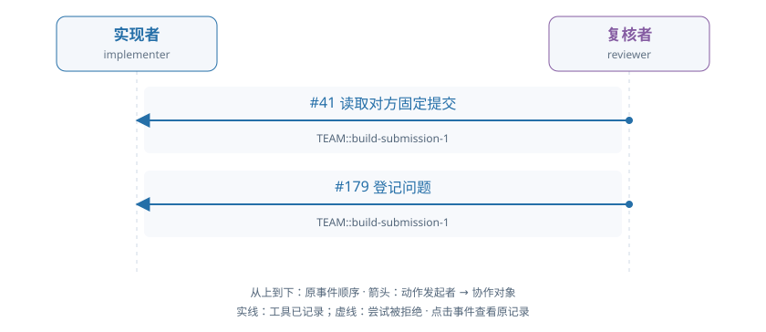

# train-01-3 · B · 错误初稿复核与修复

[交互HTML版](train-01-3.html) · [全部16条](../README.md) · [完整结构化数据](../data/train-01-3.json)

> 审阅者全局视角。模型输出保持原文；各成员完整实际输入在HTML的请求详情和JSON中逐调用保留，不能从全局快照补入模型当时视野。数值token/logprob数组仅保留源引用。

## 成员协作有向图



箭头为动作发起成员→协作对象，按原事件顺序向下排列。实线表示工具已记录，虚线表示尝试被拒；不代表对方已读或业务正确。个人操作及准备动作不连成成员关系。

[在交互页查看并定位事件](train-01-3.html#collaboration) · [单独打开图](../graphs/train-01-3.svg)

## 任务及原结果

A real fixed submission is already pending. The implementer may inspect it and repair a real defect independently or respond to an evidenced review. The reviewer independently reads data, applicable audit facts and exact submitted code/result; approve correct work or raise a located evidenced issue. For repair, withdraw the pending submission, execute changed code, submit a new fixed result, respond to actual issues and independently check their treatment before final approval. Correct initial work can be approved without manufacture of a defect or unnecessary repair. Prior preparation is not current actor work.

完整职责：否；原回报：0.0；重配有效性V：否；方法：unmapped。

| 维度 | 原判定 |
|---|---|
| record | 是 |
| permission | 是 |
| basis | 否 |
| delivery | 否 |

## 中文阅读提示（事后摘要）

当前有一份已固定、待复核的提交。实现者可以自行检查并修复真实缺陷，也可以响应有证据的复核反馈。复核者须独立读取数据、适用审计依据以及准确提交版本的代码和结果：正确则核准，有问题则提出定位明确、证据充分的问题。需要修复时，应先撤回待审提交，执行修改后的代码并提交新的固定结果，回应实际存在的问题，并独立检查其处理后再最终核准。正确初稿可直接核准，不必制造缺陷或无必要修复；准备阶段成果不计作当前工作人员工作。

出现有据有效 issue，修复与处理链未闭合。

reviewer seq41 inspect 固定提交，seq64/110/133/156 读取数据、审计、代码和结果，seq179 提出原评分承认的有效 issue。实现者虽 seq145/168 改了代码，但未见 withdraw/build/new submit/respond/decide 的闭合链；双方随后达上下文门。

审阅重点：这是有意义的有效问题发现；R=0 不等于没有有效局部工作。 有效问题发现仍不足以映射为完整反馈修复方法。


以下参数完整保留；工具返回仅作带标注的摘要，完整返回、原始XML、全部输入消息及对象文件在HTML/JSON中，不是再次评分。

## 联合时间线

### #2 实现者 · 决定 1

调用 `model-e67efee898134b1e86eed6c8`；observed_completion；输出token 188。

模型回复原文：

```text
I need to understand the current state of the work and what needs to be done. Let me start by reading the requirements to understand the fixed-material retail result contract.

The observation shows:
- There's a pending submission "TEAM::build-submission-1"
- The work is in_review status with submission_state "pending"
- There are adoptions for "basis" and "data" with version v1
- The deliverable contract requires a "retail_customer_metrics" result with tables containing metrics (CustomerID, revenue_pence, invoice_count)

Let me first read the requirements.online_scope as mentioned in the task, then inspect the pending submission to see what's already been submitted.
```

工具/控制提案：

```json
[
  {
    "id": "call_ee1eb2f4590c7c7dd6a3272ddaad7562",
    "type": "function",
    "function": {
      "name": "read_alias",
      "arguments": "{\"alias\": \"requirements.online_scope\", \"work_id\": \"TEAM::build\"}"
    }
  }
]
```

**#8 读取别名 · read_alias · 工具ok=false**

执行参数：

```json
{
  "alias": "requirements.online_scope",
  "work_id": "TEAM::build"
}
```

工具返回摘要（完整返回见HTML/JSON）：

```text
{
  "message": "Unknown alias in the bound workspace",
  "rejection": {
    "category": "unknown",
    "code": "unclassified_exception",
    "context": {
      "action": "project_action",
      "actor_id": "implementer",
      "arguments_type": "dict",
      "project_id": "TEAM",
      "tool": "read_alias"
    },
    "version": "tool-rejection-v0.9"
  },
  "type": "ValueError"
}
```

原输入/回复序号：4/5；[在HTML定位](train-01-3.html#seq-2)。

### #12 复核者 · 决定 1

调用 `model-ef8f3478bf9a9fb8db0b4867`；observed_completion；输出token 86。

模型回复原文：

```text
I need to independently inspect the fixed code/result submission. Let me start by reading the requirements to understand the task, then inspect the pending submission.

First, let me read the requirements to understand what I'm reviewing:
```

工具/控制提案：

```json
[
  {
    "id": "call_4ea3e9f1a86a35863ea749009b8246c8",
    "type": "function",
    "function": {
      "name": "read_alias",
      "arguments": "{\"alias\": \"requirements\", \"work_id\": \"TEAM::build\"}"
    }
  }
]
```

**#18 读取别名 · read_alias · 工具ok=false**

执行参数：

```json
{
  "alias": "requirements",
  "work_id": "TEAM::build"
}
```

工具返回摘要（完整返回见HTML/JSON）：

```text
{
  "message": "Unknown alias in the bound workspace",
  "rejection": {
    "category": "unknown",
    "code": "unclassified_exception",
    "context": {
      "action": "project_action",
      "actor_id": "reviewer",
      "arguments_type": "dict",
      "project_id": "TEAM",
      "tool": "read_alias"
    },
    "version": "tool-rejection-v0.9"
  },
  "type": "ValueError"
}
```

原输入/回复序号：14/15；[在HTML定位](train-01-3.html#seq-12)。

### #24 实现者 · 决定 2

调用 `model-95658db6d79c87341c837f19`；observed_completion；输出token 120。

模型回复原文：

```text
I need to understand the current state. The observation shows there's a pending submission "TEAM::build-submission-1" and I'm the implementer. Let me first inspect the pending submission to see what was submitted, then I can determine if it's correct or needs repair.
```

工具/控制提案：

```json
[
  {
    "id": "call_bcf5ce102d27e26500f987489fcfa9d3",
    "type": "function",
    "function": {
      "name": "inspect_submission",
      "arguments": "{\"work_id\": \"TEAM::build\", \"submission_id\": \"TEAM::build-submission-1\", \"include_contract\": true}"
    }
  }
]
```

**#30 检查固定提交 · inspect_submission · 工具ok=true**

执行参数：

```json
{
  "work_id": "TEAM::build",
  "submission_id": "TEAM::build-submission-1",
  "include_contract": true
}
```

工具返回摘要（完整返回见HTML/JSON）：

```text
{
  "submission_id": "TEAM::build-submission-1"
}
```

原输入/回复序号：26/27；[在HTML定位](train-01-3.html#seq-24)。

### #35 复核者 · 决定 2

调用 `model-cae5c8f538c0e1de87f63e3c`；observed_completion；输出token 103。

模型回复原文：

```text
I need to inspect the pending submission to understand what code and result was submitted, then read the exact data and audit_basis versions to verify correctness.

Let me start by inspecting the pending submission.
```

工具/控制提案：

```json
[
  {
    "id": "call_b1b98678cc85237b5b5d0efc55ce77cd",
    "type": "function",
    "function": {
      "name": "inspect_submission",
      "arguments": "{\"work_id\": \"TEAM::build\", \"submission_id\": \"TEAM::build-submission-1\", \"include_contract\": true}"
    }
  }
]
```

**#41 检查固定提交 · inspect_submission · 工具ok=true**

执行参数：

```json
{
  "work_id": "TEAM::build",
  "submission_id": "TEAM::build-submission-1",
  "include_contract": true
}
```

工具返回摘要（完整返回见HTML/JSON）：

```text
{
  "submission_id": "TEAM::build-submission-1"
}
```

原输入/回复序号：37/38；[在HTML定位](train-01-3.html#seq-35)。

### #47 实现者 · 决定 3

调用 `model-696afd28ba996a9bdbdf6671`；observed_completion；输出token 131。

模型回复原文：

```text
I have inspected the pending submission. Now I need to read the exact versions of the submitted artifacts (code and result) to verify if they are correct. Let me start by reading the code and result versions that were submitted (v2 for both based on the artifact_versions).
```

工具/控制提案：

```json
[
  {
    "id": "call_9dd675e0b99e919c953740f1234dfd04",
    "type": "function",
    "function": {
      "name": "read_version",
      "arguments": "{\"reference\": {\"object_id\": \"obj-744d5addeb8920d37cbb11db\", \"version_id\": \"v2\"}, \"work_id\": \"TEAM::build\"}"
    }
  }
]
```

**#53 读取确切版本 · read_version · 工具ok=true**

执行参数：

```json
{
  "reference": {
    "object_id": "obj-744d5addeb8920d37cbb11db",
    "version_id": "v2"
  },
  "work_id": "TEAM::build"
}
```

工具返回摘要（完整返回见HTML/JSON）：

```text
{
  "reference": {
    "object_id": "obj-744d5addeb8920d37cbb11db",
    "version_id": "v2"
  }
}
```

原输入/回复序号：49/50；[在HTML定位](train-01-3.html#seq-47)。

### #58 复核者 · 决定 3

调用 `model-c2904f4704ed8216658b15ed`；observed_completion；输出token 302。

模型回复原文：

```text
I need to independently inspect the fixed code/result using the actual data and audit_basis. Let me read the exact versions of the data and audit_basis, then read the code and result versions to verify correctness.

From the inspection, I can see:
- The submission has artifact versions: obj-744d5addeb8920d37cbb11db (code) at v2, obj-9198e3ea23f930466ff23e6a (result) at v2
- Data object: obj-ce6df59356455075dcb4aa81 at v1
- Basis object: obj-9f9810e0cce067d1c4e27122 at v1
- Audit_basis object: obj-f69c3f5f6d16d972a39d7b6b at v1

I need to read these exact versions to verify the result is correct.
```

工具/控制提案：

```json
[
  {
    "id": "call_b46c7d5bfd4fc59400289b4bc961fd51",
    "type": "function",
    "function": {
      "name": "read_version",
      "arguments": "{\"reference\": {\"object_id\": \"obj-ce6df59356455075dcb4aa81\", \"version_id\": \"v1\"}, \"work_id\": \"TEAM::build\"}"
    }
  }
]
```

**#64 读取确切版本 · read_version · 工具ok=true**

执行参数：

```json
{
  "reference": {
    "object_id": "obj-ce6df59356455075dcb4aa81",
    "version_id": "v1"
  },
  "work_id": "TEAM::build"
}
```

工具返回摘要（完整返回见HTML/JSON）：

```text
{
  "reference": {
    "object_id": "obj-ce6df59356455075dcb4aa81",
    "version_id": "v1"
  }
}
```

原输入/回复序号：60/61；[在HTML定位](train-01-3.html#seq-58)。

### #70 实现者 · 决定 4

调用 `model-cd894445ca88c2efe7757a15`；observed_completion；输出token 41。

模型回复原文：

```text
（原正文为空；工具提案见下）
```

工具/控制提案：

```json
[
  {
    "id": "call_f62440e84a789632ace3fcd3f1936e7c",
    "type": "function",
    "function": {
      "name": "read_alias",
      "arguments": "{\"alias\": \"basis\", \"work_id\": \"TEAM::build\"}"
    }
  }
]
```

**#76 读取别名 · read_alias · 工具ok=true**

执行参数：

```json
{
  "alias": "basis",
  "work_id": "TEAM::build"
}
```

工具返回摘要（完整返回见HTML/JSON）：

```text
{
  "reference": {
    "object_id": "obj-9f9810e0cce067d1c4e27122",
    "version_id": "v1"
  }
}
```

原输入/回复序号：72/73；[在HTML定位](train-01-3.html#seq-70)。

### #81 复核者 · 决定 4

调用 `model-efca3bf79288fd70206547c0`；observed_completion；输出token 78。

模型回复原文：

```text
（原正文为空；工具提案见下）
```

工具/控制提案：

```json
[
  {
    "id": "call_f906460d9d57912deeb5404b101b1023",
    "type": "function",
    "function": {
      "name": "read_version",
      "arguments": "{\"reference\": {\"object_id\": \"obj-9f9810e0cce067d1c4e27122\", \"version_id\": \"v1\"}, \"work_id\": \"TEAM::build\"}"
    }
  }
]
```

**#87 读取确切版本 · read_version · 工具ok=false**

执行参数：

```json
{
  "reference": {
    "object_id": "obj-9f9810e0cce067d1c4e27122",
    "version_id": "v1"
  },
  "work_id": "TEAM::build"
}
```

工具返回摘要（完整返回见HTML/JSON）：

```text
{
  "message": "Exact object version is not shared with this actor and project",
  "rejection": {
    "category": "unknown",
    "code": "unclassified_exception",
    "context": {
      "action": "project_action",
      "actor_id": "reviewer",
      "arguments_type": "dict",
      "project_id": "TEAM",
      "tool": "read_version"
    },
    "version": "tool-rejection-v0.9"
  },
  "type": "ValueError"
}
```

原输入/回复序号：83/84；[在HTML定位](train-01-3.html#seq-81)。

### #93 实现者 · 决定 5

调用 `model-0d38b2d20c44f5c41eef1bee`；observed_completion；输出token 41。

模型回复原文：

```text
（原正文为空；工具提案见下）
```

工具/控制提案：

```json
[
  {
    "id": "call_878f623aecb01964530ab00481a868ab",
    "type": "function",
    "function": {
      "name": "read_alias",
      "arguments": "{\"alias\": \"data\", \"work_id\": \"TEAM::build\"}"
    }
  }
]
```

**#99 读取别名 · read_alias · 工具ok=true**

执行参数：

```json
{
  "alias": "data",
  "work_id": "TEAM::build"
}
```

工具返回摘要（完整返回见HTML/JSON）：

```text
{
  "reference": {
    "object_id": "obj-ce6df59356455075dcb4aa81",
    "version_id": "v1"
  }
}
```

原输入/回复序号：95/96；[在HTML定位](train-01-3.html#seq-93)。

### #104 复核者 · 决定 5

调用 `model-563eeff1a3218f02eadacae5`；observed_completion；输出token 192。

模型回复原文：

```text
I see that reading the basis version (obj-9f9810e0cce067d1c4e27122 v1) failed with an error. However, I notice from the observation that there's an "audit_basis" object at "obj-f69c3f5f6d16d972a39d7b6b" which is the audit_basis I need to read. Let me read that instead, as the review_contract mentions "audit_alias":"audit_basis".
```

工具/控制提案：

```json
[
  {
    "id": "call_9628b96108f6a09004b7d0b0db7f3831",
    "type": "function",
    "function": {
      "name": "read_version",
      "arguments": "{\"reference\": {\"object_id\": \"obj-f69c3f5f6d16d972a39d7b6b\", \"version_id\": \"v1\"}, \"work_id\": \"TEAM::build\"}"
    }
  }
]
```

**#110 读取确切版本 · read_version · 工具ok=true**

执行参数：

```json
{
  "reference": {
    "object_id": "obj-f69c3f5f6d16d972a39d7b6b",
    "version_id": "v1"
  },
  "work_id": "TEAM::build"
}
```

工具返回摘要（完整返回见HTML/JSON）：

```text
{
  "reference": {
    "object_id": "obj-f69c3f5f6d16d972a39d7b6b",
    "version_id": "v1"
  }
}
```

原输入/回复序号：106/107；[在HTML定位](train-01-3.html#seq-104)。

### #116 实现者 · 决定 6

调用 `model-444ac85f96c30f54eb800106`；observed_completion；输出token 117。

模型回复原文：

```text
I need to analyze the submitted code and verify its correctness against the data and basis policy. Let me first read the submitted result to see what was produced, then execute the SQL to verify.
```

工具/控制提案：

```json
[
  {
    "id": "call_b76d592de1cbe849f998d820f69816fc",
    "type": "function",
    "function": {
      "name": "read_version",
      "arguments": "{\"reference\": {\"object_id\": \"obj-9198e3ea23f930466ff23e6a\", \"version_id\": \"v2\"}, \"work_id\": \"TEAM::build\"}"
    }
  }
]
```

**#122 读取确切版本 · read_version · 工具ok=true**

执行参数：

```json
{
  "reference": {
    "object_id": "obj-9198e3ea23f930466ff23e6a",
    "version_id": "v2"
  },
  "work_id": "TEAM::build"
}
```

工具返回摘要（完整返回见HTML/JSON）：

```text
{
  "reference": {
    "object_id": "obj-9198e3ea23f930466ff23e6a",
    "version_id": "v2"
  }
}
```

原输入/回复序号：118/119；[在HTML定位](train-01-3.html#seq-116)。

### #127 复核者 · 决定 6

调用 `model-238a144d4d2ad6187c51b7db`；observed_completion；输出token 75。

模型回复原文：

```text
（原正文为空；工具提案见下）
```

工具/控制提案：

```json
[
  {
    "id": "call_57d8e6a53e240b7f011913e56530d15e",
    "type": "function",
    "function": {
      "name": "read_version",
      "arguments": "{\"reference\": {\"object_id\": \"obj-744d5addeb8920d37cbb11db\", \"version_id\": \"v2\"}, \"work_id\": \"TEAM::build\"}"
    }
  }
]
```

**#133 读取确切版本 · read_version · 工具ok=true**

执行参数：

```json
{
  "reference": {
    "object_id": "obj-744d5addeb8920d37cbb11db",
    "version_id": "v2"
  },
  "work_id": "TEAM::build"
}
```

工具返回摘要（完整返回见HTML/JSON）：

```text
{
  "reference": {
    "object_id": "obj-744d5addeb8920d37cbb11db",
    "version_id": "v2"
  }
}
```

原输入/回复序号：129/130；[在HTML定位](train-01-3.html#seq-127)。

### #139 实现者 · 决定 7

调用 `model-21a4e918b45fbd2de3d18f73`；observed_completion；输出token 782。

模型回复原文：

````text
I have inspected the pending submission and read all relevant versions. Let me analyze the submitted code against the policy requirements:

**Policy Requirements (from basis):**
- Period: UCI-2011-fixed-slice (2010-12-01 to 2012-01-01)
- Edition: approved
- Invoice mode: sales_only (excludes C invoices AND nonpositive quantities)
- UnitPrice > 0 (strictly positive)
- Exclude missing CustomerID
- Keep all original rows (no duplicate deletion)
- Sum Quantity*UnitPrice in GBP, output rounded integer pence
- Count DISTINCT qualifying InvoiceNo
- Retain every customer in data.customers with zeros as needed

**Data:**
- 2 customers: 14367, 17644
- Retail rows include Cancellations (starting with C) and regular invoices

**Submitted SQL Analysis:**
The submitted query has:
```sql
WHERE ... AND (invoice_mode='net_signed' OR (InvoiceNo NOT ILIKE 'C%' AND Quantity>0))
```

This is **WRONG**. The policy says "sales_only" which should exclude C invoices AND nonpositive quantities. The SQL uses `invoice_mode='net_signed'` but the basis policy specifies `invoice_mode='sales_only'`.

Also, the COUNT logic is wrong: `COUNT(DISTINCT InvoiceNo)+1` adds 1 to the count, which is incorrect. It should just be `COUNT(DISTINCT InvoiceNo)`.

Let me verify by checking what the correct logic should be:
- For sales_only mode: InvoiceNo NOT ILIKE 'C%' AND Quantity>0
- For net_signed mode: all invoices (including cancellations) as long as UnitPrice>0 and CustomerID IS NOT NULL

The basis says `invoice_mode='sales_only'`, so we should use the sales_only filter.

The submitted SQL is using the wrong invoice_mode condition. Let me fix this and re-run the build.
````

工具/控制提案：

```json
[
  {
    "id": "call_bb49e1fda0b913510238dd11d4e6939c",
    "type": "function",
    "function": {
      "name": "write_object",
      "arguments": "{\"alias\": \"code\", \"dependencies\": [{\"object_id\": \"obj-9f9810e0cce067d1c4e27122\", \"version_id\": \"v1\"}, {\"object_id\": \"obj-ce6df59356455075dcb4aa81\", \"version_id\": \"v1\"}], \"data\": {\"config\": {\"exports\": [\"metrics\"]}, \"models\": [{\"name\": \"metrics\", \"sql\": \"WITH e AS (SELECT r.* FROM retail r, basis_meta b WHERE edition='approved' AND InvoiceDate>=start_inclusive::TIMESTAMP AND InvoiceDate<end_exclusive::TIMESTAMP AND CustomerID IS NOT NULL AND UnitPrice>0 AND invoice_mode='sales_only' AND (InvoiceNo NOT ILIKE 'C%' OR Quantity<=0)), a AS (SELECT CustomerID, SUM(Quantity*UnitPrice)*100 p, COUNT(DISTINCT InvoiceNo) n FROM e GROUP BY CustomerID) SELECT c.CustomerID, COALESCE(p, 0)::BIGINT revenue_pence, COALESCE(n, 0)::BIGINT invoice_count FROM customers c LEFT JOIN a ON c.CustomerID=a.CustomerID ORDER BY c.CustomerID\"}], \"tests\": [{\"name\": \"unique_customer\", \"sql\": \"SELECT CustomerID FROM metrics GROUP BY CustomerID HAVING COUNT(*) <> 1\"}]}, \"work_id\": \"TEAM::build\"}"
    }
  }
]
```

**#145 写入对象 · write_object · 工具ok=true**

执行参数：

```json
{
  "alias": "code",
  "dependencies": [
    {
      "object_id": "obj-9f9810e0cce067d1c4e27122",
      "version_id": "v1"
    },
    {
      "object_id": "obj-ce6df59356455075dcb4aa81",
      "version_id": "v1"
    }
  ],
  "data": {
    "config": {
      "exports": [
        "metrics"
      ]
    },
    "models": [
      {
        "name": "metrics",
        "sql": "WITH e AS (SELECT r.* FROM retail r, basis_meta b WHERE edition='approved' AND InvoiceDate>=start_inclusive::TIMESTAMP AND InvoiceDate<end_exclusive::TIMESTAMP AND CustomerID IS NOT NULL AND UnitPrice>0 AND invoice_mode='sales_only' AND (InvoiceNo NOT ILIKE 'C%' OR Quantity<=0)), a AS (SELECT CustomerID, SUM(Quantity*UnitPrice)*100 p, COUNT(DISTINCT InvoiceNo) n FROM e GROUP BY CustomerID) SELECT c.CustomerID, COALESCE(p, 0)::BIGINT revenue_pence, COALESCE(n, 0)::BIGINT invoice_count FROM customers c LEFT JOIN a ON c.CustomerID=a.CustomerID ORDER BY c.CustomerID"
      }
    ],
    "tests": [
      {
        "name": "unique_customer",
        "sql": "SELECT CustomerID FROM metrics GROUP BY CustomerID HAVING COUNT(*) <> 1"
      }
    ]
  },
  "work_id": "TEAM::build"
}
```

工具返回摘要（完整返回见HTML/JSON）：

```text
{
  "version_id": "v3"
}
```

原输入/回复序号：141/142；[在HTML定位](train-01-3.html#seq-139)。

### #150 复核者 · 决定 7

调用 `model-a8332f886d9f98600475cc17`；observed_completion；输出token 132。

模型回复原文：

```text
I need to read the result object (obj-9198e3ea23f930466ff23e6a) to inspect the submitted result. Let me read version v2 (the current version in the submission).
```

工具/控制提案：

```json
[
  {
    "id": "call_c1d1b1f43183c1c4f8a02db59db4ab01",
    "type": "function",
    "function": {
      "name": "read_version",
      "arguments": "{\"reference\": {\"object_id\": \"obj-9198e3ea23f930466ff23e6a\", \"version_id\": \"v2\"}, \"work_id\": \"TEAM::build\"}"
    }
  }
]
```

**#156 读取确切版本 · read_version · 工具ok=true**

执行参数：

```json
{
  "reference": {
    "object_id": "obj-9198e3ea23f930466ff23e6a",
    "version_id": "v2"
  },
  "work_id": "TEAM::build"
}
```

工具返回摘要（完整返回见HTML/JSON）：

```text
{
  "reference": {
    "object_id": "obj-9198e3ea23f930466ff23e6a",
    "version_id": "v2"
  }
}
```

原输入/回复序号：152/153；[在HTML定位](train-01-3.html#seq-150)。

### #162 实现者 · 决定 8

调用 `model-1b77e429f6695c1139723bab`；observed_completion；输出token 690。

模型回复原文：

````text
Looking at the data and policy, I need to carefully re-examine the requirements:

**Policy (basis):**
- `invoice_mode='sales_only'` - excludes C invoices AND nonpositive quantities
- Wait, let me re-read: "sales_only excludes C invoices and nonpositive quantities"

**Data:**
- Customer 14367 has rows with InvoiceNo starting with C (cancellations) and negative quantities
- Customer 17644 has rows with positive quantities (no C invoices in the data)

The submitted code uses:
```sql
invoice_mode='net_signed' OR (InvoiceNo NOT ILIKE 'C%' AND Quantity>0)
```

This is wrong. According to the policy, `sales_only` should mean:
- Exclude C invoices (cancellations)
- Exclude nonpositive quantities

So the correct logic should be:
- `invoice_mode='sales_only'` AND `InvoiceNo NOT ILIKE 'C%'` AND `Quantity>0`

But wait, I need to re-read the basis more carefully. The basis says:
- "sales_only excludes C invoices and nonpositive quantities"

This means for `sales_only` mode, we need to exclude both C invoices AND rows with Quantity<=0.

Let me also check: the data has InvoiceNo starting with 'C' which are cancellations. For sales_only, these should be excluded.

The issue with the submitted code is the OR condition. Let me fix it:

```sql
invoice_mode='sales_only' AND InvoiceNo NOT ILIKE 'C%' AND Quantity>0
```
````

工具/控制提案：

```json
[
  {
    "id": "call_84b1b629eac7ac546d2c2e3b92d202b5",
    "type": "function",
    "function": {
      "name": "write_object",
      "arguments": "{\"alias\": \"code\", \"dependencies\": [{\"object_id\": \"obj-9f9810e0cce067d1c4e27122\", \"version_id\": \"v1\"}, {\"object_id\": \"obj-ce6df59356455075dcb4aa81\", \"version_id\": \"v1\"}], \"data\": {\"config\": {\"exports\": [\"metrics\"]}, \"models\": [{\"name\": \"metrics\", \"sql\": \"WITH e AS (SELECT r.* FROM retail r, basis_meta b WHERE edition='approved' AND InvoiceDate>=start_inclusive::TIMESTAMP AND InvoiceDate<end_exclusive::TIMESTAMP AND CustomerID IS NOT NULL AND UnitPrice>0 AND invoice_mode='sales_only' AND InvoiceNo NOT ILIKE 'C%' AND Quantity>0), a AS (SELECT CustomerID, SUM(Quantity*UnitPrice)*100 p, COUNT(DISTINCT InvoiceNo) n FROM e GROUP BY CustomerID) SELECT c.CustomerID, COALESCE(p, 0)::BIGINT revenue_pence, COALESCE(n, 0)::BIGINT invoice_count FROM customers c LEFT JOIN a ON c.CustomerID=a.CustomerID ORDER BY c.CustomerID\"}], \"tests\": [{\"name\": \"unique_customer\", \"sql\": \"SELECT CustomerID FROM metrics GROUP BY CustomerID HAVING COUNT(*) <> 1\"}]}, \"work_id\": \"TEAM::build\"}"
    }
  }
]
```

**#168 写入对象 · write_object · 工具ok=true**

执行参数：

```json
{
  "alias": "code",
  "dependencies": [
    {
      "object_id": "obj-9f9810e0cce067d1c4e27122",
      "version_id": "v1"
    },
    {
      "object_id": "obj-ce6df59356455075dcb4aa81",
      "version_id": "v1"
    }
  ],
  "data": {
    "config": {
      "exports": [
        "metrics"
      ]
    },
    "models": [
      {
        "name": "metrics",
        "sql": "WITH e AS (SELECT r.* FROM retail r, basis_meta b WHERE edition='approved' AND InvoiceDate>=start_inclusive::TIMESTAMP AND InvoiceDate<end_exclusive::TIMESTAMP AND CustomerID IS NOT NULL AND UnitPrice>0 AND invoice_mode='sales_only' AND InvoiceNo NOT ILIKE 'C%' AND Quantity>0), a AS (SELECT CustomerID, SUM(Quantity*UnitPrice)*100 p, COUNT(DISTINCT InvoiceNo) n FROM e GROUP BY CustomerID) SELECT c.CustomerID, COALESCE(p, 0)::BIGINT revenue_pence, COALESCE(n, 0)::BIGINT invoice_count FROM customers c LEFT JOIN a ON c.CustomerID=a.CustomerID ORDER BY c.CustomerID"
      }
    ],
    "tests": [
      {
        "name": "unique_customer",
        "sql": "SELECT CustomerID FROM metrics GROUP BY CustomerID HAVING COUNT(*) <> 1"
      }
    ]
  },
  "work_id": "TEAM::build"
}
```

工具返回摘要（完整返回见HTML/JSON）：

```text
{
  "version_id": "v4"
}
```

原输入/回复序号：164/165；[在HTML定位](train-01-3.html#seq-162)。

### #173 复核者 · 决定 8

调用 `model-05086032d6ed25cd86240d87`；observed_completion；输出token 1830。

模型回复原文：

```text
I have now read all the necessary versions to perform an independent review:

1. **Data (obj-ce6df59356455075dcb4aa81, v1)**: Contains 2 customers (14367, 17644) and 14 retail transactions.

2. **Audit Basis (obj-f69c3f5f6d16d972a39d7b6b, v1)**: The policy states:
   - `invoice_mode: 'sales_only'` - excludes C invoices AND nonpositive quantities
   - Cancellation: InvoiceNo starting with 'C' (case insensitive)
   - Price rule: strictly positive (UnitPrice>0)
   - Date range: 2010-12-01 to 2012-01-01
   - For sales_only: exclude C invoices and nonpositive quantities

3. **Code (obj-744d5addeb8920d37cbb11db, v2)**: The SQL query uses:
   - `InvoiceNo NOT ILIKE 'C%' AND Quantity>0` for the sales_only mode
   - This correctly implements the sales_only policy

4. **Result (obj-9198e3ea23f930466ff23e6a, v2)**: 
   - Customer 14367: revenue_pence=12390, invoice_count=3
   - Customer 17644: revenue_pence=7215, invoice_count=3

Let me verify the calculations manually:

**Customer 14367 rows:**
- Row 1: InvoiceNo=552848, Qty=12, Price=2.95 → 12*2.95 = 35.40
- Row 2: InvoiceNo=552848, Qty=6, Price=2.95 → 6*2.95 = 17.70
- Row 3: InvoiceNo=552848, Qty=3, Price=2.95 → 3*2.95 = 8.85
- Row 4: InvoiceNo=C552849 (CANCELLATION, Qty=-12) - EXCLUDED
- Row 5: InvoiceNo=C552849 (CANCELLATION, Qty=-6) - EXCLUDED
- Row 6: InvoiceNo=C552849 (CANCELLATION, Qty=-3) - EXCLUDED
- Row 7: InvoiceNo=552850, Qty=12, Price=2.95 → 12*2.95 = 35.40
- Row 8: InvoiceNo=552850, Qty=6, Price=2.95 → 6*2.95 = 17.70
- Row 9: InvoiceNo=552850, Qty=3, Price=2.95 → 3*2.95 = 8.85

For sales_only: Only rows with positive quantity and non-C invoice:
- 552848 appears 3 times (rows 1,2,3) - count as 1 distinct InvoiceNo
- 552850 appears 3 times (rows 7,8,9) - count as 1 distinct InvoiceNo

Revenue: 35.40 + 17.70 + 8.85 + 35.40 + 17.70 + 8.85 = 123.90 GBP = 12390 pence ✓
Invoice count: 2 distinct invoices (552848, 552850)... but result shows 3.

Wait, let me re-check. The result says invoice_count=3 for customer 14367. Let me count again...

Actually looking at the result table, invoice_count=3 for customer 14367. But I only see 2 distinct invoices (552848 and 552850). Let me check if there's an issue with the code...

The code has `COUNT(DISTINCT InvoiceNo)+1` which adds 1 to the count. This seems like a bug! It should just be `COUNT(DISTINCT InvoiceNo)`.

Let me verify customer 17644:
- Row 10: InvoiceNo=556746, Qty=1, Price=1.65 → 1*1.65 = 1.65
- Row 11: InvoiceNo=556746, Qty=8, Price=1.95 → 8*1.95 = 15.60
- Row 12: InvoiceNo=556746, Qty=6, Price=2.55 → 6*2.55 = 15.30
- Row 13: InvoiceNo=559926, Qty=12, Price=1.65 → 12*1.65 = 19.80
- Row 14: InvoiceNo=559926, Qty=12, Price=1.65 → 12*1.65 = 19.80

All positive quantities, none start with C.

Revenue: 1.65 + 15.60 + 15.30 + 19.80 + 19.80 = 72.15 GBP = 7215 pence ✓
Distinct invoices: 556746, 559926 = 2 distinct invoices
But result shows invoice_count=3, which would be 2+1 = 3 due to the +1 bug.

**The code has a bug!** The `+1` in the invoice count is incorrect. It should just be `COUNT(DISTINCT InvoiceNo)`.

I need to raise a blocking issue about this defect.
```

工具/控制提案：

```json
[
  {
    "id": "call_e9a6c7fb3631ab4d8c53ce50d8050936",
    "type": "function",
    "function": {
      "name": "raise_issue",
      "arguments": "{\"work_id\": \"TEAM::build\", \"submission_id\": \"TEAM::build-submission-1\", \"issue_key\": \"BUG-INVOICE-COUNT\", \"object_id\": \"obj-9198e3ea23f930466ff23e6a\", \"version_id\": \"v2\", \"locator\": [\"tables\", \"metrics\", \"rows\", 0, 2], \"description\": \"The invoice_count field is incorrectly calculated. The SQL query uses COUNT(DISTINCT InvoiceNo)+1 which adds 1 to every count. For customer 14367, there are only 2 distinct invoices (552848, 552850) but the result shows 3. For customer 17644, there are only 2 distinct invoices (556746, 559926) but the result shows 3. The +1 is a bug and should be removed.\", \"evidence\": [{\"object_id\": \"obj-ce6df59356455075dcb4aa81\", \"version_id\": \"v1\"}, {\"object_id\": \"obj-f69c3f5f6d16d972a39d7b6b\", \"version_id\": \"v1\"}, {\"object_id\": \"obj-744d5addeb8920d37cbb11db\", \"version_id\": \"v2\"}, {\"object_id\": \"obj-9198e3ea23f930466ff23e6a\", \"version_id\": \"v2\"}], \"blocking\": true}"
    }
  }
]
```

**#179 提出问题 · raise_issue · 工具ok=true**

执行参数：

```json
{
  "work_id": "TEAM::build",
  "submission_id": "TEAM::build-submission-1",
  "issue_key": "BUG-INVOICE-COUNT",
  "object_id": "obj-9198e3ea23f930466ff23e6a",
  "version_id": "v2",
  "locator": [
    "tables",
    "metrics",
    "rows",
    0,
    2
  ],
  "description": "The invoice_count field is incorrectly calculated. The SQL query uses COUNT(DISTINCT InvoiceNo)+1 which adds 1 to every count. For customer 14367, there are only 2 distinct invoices (552848, 552850) but the result shows 3. For customer 17644, there are only 2 distinct invoices (556746, 559926) but the result shows 3. The +1 is a bug and should be removed.",
  "evidence": [
    {
      "object_id": "obj-ce6df59356455075dcb4aa81",
      "version_id": "v1"
    },
    {
      "object_id": "obj-f69c3f5f6d16d972a39d7b6b",
      "version_id": "v1"
    },
    {
      "object_id": "obj-744d5addeb8920d37cbb11db",
      "version_id": "v2"
    },
    {
      "object_id": "obj-9198e3ea23f930466ff23e6a",
      "version_id": "v2"
    }
  ],
  "blocking": true
}
```

工具返回摘要（完整返回见HTML/JSON）：

```text
{
  "submission_id": "TEAM::build-submission-1",
  "issue_id": "issue-3f0159f5e445e70c035694fa"
}
```

原输入/回复序号：175/176；[在HTML定位](train-01-3.html#seq-173)。

### #185 实现者 · 决定 9

调用 `model-b0fdb866042272a41775dac5`；not_started_direct_context_limit；输出token 0。

本次没有生成输出；原返回：

```json
{
  "http_status": 400,
  "raw_body": "{\n  \"error\": {\n    \"code\": \"context_length_exceeded\",\n    \"message\": \"Full real prompt plus requested output exceeds context limit; no crop\",\n    \"prompt_tokens\": 14828,\n    \"requested_output\": 2048,\n    \"context_limit\": 16384\n  },\n  \"transport_kind\": \"resident_direct\",\n  \"generation_started\": false,\n  \"actor_identity\": {\n    \"version\": \"shared-actor-identity-v0.13\",\n    \"policy_version\": \"online-actor-2:2896e50d1b66e915c19d7b13cbab82589976bf073b31152a6b5f29999e8394ed\",\n    \"adapter_sha256\": \"2896e50d1b66e915c19d7b13cbab82589976bf073b31152a6b5f29999e8394ed\",\n    \"base_manifest_sha256\": \"030031b27513e399360f26a8db31746e719bb15a3d2f4d68874c1dba3ccc60a6\",\n    \"inference_profile_sha256\": \"c640cad53145a1df8ee7cc81932be81d931d58c1182aa872530460a030a694a6\"\n  },\n  \"online_window_id\": \"v025-window-1\"\n}\n",
  "body": {
    "error": {
      "code": "context_length_exceeded",
      "message": "Full real prompt plus requested output exceeds context limit; no crop",
      "prompt_tokens": 14828,
      "requested_output": 2048,
      "context_limit": 16384
    },
    "transport_kind": "resident_direct",
    "generation_started": false,
    "actor_identity": {
      "version": "shared-actor-identity-v0.13",
      "policy_version": "online-actor-2:2896e50d1b66e915c19d7b13cbab82589976bf073b31152a6b5f29999e8394ed",
      "adapter_sha256": "2896e50d1b66e915c19d7b13cbab82589976bf073b31152a6b5f29999e8394ed",
      "base_manifest_sha256": "030031b27513e399360f26a8db31746e719bb15a3d2f4d68874c1dba3ccc60a6",
      "inference_profile_sha256": "c640cad53145a1df8ee7cc81932be81d931d58c1182aa872530460a030a694a6"
    },
    "online_window_id": "v025-window-1"
  },
  "response_headers": {
    "x-transport": "resident-direct"
  },
  "response_redactions": []
}
```

没有实际世界工具执行；控制输出、解析失败与未生成分别查看原记录。

原输入/回复序号：None/None；[在HTML定位](train-01-3.html#seq-185)。

### #188 停止或边界 · 实现者

```json
{
  "type": "PolicyBoundaryError",
  "message": "Backend reported its fixed context limit",
  "status": "model_budget_exhausted",
  "opportunity_id": "staff-opportunity-v024-5072f27d0940dc96eb4baaf3-17",
  "model_call_id": "model-b0fdb866042272a41775dac5",
  "backend_error": {
    "code": "context_length_exceeded",
    "http_status": 400
  }
}
```

### #192 复核者 · 决定 9

调用 `model-b0f02030e3dd5edd587a2511`；not_started_direct_context_limit；输出token 0。

本次没有生成输出；原返回：

```json
{
  "http_status": 400,
  "raw_body": "{\n  \"error\": {\n    \"code\": \"context_length_exceeded\",\n    \"message\": \"Full real prompt plus requested output exceeds context limit; no crop\",\n    \"prompt_tokens\": 14369,\n    \"requested_output\": 2048,\n    \"context_limit\": 16384\n  },\n  \"transport_kind\": \"resident_direct\",\n  \"generation_started\": false,\n  \"actor_identity\": {\n    \"version\": \"shared-actor-identity-v0.13\",\n    \"policy_version\": \"online-actor-2:2896e50d1b66e915c19d7b13cbab82589976bf073b31152a6b5f29999e8394ed\",\n    \"adapter_sha256\": \"2896e50d1b66e915c19d7b13cbab82589976bf073b31152a6b5f29999e8394ed\",\n    \"base_manifest_sha256\": \"030031b27513e399360f26a8db31746e719bb15a3d2f4d68874c1dba3ccc60a6\",\n    \"inference_profile_sha256\": \"c640cad53145a1df8ee7cc81932be81d931d58c1182aa872530460a030a694a6\"\n  },\n  \"online_window_id\": \"v025-window-1\"\n}\n",
  "body": {
    "error": {
      "code": "context_length_exceeded",
      "message": "Full real prompt plus requested output exceeds context limit; no crop",
      "prompt_tokens": 14369,
      "requested_output": 2048,
      "context_limit": 16384
    },
    "transport_kind": "resident_direct",
    "generation_started": false,
    "actor_identity": {
      "version": "shared-actor-identity-v0.13",
      "policy_version": "online-actor-2:2896e50d1b66e915c19d7b13cbab82589976bf073b31152a6b5f29999e8394ed",
      "adapter_sha256": "2896e50d1b66e915c19d7b13cbab82589976bf073b31152a6b5f29999e8394ed",
      "base_manifest_sha256": "030031b27513e399360f26a8db31746e719bb15a3d2f4d68874c1dba3ccc60a6",
      "inference_profile_sha256": "c640cad53145a1df8ee7cc81932be81d931d58c1182aa872530460a030a694a6"
    },
    "online_window_id": "v025-window-1"
  },
  "response_headers": {
    "x-transport": "resident-direct"
  },
  "response_redactions": []
}
```

没有实际世界工具执行；控制输出、解析失败与未生成分别查看原记录。

原输入/回复序号：None/None；[在HTML定位](train-01-3.html#seq-192)。

### #195 停止或边界 · 复核者

```json
{
  "type": "PolicyBoundaryError",
  "message": "Backend reported its fixed context limit",
  "status": "model_budget_exhausted",
  "opportunity_id": "staff-opportunity-v024-5072f27d0940dc96eb4baaf3-18",
  "model_call_id": "model-b0f02030e3dd5edd587a2511",
  "backend_error": {
    "code": "context_length_exceeded",
    "http_status": 400
  }
}
```


## 终止、方法及源记录

```json
{
  "status": "finite_task_deadline",
  "kind": "finite_horizon_task_terminal",
  "role_stops": {
    "implementer": "model_budget_exhausted",
    "reviewer": "model_budget_exhausted"
  },
  "opportunities": 18,
  "actions": 16,
  "continuation": false,
  "bootstrap": 0,
  "scope": "Fixed short-task deadline; this terminal does not claim the business goal completed. No later continuation can backfill its reward."
}
```

```json
{
  "version": "complete-work-evidence-v0.25",
  "rollout_id": "d6d760ef-84ae-41ef-a005-d56340232c0d",
  "spec_id": "retail-complete-actual-method-v0.25",
  "status": "unmapped",
  "class_id": null,
  "evidence": {
    "version": "complete-work-evidence-v0.25",
    "episode_id": "d6d760ef-84ae-41ef-a005-d56340232c0d",
    "manifest_sha256": "c53078f1cd0f3059ac6efcec7fb010f020828c290586c98165fc3d8b89c0186a",
    "known": true,
    "reason": null,
    "case_id": "retail-v25-4273bbfbaa657a8c",
    "facts": {
      "task": "joint_b",
      "initial_submission_id": "TEAM::build-submission-1",
      "initial_independent_quality": "content_failure",
      "initial_was_incorrect": true,
      "implementation_inspected_before_withdrawal": false,
      "withdrawal": null,
      "fixed_current_product": null,
      "judgments": [
        {
          "action": "raise_issue",
          "sequence": 179,
          "submission_id": "TEAM::build-submission-1",
          "valid": true,
          "read_evidence": {
            "submission_id": "TEAM::build-submission-1",
            "audit_reference": [
              "obj-f69c3f5f6d16d972a39d7b6b",
              "v1"
            ],
            "data_reference": [
              "obj-ce6df59356455075dcb4aa81",
              "v1"
            ],
            "inspect_sequence": 41,
            "audit_read_sequence": 110
          },
          "issue_id": "issue-3f0159f5e445e70c035694fa"
        }
      ],
      "issues": [
        {
          "action": "raise_issue",
          "sequence": 179,
          "submission_id": "TEAM::build-submission-1",
          "valid": true,
          "read_evidence": {
            "submission_id": "TEAM::build-submission-1",
            "audit_reference": [
              "obj-f69c3f5f6d16d972a39d7b6b",
              "v1"
            ],
            "data_reference": [
              "obj-ce6df59356455075dcb4aa81",
              "v1"
            ],
            "inspect_sequence": 41,
            "audit_read_sequence": 110
          },
          "issue_id": "issue-3f0159f5e445e70c035694fa"
        }
      ],
      "issue_treatments": [
        null
      ],
      "final_approvals": [],
      "actual_feedback_presented_before_withdrawal": false,
      "all_judgments_valid": true,
      "self_repair_path": false,
      "feedback_repair_path": false,
      "basis_valid": false,
      "delivery_valid": false,
      "existing_predicates": [
        "RetailEvidence.read_inputs/read_before/review_reads",
        "retail_collaboration_v021._quality/_actual_fixed_build/_judgments",
        "retail_collaboration_v021._implementation_inspected/_issue_treatment"
      ]
    }
  },
  "reason": "Full independently valid work and an unambiguous current method required"
}
```

```json
{
  "started_requests": 18,
  "actual_generations": 16,
  "non_generation_requests": 2,
  "world_actions": 16,
  "world_action_ok": 13,
  "world_action_rejected": 3,
  "format_feedback_events": 0,
  "model_control_events": 0,
  "boundary_errors": 2,
  "unlinked_boundary_errors": 0,
  "parse_errors": 0,
  "all_actual_requests_reconstructed_exactly": true,
  "all_world_actions_linked_exactly": true,
  "numeric_token_arrays_included": false
}
```

原始文件引用：

```json
{
  "rollout": {
    "path": "/data1/zhuxinrui/projects/ProWorkSim/runs/domain-v025/support/actual/collection/train-01-3/team-rollout.json",
    "sha256": "60247070ddfcc3b5ca1c255d1bc570b10713cb334eb4fe2e39ff234176fa4187",
    "bytes": 20417227
  },
  "projection": {
    "path": "/data1/zhuxinrui/projects/ProWorkSim/runs/domain-v025/support/actual/collection/train-01-3/projection.json",
    "sha256": "600ae84b39c3150ba1ade2287122fb6fd3636fa92c66a9a64208a08669937101",
    "bytes": 19316657
  },
  "manifest": {
    "path": "/data1/zhuxinrui/projects/ProWorkSim/runs/domain-v025/support/actual/collection/train-01-3/episode/manifest.json",
    "sha256": "c53078f1cd0f3059ac6efcec7fb010f020828c290586c98165fc3d8b89c0186a",
    "bytes": 149353
  },
  "preparation": {
    "path": "/data1/zhuxinrui/projects/ProWorkSim/runs/domain-v025/support/actual/collection/train-01-3/preparation.json",
    "sha256": "622b80ad4b112ea932783167478e4f95d55a969a4b70e712df5ce56ced946b05",
    "bytes": 89094
  }
}
```

