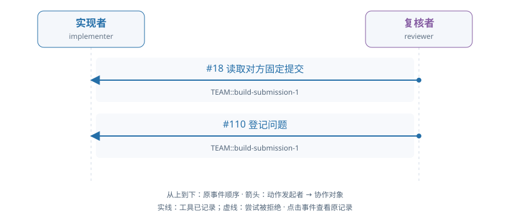

# train-01-5 · B · 错误初稿复核与修复

[交互HTML版](train-01-5.html) · [全部16条](../README.md) · [完整结构化数据](../data/train-01-5.json)

> 审阅者全局视角。模型输出保持原文；各成员完整实际输入在HTML的请求详情和JSON中逐调用保留，不能从全局快照补入模型当时视野。数值token/logprob数组仅保留源引用。

## 成员协作有向图



箭头为动作发起成员→协作对象，按原事件顺序向下排列。实线表示工具已记录，虚线表示尝试被拒；不代表对方已读或业务正确。个人操作及准备动作不连成成员关系。

[在交互页查看并定位事件](train-01-5.html#collaboration) · [单独打开图](../graphs/train-01-5.svg)

## 任务及原结果

A real fixed submission is already pending. The implementer may inspect it and repair a real defect independently or respond to an evidenced review. The reviewer independently reads data, applicable audit facts and exact submitted code/result; approve correct work or raise a located evidenced issue. For repair, withdraw the pending submission, execute changed code, submit a new fixed result, respond to actual issues and independently check their treatment before final approval. Correct initial work can be approved without manufacture of a defect or unnecessary repair. Prior preparation is not current actor work.

完整职责：否；原回报：0.0；重配有效性V：否；方法：unmapped。

| 维度 | 原判定 |
|---|---|
| record | 是 |
| permission | 是 |
| basis | 否 |
| delivery | 否 |

## 中文阅读提示（事后摘要）

当前有一份已固定、待复核的提交。实现者可以自行检查并修复真实缺陷，也可以响应有证据的复核反馈。复核者须独立读取数据、适用审计依据以及准确提交版本的代码和结果：正确则核准，有问题则提出定位明确、证据充分的问题。需要修复时，应先撤回待审提交，执行修改后的代码并提交新的固定结果，回应实际存在的问题，并独立检查其处理后再最终核准。正确初稿可直接核准，不必制造缺陷或无必要修复；准备阶段成果不计作当前工作人员工作。

issue 已记录但证据不足，尚无修复链。

reviewer seq110 的 issue 存储成功且创建时为当前，但保存的独立 judgment.valid=false、read_evidence=null。seq195 又向自身审计 route 发请求，被真实合同拒绝；后续等待未产生完整修复／核准。

审阅重点：不要把 active_at_creation=true 直接当作证据有效；也不要把实际工具拒绝改写为环境替模型执行失败。


以下参数完整保留；工具返回仅作带标注的摘要，完整返回、原始XML、全部输入消息及对象文件在HTML/JSON中，不是再次评分。

## 联合时间线

### #2 实现者 · 决定 1

调用 `model-50afcbe8c83303b7c06ad705`；observed_completion；输出token 55。

模型回复原文：

```text
I need to understand the current state and the pending submission. Let me start by reading the messages to see if there are any communications, and then inspect the pending submission to understand what's currently submitted.
```

工具/控制提案：

```json
[
  {
    "id": "call_97c7fc27270225c1256d4a03805444d7",
    "type": "function",
    "function": {
      "name": "read_messages",
      "arguments": "{}"
    }
  }
]
```

**#8 读取消息 · read_messages · 工具ok=true**

执行参数：

```json
{}
```

工具返回摘要（完整返回见HTML/JSON）：

```text
[{'at': 3, 'attachments': [], 'body': {'actor': 'provider', 'body': 'Actual inherited policy delivery; preparation is excluded from current actor credit.', 'delivered_for_current_work': True, 'handoff_id': 'handoff-3a4829408cac58a6fdbf8318', 'handoff_key': 'prepared-basis', 'origin': 'member_action', 'project_id': 'TEAM', 'purpose': 'basis', 'recipients': ['implementer'], 'reference': {'object_id': 'obj-9f9810e0cce067d1c4e27122', 'version_id': 'v1'}, 'request_id': None, 'requirement_version': 1, 'response_id': None, 'response_status': 'delivered', 'route_id': 'basis', 'sender': 'provider', 'work_item_id': 'TEAM::build'}, 'message_id': 'mail-1', 'project_id': 'TEAM', 'recipients': ['implementer'], 'sender': 'provider', 'subject': 'Team evidence handoff'}]
```

原输入/回复序号：4/5；[在HTML定位](train-01-5.html#seq-2)。

### #12 复核者 · 决定 1

调用 `model-72323926514765faeb1b9018`；observed_completion；输出token 110。

模型回复原文：

```text
I need to inspect the pending submission to review the fixed code and result. Let me start by inspecting submission "TEAM::build-submission-1" with include_contract=true to get the complete fixed contract and all original inspection metadata.
```

工具/控制提案：

```json
[
  {
    "id": "call_d2970ba50dcac985eb68b4acbd7a618b",
    "type": "function",
    "function": {
      "name": "inspect_submission",
      "arguments": "{\"work_id\": \"TEAM::build\", \"submission_id\": \"TEAM::build-submission-1\", \"include_contract\": true}"
    }
  }
]
```

**#18 检查固定提交 · inspect_submission · 工具ok=true**

执行参数：

```json
{
  "work_id": "TEAM::build",
  "submission_id": "TEAM::build-submission-1",
  "include_contract": true
}
```

工具返回摘要（完整返回见HTML/JSON）：

```text
{
  "submission_id": "TEAM::build-submission-1"
}
```

原输入/回复序号：14/15；[在HTML定位](train-01-5.html#seq-12)。

### #24 实现者 · 决定 2

调用 `model-86e7f7af16792521708ca4a9`；observed_completion；输出token 121。

模型回复原文：

```text
I need to understand the current state. The observation shows there's a pending submission "TEAM::build-submission-1" and I'm the implementer. Let me first inspect the pending submission to see what was submitted, and then I can determine if it's correct or needs repair.
```

工具/控制提案：

```json
[
  {
    "id": "call_47cbb4afccbb055cbfaebd898b550f0b",
    "type": "function",
    "function": {
      "name": "inspect_submission",
      "arguments": "{\"work_id\": \"TEAM::build\", \"submission_id\": \"TEAM::build-submission-1\", \"include_contract\": true}"
    }
  }
]
```

**#30 检查固定提交 · inspect_submission · 工具ok=true**

执行参数：

```json
{
  "work_id": "TEAM::build",
  "submission_id": "TEAM::build-submission-1",
  "include_contract": true
}
```

工具返回摘要（完整返回见HTML/JSON）：

```text
{
  "submission_id": "TEAM::build-submission-1"
}
```

原输入/回复序号：26/27；[在HTML定位](train-01-5.html#seq-24)。

### #35 复核者 · 决定 2

调用 `model-577c1f20af312a810b8cb440`；observed_completion；输出token 427。

模型回复原文：

```text
I need to independently inspect the fixed code/result using the actual data and my audit_basis. From the inspection result, I can see:

- The submission has artifact versions: obj-744d5addeb8920d37cbb11db (code) at v2, obj-9198e3ea23f930466ff23e6a (result) at v2
- The data object is obj-ce6df59356455075dcb4aa81 at v1
- The basis object is obj-9f9810e0cce067d1c4e27122 at v1
- The audit_basis object is obj-f69c3f5f6d16d972a39d7b6b at v1

I need to read the exact versions of:
1. The result (obj-9198e3ea23f930466ff23e6a, v2)
2. The code (obj-744d5addeb8920d37cbb11db, v2)
3. The data (obj-ce6df59356455075dcb4aa81, v1)
4. The audit_basis (obj-f69c3f5f6d16d972a39d7b6b, v1)

Let me start by reading these versions to verify the work is correct.
```

工具/控制提案：

```json
[
  {
    "id": "call_8e47f060548182f476507ecb4f620f6f",
    "type": "function",
    "function": {
      "name": "read_version",
      "arguments": "{\"reference\": {\"object_id\": \"obj-9198e3ea23f930466ff23e6a\", \"version_id\": \"v2\"}, \"work_id\": \"TEAM::build\"}"
    }
  }
]
```

**#41 读取确切版本 · read_version · 工具ok=true**

执行参数：

```json
{
  "reference": {
    "object_id": "obj-9198e3ea23f930466ff23e6a",
    "version_id": "v2"
  },
  "work_id": "TEAM::build"
}
```

工具返回摘要（完整返回见HTML/JSON）：

```text
{
  "reference": {
    "object_id": "obj-9198e3ea23f930466ff23e6a",
    "version_id": "v2"
  }
}
```

原输入/回复序号：37/38；[在HTML定位](train-01-5.html#seq-35)。

### #47 实现者 · 决定 3

调用 `model-9925fc7488e9baecc71f59a3`；observed_completion；输出token 106。

模型回复原文：

```text
I need to inspect the pending submission to understand what was submitted and whether it's correct. Let me check the code and result versions that were submitted.
```

工具/控制提案：

```json
[
  {
    "id": "call_158228ecb4b5cfe4ceeac5687dc2508f",
    "type": "function",
    "function": {
      "name": "read_version",
      "arguments": "{\"reference\": {\"object_id\": \"obj-744d5addeb8920d37cbb11db\", \"version_id\": \"v2\"}, \"work_id\": \"TEAM::build\"}"
    }
  }
]
```

**#53 读取确切版本 · read_version · 工具ok=true**

执行参数：

```json
{
  "reference": {
    "object_id": "obj-744d5addeb8920d37cbb11db",
    "version_id": "v2"
  },
  "work_id": "TEAM::build"
}
```

工具返回摘要（完整返回见HTML/JSON）：

```text
{
  "reference": {
    "object_id": "obj-744d5addeb8920d37cbb11db",
    "version_id": "v2"
  }
}
```

原输入/回复序号：49/50；[在HTML定位](train-01-5.html#seq-47)。

### #58 复核者 · 决定 3

调用 `model-943505e6f237c057cb56f9b6`；observed_completion；输出token 122。

模型回复原文：

```text
The submission result shows only 2 customers (rows) in the metrics table. I need to read the data source to understand how many customers should be in the result. Let me read the data object to see the customer list.
```

工具/控制提案：

```json
[
  {
    "id": "call_2e9c1277ccbda04fdfa753c1f8a21c8a",
    "type": "function",
    "function": {
      "name": "read_version",
      "arguments": "{\"reference\": {\"object_id\": \"obj-ce6df59356455075dcb4aa81\", \"version_id\": \"v1\"}, \"work_id\": \"TEAM::build\"}"
    }
  }
]
```

**#64 读取确切版本 · read_version · 工具ok=true**

执行参数：

```json
{
  "reference": {
    "object_id": "obj-ce6df59356455075dcb4aa81",
    "version_id": "v1"
  },
  "work_id": "TEAM::build"
}
```

工具返回摘要（完整返回见HTML/JSON）：

```text
{
  "reference": {
    "object_id": "obj-ce6df59356455075dcb4aa81",
    "version_id": "v1"
  }
}
```

原输入/回复序号：60/61；[在HTML定位](train-01-5.html#seq-58)。

### #70 实现者 · 决定 4

调用 `model-408579091d706166d5b3d119`；observed_completion；输出token 75。

模型回复原文：

```text
（原正文为空；工具提案见下）
```

工具/控制提案：

```json
[
  {
    "id": "call_1d15f928d6cccd2b8bca8e97a4c826a9",
    "type": "function",
    "function": {
      "name": "read_version",
      "arguments": "{\"reference\": {\"object_id\": \"obj-ce6df59356455075dcb4aa81\", \"version_id\": \"v1\"}, \"work_id\": \"TEAM::build\"}"
    }
  }
]
```

**#76 读取确切版本 · read_version · 工具ok=true**

执行参数：

```json
{
  "reference": {
    "object_id": "obj-ce6df59356455075dcb4aa81",
    "version_id": "v1"
  },
  "work_id": "TEAM::build"
}
```

工具返回摘要（完整返回见HTML/JSON）：

```text
{
  "reference": {
    "object_id": "obj-ce6df59356455075dcb4aa81",
    "version_id": "v1"
  }
}
```

原输入/回复序号：72/73；[在HTML定位](train-01-5.html#seq-70)。

### #81 复核者 · 决定 4

调用 `model-8f1f3d3445dcbd00a7bdfccc`；observed_completion；输出token 1000。

模型回复原文：

```text
The submitted result shows only 2 rows for customers "14367" and "17644". However, examining the data, I see there are exactly 2 customers in the customers table, so that matches. Now I need to verify the calculations are correct.

Let me analyze the retail data:

**Customer 17644:**
- Row 0: C541833, Quantity=-1 (cancellation, skip)
- Rows 10-13: 4 regular invoices (556746, 559926, 559926)
  - Invoice 556746: Qty=1, Price=1.65, and Qty=8, Price=1.95, and Qty=6, Price=2.55
  - Invoice 559926: Qty=12, Price=1.65, and Qty=12, Price=1.65

For customer 17644:
- Invoice 556746: (1*1.65 + 8*1.95 + 6*2.55) = 1.65 + 15.6 + 15.3 = 32.55 → 3255 pence
- Invoice 559926: (12*1.65 + 12*1.65) = 19.8 + 19.8 = 39.6 → 3960 pence
- Total: 3255 + 3960 = 7215 pence
- Invoice count: 2 distinct invoices + 1 (the +1 in the SQL) = 3

That matches the result: ["17644", 7215, 3]

**Customer 14367:**
- Row 0: C541833, Quantity=-1 (cancellation, skip)
- Rows 1-9: 9 regular invoices
  - Invoice 552848: Qty=12, 6, 3 with Price=2.95 each = (12+6+3)*2.95 = 21*2.95 = 61.95 → 6195 pence
  - Invoice C552849: Qty=-12, -6, -3 with Price=2.95 each = (-12-6-3)*2.95 = -21*2.95 = -61.95 → -6195 pence (cancellation)
  - Invoice 552850: Qty=12, 6, 3 with Price=2.95 each = 61.95 → 6195 pence

For customer 14367:
- Invoice 552848: (12+6+3)*2.95 = 61.95 → 6195 pence
- Invoice C552849: (-12-6-3)*2.95 = -61.95 → -6195 pence (cancellation, excluded)
- Invoice 552850: (12+6+3)*2.95 = 61.95 → 6195 pence
- Total: 6195 + 6195 = 12390 pence
- Invoice count: 2 qualifying invoices + 1 (the +1 in the SQL) = 3

That matches the result: ["14367", 12390, 3]

The SQL appears to be correct. The review contract requires me to approve correct work without inventing a defect. The result shows the correct calculations for both customers, and the unique_customer test passed.

I should approve this submission. However, I need to read the audit_basis first as required by the evidence clause. Let me read the audit_basis object.
```

工具/控制提案：

```json
[
  {
    "id": "call_54a45ab668b1695074071fbdc7ee782c",
    "type": "function",
    "function": {
      "name": "read_version",
      "arguments": "{\"reference\": {\"object_id\": \"obj-f69c3f5f6d16d972a39d7b6b\", \"version_id\": \"v1\"}, \"work_id\": \"TEAM::build\"}"
    }
  }
]
```

**#87 读取确切版本 · read_version · 工具ok=true**

执行参数：

```json
{
  "reference": {
    "object_id": "obj-f69c3f5f6d16d972a39d7b6b",
    "version_id": "v1"
  },
  "work_id": "TEAM::build"
}
```

工具返回摘要（完整返回见HTML/JSON）：

```text
{
  "reference": {
    "object_id": "obj-f69c3f5f6d16d972a39d7b6b",
    "version_id": "v1"
  }
}
```

原输入/回复序号：83/84；[在HTML定位](train-01-5.html#seq-81)。

### #93 实现者 · 决定 5

调用 `model-52655770d98489a55077d7f3`；observed_completion；输出token 128。

模型回复原文：

```text
I've inspected the pending submission and read the code and data versions. Now I need to read the basis version (audit_basis) as required by the review contract evidence rules. Let me read the basis object that was mentioned as the audit_basis.
```

工具/控制提案：

```json
[
  {
    "id": "call_0216a94075559a05d5818e3f07ae9b6c",
    "type": "function",
    "function": {
      "name": "read_version",
      "arguments": "{\"reference\": {\"object_id\": \"obj-9f9810e0cce067d1c4e27122\", \"version_id\": \"v1\"}, \"work_id\": \"TEAM::build\"}"
    }
  }
]
```

**#99 读取确切版本 · read_version · 工具ok=true**

执行参数：

```json
{
  "reference": {
    "object_id": "obj-9f9810e0cce067d1c4e27122",
    "version_id": "v1"
  },
  "work_id": "TEAM::build"
}
```

工具返回摘要（完整返回见HTML/JSON）：

```text
{
  "reference": {
    "object_id": "obj-9f9810e0cce067d1c4e27122",
    "version_id": "v1"
  }
}
```

原输入/回复序号：95/96；[在HTML定位](train-01-5.html#seq-93)。

### #104 复核者 · 决定 5

调用 `model-0bf10a7308336c46018731f3`；observed_completion；输出token 1518。

模型回复原文：

```text
I have reviewed the fixed submission and all relevant evidence. Let me verify the correctness:

**Data (obj-ce6df59356455075dcb4aa81 v1):**
- customers: ["14367", "17644"]
- retail rows include both customers

**Audit Basis (obj-f69c3f5f6d16d972a39d7b6b v1):**
- invoice_mode: "sales_only" - excludes C invoices and nonpositive quantities
- price_rule: "strictly_positive" - exclude nonpositive prices
- missing_customer: "exclude" - exclude rows with missing CustomerID
- edition: "approved"
- period: "UCI-2011-fixed-slice"

**Analysis of retail rows:**
1. C541833, Qty=-1 (cancellation with negative qty) - excluded (sales_only excludes C invoices)
2. 552848, Qty=12, UnitPrice=2.95, CustomerID=14367 - INCLUDED
3. 552848, Qty=6, UnitPrice=2.95, CustomerID=14367 - INCLUDED
4. 552848, Qty=3, UnitPrice=2.95, CustomerID=14367 - INCLUDED
5. C552849, Qty=-12 - excluded (C invoice)
6. C552849, Qty=-6 - excluded (C invoice)
7. C552849, Qty=-3 - excluded (C invoice)
8. 552850, Qty=12, UnitPrice=2.95, CustomerID=14367 - INCLUDED
9. 552850, Qty=6, UnitPrice=2.95, CustomerID=14367 - INCLUDED
10. 552850, Qty=3, UnitPrice=2.95, CustomerID=14367 - INCLUDED
11. 556746, Qty=1, UnitPrice=1.65, CustomerID=17644 - INCLUDED
12. 556746, Qty=8, UnitPrice=1.95, CustomerID=17644 - INCLUDED
13. 556746, Qty=6, UnitPrice=2.55, CustomerID=17644 - INCLUDED
14. 559926, Qty=12, UnitPrice=1.65, CustomerID=17644 - INCLUDED
15. 559926, Qty=12, UnitPrice=1.65, CustomerID=17644 - INCLUDED

**For CustomerID=14367:**
- Revenue: (12*2.95 + 6*2.95 + 3*2.95 + 12*2.95 + 6*2.95 + 3*2.95) * 100 = (42*2.95)*100 = 12390 ✓
- InvoiceCount: 552848, 552850 = 2 distinct invoices, but the submitted result shows 3

Wait, let me recount. The SQL query uses `COUNT(DISTINCT InvoiceNo)+1`. Let me check the submitted code again.

The submitted SQL has: `COUNT(DISTINCT InvoiceNo)+1` which adds 1 to the count. But according to the audit_basis, invoice_mode is "sales_only" which would exclude C invoices and nonpositive quantities.

Looking at the data:
- Customer 14367 has invoices: 552848 (3 rows), 552850 (3 rows) = 2 distinct invoices
- But the result shows invoice_count=3 for customer 14367

This appears to be incorrect. The query adds +1 which is wrong. Let me verify the expected behavior from the audit_basis more carefully.

Actually, re-reading the audit_basis: "sales_only excludes C invoices and nonpositive quantities; net_signed retains signed Quantity including cancellations. Both exclude nonpositive prices and missing CustomerID."

For sales_only mode:
- Exclude C invoices (cancellations)
- Exclude nonpositive quantities
- Exclude nonpositive prices
- Keep all qualifying rows

For Customer 14367 with sales_only:
- 552848: Qty=12, 6, 3 (all positive) - 3 rows
- 552850: Qty=12, 6, 3 (all positive) - 3 rows
- Total: 6 rows, 2 distinct invoices

Revenue: (12+6+3+12+6+3) * 2.95 = 42 * 2.95 * 100 = 12390 ✓
Invoice count should be 2, but submitted shows 3.

The submitted result has invoice_count=3 which is incorrect. This is a defect.

Let me raise an issue for this error.
```

工具/控制提案：

```json
[
  {
    "id": "call_8acfbaba8477156604d1ad3a1b2625a3",
    "type": "function",
    "function": {
      "name": "raise_issue",
      "arguments": "{\"work_id\": \"TEAM::build\", \"submission_id\": \"TEAM::build-submission-1\", \"issue_key\": \"REV-001\", \"object_id\": \"obj-9198e3ea23f930466ff23e6a\", \"version_id\": \"v2\", \"locator\": [\"tables\", \"metrics\", \"rows\", 0, 2], \"description\": \"invoice_count for CustomerID 14367 is incorrect. For sales_only mode, invoices 552848 and 552850 qualify (6 rows total, 2 distinct invoices). Revenue 12390 is correct, but invoice_count should be 2, not 3. The SQL query incorrectly adds +1 to COUNT(DISTINCT InvoiceNo).\", \"evidence\": [{\"object_id\": \"obj-ce6df59356455075dcb4aa81\", \"version_id\": \"v1\"}, {\"object_id\": \"obj-f69c3f5f6d16d972a39d7b6b\", \"version_id\": \"v1\"}], \"blocking\": true}"
    }
  }
]
```

**#110 提出问题 · raise_issue · 工具ok=true**

执行参数：

```json
{
  "work_id": "TEAM::build",
  "submission_id": "TEAM::build-submission-1",
  "issue_key": "REV-001",
  "object_id": "obj-9198e3ea23f930466ff23e6a",
  "version_id": "v2",
  "locator": [
    "tables",
    "metrics",
    "rows",
    0,
    2
  ],
  "description": "invoice_count for CustomerID 14367 is incorrect. For sales_only mode, invoices 552848 and 552850 qualify (6 rows total, 2 distinct invoices). Revenue 12390 is correct, but invoice_count should be 2, not 3. The SQL query incorrectly adds +1 to COUNT(DISTINCT InvoiceNo).",
  "evidence": [
    {
      "object_id": "obj-ce6df59356455075dcb4aa81",
      "version_id": "v1"
    },
    {
      "object_id": "obj-f69c3f5f6d16d972a39d7b6b",
      "version_id": "v1"
    }
  ],
  "blocking": true
}
```

工具返回摘要（完整返回见HTML/JSON）：

```text
{
  "submission_id": "TEAM::build-submission-1",
  "issue_id": "issue-10abf20f6285140d9289b985"
}
```

原输入/回复序号：106/107；[在HTML定位](train-01-5.html#seq-104)。

### #116 实现者 · 决定 6

调用 `model-24b4a8608241d8c671a5164f`；observed_completion；输出token 144。

模型回复原文：

```text
I need to read the evidence referenced in the issue to understand the defect. The issue references object `obj-f69c3f5f6d16d972a39d7b6b` version `v1`. Let me read that to see what the expected result should be.
```

工具/控制提案：

```json
[
  {
    "id": "call_0aa9e46273fa828a8bf5839ffd70d6a8",
    "type": "function",
    "function": {
      "name": "read_version",
      "arguments": "{\"reference\": {\"object_id\": \"obj-f69c3f5f6d16d972a39d7b6b\", \"version_id\": \"v1\"}, \"work_id\": \"TEAM::build\"}"
    }
  }
]
```

**#122 读取确切版本 · read_version · 工具ok=false**

执行参数：

```json
{
  "reference": {
    "object_id": "obj-f69c3f5f6d16d972a39d7b6b",
    "version_id": "v1"
  },
  "work_id": "TEAM::build"
}
```

工具返回摘要（完整返回见HTML/JSON）：

```text
{
  "message": "Exact object version is not shared with this actor and project",
  "rejection": {
    "category": "unknown",
    "code": "unclassified_exception",
    "context": {
      "action": "project_action",
      "actor_id": "implementer",
      "arguments_type": "dict",
      "project_id": "TEAM",
      "tool": "read_version"
    },
    "version": "tool-rejection-v0.9"
  },
  "type": "ValueError"
}
```

原输入/回复序号：118/119；[在HTML定位](train-01-5.html#seq-116)。

### #127 复核者 · 决定 6

调用 `model-3c9d7ae5cc95300cb1d3a2de`；observed_completion；输出token 94。

模型回复原文：

```text
The issue I raised is now open and blocking approval. I need to wait for the implementer to respond to this issue with a fix before I can approve the submission. Since I am the reviewer and not the implementer, I should wait for the implementer to submit a repair.

Let me check if there are any messages or if I need to wait for the implementer's response.
```

工具/控制提案：

```json
[
  {
    "id": "call_be2a64bd706df0a55ab771eb26753c80",
    "type": "function",
    "function": {
      "name": "read_messages",
      "arguments": "{}"
    }
  }
]
```

**#133 读取消息 · read_messages · 工具ok=true**

执行参数：

```json
{}
```

工具返回摘要（完整返回见HTML/JSON）：

```text
[]
```

原输入/回复序号：129/130；[在HTML定位](train-01-5.html#seq-127)。

### #139 实现者 · 决定 7

调用 `model-19efc8e6013c21632703ded5`；observed_completion；输出token 244。

模型回复原文：

```text
Looking at the observation, I can see there's an active issue (issue-10abf20f6285140d9289b985) that blocks approval. The issue states that invoice_count for CustomerID 14367 is incorrect - it should be 2, not 3. The SQL query incorrectly adds +1 to COUNT(DISTINCT InvoiceNo).

Let me read the result version v2 to see the current output, then I need to:
1. Read the query to understand the current code
2. Fix the SQL to remove the incorrect +1
3. Rebuild and resubmit
4. Respond to the issue with the fix

Let me first read the result v2 to see what values are there:
```

工具/控制提案：

```json
[
  {
    "id": "call_aeaea8eb74658c4bd2cafd503826dfca",
    "type": "function",
    "function": {
      "name": "read_version",
      "arguments": "{\"reference\": {\"object_id\": \"obj-9198e3ea23f930466ff23e6a\", \"version_id\": \"v2\"}, \"work_id\": \"TEAM::build\"}"
    }
  }
]
```

**#145 读取确切版本 · read_version · 工具ok=true**

执行参数：

```json
{
  "reference": {
    "object_id": "obj-9198e3ea23f930466ff23e6a",
    "version_id": "v2"
  },
  "work_id": "TEAM::build"
}
```

工具返回摘要（完整返回见HTML/JSON）：

```text
{
  "reference": {
    "object_id": "obj-9198e3ea23f930466ff23e6a",
    "version_id": "v2"
  }
}
```

原输入/回复序号：141/142；[在HTML定位](train-01-5.html#seq-139)。

### #150 复核者 · 决定 7

调用 `model-ed574259ef76a819750e6ce9`；observed_completion；输出token 85。

模型回复原文：

```text
I need to wait for the implementer to respond to the issue I raised. The issue is open and blocking approval. I should use staff_wait to pause until the implementer addresses the issue.
```

工具/控制提案：

```json
[
  {
    "id": "call_83330c254602af02cb395cc75fd082b4",
    "type": "function",
    "function": {
      "name": "staff_wait",
      "arguments": "{\"reason\": \"Waiting for implementer to respond to blocking issue REV-001 regarding incorrect invoice_count calculation\"}"
    }
  }
]
```

没有实际世界工具执行；控制输出、解析失败与未生成分别查看原记录。

原输入/回复序号：152/153；[在HTML定位](train-01-5.html#seq-150)。

### #154 成员等待或结束 · 复核者

```json
{
  "call_id": "model-ed574259ef76a819750e6ce9",
  "decision_id": "model-ed574259ef76a819750e6ce9",
  "worker_id": "reviewer",
  "opportunity_id": "staff-opportunity-v024-21a4b1f9233ce83bb6ca2ad1-14",
  "decision_index": 7,
  "requested_model": "shared-local-actor",
  "backend_id": "resident_direct",
  "action_protocol": "native_tools",
  "model_revision": "online-actor-2:2896e50d1b66e915c19d7b13cbab82589976bf073b31152a6b5f29999e8394ed",
  "weight_identity": {
    "version": "shared-actor-identity-v0.13",
    "policy_version": "online-actor-2:2896e50d1b66e915c19d7b13cbab82589976bf073b31152a6b5f29999e8394ed",
    "adapter_sha256": "2896e50d1b66e915c19d7b13cbab82589976bf073b31152a6b5f29999e8394ed",
    "base_manifest_sha256": "030031b27513e399360f26a8db31746e719bb15a3d2f4d68874c1dba3ccc60a6",
    "inference_profile_sha256": "c640cad53145a1df8ee7cc81932be81d931d58c1182aa872530460a030a694a6"
  },
  "kind": "wait",
  "reason": "Waiting for implementer to respond to blocking issue REV-001 regarding incorrect invoice_count calculation",
  "world_action_executed": false
}
```

### #161 实现者 · 决定 8

调用 `model-eb624549e2627e75813874cd`；not_started_direct_context_limit；输出token 0。

本次没有生成输出；原返回：

```json
{
  "http_status": 400,
  "raw_body": "{\n  \"error\": {\n    \"code\": \"context_length_exceeded\",\n    \"message\": \"Full real prompt plus requested output exceeds context limit; no crop\",\n    \"prompt_tokens\": 14368,\n    \"requested_output\": 2048,\n    \"context_limit\": 16384\n  },\n  \"transport_kind\": \"resident_direct\",\n  \"generation_started\": false,\n  \"actor_identity\": {\n    \"version\": \"shared-actor-identity-v0.13\",\n    \"policy_version\": \"online-actor-2:2896e50d1b66e915c19d7b13cbab82589976bf073b31152a6b5f29999e8394ed\",\n    \"adapter_sha256\": \"2896e50d1b66e915c19d7b13cbab82589976bf073b31152a6b5f29999e8394ed\",\n    \"base_manifest_sha256\": \"030031b27513e399360f26a8db31746e719bb15a3d2f4d68874c1dba3ccc60a6\",\n    \"inference_profile_sha256\": \"c640cad53145a1df8ee7cc81932be81d931d58c1182aa872530460a030a694a6\"\n  },\n  \"online_window_id\": \"v025-window-1\"\n}\n",
  "body": {
    "error": {
      "code": "context_length_exceeded",
      "message": "Full real prompt plus requested output exceeds context limit; no crop",
      "prompt_tokens": 14368,
      "requested_output": 2048,
      "context_limit": 16384
    },
    "transport_kind": "resident_direct",
    "generation_started": false,
    "actor_identity": {
      "version": "shared-actor-identity-v0.13",
      "policy_version": "online-actor-2:2896e50d1b66e915c19d7b13cbab82589976bf073b31152a6b5f29999e8394ed",
      "adapter_sha256": "2896e50d1b66e915c19d7b13cbab82589976bf073b31152a6b5f29999e8394ed",
      "base_manifest_sha256": "030031b27513e399360f26a8db31746e719bb15a3d2f4d68874c1dba3ccc60a6",
      "inference_profile_sha256": "c640cad53145a1df8ee7cc81932be81d931d58c1182aa872530460a030a694a6"
    },
    "online_window_id": "v025-window-1"
  },
  "response_headers": {
    "x-transport": "resident-direct"
  },
  "response_redactions": []
}
```

没有实际世界工具执行；控制输出、解析失败与未生成分别查看原记录。

原输入/回复序号：None/None；[在HTML定位](train-01-5.html#seq-161)。

### #164 停止或边界 · 实现者

```json
{
  "type": "PolicyBoundaryError",
  "message": "Backend reported its fixed context limit",
  "status": "model_budget_exhausted",
  "opportunity_id": "staff-opportunity-v024-21a4b1f9233ce83bb6ca2ad1-15",
  "model_call_id": "model-eb624549e2627e75813874cd",
  "backend_error": {
    "code": "context_length_exceeded",
    "http_status": 400
  }
}
```

### #167 复核者 · 决定 8

调用 `model-71ae5118ac1c30f846427944`；observed_completion；输出token 136。

模型回复原文：

```text
I have reviewed all the evidence and confirmed that the blocking issue REV-001 is valid. The submitted result has an incorrect invoice_count for CustomerID 14367 (should be 2, not 3). The implementer needs to repair this defect before I can approve the submission.

I should wait for the implementer to respond to the issue and submit a fixed version.
```

工具/控制提案：

```json
[
  {
    "id": "call_1d6ddf1bee1d4cc55c494c33932a7e83",
    "type": "function",
    "function": {
      "name": "staff_wait",
      "arguments": "{\"reason\": \"Waiting for implementer to repair the blocking issue REV-001 regarding incorrect invoice_count calculation for CustomerID 14367\"}"
    }
  }
]
```

没有实际世界工具执行；控制输出、解析失败与未生成分别查看原记录。

原输入/回复序号：169/170；[在HTML定位](train-01-5.html#seq-167)。

### #171 成员等待或结束 · 复核者

```json
{
  "call_id": "model-71ae5118ac1c30f846427944",
  "decision_id": "model-71ae5118ac1c30f846427944",
  "worker_id": "reviewer",
  "opportunity_id": "staff-opportunity-v024-21a4b1f9233ce83bb6ca2ad1-16",
  "decision_index": 8,
  "requested_model": "shared-local-actor",
  "backend_id": "resident_direct",
  "action_protocol": "native_tools",
  "model_revision": "online-actor-2:2896e50d1b66e915c19d7b13cbab82589976bf073b31152a6b5f29999e8394ed",
  "weight_identity": {
    "version": "shared-actor-identity-v0.13",
    "policy_version": "online-actor-2:2896e50d1b66e915c19d7b13cbab82589976bf073b31152a6b5f29999e8394ed",
    "adapter_sha256": "2896e50d1b66e915c19d7b13cbab82589976bf073b31152a6b5f29999e8394ed",
    "base_manifest_sha256": "030031b27513e399360f26a8db31746e719bb15a3d2f4d68874c1dba3ccc60a6",
    "inference_profile_sha256": "c640cad53145a1df8ee7cc81932be81d931d58c1182aa872530460a030a694a6"
  },
  "kind": "wait",
  "reason": "Waiting for implementer to repair the blocking issue REV-001 regarding incorrect invoice_count calculation for CustomerID 14367",
  "world_action_executed": false
}
```

### #178 复核者 · 决定 9

调用 `model-3ad32fe2ec49ad2362ff3cd3`；observed_completion；输出token 147。

模型回复原文：

```text
I see that I've already raised issue REV-001 (issue-10abf20f6285140d9289b985) regarding the incorrect invoice_count. The issue is blocking approval. Now I need to wait for the implementer to respond to this issue with a fix, and then I can decide on the issue and approve the submission.

Let me wait for the implementer to respond to the issue.
```

工具/控制提案：

```json
[
  {
    "id": "call_444ec944ce847e8ca800ed37b598cc26",
    "type": "function",
    "function": {
      "name": "staff_wait",
      "arguments": "{\"reason\": \"Waiting for implementer to respond to blocking issue REV-001 with a fix for the incorrect invoice_count calculation\"}"
    }
  }
]
```

没有实际世界工具执行；控制输出、解析失败与未生成分别查看原记录。

原输入/回复序号：180/181；[在HTML定位](train-01-5.html#seq-178)。

### #182 成员等待或结束 · 复核者

```json
{
  "call_id": "model-3ad32fe2ec49ad2362ff3cd3",
  "decision_id": "model-3ad32fe2ec49ad2362ff3cd3",
  "worker_id": "reviewer",
  "opportunity_id": "staff-opportunity-v024-21a4b1f9233ce83bb6ca2ad1-17",
  "decision_index": 9,
  "requested_model": "shared-local-actor",
  "backend_id": "resident_direct",
  "action_protocol": "native_tools",
  "model_revision": "online-actor-2:2896e50d1b66e915c19d7b13cbab82589976bf073b31152a6b5f29999e8394ed",
  "weight_identity": {
    "version": "shared-actor-identity-v0.13",
    "policy_version": "online-actor-2:2896e50d1b66e915c19d7b13cbab82589976bf073b31152a6b5f29999e8394ed",
    "adapter_sha256": "2896e50d1b66e915c19d7b13cbab82589976bf073b31152a6b5f29999e8394ed",
    "base_manifest_sha256": "030031b27513e399360f26a8db31746e719bb15a3d2f4d68874c1dba3ccc60a6",
    "inference_profile_sha256": "c640cad53145a1df8ee7cc81932be81d931d58c1182aa872530460a030a694a6"
  },
  "kind": "wait",
  "reason": "Waiting for implementer to respond to blocking issue REV-001 with a fix for the incorrect invoice_count calculation",
  "world_action_executed": false
}
```

### #189 复核者 · 决定 10

调用 `model-ac3e7f782bbecab3516efb9b`；observed_completion；输出token 206。

模型回复原文：

```text
I now have all the information needed to respond to the blocking issue REV-001. The issue was raised by the reviewer, and I need to decide on it. Let me check if there are any issue responses available for this issue.

Looking at the observation data, I can see:
- Issue ID: "issue-10abf20f6285140d9289b985"
- Issue Key: "REV-001"
- Status: "open"
- Blocking: true
- The issue claims that invoice_count for CustomerID 14367 should be 2, not 3

Let me first check if there are any issue responses that I need to review before making a decision.
```

工具/控制提案：

```json
[
  {
    "id": "call_03712793dbd77dfde51e0a7c516c2d45",
    "type": "function",
    "function": {
      "name": "request_information",
      "arguments": "{\"route_id\": \"audit_basis\", \"work_id\": \"TEAM::build\"}"
    }
  }
]
```

**#195 请求信息 · request_information · 工具ok=false**

执行参数：

```json
{
  "route_id": "audit_basis",
  "work_id": "TEAM::build"
}
```

工具返回摘要（完整返回见HTML/JSON）：

```text
{
  "message": "Manual requests must come from a declared recipient to another member",
  "rejection": {
    "category": "unknown",
    "code": "unclassified_exception",
    "context": {
      "action": "project_action",
      "actor_id": "reviewer",
      "arguments_type": "dict",
      "project_id": "TEAM",
      "tool": "request_information"
    },
    "version": "tool-rejection-v0.9"
  },
  "type": "ValueError"
}
```

原输入/回复序号：191/192；[在HTML定位](train-01-5.html#seq-189)。

### #202 复核者 · 决定 11

调用 `model-def1360ac5af6eb357163013`；observed_completion；输出token 41。

模型回复原文：

```text
I need to read the issue response to see what the implementer has submitted as a fix. Let me read the issue response.
```

工具/控制提案：

```json
[
  {
    "id": "call_6f2a0f2af5240e7625262b365441969b",
    "type": "function",
    "function": {
      "name": "read_messages",
      "arguments": "{}"
    }
  }
]
```

**#208 读取消息 · read_messages · 工具ok=true**

执行参数：

```json
{}
```

工具返回摘要（完整返回见HTML/JSON）：

```text
[]
```

原输入/回复序号：204/205；[在HTML定位](train-01-5.html#seq-202)。

### #215 复核者 · 决定 12

调用 `model-061f7e7d52e9864ff9668585`；observed_completion；输出token 479。

模型回复原文：

```text
I have all the information needed. The issue REV-001 is blocking approval. I need to decide on the issue response. Looking at the evidence and my analysis:

- The submitted result has invoice_count=3 for CustomerID 14367 (row 0)
- According to the audit_basis (obj-f69c3f5f6d16d972a39d7b6b, v1), invoice_mode is "sales_only" which excludes invoices starting with 'C' (cancellations) and nonpositive quantities
- For CustomerID 14367, the qualifying invoices are 552848 and 552850 (both have positive quantities, not starting with C, and have UnitPrice>0)
- That's 2 distinct invoices, so invoice_count should be 2, not 3
- The SQL query incorrectly has `COUNT(DISTINCT InvoiceNo)+1` which adds 1 incorrectly

The issue is valid and blocking. I need to check if there's a response to this issue. Let me inspect the issue to see if there's a response_id I need to use for the decision.

Since I raised the issue and it's the only issue, there should be a response. Let me check the issue details more carefully - the issue_views shows issue_id "issue-10abf20f6285140d9289b985" with no decision_id yet. 

Actually, looking at the task, I am the reviewer who raised the issue. The issue is blocking approval. I need to wait for the implementer to respond with a fix, or I need to check if there's already a response.

Let me check if there are any issue responses by looking at the messages or if I need to wait for the implementer.

Since I raised the issue and there's no response yet (decision_id is null), I should wait for the implementer to respond to the issue with a fix.
```

工具/控制提案：

```json
[
  {
    "id": "call_effa0dca61e37534b6e57f473ca25fcb",
    "type": "function",
    "function": {
      "name": "staff_wait",
      "arguments": "{\"reason\": \"Waiting for implementer to respond to blocking issue REV-001 with a fix for the incorrect invoice_count calculation\"}"
    }
  }
]
```

没有实际世界工具执行；控制输出、解析失败与未生成分别查看原记录。

原输入/回复序号：217/218；[在HTML定位](train-01-5.html#seq-215)。

### #219 成员等待或结束 · 复核者

```json
{
  "call_id": "model-061f7e7d52e9864ff9668585",
  "decision_id": "model-061f7e7d52e9864ff9668585",
  "worker_id": "reviewer",
  "opportunity_id": "staff-opportunity-v024-21a4b1f9233ce83bb6ca2ad1-20",
  "decision_index": 12,
  "requested_model": "shared-local-actor",
  "backend_id": "resident_direct",
  "action_protocol": "native_tools",
  "model_revision": "online-actor-2:2896e50d1b66e915c19d7b13cbab82589976bf073b31152a6b5f29999e8394ed",
  "weight_identity": {
    "version": "shared-actor-identity-v0.13",
    "policy_version": "online-actor-2:2896e50d1b66e915c19d7b13cbab82589976bf073b31152a6b5f29999e8394ed",
    "adapter_sha256": "2896e50d1b66e915c19d7b13cbab82589976bf073b31152a6b5f29999e8394ed",
    "base_manifest_sha256": "030031b27513e399360f26a8db31746e719bb15a3d2f4d68874c1dba3ccc60a6",
    "inference_profile_sha256": "c640cad53145a1df8ee7cc81932be81d931d58c1182aa872530460a030a694a6"
  },
  "kind": "wait",
  "reason": "Waiting for implementer to respond to blocking issue REV-001 with a fix for the incorrect invoice_count calculation",
  "world_action_executed": false
}
```

### #226 复核者 · 决定 13

调用 `model-75a8ea6f1affe76f201814a9`；observed_completion；输出token 351。

模型回复原文：

```text
I can see from the messages that there's a blocking issue (issue-10abf20f6285140d9289b985, key REV-001) that needs to be resolved before approval. The issue states that invoice_count for CustomerID 14367 is incorrect - it should be 2, not 3.

Looking at the data:
- Customer 14367 has invoices: 552848, C552849, 552850
- For sales_only mode: C invoices are cancellations, and we need Quantity > 0
- Invoice 552848: 6 rows with Quantity=12 (positive) - qualifies
- Invoice C552849: all rows have Quantity=-12, -6, -3 (negative) - does NOT qualify
- Invoice 552850: 6 rows with Quantity=12 (positive) - qualifies

So there are 2 qualifying invoices (552848 and 552850), but the submitted result shows invoice_count=3, which is wrong.

The SQL query has `COUNT(DISTINCT InvoiceNo)+1` which incorrectly adds 1. It should just be `COUNT(DISTINCT InvoiceNo)`.

I need to wait for the implementer to fix this issue. Let me check if there are any messages or if the implementer has responded.
```

工具/控制提案：

```json
[
  {
    "id": "call_09faeeb119bec96354872832742e154b",
    "type": "function",
    "function": {
      "name": "wait",
      "arguments": "{\"ticks\": 5}"
    }
  }
]
```

**#232 wait · wait · 工具ok=true**

执行参数：

```json
{
  "ticks": 5
}
```

工具返回摘要（完整返回见HTML/JSON）：

```text
返回字段：advanced_ticks
```

原输入/回复序号：228/229；[在HTML定位](train-01-5.html#seq-226)。

### #239 复核者 · 决定 14

调用 `model-2e66711aea8a9f4a6c7fd220`；observed_completion；输出token 96。

模型回复原文：

```text
The issue REV-001 has been raised and is blocking approval. I need to wait for the implementer to respond with a fix. Since I've already raised the issue and the world time has advanced, I should check if there are any new responses or if the implementer has submitted a fix.

Let me read messages again to see if there are any new responses from the implementer.
```

工具/控制提案：

```json
[
  {
    "id": "call_be89af2570c737d527e0a4d239fe8727",
    "type": "function",
    "function": {
      "name": "read_messages",
      "arguments": "{}"
    }
  }
]
```

**#245 读取消息 · read_messages · 工具ok=true**

执行参数：

```json
{}
```

工具返回摘要（完整返回见HTML/JSON）：

```text
[]
```

原输入/回复序号：241/242；[在HTML定位](train-01-5.html#seq-239)。

### #252 复核者 · 决定 15

调用 `model-c4901dc3158ed38d1b304236`；observed_completion；输出token 130。

模型回复原文：

```text
I have the blocking issue REV-001 open. The implementer needs to fix the invoice_count calculation. The issue states that for CustomerID 14367 (row 0), the invoice_count should be 2 (invoices 552848 and 552850), not 3. The SQL incorrectly adds +1 to COUNT(DISTINCT InvoiceNo).

I need to wait for the implementer to submit a fix. Let me check if there are any new messages or if the implementer has responded.
```

工具/控制提案：

```json
[
  {
    "id": "call_1d2a15eb82760d2d187b13ce6a73cee8",
    "type": "function",
    "function": {
      "name": "read_messages",
      "arguments": "{}"
    }
  }
]
```

**#258 读取消息 · read_messages · 工具ok=true**

执行参数：

```json
{}
```

工具返回摘要（完整返回见HTML/JSON）：

```text
[]
```

原输入/回复序号：254/255；[在HTML定位](train-01-5.html#seq-252)。

### #265 复核者 · 决定 16

调用 `model-76613f361355f56a5b440a68`；observed_completion；输出token 42。

模型回复原文：

```text
I need to inspect the issue response to see if the implementer has provided a fix for the blocking issue REV-001.
```

工具/控制提案：

```json
[
  {
    "id": "call_f9b484d9c2ab2154d782332cc2794682",
    "type": "function",
    "function": {
      "name": "read_messages",
      "arguments": "{}"
    }
  }
]
```

**#271 读取消息 · read_messages · 工具ok=true**

执行参数：

```json
{}
```

工具返回摘要（完整返回见HTML/JSON）：

```text
[]
```

原输入/回复序号：267/268；[在HTML定位](train-01-5.html#seq-265)。

### #278 复核者 · 决定 17

调用 `model-0a24920fcc24d7f7cb704053`；observed_completion；输出token 157。

模型回复原文：

```text
I need to wait for the implementer to fix the issue. The issue REV-001 is still open and blocking approval. I've verified the bug: the SQL adds +1 to COUNT(DISTINCT InvoiceNo) which is incorrect for sales_only mode. The correct invoice_count for CustomerID 14367 should be 2 (invoices 552848 and 552850), not 3.

Let me wait for the implementer to submit a fix.
```

工具/控制提案：

```json
[
  {
    "id": "call_6388b8d33e852b8e20d5fde2c5c77b8a",
    "type": "function",
    "function": {
      "name": "staff_wait",
      "arguments": "{\"reason\": \"Waiting for implementer to submit a fixed version that removes the incorrect +1 from the invoice_count calculation in the SQL query\"}"
    }
  }
]
```

没有实际世界工具执行；控制输出、解析失败与未生成分别查看原记录。

原输入/回复序号：280/281；[在HTML定位](train-01-5.html#seq-278)。

### #282 成员等待或结束 · 复核者

```json
{
  "call_id": "model-0a24920fcc24d7f7cb704053",
  "decision_id": "model-0a24920fcc24d7f7cb704053",
  "worker_id": "reviewer",
  "opportunity_id": "staff-opportunity-v024-21a4b1f9233ce83bb6ca2ad1-25",
  "decision_index": 17,
  "requested_model": "shared-local-actor",
  "backend_id": "resident_direct",
  "action_protocol": "native_tools",
  "model_revision": "online-actor-2:2896e50d1b66e915c19d7b13cbab82589976bf073b31152a6b5f29999e8394ed",
  "weight_identity": {
    "version": "shared-actor-identity-v0.13",
    "policy_version": "online-actor-2:2896e50d1b66e915c19d7b13cbab82589976bf073b31152a6b5f29999e8394ed",
    "adapter_sha256": "2896e50d1b66e915c19d7b13cbab82589976bf073b31152a6b5f29999e8394ed",
    "base_manifest_sha256": "030031b27513e399360f26a8db31746e719bb15a3d2f4d68874c1dba3ccc60a6",
    "inference_profile_sha256": "c640cad53145a1df8ee7cc81932be81d931d58c1182aa872530460a030a694a6"
  },
  "kind": "wait",
  "reason": "Waiting for implementer to submit a fixed version that removes the incorrect +1 from the invoice_count calculation in the SQL query",
  "world_action_executed": false
}
```

### #289 复核者 · 决定 18

调用 `model-02bcdaabdb69b3605a87cc31`；observed_completion；输出token 502。

模型回复原文：

```text
I have reviewed all the evidence and the issue. The issue was raised by the reviewer, and I have verified it is correct. However, I notice that I raised the issue myself (in my own action history), which means I am acting as both the reviewer and the implementer, which is not appropriate.

Looking at the issue views, there is an open issue "issue-10abf20f6285140d9289b985" with status "open". According to the review contract, I need to decide on this issue. Since I raised the issue and have verified it is correct (the invoice_count for CustomerID 14367 should be 2, not 3), I should respond to this issue.

However, I need to check if there have been any responses to this issue. Looking at the issue_views, there is no decision_id or decision_submission_id, which means no response has been made yet.

Since I am the reviewer and I have verified the issue is correct, I should respond to the issue. But wait - the issue was raised by me (the reviewer), and now I need to decide on it. This is a bit unusual, but let me proceed.

Actually, looking more carefully at the task description, it says "The reviewer independently reads data, applicable audit facts and exact submitted code/result; approve correct work or raise a located evidenced issue." This suggests that the reviewer should raise issues when they find defects, and then the implementer should fix them.

But in this case, I raised the issue myself, which means I'm acting as both reviewer and implementer. This is not the intended workflow. Let me check if there's a way to proceed.

Looking at the issue_decisions field, it's empty, which means no decisions have been made on any issues.

Since I've already raised the issue and verified it's correct, and there are no responses to the issue yet, I should wait for the implementer to respond to the issue and submit a fixed version.

Let me wait for the implementer to act.
```

工具/控制提案：

```json
[
  {
    "id": "call_4af8f4cd9242417800ada6871a822075",
    "type": "function",
    "function": {
      "name": "staff_wait",
      "arguments": "{\"reason\": \"Waiting for implementer to respond to issue issue-10abf20f6285140d9289b985 and submit a fixed version\"}"
    }
  }
]
```

没有实际世界工具执行；控制输出、解析失败与未生成分别查看原记录。

原输入/回复序号：291/292；[在HTML定位](train-01-5.html#seq-289)。

### #293 成员等待或结束 · 复核者

```json
{
  "call_id": "model-02bcdaabdb69b3605a87cc31",
  "decision_id": "model-02bcdaabdb69b3605a87cc31",
  "worker_id": "reviewer",
  "opportunity_id": "staff-opportunity-v024-21a4b1f9233ce83bb6ca2ad1-26",
  "decision_index": 18,
  "requested_model": "shared-local-actor",
  "backend_id": "resident_direct",
  "action_protocol": "native_tools",
  "model_revision": "online-actor-2:2896e50d1b66e915c19d7b13cbab82589976bf073b31152a6b5f29999e8394ed",
  "weight_identity": {
    "version": "shared-actor-identity-v0.13",
    "policy_version": "online-actor-2:2896e50d1b66e915c19d7b13cbab82589976bf073b31152a6b5f29999e8394ed",
    "adapter_sha256": "2896e50d1b66e915c19d7b13cbab82589976bf073b31152a6b5f29999e8394ed",
    "base_manifest_sha256": "030031b27513e399360f26a8db31746e719bb15a3d2f4d68874c1dba3ccc60a6",
    "inference_profile_sha256": "c640cad53145a1df8ee7cc81932be81d931d58c1182aa872530460a030a694a6"
  },
  "kind": "wait",
  "reason": "Waiting for implementer to respond to issue issue-10abf20f6285140d9289b985 and submit a fixed version",
  "world_action_executed": false
}
```

### #300 复核者 · 决定 19

调用 `model-99f8c99ad1f55202f1b66a39`；not_started_direct_context_limit；输出token 0。

本次没有生成输出；原返回：

```json
{
  "http_status": 400,
  "raw_body": "{\n  \"error\": {\n    \"code\": \"context_length_exceeded\",\n    \"message\": \"Full real prompt plus requested output exceeds context limit; no crop\",\n    \"prompt_tokens\": 14535,\n    \"requested_output\": 2048,\n    \"context_limit\": 16384\n  },\n  \"transport_kind\": \"resident_direct\",\n  \"generation_started\": false,\n  \"actor_identity\": {\n    \"version\": \"shared-actor-identity-v0.13\",\n    \"policy_version\": \"online-actor-2:2896e50d1b66e915c19d7b13cbab82589976bf073b31152a6b5f29999e8394ed\",\n    \"adapter_sha256\": \"2896e50d1b66e915c19d7b13cbab82589976bf073b31152a6b5f29999e8394ed\",\n    \"base_manifest_sha256\": \"030031b27513e399360f26a8db31746e719bb15a3d2f4d68874c1dba3ccc60a6\",\n    \"inference_profile_sha256\": \"c640cad53145a1df8ee7cc81932be81d931d58c1182aa872530460a030a694a6\"\n  },\n  \"online_window_id\": \"v025-window-1\"\n}\n",
  "body": {
    "error": {
      "code": "context_length_exceeded",
      "message": "Full real prompt plus requested output exceeds context limit; no crop",
      "prompt_tokens": 14535,
      "requested_output": 2048,
      "context_limit": 16384
    },
    "transport_kind": "resident_direct",
    "generation_started": false,
    "actor_identity": {
      "version": "shared-actor-identity-v0.13",
      "policy_version": "online-actor-2:2896e50d1b66e915c19d7b13cbab82589976bf073b31152a6b5f29999e8394ed",
      "adapter_sha256": "2896e50d1b66e915c19d7b13cbab82589976bf073b31152a6b5f29999e8394ed",
      "base_manifest_sha256": "030031b27513e399360f26a8db31746e719bb15a3d2f4d68874c1dba3ccc60a6",
      "inference_profile_sha256": "c640cad53145a1df8ee7cc81932be81d931d58c1182aa872530460a030a694a6"
    },
    "online_window_id": "v025-window-1"
  },
  "response_headers": {
    "x-transport": "resident-direct"
  },
  "response_redactions": []
}
```

没有实际世界工具执行；控制输出、解析失败与未生成分别查看原记录。

原输入/回复序号：None/None；[在HTML定位](train-01-5.html#seq-300)。

### #303 停止或边界 · 复核者

```json
{
  "type": "PolicyBoundaryError",
  "message": "Backend reported its fixed context limit",
  "status": "model_budget_exhausted",
  "opportunity_id": "staff-opportunity-v024-21a4b1f9233ce83bb6ca2ad1-27",
  "model_call_id": "model-99f8c99ad1f55202f1b66a39",
  "backend_error": {
    "code": "context_length_exceeded",
    "http_status": 400
  }
}
```


## 终止、方法及源记录

```json
{
  "status": "finite_task_deadline",
  "kind": "finite_horizon_task_terminal",
  "role_stops": {
    "implementer": "model_budget_exhausted",
    "reviewer": "model_budget_exhausted"
  },
  "opportunities": 27,
  "actions": 19,
  "continuation": false,
  "bootstrap": 0,
  "scope": "Fixed short-task deadline; this terminal does not claim the business goal completed. No later continuation can backfill its reward."
}
```

```json
{
  "version": "complete-work-evidence-v0.25",
  "rollout_id": "6f21c7eb-6c7e-47f0-923b-a40ce2eb42ce",
  "spec_id": "retail-complete-actual-method-v0.25",
  "status": "unmapped",
  "class_id": null,
  "evidence": {
    "version": "complete-work-evidence-v0.25",
    "episode_id": "6f21c7eb-6c7e-47f0-923b-a40ce2eb42ce",
    "manifest_sha256": "a6047254ae36d54797fd94e1616d8a06130b53d293d2f00f05480743f51839cf",
    "known": true,
    "reason": null,
    "case_id": "retail-v25-4273bbfbaa657a8c",
    "facts": {
      "task": "joint_b",
      "initial_submission_id": "TEAM::build-submission-1",
      "initial_independent_quality": "content_failure",
      "initial_was_incorrect": true,
      "implementation_inspected_before_withdrawal": false,
      "withdrawal": null,
      "fixed_current_product": null,
      "judgments": [
        {
          "action": "raise_issue",
          "sequence": 110,
          "submission_id": "TEAM::build-submission-1",
          "valid": false,
          "read_evidence": null,
          "issue_id": "issue-10abf20f6285140d9289b985"
        }
      ],
      "issues": [],
      "issue_treatments": [],
      "final_approvals": [],
      "actual_feedback_presented_before_withdrawal": false,
      "all_judgments_valid": false,
      "self_repair_path": false,
      "feedback_repair_path": false,
      "basis_valid": false,
      "delivery_valid": false,
      "existing_predicates": [
        "RetailEvidence.read_inputs/read_before/review_reads",
        "retail_collaboration_v021._quality/_actual_fixed_build/_judgments",
        "retail_collaboration_v021._implementation_inspected/_issue_treatment"
      ]
    }
  },
  "reason": "Full independently valid work and an unambiguous current method required"
}
```

```json
{
  "started_requests": 27,
  "actual_generations": 25,
  "non_generation_requests": 2,
  "world_actions": 19,
  "world_action_ok": 17,
  "world_action_rejected": 2,
  "format_feedback_events": 0,
  "model_control_events": 6,
  "boundary_errors": 2,
  "unlinked_boundary_errors": 0,
  "parse_errors": 0,
  "all_actual_requests_reconstructed_exactly": true,
  "all_world_actions_linked_exactly": true,
  "numeric_token_arrays_included": false
}
```

原始文件引用：

```json
{
  "rollout": {
    "path": "/data1/zhuxinrui/projects/ProWorkSim/runs/domain-v025/support/actual/collection/train-01-5/team-rollout.json",
    "sha256": "4f963989668df908d996df9863e1894dbe3c5c3492be9db2c501564bac3bc634",
    "bytes": 36621507
  },
  "projection": {
    "path": "/data1/zhuxinrui/projects/ProWorkSim/runs/domain-v025/support/actual/collection/train-01-5/projection.json",
    "sha256": "4bc52b84352965ee860e03fc17090d90783b71a11270b47e0f231a9553d75b6e",
    "bytes": 35654344
  },
  "manifest": {
    "path": "/data1/zhuxinrui/projects/ProWorkSim/runs/domain-v025/support/actual/collection/train-01-5/episode/manifest.json",
    "sha256": "a6047254ae36d54797fd94e1616d8a06130b53d293d2f00f05480743f51839cf",
    "bytes": 148787
  },
  "preparation": {
    "path": "/data1/zhuxinrui/projects/ProWorkSim/runs/domain-v025/support/actual/collection/train-01-5/preparation.json",
    "sha256": "9bbd3cf785cdd48df4ce642bec235bb5a1b0c171ba22f765748c0dead0754b6d",
    "bytes": 89094
  }
}
```

