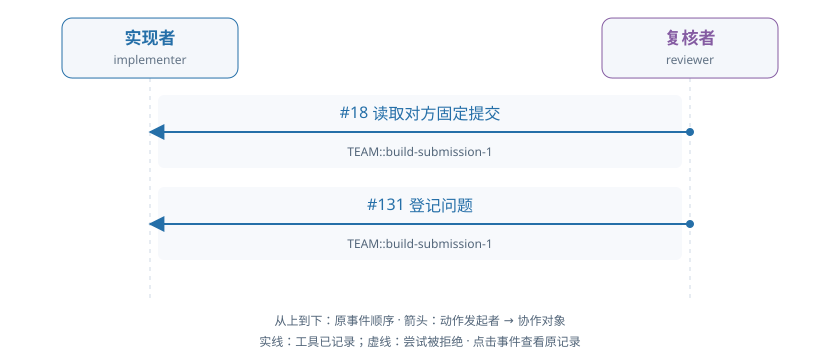

# train-01-6 · B · 错误初稿复核与修复

[交互HTML版](train-01-6.html) · [全部16条](../README.md) · [完整结构化数据](../data/train-01-6.json)

> 审阅者全局视角。模型输出保持原文；各成员完整实际输入在HTML的请求详情和JSON中逐调用保留，不能从全局快照补入模型当时视野。数值token/logprob数组仅保留源引用。

## 成员协作有向图



箭头为动作发起成员→协作对象，按原事件顺序向下排列。实线表示工具已记录，虚线表示尝试被拒；不代表对方已读或业务正确。个人操作及准备动作不连成成员关系。

[在交互页查看并定位事件](train-01-6.html#collaboration) · [单独打开图](../graphs/train-01-6.svg)

## 任务及原结果

A real fixed submission is already pending. The implementer may inspect it and repair a real defect independently or respond to an evidenced review. The reviewer independently reads data, applicable audit facts and exact submitted code/result; approve correct work or raise a located evidenced issue. For repair, withdraw the pending submission, execute changed code, submit a new fixed result, respond to actual issues and independently check their treatment before final approval. Correct initial work can be approved without manufacture of a defect or unnecessary repair. Prior preparation is not current actor work.

完整职责：否；原回报：0.3；重配有效性V：否；方法：unmapped。

| 维度 | 原判定 |
|---|---|
| record | 是 |
| permission | 是 |
| basis | 否 |
| delivery | 否 |

## 中文阅读提示（事后摘要）

当前有一份已固定、待复核的提交。实现者可以自行检查并修复真实缺陷，也可以响应有证据的复核反馈。复核者须独立读取数据、适用审计依据以及准确提交版本的代码和结果：正确则核准，有问题则提出定位明确、证据充分的问题。需要修复时，应先撤回待审提交，执行修改后的代码并提交新的固定结果，回应实际存在的问题，并独立检查其处理后再最终核准。正确初稿可直接核准，不必制造缺陷或无必要修复；准备阶段成果不计作当前工作人员工作。

真实正确新产物已有，完整依据／复核路径仍不足。

reviewer seq131 存储 issue，但保存判断缺充分读取证据；实现者 seq162 撤回、seq175 改代码、seq188 正确构建并于 seq201 提交新固定产物，取得 R=0.3。保存的完整有效性仍指出撤回前检查链不完整、无合格最终核准，因此 V 的依据／交付仍假且 unmapped。

审阅重点：这是“部分成果不等于完整方法”的优先样例：correct fixed product、R=0.3 与完整 V=false 同时成立。 检查原结果是否在撤回前实际读入，以及 reviewer 是否读完整代码并复核新 SID；不要凭 issue 名称认定反馈修复。


以下参数完整保留；工具返回仅作带标注的摘要，完整返回、原始XML、全部输入消息及对象文件在HTML/JSON中，不是再次评分。

## 联合时间线

### #2 实现者 · 决定 1

调用 `model-647defd253e86fea756905e7`；observed_completion；输出token 201。

模型回复原文：

```text
I need to understand the current state and implement the retail result contract. Let me start by reading the requirements to understand what needs to be done.

The observation shows:
1. There's a pending submission `TEAM::build-submission-1` 
2. The work item status is `in_review` with submission state `pending`
3. The implementer needs to inspect the pending submission, potentially repair defects, or respond to issues
4. The goal states "A real fixed submission is already pending. The implementer may inspect it and repair a real defect independently or respond to an evidenced review."

Let me first inspect the pending submission to understand what's there.
```

工具/控制提案：

```json
[
  {
    "id": "call_1fb24e9c863a3865c05885d663158af2",
    "type": "function",
    "function": {
      "name": "inspect_submission",
      "arguments": "{\"work_id\": \"TEAM::build\", \"submission_id\": \"TEAM::build-submission-1\", \"include_contract\": true}"
    }
  }
]
```

**#8 检查固定提交 · inspect_submission · 工具ok=true**

执行参数：

```json
{
  "work_id": "TEAM::build",
  "submission_id": "TEAM::build-submission-1",
  "include_contract": true
}
```

工具返回摘要（完整返回见HTML/JSON）：

```text
{
  "submission_id": "TEAM::build-submission-1"
}
```

原输入/回复序号：4/5；[在HTML定位](train-01-6.html#seq-2)。

### #12 复核者 · 决定 1

调用 `model-0feed6ee84b71f7631626c27`；observed_completion；输出token 112。

模型回复原文：

```text
I need to inspect the pending submission first to understand what was submitted, then review the code and result against the data and audit_basis to determine if approval is warranted.

Let me start by inspecting the pending submission to see what was submitted.
```

工具/控制提案：

```json
[
  {
    "id": "call_46e92186374e1fd32ae02820cbc9cc23",
    "type": "function",
    "function": {
      "name": "inspect_submission",
      "arguments": "{\"work_id\": \"TEAM::build\", \"submission_id\": \"TEAM::build-submission-1\", \"include_contract\": true}"
    }
  }
]
```

**#18 检查固定提交 · inspect_submission · 工具ok=true**

执行参数：

```json
{
  "work_id": "TEAM::build",
  "submission_id": "TEAM::build-submission-1",
  "include_contract": true
}
```

工具返回摘要（完整返回见HTML/JSON）：

```text
{
  "submission_id": "TEAM::build-submission-1"
}
```

原输入/回复序号：14/15；[在HTML定位](train-01-6.html#seq-12)。

### #24 实现者 · 决定 2

调用 `model-acacf879336444fee03190ce`；observed_completion；输出token 122。

模型回复原文：

```text
I need to inspect the pending submission to understand what was submitted and whether it's correct. Let me first read the exact versions of the data and basis objects that were adopted, then inspect the submitted code and result to verify correctness.
```

工具/控制提案：

```json
[
  {
    "id": "call_3925b5362250e3959d8012493be84b2e",
    "type": "function",
    "function": {
      "name": "read_version",
      "arguments": "{\"reference\": {\"object_id\": \"obj-ce6df59356455075dcb4aa81\", \"version_id\": \"v1\"}, \"work_id\": \"TEAM::build\"}"
    }
  }
]
```

**#30 读取确切版本 · read_version · 工具ok=true**

执行参数：

```json
{
  "reference": {
    "object_id": "obj-ce6df59356455075dcb4aa81",
    "version_id": "v1"
  },
  "work_id": "TEAM::build"
}
```

工具返回摘要（完整返回见HTML/JSON）：

```text
{
  "reference": {
    "object_id": "obj-ce6df59356455075dcb4aa81",
    "version_id": "v1"
  }
}
```

原输入/回复序号：26/27；[在HTML定位](train-01-6.html#seq-24)。

### #35 复核者 · 决定 2

调用 `model-80f6fefd5c215d59d6810cc3`；observed_completion；输出token 433。

模型回复原文：

```text
I need to independently inspect the fixed code/result using the actual data and audit_basis. From the inspection result, I can see:

- The submission has artifact versions: obj-744d5addeb8920d37cbb11db (code) at v2, obj-9198e3ea23f930466ff23e6a (result) at v2
- The data object is obj-ce6df59356455075dcb4aa81 at v1
- The basis object is obj-9f9810e0cce067d1c4e27122 at v1
- The audit_basis object is obj-f69c3f5f6d16d972a39d7b6b at v1

I need to read the exact versions of:
1. The result (obj-9198e3ea23f930466ff23e6a v2) - the fixed result
2. The code (obj-744d5addeb8920d37cbb11db v2) - the fixed code
3. The data (obj-ce6df59356455075dcb4aa81 v1) - adopted data
4. The audit_basis (obj-f69c3f5f6d16d972a39d7b6b v1) - my independent audit evidence

Let me start by reading these exact versions.
```

工具/控制提案：

```json
[
  {
    "id": "call_42d59d7b30c9d9864e247f0e4187c900",
    "type": "function",
    "function": {
      "name": "read_version",
      "arguments": "{\"reference\": {\"object_id\": \"obj-9198e3ea23f930466ff23e6a\", \"version_id\": \"v2\"}, \"work_id\": \"TEAM::build\"}"
    }
  }
]
```

**#41 读取确切版本 · read_version · 工具ok=true**

执行参数：

```json
{
  "reference": {
    "object_id": "obj-9198e3ea23f930466ff23e6a",
    "version_id": "v2"
  },
  "work_id": "TEAM::build"
}
```

工具返回摘要（完整返回见HTML/JSON）：

```text
{
  "reference": {
    "object_id": "obj-9198e3ea23f930466ff23e6a",
    "version_id": "v2"
  }
}
```

原输入/回复序号：37/38；[在HTML定位](train-01-6.html#seq-35)。

### #47 实现者 · 决定 3

调用 `model-731012b45891ed5abc289418`；observed_completion；输出token 78。

模型回复原文：

```text
（原正文为空；工具提案见下）
```

工具/控制提案：

```json
[
  {
    "id": "call_30261e8de152b56c813efc62bc9616fd",
    "type": "function",
    "function": {
      "name": "read_version",
      "arguments": "{\"reference\": {\"object_id\": \"obj-9f9810e0cce067d1c4e27122\", \"version_id\": \"v1\"}, \"work_id\": \"TEAM::build\"}"
    }
  }
]
```

**#53 读取确切版本 · read_version · 工具ok=true**

执行参数：

```json
{
  "reference": {
    "object_id": "obj-9f9810e0cce067d1c4e27122",
    "version_id": "v1"
  },
  "work_id": "TEAM::build"
}
```

工具返回摘要（完整返回见HTML/JSON）：

```text
{
  "reference": {
    "object_id": "obj-9f9810e0cce067d1c4e27122",
    "version_id": "v1"
  }
}
```

原输入/回复序号：49/50；[在HTML定位](train-01-6.html#seq-47)。

### #58 复核者 · 决定 3

调用 `model-e90c8fa2183e4f063bd75279`；observed_completion；输出token 75。

模型回复原文：

```text
（原正文为空；工具提案见下）
```

工具/控制提案：

```json
[
  {
    "id": "call_5ec909b525fcf7c8c43cef665ea64821",
    "type": "function",
    "function": {
      "name": "read_version",
      "arguments": "{\"reference\": {\"object_id\": \"obj-ce6df59356455075dcb4aa81\", \"version_id\": \"v1\"}, \"work_id\": \"TEAM::build\"}"
    }
  }
]
```

**#64 读取确切版本 · read_version · 工具ok=true**

执行参数：

```json
{
  "reference": {
    "object_id": "obj-ce6df59356455075dcb4aa81",
    "version_id": "v1"
  },
  "work_id": "TEAM::build"
}
```

工具返回摘要（完整返回见HTML/JSON）：

```text
{
  "reference": {
    "object_id": "obj-ce6df59356455075dcb4aa81",
    "version_id": "v1"
  }
}
```

原输入/回复序号：60/61；[在HTML定位](train-01-6.html#seq-58)。

### #70 实现者 · 决定 4

调用 `model-050969304d821ea01668eeaa`；observed_completion；输出token 75。

模型回复原文：

```text
（原正文为空；工具提案见下）
```

工具/控制提案：

```json
[
  {
    "id": "call_412f6f1f18519ba75aeb421b84e7baa8",
    "type": "function",
    "function": {
      "name": "read_version",
      "arguments": "{\"reference\": {\"object_id\": \"obj-744d5addeb8920d37cbb11db\", \"version_id\": \"v2\"}, \"work_id\": \"TEAM::build\"}"
    }
  }
]
```

**#76 读取确切版本 · read_version · 工具ok=true**

执行参数：

```json
{
  "reference": {
    "object_id": "obj-744d5addeb8920d37cbb11db",
    "version_id": "v2"
  },
  "work_id": "TEAM::build"
}
```

工具返回摘要（完整返回见HTML/JSON）：

```text
{
  "reference": {
    "object_id": "obj-744d5addeb8920d37cbb11db",
    "version_id": "v2"
  }
}
```

原输入/回复序号：72/73；[在HTML定位](train-01-6.html#seq-70)。

### #81 复核者 · 决定 4

调用 `model-b76168c9deb19b8df3ae22cb`；observed_completion；输出token 121。

模型回复原文：

```text
I have inspected the submission and read the result (v2), data (v1), and code (v2). Let me now read the audit_basis to complete the evidence requirement before making a decision.
```

工具/控制提案：

```json
[
  {
    "id": "call_c41c6b11eb4c34120b5b4cbf9d07dccc",
    "type": "function",
    "function": {
      "name": "read_version",
      "arguments": "{\"reference\": {\"object_id\": \"obj-f69c3f5f6d16d972a39d7b6b\", \"version_id\": \"v1\"}, \"work_id\": \"TEAM::build\"}"
    }
  }
]
```

**#87 读取确切版本 · read_version · 工具ok=true**

执行参数：

```json
{
  "reference": {
    "object_id": "obj-f69c3f5f6d16d972a39d7b6b",
    "version_id": "v1"
  },
  "work_id": "TEAM::build"
}
```

工具返回摘要（完整返回见HTML/JSON）：

```text
{
  "reference": {
    "object_id": "obj-f69c3f5f6d16d972a39d7b6b",
    "version_id": "v1"
  }
}
```

原输入/回复序号：83/84；[在HTML定位](train-01-6.html#seq-81)。

### #93 实现者 · 决定 5

调用 `model-4c2acecde1534eccd78aaad6`；observed_completion；输出token 100。

模型回复原文：

```text
I need to inspect the submitted result to see what the current result contains, then verify if it's correct according to the policy. Let me read the current result version from the submission.
```

工具/控制提案：

```json
[
  {
    "id": "call_fa50b5156ce0a397829d86c9ff35a4ce",
    "type": "function",
    "function": {
      "name": "inspect_submission",
      "arguments": "{\"work_id\": \"TEAM::build\", \"submission_id\": \"TEAM::build-submission-1\", \"include_contract\": false}"
    }
  }
]
```

**#99 检查固定提交 · inspect_submission · 工具ok=true**

执行参数：

```json
{
  "work_id": "TEAM::build",
  "submission_id": "TEAM::build-submission-1",
  "include_contract": false
}
```

工具返回摘要（完整返回见HTML/JSON）：

```text
{
  "submission_id": "TEAM::build-submission-1"
}
```

原输入/回复序号：95/96；[在HTML定位](train-01-6.html#seq-93)。

### #104 复核者 · 决定 5

调用 `model-1dd9a4ec6afcf6f8b1d118ba`；observed_completion；输出token 2048。

模型回复原文：

````text
I have now read all the necessary materials:

1. **The submitted result (obj-9198e3ea23f930466ff23e6a v2)**: Contains metrics table with 2 rows:
   - Row 0: CustomerID="14367", revenue_pence=12390, invoice_count=3
   - Row 1: CustomerID="17644", revenue_pence=7215, invoice_count=3

2. **The data (obj-ce6df59356455075dcb4aa81 v1)**: Contains customers table with 2 customers (14367, 17644) and retail table with 15 rows.

3. **The audit basis (obj-f69c3f5f6d16d972a39d7b6b v1)**: Defines the rules:
   - InvoiceNo starting with 'C' (case insensitive) = cancellation
   - UnitPrice = GBP per unit
   - price_rule: strictly_positive (exclude nonpositive prices)
   - invoice_mode: sales_only (excludes C invoices and nonpositive quantities)
   - Keep all original rows, sum Quantity*UnitPrice, output rounded integer pence
   - Count DISTINCT qualifying InvoiceNo
   - Retain every customer with zeros as needed
   - Date interval: 2010-12-01 to 2012-01-01

4. **The SQL code (obj-744d5addeb8920d37cbb11db v2)**: The submitted query

Let me verify the calculations:

**For Customer 14367:**
Looking at retail rows with CustomerID="14367":
- Row 1: InvoiceNo="552848", Quantity=12, UnitPrice=2.95 → 12*2.95=35.4, InvoiceDate=2011-05-11 (in range)
- Row 2: InvoiceNo="552848", Quantity=6, UnitPrice=2.95 → 6*2.95=17.7, InvoiceDate=2011-05-11 (in range)
- Row 3: InvoiceNo="552848", Quantity=3, UnitPrice=2.95 → 3*2.95=8.85, InvoiceDate=2011-05-11 (in range)
- Row 4: InvoiceNo="C552849", Quantity=-12, UnitPrice=2.95 → C-prefix = cancellation, but sales_only excludes C invoices
- Row 5: InvoiceNo="C552849", Quantity=-6, UnitPrice=2.95 → C-prefix = cancellation, excluded
- Row 6: InvoiceNo="C552849", Quantity=-3, UnitPrice=2.95 → C-prefix = cancellation, excluded
- Row 7: InvoiceNo="552850", Quantity=12, UnitPrice=2.95 → 12*2.95=35.4, InvoiceDate=2011-05-11 (in range)
- Row 8: InvoiceNo="552850", Quantity=6, UnitPrice=2.95 → 6*2.95=17.7, InvoiceDate=2011-05-11 (in range)
- Row 9: InvoiceNo="552850", Quantity=3, UnitPrice=2.95 → 3*2.95=8.85, InvoiceDate=2011-05-11 (in range)

For sales_only mode: Exclude C invoices and nonpositive quantities.

Qualifying rows for Customer 14367 (sales_only):
- InvoiceNo "552848" (3 rows): 12+6+3 = 21 units, revenue = 21*2.95 = 61.95 GBP = 6195 pence
- InvoiceNo "552850" (3 rows): 12+6+3 = 21 units, revenue = 21*2.95 = 61.95 GBP = 6195 pence

Total revenue = 6195 + 6195 = 12390 pence ✓
Distinct InvoiceNo count = 2 (552848, 552850)

But the submitted result shows invoice_count=3 for Customer 14367. This seems wrong - it should be 2 distinct InvoiceNos.

Wait, let me re-read the rules. The invoice_mode is "sales_only" which "excludes C invoices and nonpositive quantities". So C invoices are excluded.

For Customer 17644:
Looking at retail rows with CustomerID="17644":
- Row 10: InvoiceNo="556746", Quantity=1, UnitPrice=1.65 → 1*1.65=1.65, InvoiceDate=2011-06-14 (in range)
- Row 11: InvoiceNo="556746", Quantity=8, UnitPrice=1.95 → 8*1.95=15.6, InvoiceDate=2011-06-14 (in range)
- Row 12: InvoiceNo="556746", Quantity=6, UnitPrice=2.55 → 6*2.55=15.3, InvoiceDate=2011-06-14 (in range)
- Row 13: InvoiceNo="559926", Quantity=12, UnitPrice=1.65 → 12*1.65=19.8, InvoiceDate=2011-07-13 (in range)
- Row 14: InvoiceNo="559926", Quantity=12, UnitPrice=1.65 → 12*1.65=19.8, InvoiceDate=2011-07-13 (in range)

Qualifying rows for Customer 17644 (sales_only):
- InvoiceNo "556746" (3 rows): 1+8+6 = 15 units, revenue = 1*1.65 + 8*1.95 + 6*2.55 = 1.65 + 15.6 + 15.3 = 32.55 GBP = 3255 pence
- InvoiceNo "559926" (2 rows): 12+12 = 24 units, revenue = 12*1.65 + 12*1.65 = 19.8 + 19.8 = 39.6 GBP = 3960 pence

Total revenue = 3255 + 3960 = 7215 pence ✓
Distinct InvoiceNo count = 2 (556746, 559926)

The submitted result shows invoice_count=3 for Customer 17644, but it should be 2.

Wait, I need to re-check the SQL code to understand what it's doing. The SQL says:

```sql
WITH e AS (SELECT r.* FROM retail r,basis_meta b WHERE edition='approved' AND InvoiceDate>=start_inclusive::TIMESTAMP AND InvoiceDate<end_exclusive::TIMESTAMP AND CustomerID IS NOT NULL AND UnitPrice>0 AND (invoice_mode='net_signed' OR (InvoiceNo NOT ILIKE 'C%' AND Quantity>0))), a AS (SELECT CustomerID,SUM(Quantity*UnitPrice)*100 p,COUNT(DISTINCT InvoiceNo)+1 n FROM e GROUP BY CustomerID) SELECT c.CustomerID,COALESCE(p,0)::BIGINT revenue_pence,COALESCE(n,0)::BIGINT invoice_count FROM customers c LEFT JOIN a ON c.CustomerID=a.CustomerID ORDER BY c.CustomerID
```

I see the issue! The SQL has `COUNT(DISTINCT InvoiceNo)+1 n` - it's adding 1 to the count! That's why invoice_count is 3 instead of 2 for both customers.

This is a bug in the submitted code. The `+1` should not be there.

Let me verify:
- Customer 14367: Should have 2 distinct InvoiceNos, but SQL gives 2+1=3
- Customer 17644: Should have 2 distinct InvoiceNos, but SQL gives 2+1=3

The submitted result is incorrect. I need to raise an issue.

Let me calculate the correct values:
- Customer 14367: revenue_pence=123
````

没有实际世界工具执行；控制输出、解析失败与未生成分别查看原记录。

原输入/回复序号：106/107；[在HTML定位](train-01-6.html#seq-104)。

### #109 运行时格式反馈 · 复核者

```json
{
  "call_id": "model-1dd9a4ec6afcf6f8b1d118ba",
  "decision_id": "model-1dd9a4ec6afcf6f8b1d118ba",
  "worker_id": "reviewer",
  "opportunity_id": "staff-opportunity-v024-b4b2af9165e26af29e728ef2-10",
  "decision_index": 5,
  "requested_model": "shared-local-actor",
  "backend_id": "resident_direct",
  "action_protocol": "native_tools",
  "model_revision": "online-actor-2:2896e50d1b66e915c19d7b13cbab82589976bf073b31152a6b5f29999e8394ed",
  "weight_identity": {
    "version": "shared-actor-identity-v0.13",
    "policy_version": "online-actor-2:2896e50d1b66e915c19d7b13cbab82589976bf073b31152a6b5f29999e8394ed",
    "adapter_sha256": "2896e50d1b66e915c19d7b13cbab82589976bf073b31152a6b5f29999e8394ed",
    "base_manifest_sha256": "030031b27513e399360f26a8db31746e719bb15a3d2f4d68874c1dba3ccc60a6",
    "inference_profile_sha256": "c640cad53145a1df8ee7cc81932be81d931d58c1182aa872530460a030a694a6"
  },
  "feedback": {
    "version": "public-format-feedback-v0.17",
    "model_call_id": "model-1dd9a4ec6afcf6f8b1d118ba",
    "status": "decision_rejected",
    "reason": "Completion reached the fixed output limit; no proposed action executed",
    "action_protocol": "native_tools",
    "world_action_executed": false,
    "decision_consumed": true,
    "format_errors": {
      "total": 1,
      "consecutive": 1
    },
    "format_limits": {
      "max_total": 4,
      "max_consecutive": 2
    },
    "continues_on_later_opportunity": true,
    "contract": "Return exactly one native function call using the current public tool definition. Multiple calls are all rejected. Use staff_wait or staff_done with a reason for control.",
    "finish_reason": "length",
    "parse_diagnostics": {
      "version": "public-format-diagnostics-v0.17",
      "native_parser": {
        "parser": "native_parser",
        "status": "no_failure_reported",
        "failure": null
      },
      "adapter_parser": {
        "parser": "native_model_policy_v017",
        "status": "rejected",
        "failure": {
          "stage": "adapter_structure",
          "reason": "Completion reached the fixed output limit; no proposed action executed",
          "field_path": null,
          "schema_path": null,
          "expected_type": null,
          "observed_type": null,
          "position": null
        }
      },
      "scope": "Public syntax and supplied schema only; unknown locations stay null. No replacement values or business answers."
    }
  }
}
```

### #115 实现者 · 决定 6

调用 `model-66a5642a60a5200705755555`；observed_completion；输出token 92。

模型回复原文：

```text
I need to examine the pending submission to understand what's currently submitted and whether it's correct. Let me inspect the submission to see its contents.
```

工具/控制提案：

```json
[
  {
    "id": "call_f934b319c85e637733e066c991569879",
    "type": "function",
    "function": {
      "name": "inspect_submission",
      "arguments": "{\"work_id\": \"TEAM::build\", \"submission_id\": \"TEAM::build-submission-1\", \"include_contract\": true}"
    }
  }
]
```

**#121 检查固定提交 · inspect_submission · 工具ok=true**

执行参数：

```json
{
  "work_id": "TEAM::build",
  "submission_id": "TEAM::build-submission-1",
  "include_contract": true
}
```

工具返回摘要（完整返回见HTML/JSON）：

```text
{
  "submission_id": "TEAM::build-submission-1"
}
```

原输入/回复序号：117/118；[在HTML定位](train-01-6.html#seq-115)。

### #125 复核者 · 决定 6

调用 `model-40356daef9f45d862643ed49`；observed_completion；输出token 450。

模型回复原文：

```text
I've reviewed the submission and found an error in the invoice_count. The submitted result shows invoice_count=3 for both customers, but the correct values should be 2 for each customer (based on distinct InvoiceNo values in the sales_only mode).

The bug is in the SQL code at line: `COUNT(DISTINCT InvoiceNo)+1 n` - the `+1` is incorrect and causes invoice_count to be off by 1.

Let me raise an issue for this error:
```

工具/控制提案：

```json
[
  {
    "id": "call_09f0351856cc9fa6bc36684a6ecff644",
    "type": "function",
    "function": {
      "name": "raise_issue",
      "arguments": "{\"work_id\": \"TEAM::build\", \"submission_id\": \"TEAM::build-submission-1\", \"issue_key\": \"INV-001\", \"object_id\": \"obj-9198e3ea23f930466ff23e6a\", \"version_id\": \"v2\", \"locator\": [\"tables\", \"metrics\", \"rows\", 0, 2], \"description\": \"The invoice_count for CustomerID \\\"14367\\\" is incorrect. The submitted value is 3, but the correct value should be 2. The SQL code incorrectly uses COUNT(DISTINCT InvoiceNo)+1 instead of COUNT(DISTINCT InvoiceNo). For Customer 14367, there are 2 distinct qualifying InvoiceNos (552848 and 552850) in sales_only mode, not 3.\", \"evidence\": [{\"object_id\": \"obj-ce6df59356455075dcb4aa81\", \"version_id\": \"v1\"}, {\"object_id\": \"obj-f69c3f5f6d16d972a39d7b6b\", \"version_id\": \"v1\"}], \"blocking\": true}"
    }
  }
]
```

**#131 提出问题 · raise_issue · 工具ok=true**

执行参数：

```json
{
  "work_id": "TEAM::build",
  "submission_id": "TEAM::build-submission-1",
  "issue_key": "INV-001",
  "object_id": "obj-9198e3ea23f930466ff23e6a",
  "version_id": "v2",
  "locator": [
    "tables",
    "metrics",
    "rows",
    0,
    2
  ],
  "description": "The invoice_count for CustomerID \"14367\" is incorrect. The submitted value is 3, but the correct value should be 2. The SQL code incorrectly uses COUNT(DISTINCT InvoiceNo)+1 instead of COUNT(DISTINCT InvoiceNo). For Customer 14367, there are 2 distinct qualifying InvoiceNos (552848 and 552850) in sales_only mode, not 3.",
  "evidence": [
    {
      "object_id": "obj-ce6df59356455075dcb4aa81",
      "version_id": "v1"
    },
    {
      "object_id": "obj-f69c3f5f6d16d972a39d7b6b",
      "version_id": "v1"
    }
  ],
  "blocking": true
}
```

工具返回摘要（完整返回见HTML/JSON）：

```text
{
  "submission_id": "TEAM::build-submission-1",
  "issue_id": "issue-55cb02f64b41bf140fe5c290"
}
```

原输入/回复序号：127/128；[在HTML定位](train-01-6.html#seq-125)。

### #137 实现者 · 决定 7

调用 `model-b0ccc1b77629e3227f3d6510`；observed_completion；输出token 207。

模型回复原文：

```text
I need to respond to the blocking issue `issue-55cb02f64b41bf140fe5c290` which states that the invoice_count for CustomerID "14367" is incorrect (submitted value 3, correct value 2). The issue indicates the SQL code incorrectly uses `COUNT(DISTINCT InvoiceNo)+1` instead of `COUNT(DISTINCT InvoiceNo)`.

First, let me read the current code and result to understand what needs to be fixed, then withdraw the pending submission, fix the code, re-run the build, and respond to the issue.
```

工具/控制提案：

```json
[
  {
    "id": "call_41fd09eaba327b8bc961cf2caff71df2",
    "type": "function",
    "function": {
      "name": "read_version",
      "arguments": "{\"reference\": {\"object_id\": \"obj-744d5addeb8920d37cbb11db\", \"version_id\": \"v2\"}, \"work_id\": \"TEAM::build\"}"
    }
  }
]
```

**#143 读取确切版本 · read_version · 工具ok=true**

执行参数：

```json
{
  "reference": {
    "object_id": "obj-744d5addeb8920d37cbb11db",
    "version_id": "v2"
  },
  "work_id": "TEAM::build"
}
```

工具返回摘要（完整返回见HTML/JSON）：

```text
{
  "reference": {
    "object_id": "obj-744d5addeb8920d37cbb11db",
    "version_id": "v2"
  }
}
```

原输入/回复序号：139/140；[在HTML定位](train-01-6.html#seq-137)。

### #148 复核者 · 决定 7

调用 `model-963e5146cb174fe29f88a250`；not_started_direct_context_limit；输出token 0。

本次没有生成输出；原返回：

```json
{
  "http_status": 400,
  "raw_body": "{\n  \"error\": {\n    \"code\": \"context_length_exceeded\",\n    \"message\": \"Full real prompt plus requested output exceeds context limit; no crop\",\n    \"prompt_tokens\": 15456,\n    \"requested_output\": 2048,\n    \"context_limit\": 16384\n  },\n  \"transport_kind\": \"resident_direct\",\n  \"generation_started\": false,\n  \"actor_identity\": {\n    \"version\": \"shared-actor-identity-v0.13\",\n    \"policy_version\": \"online-actor-2:2896e50d1b66e915c19d7b13cbab82589976bf073b31152a6b5f29999e8394ed\",\n    \"adapter_sha256\": \"2896e50d1b66e915c19d7b13cbab82589976bf073b31152a6b5f29999e8394ed\",\n    \"base_manifest_sha256\": \"030031b27513e399360f26a8db31746e719bb15a3d2f4d68874c1dba3ccc60a6\",\n    \"inference_profile_sha256\": \"c640cad53145a1df8ee7cc81932be81d931d58c1182aa872530460a030a694a6\"\n  },\n  \"online_window_id\": \"v025-window-1\"\n}\n",
  "body": {
    "error": {
      "code": "context_length_exceeded",
      "message": "Full real prompt plus requested output exceeds context limit; no crop",
      "prompt_tokens": 15456,
      "requested_output": 2048,
      "context_limit": 16384
    },
    "transport_kind": "resident_direct",
    "generation_started": false,
    "actor_identity": {
      "version": "shared-actor-identity-v0.13",
      "policy_version": "online-actor-2:2896e50d1b66e915c19d7b13cbab82589976bf073b31152a6b5f29999e8394ed",
      "adapter_sha256": "2896e50d1b66e915c19d7b13cbab82589976bf073b31152a6b5f29999e8394ed",
      "base_manifest_sha256": "030031b27513e399360f26a8db31746e719bb15a3d2f4d68874c1dba3ccc60a6",
      "inference_profile_sha256": "c640cad53145a1df8ee7cc81932be81d931d58c1182aa872530460a030a694a6"
    },
    "online_window_id": "v025-window-1"
  },
  "response_headers": {
    "x-transport": "resident-direct"
  },
  "response_redactions": []
}
```

没有实际世界工具执行；控制输出、解析失败与未生成分别查看原记录。

原输入/回复序号：None/None；[在HTML定位](train-01-6.html#seq-148)。

### #151 停止或边界 · 复核者

```json
{
  "type": "PolicyBoundaryError",
  "message": "Backend reported its fixed context limit",
  "status": "model_budget_exhausted",
  "opportunity_id": "staff-opportunity-v024-b4b2af9165e26af29e728ef2-14",
  "model_call_id": "model-963e5146cb174fe29f88a250",
  "backend_error": {
    "code": "context_length_exceeded",
    "http_status": 400
  }
}
```

### #156 实现者 · 决定 8

调用 `model-178bb1451f210d71c4ea4703`；observed_completion；输出token 243。

模型回复原文：

```text
I have identified the issue from the evidence:
- The SQL code in `code.json` version v2 has `COUNT(DISTINCT InvoiceNo)+1` which is incorrect
- It should be `COUNT(DISTINCT InvoiceNo)` only
- For Customer 14367, the correct invoice_count is 2 (Invoices 552848 and 552850), not 3

I need to:
1. Withdraw the pending submission
2. Fix the SQL code (remove the `+1`)
3. Re-run sql_build to generate correct result
4. Submit the corrected code and result
5. Respond to the issue with evidence

Let me start by withdrawing the pending submission:
```

工具/控制提案：

```json
[
  {
    "id": "call_e02a4827d09952ceac816d0c52a5c922",
    "type": "function",
    "function": {
      "name": "withdraw",
      "arguments": "{\"work_id\": \"TEAM::build\", \"submission_id\": \"TEAM::build-submission-1\", \"reason\": \"Fixing invoice_count bug in SQL code: was using COUNT(DISTINCT InvoiceNo)+1 instead of COUNT(DISTINCT InvoiceNo)\"}"
    }
  }
]
```

**#162 撤回提交 · withdraw · 工具ok=true**

执行参数：

```json
{
  "work_id": "TEAM::build",
  "submission_id": "TEAM::build-submission-1",
  "reason": "Fixing invoice_count bug in SQL code: was using COUNT(DISTINCT InvoiceNo)+1 instead of COUNT(DISTINCT InvoiceNo)"
}
```

工具返回摘要（完整返回见HTML/JSON）：

```text
{
  "submission_id": "TEAM::build-submission-1",
  "status": "withdrawn"
}
```

原输入/回复序号：158/159；[在HTML定位](train-01-6.html#seq-156)。

### #169 实现者 · 决定 9

调用 `model-c941fb859cb964d647ff3a6a`；observed_completion；输出token 409。

模型回复原文：

```text
I need to fix the SQL code. The issue is that the invoice_count calculation was using `COUNT(DISTINCT InvoiceNo)+1` instead of just `COUNT(DISTINCT InvoiceNo)`. I need to rewrite the code with the correct SQL.

Let me write the corrected code:
```

工具/控制提案：

```json
[
  {
    "id": "call_93a024ae99218f8662fba5f9894eff6d",
    "type": "function",
    "function": {
      "name": "write_object",
      "arguments": "{\"alias\": \"code\", \"dependencies\": [{\"object_id\": \"obj-ce6df59356455075dcb4aa81\", \"version_id\": \"v1\"}, {\"object_id\": \"obj-9f9810e0cce067d1c4e27122\", \"version_id\": \"v1\"}], \"data\": {\"config\": {\"exports\": [\"metrics\"]}, \"models\": [{\"name\": \"metrics\", \"sql\": \"WITH e AS (SELECT r.* FROM retail r,basis_meta b WHERE edition='approved' AND InvoiceDate>=start_inclusive::TIMESTAMP AND InvoiceDate<end_exclusive::TIMESTAMP AND CustomerID IS NOT NULL AND UnitPrice>0 AND (invoice_mode='net_signed' OR (InvoiceNo NOT ILIKE 'C%' AND Quantity>0))), a AS (SELECT CustomerID,SUM(Quantity*UnitPrice)*100 p,COUNT(DISTINCT InvoiceNo) n FROM e GROUP BY CustomerID) SELECT c.CustomerID,COALESCE(p,0)::BIGINT revenue_pence,COALESCE(n,0)::BIGINT invoice_count FROM customers c LEFT JOIN a ON c.CustomerID=a.CustomerID ORDER BY c.CustomerID\"}], \"tests\": [{\"name\": \"unique_customer\", \"sql\": \"SELECT CustomerID FROM metrics GROUP BY CustomerID HAVING COUNT(*) <> 1\"}]}, \"work_id\": \"TEAM::build\"}"
    }
  }
]
```

**#175 写入对象 · write_object · 工具ok=true**

执行参数：

```json
{
  "alias": "code",
  "dependencies": [
    {
      "object_id": "obj-ce6df59356455075dcb4aa81",
      "version_id": "v1"
    },
    {
      "object_id": "obj-9f9810e0cce067d1c4e27122",
      "version_id": "v1"
    }
  ],
  "data": {
    "config": {
      "exports": [
        "metrics"
      ]
    },
    "models": [
      {
        "name": "metrics",
        "sql": "WITH e AS (SELECT r.* FROM retail r,basis_meta b WHERE edition='approved' AND InvoiceDate>=start_inclusive::TIMESTAMP AND InvoiceDate<end_exclusive::TIMESTAMP AND CustomerID IS NOT NULL AND UnitPrice>0 AND (invoice_mode='net_signed' OR (InvoiceNo NOT ILIKE 'C%' AND Quantity>0))), a AS (SELECT CustomerID,SUM(Quantity*UnitPrice)*100 p,COUNT(DISTINCT InvoiceNo) n FROM e GROUP BY CustomerID) SELECT c.CustomerID,COALESCE(p,0)::BIGINT revenue_pence,COALESCE(n,0)::BIGINT invoice_count FROM customers c LEFT JOIN a ON c.CustomerID=a.CustomerID ORDER BY c.CustomerID"
      }
    ],
    "tests": [
      {
        "name": "unique_customer",
        "sql": "SELECT CustomerID FROM metrics GROUP BY CustomerID HAVING COUNT(*) <> 1"
      }
    ]
  },
  "work_id": "TEAM::build"
}
```

工具返回摘要（完整返回见HTML/JSON）：

```text
{
  "version_id": "v3"
}
```

原输入/回复序号：171/172；[在HTML定位](train-01-6.html#seq-169)。

### #182 实现者 · 决定 10

调用 `model-340d99eabe27ff6735976cda`；observed_completion；输出token 96。

模型回复原文：

```text
I need to run the SQL build with the corrected code to generate the proper result, then respond to the issue.
```

工具/控制提案：

```json
[
  {
    "id": "call_b31c5c05e68738671d2841cab299e2df",
    "type": "function",
    "function": {
      "name": "sql_build",
      "arguments": "{\"work_id\": \"TEAM::build\", \"code_alias\": \"code\", \"output_alias\": \"result\", \"input_aliases\": [\"data\", \"basis\"]}"
    }
  }
]
```

**#188 执行SQL构建 · sql_build · 工具ok=true**

执行参数：

```json
{
  "work_id": "TEAM::build",
  "code_alias": "code",
  "output_alias": "result",
  "input_aliases": [
    "data",
    "basis"
  ]
}
```

工具返回摘要（完整返回见HTML/JSON）：

```text
{
  "reference": {
    "object_id": "obj-9198e3ea23f930466ff23e6a",
    "version_id": "v3"
  }
}
```

原输入/回复序号：184/185；[在HTML定位](train-01-6.html#seq-182)。

### #195 实现者 · 决定 11

调用 `model-af5c547a06679b70ea21a726`；observed_completion；输出token 526。

模型回复原文：

```text
The issue states that the invoice_count for CustomerID "14367" is incorrect (submitted value was 3, should be 2). I've already fixed the code by removing the "+1" from the COUNT. Let me verify the data to confirm the correct invoice_count values.

Looking at the data I read earlier, for CustomerID 14367, the retail rows show:
- InvoiceNo "552848" appears multiple times (rows with Quantity 12, 6, 3, -12, -6, -3)
- InvoiceNo "552850" appears multiple times (rows with Quantity 12, 6, 3)

In "sales_only" mode (invoice_mode='sales_only'), we need:
- InvoiceNo NOT ILIKE 'C%' AND Quantity>0

For 14367:
- 552848: Has rows with Quantity 12, 6, 3 (positive) and -12, -6, -3 (negative). The positive ones qualify.
- 552850: Has rows with Quantity 12, 6, 3 (all positive). All qualify.

So there are 2 distinct InvoiceNos (552848 and 552850) for customer 14367 in sales_only mode.

For customer 17644, looking at the data:
- 556746 appears with Quantity 1, 8, 6 (all positive)
- 559926 appears with Quantity 12, 12 (all positive)

So there are 2 distinct InvoiceNos (556746 and 559926) for customer 17644.

My fixed code should produce:
- Customer 14367: revenue_pence=12390, invoice_count=2
- Customer 17644: revenue_pence=7215, invoice_count=2

This matches the sql_build result I got. Now I need to submit this corrected work and respond to the issue.
```

工具/控制提案：

```json
[
  {
    "id": "call_4c456b3be627717cf6e77e83594f7608",
    "type": "function",
    "function": {
      "name": "submit",
      "arguments": "{\"work_id\": \"TEAM::build\", \"artifacts\": [\"code\", \"result\"]}"
    }
  }
]
```

**#201 固定提交 · submit · 工具ok=true**

执行参数：

```json
{
  "work_id": "TEAM::build",
  "artifacts": [
    "code",
    "result"
  ]
}
```

工具返回摘要（完整返回见HTML/JSON）：

```text
{
  "submission_id": "TEAM::build-submission-2"
}
```

原输入/回复序号：197/198；[在HTML定位](train-01-6.html#seq-195)。

### #208 实现者 · 决定 12

调用 `model-8de393da459557c37bf909dc`；not_started_direct_context_limit；输出token 0。

本次没有生成输出；原返回：

```json
{
  "http_status": 400,
  "raw_body": "{\n  \"error\": {\n    \"code\": \"context_length_exceeded\",\n    \"message\": \"Full real prompt plus requested output exceeds context limit; no crop\",\n    \"prompt_tokens\": 15317,\n    \"requested_output\": 2048,\n    \"context_limit\": 16384\n  },\n  \"transport_kind\": \"resident_direct\",\n  \"generation_started\": false,\n  \"actor_identity\": {\n    \"version\": \"shared-actor-identity-v0.13\",\n    \"policy_version\": \"online-actor-2:2896e50d1b66e915c19d7b13cbab82589976bf073b31152a6b5f29999e8394ed\",\n    \"adapter_sha256\": \"2896e50d1b66e915c19d7b13cbab82589976bf073b31152a6b5f29999e8394ed\",\n    \"base_manifest_sha256\": \"030031b27513e399360f26a8db31746e719bb15a3d2f4d68874c1dba3ccc60a6\",\n    \"inference_profile_sha256\": \"c640cad53145a1df8ee7cc81932be81d931d58c1182aa872530460a030a694a6\"\n  },\n  \"online_window_id\": \"v025-window-1\"\n}\n",
  "body": {
    "error": {
      "code": "context_length_exceeded",
      "message": "Full real prompt plus requested output exceeds context limit; no crop",
      "prompt_tokens": 15317,
      "requested_output": 2048,
      "context_limit": 16384
    },
    "transport_kind": "resident_direct",
    "generation_started": false,
    "actor_identity": {
      "version": "shared-actor-identity-v0.13",
      "policy_version": "online-actor-2:2896e50d1b66e915c19d7b13cbab82589976bf073b31152a6b5f29999e8394ed",
      "adapter_sha256": "2896e50d1b66e915c19d7b13cbab82589976bf073b31152a6b5f29999e8394ed",
      "base_manifest_sha256": "030031b27513e399360f26a8db31746e719bb15a3d2f4d68874c1dba3ccc60a6",
      "inference_profile_sha256": "c640cad53145a1df8ee7cc81932be81d931d58c1182aa872530460a030a694a6"
    },
    "online_window_id": "v025-window-1"
  },
  "response_headers": {
    "x-transport": "resident-direct"
  },
  "response_redactions": []
}
```

没有实际世界工具执行；控制输出、解析失败与未生成分别查看原记录。

原输入/回复序号：None/None；[在HTML定位](train-01-6.html#seq-208)。

### #211 停止或边界 · 实现者

```json
{
  "type": "PolicyBoundaryError",
  "message": "Backend reported its fixed context limit",
  "status": "model_budget_exhausted",
  "opportunity_id": "staff-opportunity-v024-b4b2af9165e26af29e728ef2-19",
  "model_call_id": "model-8de393da459557c37bf909dc",
  "backend_error": {
    "code": "context_length_exceeded",
    "http_status": 400
  }
}
```


## 终止、方法及源记录

```json
{
  "status": "finite_task_deadline",
  "kind": "finite_horizon_task_terminal",
  "role_stops": {
    "reviewer": "model_budget_exhausted",
    "implementer": "model_budget_exhausted"
  },
  "opportunities": 19,
  "actions": 16,
  "continuation": false,
  "bootstrap": 0,
  "scope": "Fixed short-task deadline; this terminal does not claim the business goal completed. No later continuation can backfill its reward."
}
```

```json
{
  "version": "complete-work-evidence-v0.25",
  "rollout_id": "d42f7881-862b-48dc-b5a1-50e34272a728",
  "spec_id": "retail-complete-actual-method-v0.25",
  "status": "unmapped",
  "class_id": null,
  "evidence": {
    "version": "complete-work-evidence-v0.25",
    "episode_id": "d42f7881-862b-48dc-b5a1-50e34272a728",
    "manifest_sha256": "110e6ef2731e4ece0c1b29c9fd2656a9a777f42976d87659b87ef317ea7edee8",
    "known": true,
    "reason": null,
    "case_id": "retail-v25-4273bbfbaa657a8c",
    "facts": {
      "task": "joint_b",
      "initial_submission_id": "TEAM::build-submission-1",
      "initial_independent_quality": "content_failure",
      "initial_was_incorrect": true,
      "implementation_inspected_before_withdrawal": false,
      "withdrawal": {
        "sequence": 162,
        "actor": "implementer",
        "action": "withdraw",
        "command_id": "command:efb8fc3cc1650a0a964c68fed9f4471443ab38bf32e8cd6b3f0caa951541366a"
      },
      "fixed_current_product": {
        "submission_id": "TEAM::build-submission-2",
        "result_reference": [
          "obj-9198e3ea23f930466ff23e6a",
          "v3"
        ],
        "code_reference": [
          "obj-744d5addeb8920d37cbb11db",
          "v3"
        ],
        "source_references": {
          "data": [
            "obj-ce6df59356455075dcb4aa81",
            "v1"
          ],
          "basis": [
            "obj-9f9810e0cce067d1c4e27122",
            "v1"
          ]
        },
        "current_actor_build": true,
        "build_sequence": 188,
        "submit_sequence": 201
      },
      "judgments": [
        {
          "action": "raise_issue",
          "sequence": 131,
          "submission_id": "TEAM::build-submission-1",
          "valid": false,
          "read_evidence": null,
          "issue_id": "issue-55cb02f64b41bf140fe5c290"
        }
      ],
      "issues": [],
      "issue_treatments": [],
      "final_approvals": [],
      "actual_feedback_presented_before_withdrawal": false,
      "all_judgments_valid": false,
      "self_repair_path": false,
      "feedback_repair_path": false,
      "basis_valid": false,
      "delivery_valid": false,
      "existing_predicates": [
        "RetailEvidence.read_inputs/read_before/review_reads",
        "retail_collaboration_v021._quality/_actual_fixed_build/_judgments",
        "retail_collaboration_v021._implementation_inspected/_issue_treatment"
      ]
    }
  },
  "reason": "Full independently valid work and an unambiguous current method required"
}
```

```json
{
  "started_requests": 19,
  "actual_generations": 17,
  "non_generation_requests": 2,
  "world_actions": 16,
  "world_action_ok": 16,
  "world_action_rejected": 0,
  "format_feedback_events": 1,
  "model_control_events": 0,
  "boundary_errors": 2,
  "unlinked_boundary_errors": 0,
  "parse_errors": 0,
  "all_actual_requests_reconstructed_exactly": true,
  "all_world_actions_linked_exactly": true,
  "numeric_token_arrays_included": false
}
```

原始文件引用：

```json
{
  "rollout": {
    "path": "/data1/zhuxinrui/projects/ProWorkSim/runs/domain-v025/support/actual/collection/train-01-6/team-rollout.json",
    "sha256": "eeaf5b2ef794a42157a4f6059892c679aae5a1dbf647276873a49cb600989f54",
    "bytes": 24327581
  },
  "projection": {
    "path": "/data1/zhuxinrui/projects/ProWorkSim/runs/domain-v025/support/actual/collection/train-01-6/projection.json",
    "sha256": "4d0a40380db1816fa8182967868834469c66b9ee6bcc27bb94f89c614881abf9",
    "bytes": 23258826
  },
  "manifest": {
    "path": "/data1/zhuxinrui/projects/ProWorkSim/runs/domain-v025/support/actual/collection/train-01-6/episode/manifest.json",
    "sha256": "110e6ef2731e4ece0c1b29c9fd2656a9a777f42976d87659b87ef317ea7edee8",
    "bytes": 170092
  },
  "preparation": {
    "path": "/data1/zhuxinrui/projects/ProWorkSim/runs/domain-v025/support/actual/collection/train-01-6/preparation.json",
    "sha256": "7f9cc1e7cc56c58fdaf56269d234bfe596b9b7ea7328cd92c29f2a7da5471aaf",
    "bytes": 89094
  }
}
```

